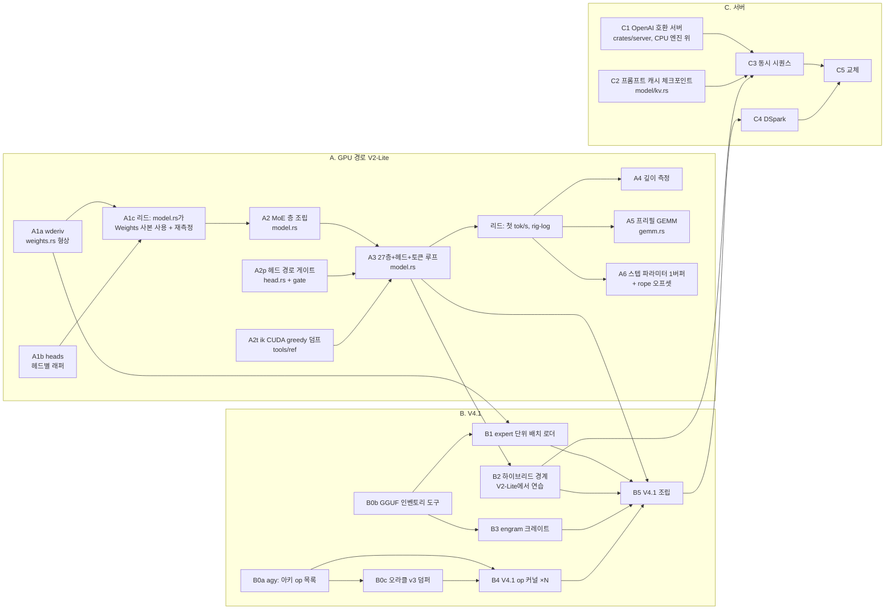

# 오케스트레이션 계획 — 로드맵 A·B·C를 라운드로 쪼개고 병렬·순차를 정한다

날짜 2026-09-21. 로드맵은 `docs/plan.md`의 "로드맵 (2026-09-21 재정리)" 절이고, 이 문서는 그것을 **위임 라운드 단위**로 자른
것이다. 라운드 하나 = 워크트리 하나 = 파일 경계 하나 = 게이트 하나 = 완료 보고 하나. 리드는 스펙·diff 독해·게이트 재실행·
임대 측정·머지만 한다. 이 문서의 크기 표기(S/M/L)는 추정이고 실측이 아니다 — 라운드가 끝날 때마다 실제 소요를 옆에 적는다.

## 원칙 (병렬성을 정하는 것은 파일 경계다)

1. **같은 파일을 두 라운드가 동시에 만지지 않는다.** `crates/gpu/src/model.rs`가 GPU 경로의 병목 파일이다 — 조립 라운드는
   전부 여기를 지나므로 **model.rs를 만지는 라운드는 한 시점에 하나**. 커널·게이트·도구·다른 크레이트는 자유롭게 병렬.
2. **오라클이 직렬을 팬아웃으로 바꾼다**(plan.md 1단계에서 실증). 조립 입력이 앞 라운드의 출력이라도, ik 덤프가 그 입력을
   파일로 갖고 있으면 병렬로 열 수 있다. 그래서 오라클 덤프 라운드(A·B 각각)가 다른 무엇보다 먼저다.
3. **리드가 직렬 지점이다**: diff 독해·게이트·임대 측정·머지. 임대는 한 번에 하나. 그래서 동시 비행은 **3~4 라운드**가 상한이고
   (GLM 쿼터도 같은 상한을 준다 — 주간 창은 09-26 11:54 리셋), 그 이상은 조사(agy) 라운드로 채운다.
4. **조사는 코드보다 먼저 병렬로 간다.** agy 조사 라운드는 파일을 안 만지므로 언제나 병렬이고, 그 결론(B0)이 없으면 B의
   코드 라운드가 잘못된 형상 위에 선다. 지금 A를 돌리는 동안 B0를 돈다.
5. **끝의 숫자가 없는 라운드는 열지 않는다.** 각 라운드 카드의 "게이트" 칸이 비면 스펙을 쓰지 않는다.

## 의존 그래프

## 라운드 카드

백엔드: **GLM** = glm-5.3 구현(`outsource-run.sh --effort max`), **agy** = 조사·보고 전용, **리드** = 이 세션. 크기: S 반나절 이하 /
M 하루 / L 하루 넘음(쪼갤 후보).

### A — GPU 경로

| id | 라운드 | 파일 경계 | 백엔드 | 게이트(끝의 숫자) | 앞 | 크기 |
|---|---|---|---|---|---|---|
| A1a | `Q8_0Derived` 형상 + gate_p10 소비자 단언 | `gpu/weights.rs`, `gate_p10.rs` | GLM | gate_p10 rc 0, FAIL-first 둘 | — | S — **머지 42017e9, 발사→머지 40분** |
| A1b | 헤드별 래퍼 커널(gather 6노드 제거) | `gpu/model.rs`, `gpu/q8f32.rs`, `gate_p8.rs` | GLM | gate_p8 탭 표 자릿수 동일, 노드 33→26 | — | M — **머지 4c50f24, 33→25노드, 발사→머지 40분** |
| A1c | model.rs가 Weights의 파생 사본을 쓰게(~10줄) + 임대 재측정 | `gpu/model.rs` | 리드 | gate_p8 동일 탭, `time-gpu-p8` 3회 | A1a, A1b | S — **2abdaab; 264 → 224.6/222.6/219.7 µs(−16 %)** |
| A1d | **op별 µs 프로파일**(`gate_p8 --profile`: op마다 eager+sync, 표) — A1c가 기대보다 작아서 끼움(2026-09-21): 남은 ~138 µs 어텐션 절반의 주인을 재고 A6의 범위를 정한다 | `gpu/model.rs`, `gate_p8.rs` | GLM | 표 합 ≈ eager 스텝, 프로파일 꺼진 경로 비트 동일 | A1c | S |
| A2 | MoE 층 조립: `Stage`를 층 l 일반화, `moe_fused`+라우터+층별 KV, 2스테이지=1스테이지 비트 동일 | `gpu/model.rs`, 새 `gate_p8b.rs`, `block.rs`(MoE 탭 밴드 표 인쇄) | GLM | 블록 1 탭 표 인쇄(리드가 핀), eager==replay, 2스테이지 비트 동일 | A1c | L → 둘로: A2-1 층 조립·탭, A2-2 스테이지 분할 |
| A2p | 헤드 경로: `result_norm` → lm_head(Q6_K) → argmax, 그래프 1개 | 새 `gpu/head.rs`, 새 `gate_head_gpu.rs`, `lib.rs`에 `pub mod` 1줄 | GLM | ref_cuda_v2 `result_norm`·`result_output` 밴드(리드 핀), argmax 동일 | — (A1b와 model.rs 안 겹침) | S |
| A2t | ik CUDA(`-ngl 99`) greedy 토큰 덤프 32프롬프트 + 발산 집합 비교기 | `tools/ref/*.sh`, `gpu-gates/src/prompts.rs`(새) | GLM (실행은 리드가 임대 아래) | 덤프 파일 32개 + 비교기 자기검증(CPU 엔진 토큰 대조에서 기존 KNOWN_DIVERGENCE {24} 재현) | — | S |
| A3 | 27층 + 헤드 + 토큰 루프(`GpuModel::decode`), 프롬프트 게이트 | `gpu/model.rs`, 새 `gate_prompts_gpu.rs`, `justfile` | GLM | 32프롬프트 greedy 대 ik CUDA(발산 집합 핀), `--time` 없이 | A2, A2p, A2t | L → A3-1 조립+1프롬프트, A3-2 32프롬프트+루프 정리 |
| A3m | 첫 tok/s(깊이 0) 대 ik 216.6, rig-log 기록, gpu-design 갱신 | — | 리드 | 임대 3회 | A3 | S |
| A4 | 깊이 1024·4096 대조(러너에 GPU 팔) | `tools/ref/depth-decode.sh` | GLM(러너) + 리드(측정) | 3점 대 ik 204.6/189.7 | A3m | S |
| A5 | 프리필: m>1 활성값 다리 + IMMA GEMM 커널(m 16~512) | 새 `gpu/gemm.rs`, 새 `gate_gemm.rs`; 조립은 별도 라운드 | GLM(커널) → GLM(조립, model.rs) | 커널 밴드 + 프리필 tok/s | A3m; 커널 부분은 A2와 병렬 가능 | L |
| A6 | 스텝 파라미터 1버퍼(pos/n_keys/token/cs를 구조체 하나, 비동기 카피) + `enqueue_rope` src/dst 오프셋(f_rope gather 2개·kvr gather 제거) | `gpu/elem.rs`, `gpu/flash.rs`, `gpu/model.rs` | GLM | gate_p8 동일 탭, 노드 26→~22, 스텝 µs(리드) | A1c; model.rs가 비는 창(A2 전 또는 A3 후) | M |

### B — V4.1

| id | 라운드 | 파일 경계 | 백엔드 | 게이트 | 앞 | 크기 |
|---|---|---|---|---|---|---|
| B0a | V4.1 아키 독해(2026-09-21 개정 — 사용자: ik 외 구현도 참고, 과도하게 따라가지 않는다): **1차 출처는 DeepSeek 공식 참조 구현 model.py**, ik 포트·mainline 포크는 GGUF 이름과 구현 차이 교차 확인. ~~ik 포트 #2455의 V4.1 그래프를 op 목록으로~~(하이퍼커넥션·공유 압축 KV·저랭크 query norm·engram 조회·DSpark 헤드), V2-Lite와 같은 op·다른 op·새 op 세 열 | `docs/research/v41-ops.md`(새) | ~~agy~~ GLM(agy 개인 쿼터 소진 rc 3) | 문서; op마다 model.py·ik·mainline 파일:줄 | — **비행 중** | M |
| B0b | GGUF 인벤토리 도구: 444 GiB 헤더만 읽어 텐서 이름·형상·타입·바이트를 표로(engram 텐서 포함), 티어별 합계 | `crates/gguf` 바이너리 1개, `docs/v41-inventory.md` | GLM (실행은 박스, 헤더만 읽어 임대 불필요) | 표 + 합계가 roofline 444.23 GiB와 일치 | — **머지 e63caf3**: 40블록 전부 MoE, engram 사이트 blk.1·blk.14, 없는 타입 q8_0·bf16 | S |
| B0c | 오라클 v3: ik에서 V4.1 중간 텐서 덤프(덤퍼 확장) — 실행은 RAM 250 GB·두 카드를 쓰므로 **llm.service 중단 + 임대** | ik 트리 덤퍼 패치, `tools/ref/dump-ref-v41.sh` | GLM(도구) → 리드(실행) | 덤프 세트 + MANIFEST | B0a | M |
| B1 | 배치 로더: 텐서마다 (디바이스, dtype) 주소를 로드 시 배정, expert 단위; 444 GiB mmap 창; 상주 표 인쇄 | `gpu/weights.rs`, `crates/model` 로더, 새 `gate_place.rs` | GLM | 배치 표가 설계와 일치, 상주 바이트 합 | A1a, B0b | M |
| B2 | 하이브리드 경계: 일부 층 expert를 CPU 풀에(V2-Lite로 연습), 활성값 왕복·동기 | `gpu/model.rs`, `crates/model/moe.rs` | GLM | 로짓 대 순GPU 밴드, 왕복 µs, 층 ms 대 하한 | A3 | M |
| B3 | engram 크레이트: NVMe mmap, 토큰당 조회 5.2 KiB, 선행 읽기(`WILLNEED`/`io_uring`), 마이크로벤치 | 새 `crates/engram` | GLM | 조회 p50/p99 콜드·웜(임대 아래 리드 실행) | B0b(테이블 레이아웃) | M |
| B4 | V4.1 고유 op 커널 ×N — op마다 자기 파일·자기 모듈·자기 게이트(결정 6) | `gpu/<op>.rs` + `gate_<op>.rs` 각각 | GLM ×N 병렬 | 오라클 v3 밴드 | B0a, B0c | op당 S~M |
| B5 | V4.1 조립 + 첫 토큰 | `gpu/model.rs`, `crates/model` | GLM → 리드 | **PPL 2.2355 패리티, tok/s 대 25.05** | A3, B1~B4 | L |

### C — 서버

| id | 라운드 | 파일 경계 | 백엔드 | 게이트 | 앞 | 크기 |
|---|---|---|---|---|---|---|
| C1 | OpenAI 호환 HTTP: `/v1/chat/completions` 스트리밍, `/props`, 청크별 `timings`; 엔진은 trait 뒤(CPU 엔진으로 먼저) | 새 `crates/server` | GLM | toktape 한 클립이 녹화됨, 통합 테스트 | — (CPU 엔진은 있다) | M |
| C2 | 프롬프트 캐시 체크포인트(메시지 경계) | `crates/model/kv.rs`, `forward.rs` | GLM | 편집 후 재프리필 토큰 수, 로짓 비트 동일 | — | M |
| C3 | 동시 시퀀스 스케줄러 + 호스트/GPU 2단 파이프라인 | `crates/server`, `crates/model` | GLM | 동시 2·4 스트림 합계 tok/s(도출 1.67배 대조) | C1, C2, B2 | L |
| C4 | DSpark 드래프트 + 검증 배치 | `crates/model`, `gpu/model.rs` | GLM | 수락률, 단일 스트림 tok/s | B5 | L |
| C5 | systemd 유닛·임대 협약·`llm.service` 교체 | `configs/`, rig-log | 리드 | 교체 전후 같은 러너 tok/s | C3, C4 | S |

## 파동 (동시 비행 3~4, 리드 직렬 지점 표시)

| 파동 | 병렬로 뜨는 것 | 리드가 그 사이 하는 것 | 파동을 닫는 조건 |
|---|---|---|---|
| **1 (지금)** | A1a, A1b(비행 중) ‖ **B0a**(agy) ‖ **B0b**(GLM) | 두 GLM 회수·머지, A1c(model.rs 10줄 + 재측정) | A1c 머지, 블록 0 µs 갱신 |
| 2 | A2-1(model.rs) ‖ A2p(head.rs) ‖ A2t(tools) ‖ B3(engram, B0b 뒤) | 블록 1 밴드 핀, A2t 덤프를 임대 아래 실행, B0c 도구 스펙 | A2-1·A2p 머지 |
| 3 | A2-2(스테이지 분할, model.rs) ‖ B0c(도구) ‖ B1(weights.rs·로더) ‖ C1(server) | A2-2 머지 후 A3-1 스펙; B0c 실행(llm.service 중단, 임대) | A2-2 머지, 오라클 v3 존재 |
| 4 | A3-1 → A3-2(model.rs, 순차) ‖ A5 커널(gemm.rs) ‖ B4 op 커널 ×2~3 ‖ C2 | **A3m: 첫 tok/s + rig-log** | A3m 기록 |
| 5 | A6(model.rs 비는 창) ‖ A4 러너 ‖ B2(A3 뒤, model.rs — A6과 순차) ‖ B4 나머지 | 깊이 측정, 하이브리드 측정 | B1~B4 전부 머지 |
| 6 | B5(model.rs) ‖ C3 ‖ A5 조립(B5 뒤) | PPL·tok/s 측정 | B5 숫자 |
| 7 | C4 ‖ C5 준비 | 교체 리허설 | 교체 |

model.rs 점유 순서(하나씩): A1b → A1c → A1d → A2-1 → A2-2 → A3-1 → A3-2 → A6 → B2 → A5 조립 → B5 → C4.

## C1을 앞으로 당기는 문제 (plan.md의 열어 둔 질문)

의존 그래프를 그리면 답이 절반은 나온다: **C1·C2는 A·B의 어느 파일도 만지지 않는다**(`crates/server` 신설, `model/kv.rs`). 앞으로
당기는 비용은 GPU 레인이 아니라 리드의 검수 시간과 GLM 쿼터다. 파동 3의 네 번째 자리가 그래서 비어 있고, 거기에 C1을 넣은 것은
제안이다 — 사용자 결정은 "GPU → V4.1 → 서버"의 **완료 순서**이고, 병렬 착수는 그 순서를 깨지 않는다. 넣지 말라면 그 자리는
B4 커널 하나가 대신 든다.

## 갱신 규칙

라운드가 끝나면 이 표의 크기 칸에 실제 소요(발사 → 머지)를 적고, 파동 표의 해당 칸에 머지 커밋을 적는다. 순서를 바꾸면
바꾼 이유를 그 줄에 날짜와 함께 남기고 옛 줄은 선을 긋는다.
