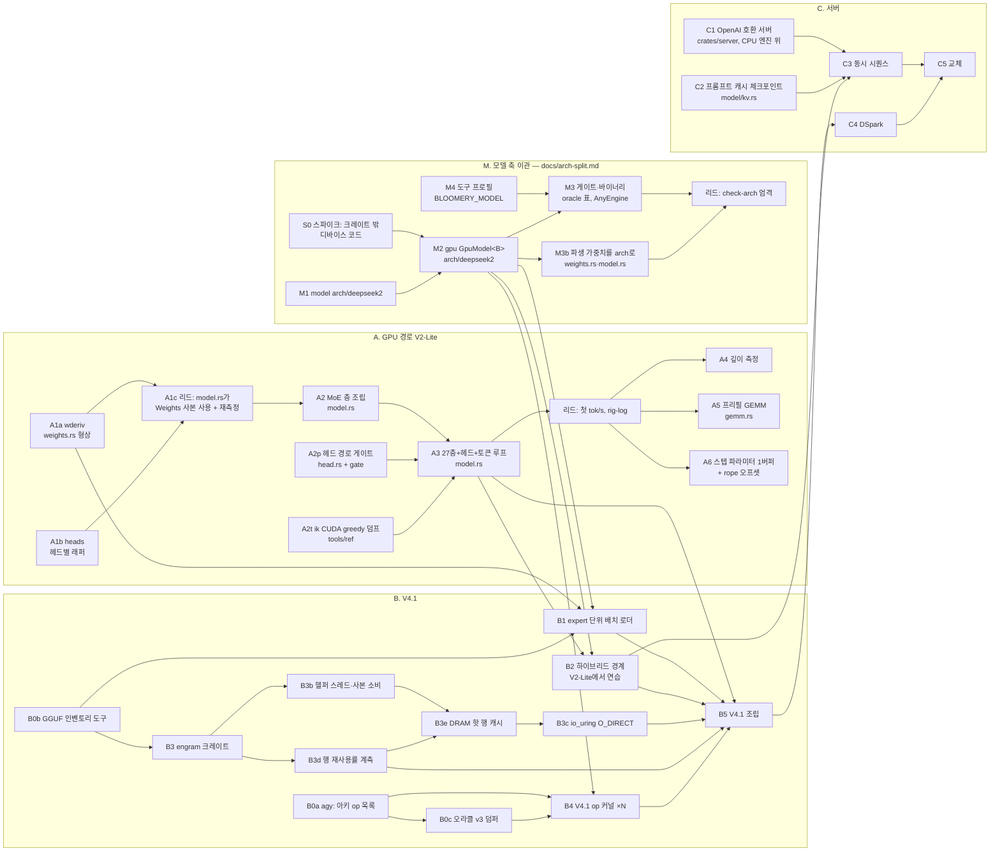

# bloomery — 계획

이 문서는 계획이고, 숫자는 [rig-log](https://github.com/midagedev/rig-log)에 측정된 뒤에만 여기 옮겨 적는다. 통과 기준은 전부 측정으로 쓴다.

이 문서는 계획·현재 상태·라운드 운영을 갖는다. `HANDOFF.md`와 `docs/orchestration.md`는 2026-09-22에 여기로 병합됐고, 두 파일의 마지막 판은 커밋 `5ce25f4`에 있다(`git show 5ce25f4:HANDOFF.md`). 새 세션은 `AGENTS.md`(규칙 정본) → 이 문서의 "지금"까지 읽으면 일을 시작할 수 있다. **끝난 것은 [`plan-ledger.md`](plan-ledger.md)(장부)에 있다** — 닫힌 라운드 카드, 지난 파동과 인계, 로드맵 A의 행별 기록, 라운드 이력을 2026-09-23에 원문 그대로 옮겼다. 옮기기 전 판은 `git show 8707bf1:docs/plan.md`다.

## 지금

**2026-09-23 낮(사용자 "적극적으로 병렬 오케스트레이션, 자율 진행")** — main은 파동 10의 b11b 머지(`277d989`) 위다. 머지 파동마다 푸시한다(아래 「결정」 ①). 끝난 파동, 그 사이의 리드 몫, 결정 원문은 장부 「「지금」에서 옮긴 것」에 있다.

- **비행 중(전부 opus)**: 11:07 `b2b`(V2-Lite 하이브리드 경계) ‖ 11:37 `b11c`(q8_0 스케일 평면 f16 + V2-Lite 짧은 행 회복 + q8_0 게이트 두 줄 + 배치 재핀) ‖ 11:49 B4 둘째 파동 `b4hc` ‖ `b4rope` ‖ `b4attn` ‖ `b4moe` ‖ `b4plan2`(스펙은 세션 스크래치 `wave-m3/spec-b4*.md`; 11:59 오라클 갱신을 다섯에 알렸다) ‖ B5 첫 둘 `b5meta` ‖ `b5ppl`(「B5 라운드」) ‖ `b4engram`(키 쪽과 쿼리 쪽을 둘로 — wkv와 키 norm은 0층 그늘, 쿼리 쪽은 1·14층 임계).
- **닫힘(12:29)**: `b5plan`(읽기 전용) — B5를 라운드 열 개로 잘랐다(「B5 라운드」, 원문 [`research/v41-b5-plan-report.md`](research/v41-b5-plan-report.md)). 그 보고로 돌고 있는 셋에 스펙 정정을 보냈다. b4hc: 1·14층은 engram이 HC_POST와 다음 접기 사이에 오므로 둘을 떼어 부를 수 있어야 한다. b4moe: shared expert는 2.666 ms이고 R1에서는 호스트 그늘이다. b4attn: 키당 131 kFLOP라 연산에 묶이며 0.39–0.57 ms/토큰이다[유도]. 보고 §7이 짚은 문서 불일치 넷(arch-split의 engram "한 스텝 앞서"·`&Gguf`·`AnyEngine` 순환, b4plan 보고의 attention 비용, v41-placement의 (b′) 비용)은 선을 그어 정정했다.
- **닫힘(파동 10 둘째 묶음, 09-23 낮)**: `b4infra` 머지(`52837f6`, 리드 보정 `74307e7` — V4.1 디바이스 크레이트를 gpu-gates 피처 `deepseek41` 뒤로 옮겨 V2-Lite 게이트 빌드가 V4.1 디바이스 코드를 컴파일하지 않는다; 의존 트리에서 `gpu` 0회·`deepseek41` 1회로 증명) ‖ `b4dump` 머지(`957cdf6`, 리드가 5토큰 세트 동일성을 다시 돌려 3,368행·파일 4,844개 동일) ‖ `ikfix` 머지(`79eaf14`) — 인덱스 키 결함을 업스트림에 [ik#2507](https://github.com/ikawrakow/ik_llama.cpp/pull/2507)로 보냈다(한 줄, 중복 검색 뒤; PPL 4청크 1.9027 → 1.8989, 오차 안; rig-log [09-23#v41-index-key-pre-rope](https://github.com/midagedev/rig-log/blob/main/log/2026-09-23.md#v41-index-key-pre-rope)). **V4.1 오라클은 이제 고친 트리의 답이다**: `/home/user/ik-idxkey`의 로컬 브랜치 `v41/idxkey-fix`(`49ef19d0`)가 deepseek41 프로필의 ik 트리이고, 공유 세트 `ref_deepseek41`과 스텝 세트 다섯(`…_step4_every_node`, `…_d1_every_node`, `…_d1_unfused_every_node`, `…_d2_every_node`, `…_d2_unfused_every_node`)이 그 트리에서 나왔다(11:56–11:58). `dump.sh`는 `$IK` 밖 라이브러리를 싣는 덤퍼를 거부한다(`11cbab6`, FAIL-first rc 3). nvidia-fs를 설치했지만 GDS의 NVMe 경로는 여전히 닫혀 있다(「GPU 선 트리아지」 ⑥ B3).
- **다음(리드)**: 둘째 파동 보고를 받는 대로 검수·머지하고, 자리가 나면 `b4woa`·`b4engram`. b2b 보고 → A6000에서 하이브리드 n_l과 겹침 켬/끔 A/B(리드), 새 레버를 AGENTS.md 런타임 레버에. b11c 보고 → A6000 ABAB(V4.1 `time-gpu-v41`, V2-Lite `time-gpu-generate`). b2b 머지 뒤 `b5load` ‖ `b5host`. ~~1단계용 스텝 세트 `d1n` 덤프~~ 떴다(`d90de1a`, 876 M). b11c 머지 뒤 `b4woa`(같은 `q8_0_gemv_heads`를 만진다)와 테스트 env ①(b11c가 쥔 `model/tests/placement.rs`를 만진다). 도구 ②는 b2b·b11c의 A6000 A/B 뒤(A/B에 쓸 측정 러너를 만진다). 테스트 env 라운드와 도구 라운드(「GPU 선 트리아지」 ①·②)는 둘째 파동과 파일이 겹치지 않으면 띄운다. 사용자 판단 대기: IOMMU를 pt로 바꾸는 재부팅(GDS의 다음 단계). 조용한 틈에 engram 임대 측정과 `measure-qdot-rate`.
- **결정(사용자 위임, 09-23 아침 — "작업속도와 성능개선에 긍정적인 방향으로")**: ① 머지 파동마다 푸시한다. ② ik의 13.3 재빌드는 ik 트리가 움직일 때 한 번에 한다(그때까지 컴파일러는 비대칭 — ik는 ptxas 13.0 AOT, 우리는 R615 JIT). ③ 3090도 서빙에 쓴다 — (b)가 서빙 목표, (a)는 대비 배치. ctx_max는 32k. 호스트 expert RAM은 서빙할 때만 잠근다. 라우터 id 추적은 승인됐다. ④ V4.1 디바이스 코드는 `crates/gpu-deepseek41`, 엔트리 접두는 `ds41_`. ⑤ #2455는 (a)안 — 따로 둔 ik 트리에서 고치고, 리드가 PPL 전후를 잰 뒤 오라클을 다시 뜬다. ⑥(09-23 낮) B5는 (a) 한 카드로 먼저 낸다 — 서빙 목표 (b)는 그대로이고 (b)냐 (b′)냐는 B12 뒤에 정한다(「B5 라운드」).
- **툴체인**: 박스는 CUDA 13.3(`~/bloomery-env.sh`)이고 ik는 13.0에 고정했다. 드라이버 JIT는 PTX `.version` 9.4까지 받지만 LLVM(= cuda-oxide·nightly 핀)은 옮기지 않는다 — 다시 볼 조건은 장부. ncu 러너는 2025.3.1에 이름으로 고정했다(「GPU 선 트리아지」 ⑦).
- **열린 결정 후보**: 스칼라 세그먼트 패스(와 그것만 재는 keyaxis 계기 8개)를 지울지 — 「성능이 먼저」는 엔진이 경로 하나만 싣는다고 했다.

### GPU 선

**2026-09-22 저녁부터 기본 flash 패스는 MMA다**(`294d907`). ~~아래 스코어보드와 깊이 표는 전부 스칼라 패스로 잰 것이고, 다음 A6000 표부터는 MMA로 잰다~~ **잤다(2026-09-22 밤, A6000 한 임대·팔 여섯 번갈아·세 바퀴·n=96, 리드 측정)**:

| 깊이 | 우리(MMA 기본) | 산포 | ik | 산포 | 비 |
|---|---|---|---|---|---|
| 6 | **229.54** tok/s | 1.13 % | 205.47 | 2.54 % | **1.117배** |
| 1024 | **222.24** | 1.06 % | 193.96 | 1.85 % | **1.146배** |
| 4096 | **199.62** | 0.57 % | 179.00 | 0.53 % | **1.115배** |

**깊이 4096의 역전이 사라졌다** — 세 깊이 전부 ik보다 빠르다. 키당 기울기는 파생으로 우리 0.160 µs(6→4096; 구간 0.141·0.166), ik 0.176(0.282·0.140) — 「모델」 `c_key` 행에 **유도로** 적어 둔 0.160 µs와 측정이 맞는다. 카드와 패스가 둘 다 바뀌었으므로 옛 3090 표와 나란히 놓지 않는다: 패스에 대한 귀속은 a4e의 같은 카드 A/B(d4096 6.511 → 5.048 ms, −22.5 %)가 하고, 이 표는 새 기본값의 절대 위치다. 기록 rig-log [09-22-o](https://github.com/midagedev/rig-log/blob/main/log/2026-09-22-o-the-depth-table-on-the-new-default-and-the-reversal-is-gone.md). 옛 스코어보드와 깊이 표(**스칼라 패스·3090**, 계열 비교용)는 장부 「GPU 선 이력」에 있다.

### CPU 선

- **커널**: Q3_K×q8_K, Q4_K/Q5_0/Q5_1/Q6_K×q8_2_x4 전부 융합(crates/qdot). MUL-38 q_nope2 Q8_0×Q8_0(vpsignb 부호접기 maddubs, 비트 동일). MUL-36 flash SIMD(kq_dot 8레인 합순서 + V j축; 폴백 레버 `BLOOMERY_FLASH_SIMD=0`). MUL-37 직렬 activation quant 풀 이양 + moe gate/up 이중양자화 제거(ptr::eq). 커널률은 ik의 95–99%(Q3_K만 ik 대조 미측정).
- **디스패치 경로가 느리면 첫 질문은 스레드 스윕이다**(`SWEEP="8 16 24 32" just measure-decode`): 곡선이 평평하면 일이 아니라 기다림. 프로파일이 꺼진 청크는 락을 잡지 않는다(AGENTS.md).
- **게이트**: 14개 just 레시피(gate-ops/attn/ffn/moe/head/forward/kv/derived/mt/profile/threads/qdot/prompts/1-1). 머지 후에는 영향 게이트 + mt/forward/prompts 재실행이 관례.
- **핀 상태**: prompts KNOWN_DIVERGENCE = ~~**{24}**(MUL-36 재핀, A/B 입증됨 — 이전 {14})~~ **{}**(2026-09-21 밤 `qdot::swiglu` 재핀, `crates/model/tests/prompts.rs` — 24는 0.151 근타이의 제비가 ik 쪽으로 떨어진 것). forward L_OUT_BANDS = (0,3e-3)(3,2e-3)(24,7e-2) + 날짜 주석. gate-mt는 재핀 불허 항목(스레드 무관 비트 동일).
- **스코어보드(2026-09-20 저녁, 같은 임대)**: N=96 **61.48 tok/s** 대 ik 82.88 → **잔여 1.35배**(아침 39.71/2.10배). 경위는 rig-log -j: 청크 끝의 무조건 수집 Mutex 제거(+44%) → 메인 스레드 고정 → mmap 프리폴트(+3.5%; 프리필 +18%는 6토큰 프롬프트 기준). → rintf libm 호출 제거(+8.3%, 2b2fdb6).
- **남은 산수**: 레벨2 dot 합/32 = 8.5 ms/step(완전 병렬 내적), ik 스텝 전체 12.1 ms, 우리 16.3 ms → 비내적 7.8 ms를 3.6 아래로. perf상 임계 경로는 메인 스레드 하나(워커는 표본의 51%를 스핀으로 대기): rintf 10% · memset 6.6% · expf 3.2% · 자기 청크+장벽 18%.
- ~~**스테이지 표(N=96, 레벨1, 24.18 ms/step)**~~ (락 아래서 잰 표 — 새 표는 rig-log -j): batch Q3_K 24.1% · Q3_K 단일 18.4% · batch Q5_0 14.9% · Q4_K 13.5% · Q6_K(lm_head) 5.3% · q_nope2 5.1% · swiglu+F32+접착부 ~10% · **flash 0.40ms(1.6%)**. 전체 54.8 GB/s = STREAM의 37%.
- 주의: 레벨2 quant 열은 MUL-37 이후 워커 CPU합(벽시간 아님).

세션별 스코어보드(밤 → 아침 4)는 장부(`plan-ledger.md`)에 있다. 가장 최근 값은 그 목록의 첫 항목이다.

### 어디에 무엇이 있는가

| 위치 | 내용 |
|---|---|
| `~/repo/bloomery` (이 리포) | 엔진 본체. AGENTS.md = 규칙 정본. docs/research/ = 조사 문서(CPU 조사 종합표는 `cpu-llm-ideas.md`, 패킹이 1순위), docs/RESULTS-*.md = 라운드 산출, docs/plan.md = 단계 계획 |
| `~/repo/rig-log` | 측정 기록(한국어 산문). 임대·증인 있는 숫자만. README 로그 표가 전체 인덱스. ~~최근: 2026-09-20-a…-h~~ 최근: 2026-09-22-a…-e. 증상으로 먼저 찾는다 — `tools/recall.sh '<키워드>'` |
| gadak 트래커 | `GADAK_HOME=$HOME/.gadak gadak --workspace gdk`, 프로젝트 MUL. Done: MUL-1…38 전부 종결(코멘트에 판정). 미완: MUL-30(GPU — ~~착수 대기~~ **진행 중**: A3 종료, A4 측정 완료, A4b 비행 중), MUL-6(CUDA 13.3 툴킷 — cutile-rs 스파이크의 전제) |
| 박스 | 접근은 오직 `./tools/box.sh '<cmd>'`(rsync 단방향 → 박스 편집 금지). 원격: /root/repo/bloomery, 데이터: /root/bloomery-data, 임대 락: /root/bloomery-cpu.lock. GPU: 기본은 3090. ~~**A6000(idx 1) 금지**~~ **정정(사용자, 2026-09-21)**: A6000도 개발에 쓸 수 있다 — `BLOOMERY_CARD=a6000\|both`로만 가고, `llm.service`가 살아 있거나 컴퓨트 프로세스가 있으면 rc 75로 거부된다. ~~**시간 숫자는 3090에만**(기준선이 거기서 나왔다)~~ **정정(2026-09-22 저녁)**: 3090 낙하 두 번 뒤로 **시간 숫자는 A6000에서** 잰다. 3090은 게이트·빌드 카드(300 W 캡) |
| 세션 메모리 | ~~`~/.zcode/cli/memories/projects/rig-log-*/memory/`~~ `~/.claude/projects/-Users-hckim-repo-rig-log/memory/`(`MEMORY.md`가 색인) — 이 워크스테이션의 세션에만 유효하고, 규칙이 아니라 **사건 원본**만 산다. 새 곳에서는 이 파일이 대체 |

## 모델 — 먼저 유도하고, 측정은 유도가 빗나갈 때만 (2026-09-22)

여기까지의 라운드는 대부분 "만들고 재 본다"였다. 그런데 닫힌 라운드를 되짚어 보면 결과의 상당수가 이미 가진 상수로
미리 계산되는 것이었다. 그래서 규칙을 바꾼다. **라운드는 예측을 들고 연다.** 측정은 예측이 밴드를 벗어났는지 보는 두 번째
행위이고, 벗어나면 그때 모델의 어느 항이 틀렸는지가 그 라운드의 발견이다.

### 비용 모델 (디코드 스텝)

`step_ms ≈ Σ_k max(bytes_k / BW, instr_k / issue, t_floor_k) + N_node · c_node + N_barrier · c_barrier + depth · c_key`

`t_floor`는 B9에서 들어온 항이다(2026-09-23). 격자가 한 파동이 안 되거나 작으면 런치 시간은 바이트가 아니라 행 하나를 걷는
적재 사슬로 정해지고, 같은 격자·같은 K에서도 커널마다 다르다(K = 5120·격자 64에서 q8_0 16.8 µs, q3_K 5.8 µs).

| 상수 | 값 | 교정한 측정 | 카드 |
|---|---|---|---|
| `c_node` | 0.80 µs | A3d lfold, 독립 계기 둘이 4% 안 | 3090 |
| `c_barrier` | 0.72 µs + 협동 런치 0.20 | A3g fmerge | 3090 |
| `BW` | ~700 GB/s. 이 근처의 커널은 발행 바운드가 아니다 | A3f q4kdec: 명령 37% 감소, 스텝 +0.38% | 3090 |
| `c_key` | 우리 0.46 µs, ik 0.16 µs (캐시된 키 하나당) | A4 depth | 3090 |
| `c_key` (기본 MMA 패스) | 우리 0.160 µs, 스칼라 패스 0.526, ik 0.160 — **파생, 재교정 전**: 09-22-j 3바퀴의 깊이 6과 4096 스텝 차를 4090키로 나눴다(MMA 4.395→5.048, 스칼라 4.360→6.511, ik 4.929→5.582 ms; ctx는 512·4192라 죽은 세그먼트 런치가 들어 있다). 위 3090 행은 스칼라 패스의 것이다. **재교정됨(2026-09-22 밤)**: 새 기본값의 깊이 표에서 우리 0.160 µs(구간 0.141·0.166), ik 0.176(0.282·0.140) — 유도값과 측정이 맞았고, ik 쪽만 0.160 → 0.176으로 올린다(그 유도는 09-22-j의 두 점에서 나왔고 이번 것은 세 점이다) | A4e 3바퀴(파생) → 09-22-o 깊이 표(측정) | A6000 |
| 잡음 | 3바퀴 기준 ±1% | A6 잔여 | A6000 |
| `c_node` | 0.852 µs(784노드), 0.871 µs(504노드) — 빈 `touch` 그래프 | B9 `time-gpu-v41`(09-23 08:07) | A6000 |
| `BW` (큰 런치) | 567–701 GB/s — 한 런치가 수십 MB면 575 가정이 맞거나 낮다(q8_0 ~~567–598~~ B11 뒤 615–680, `q4k_gemv_sel` 579, `q3k_gemv_sel` 619–639, 헤드 q6_K 701) | B9, B11 | A6000 |
| `t_floor` | 작은 격자의 런치 하한: K = 5120에서 q8_0 ~~16.8 µs(격자 64)·20.2 µs(160), f32 16.4 µs(48)~~ ~~12.0 µs(64)·16.0 µs(160)~~ **8.0 µs(64)·14.0 µs(160)**, f32 **13.5 µs(48)**, q3_K 5.5–5.8 µs(4–64); K = 4096 q8_0 ~~15.3 µs(128)~~ ~~11.9 µs~~ **10.0 µs**; K = 512 q3_K 1.45 µs(16). 굵은 값은 B11b(레인당 워드, 워프 적재당 코드 128 B) 뒤다. f32는 B11 값 그대로다 | B9, B11 ABAB(09-23 09:03), B11b ABAB(11:08) | A6000 |
| `BW_host` | V4.1 호스트 expert 다리 128–130 GB/s(16–32스레드 평균, 가장 빠른 라운드 131–137), 8스레드 90. 16스레드에서 포화한다. 디스패치 고정비 6.9 µs[유도: 같은 바이트를 엔진 82 대 행렬마다 720디스패치로] | b2h 스윕(09-23 10:24) | 호스트 |

시간 카드가 A6000으로 옮겨졌으므로 3090 상수는 **한 번씩만 A6000에서 다시 교정**한다. 교정은 상수마다 측정 하나다.
그 다음부터 라운드마다 재는 일은 없다.

점유율은 측정할 값이 아니라 계산할 값이다. 입력은 블록당 레지스터·smem·스레드(ptxas `-v`)와 SM 수이고, 스펙이 이 숫자를
먼저 적는다.

### 변경 클래스와 증명 방식

| 클래스 | 증명 | 런타임 게이트 | A/B |
|---|---|---|---|
| 이동·분할·이름 바꾸기 (의미 보존) | PTX 표 동일(커널만 증명한다). 호스트 디스패치 코드면 구조 줄도 불변이어야 한다 — 그래프 노드 수, eager = replay, e2e 집합 동일 | 그 구조 줄뿐 | 없음 |
| 정수 경로 재배열 | 결합법칙이 성립하므로 비트 동일, 게이트 하나 | 해당 게이트 1회 | 없음 |
| 런치 수만 바뀜 | Δt = ΔN · `c_node`로 예측 | 해당 게이트 | 점유율도 바뀔 때만 1회 |
| ~700 GB/s 근처 커널의 명령 수 | 모델상 이득 0. **라운드를 열지 않는다** | — | — |
| 점유율·기하 | 계산한 점유율을 스펙에 적는다 | 해당 게이트 | 예측 확인 1회 |
| 부동소수점 합산 순서·정밀도 | 아래 오차 모델 | e2e | 예측 확인 1회 |

측정으로만 답하는 잔여 클래스도 이름을 붙여 둔다. 하드웨어 고장(Xid 79), 컴파일러 레지스터 할당, 캐시 이상(깊이 1024에서
ctx를 키웠더니 오히려 0.9% 빨라진 것처럼 기제가 안 잡힌 것)이다. 이 클래스는 측정이 먼저다.

컴파일 시점에 결정되는 것(노드 수, 런치 수, 커널별 명령·레지스터 수)은 `ptx-scan` 류의 래칫으로 잡고, 런타임에서 다시 재지 않는다.

### 되짚기 — 모델이 미리 말했을 것

| 라운드 | 모델이 말했을 것 | 실측 |
|---|---|---|
| A3f f16 레버 | ~700 GB/s에서 발행 바운드가 아니므로 이득 0 | 명령 −37%, 스텝 +0.38% |
| A4d MMA | 격자 18블록 < SM 84개. 도는 SM에서 점유율은 4워프/48 = 8.3%, 66개 SM은 유휴 | 달성 점유율 8.3%, 모든 깊이에서 느림 |
| A4e | 512스레드에 K 타일 56 KB면 SM당 블록 수가 정해지고, 점유율은 그 산수로 나온다 | 33% (MIO가 다음 벽. 이것은 측정만으로 알았다) |
| B9 V4.1 밀집 읽기 | 묶음 `wo_a`(8그룹 × 40층 = 320런치)를 한 런치로 합쳐도 노드 비용만 준다: ~0.22 ms(b9h 유도). 토큰 그래프 22.73 ms | 같은 바이트를 한 런치로 두면 2.24 ms가 준다. 틀린 항은 `c_node`가 아니라 `t_floor`다 — 0.38파동 런치 하나가 15.3 µs(유도 8.2). 토큰 그래프 24.66 ms |
| B11 `LANE_UNROLL` 4 → 8 | 왕복 수가 반이 되고 왕복 지연(421–506 ns)은 그대로이므로 작은 격자 런치가 반으로 준다(`attn_kv` 16.8 → 8.4 µs). 토큰은 −3.2 ms. 큰 런치는 575 GB/s 근처라 0 | 작은 격자는 반이 아니라 0.72–0.79×였다(`attn_kv` 12.0 µs). 토큰은 −2.16 ms(−8.7 %). 틀린 항은 왕복 지연이 상수라는 가정이다 — 비행 중 바이트가 두 배가 되자 왕복당 지연이 늘었다(고정 항이 없다면 417 → 599 ns, 사이트에 따라 +44–58 %). 큰 q8_0 런치는 대역에 있지 않았다(567–598 → 615–680 GB/s). 토큰 이득 가운데 −0.6 ms가 거기서 나왔다 |
| B2h V4.1 호스트 다리 | 디스패치당 바이트 법칙(09-20, V2-Lite)과 다중 스레드 상한 사이에서 91–136 GB/s, n = 6에 30–44 ms. 행렬마다 팔은 5–8 MB 디스패치라 47–51 GB/s, 79–86 ms | 128–130 GB/s(31.1–31.5 ms)로 대역의 위쪽 끝, 행렬마다 팔은 35.5 ms. 틀린 항은 법칙이다 — 이 크기와 지금 코드에서 5–8 MB 디스패치가 110–119 GB/s를 낸다. 16스레드에서 포화하므로 한 코어 커널 차이는 이 다리에서 값이 없다 |
| B11b 레인당 워드 | 왕복 지연이 비행 바이트를 따르면 토큰 그래프 22.58 → 21.2 ms, 적재 명령 수를 따르면 19.3 ms. `attn_kv` 7.59 / 6.26 µs, SASS가 미룬 적재 둘이 왕복을 한 번 더 치르면 ~12 µs | 20.87 ms, `attn_kv` 8.01 µs — 앞쪽 모형에 가깝고 미룸은 쌌다. 큰 격자 한 런치(`wo_a` 밀집)는 624 GB/s 그대로였다. 모형 밖이었던 것: V2-Lite의 K = 128 행(`q_nope2`)이 새 본문에서 0.66 µs 느려졌다 — 행이 단계 하나뿐이면 이득 항이 없고 고정비만 남는다 |

맞은 줄의 클래스는 증명된 것으로 보고, 빗나간 줄이 측정이 필요한 자리다. 표는 새 라운드가 닫힐 때마다 한 줄씩 늘린다.

### 성능이 먼저, 정확도는 선택 (사용자 결정, 2026-09-22)

빠른 쪽과 정확한 쪽이 갈리면 기본값은 빠른 쪽이고, 엔진에는 그 경로 하나만 둔다. 더 정확한 변형은 엔진의 두 번째 경로가
아니라 검증 쪽에 둔다 — f64 심판 `exact_ref --act f64|ours|ik|ik16`이 반올림 규칙마다 시뮬레이션한다. 버그 판정은 엔진을
자기 규칙의 시뮬(`--act ours`)과 대조한다: σ를 넘게 어긋나는 위치는 버그 후보, σ 안은 반올림이다. σ와 forced_exact 버킷은 기본값이 참값에서 얼마나 떨어져 있는지 알려 주는
진단이지, 성능 변경을 막는 핀이 아니다. 정확도 핀은 버그를 잡는 것만 남긴다(forced_exact 개수 핀 ≤ 6, 참조 게이트).

계기는 errsrc였다. 원인은 활성값 양자화 블록 크기였다 — K-quant 입력을 128값 블록 대신 32값 블록으로 자르면 f64 시뮬에서
불일치가 41 → 25, σ 0.378 → 0.255로 ik CUDA(25, 0.271)와 같아진다(1023위치, `docs/research/errsrc/sim/judge-ours-ik.out`).
그 값은 활성 스케일 4배, 비트 게이트 전부의 재핀, CPU와 GPU 규칙의 분리다. 기본값은 128 그대로다. GPU에 선택 스위치로
32값 경로를 두는 안도 검토했다가 버렸다 — 두 번째 경로는 썩지 않게 할 게이트가 따로 필요하고, 검증은 시뮬로 충분하다.
32값은 `exact_ref --act ik`로만 존재한다.

### 오차 모델 (진단)

지금 e2e 핀은 이산 개수다(마진 ≥ 0.5인 불일치 수 ≤ 6). 표본이 작아서 6과 7 사이는 동전 던지기에 가깝다. MMA 레버가 핀
경계 6에 정확히 걸린 것이 그 예다. `exact-forced-32.tsv`가 1023위치 **전부**의 참 마진을 갖고 있으므로 연속량 σ를 진단으로
함께 찍는다(핀은 아니다 — 위 절). `gate-gpu-e2e`의 `forced_sigma` 줄이고, `--margins PATH`가 위치별 마진을 파일로 남긴다.
첫 실측(main c5b2b22, 스칼라 팔, 3090): σ 0.3518, 편향 −0.0206, 마진 ≥ 0.5에서 기대 3.58 대 실제 4. MMA 팔은 σ 0.3641,
기대 4.12 대 실제 6. 우리 규칙 시뮬(0.378)과 같은 자리다.

1. 팔마다 σ 하나를 잰다. 전 위치에서 (우리 마진 − 참 마진)의 RMS이고, 실행 한 번으로 나온다.
2. 기대 불일치 수는 Σ_i Φ(−m_i / σ)이다(m_i는 참 마진). 핀은 이 값의 분포에서 유도한다. 스칼라 변형을 여러 번 돌려
   산포를 표집할 필요가 없어진다.
3. 먼저 확인할 것: 마진 ≥ 0.5 불일치 4곳(8/2, 18/31, 21/24, 29/27)이 매끄러운 오차인지, 라우터 전문가 선택이 뒤집힌
   불연속인지. 불연속이면 σ는 라우터 마진에 대해 잡아야 한다. **불연속 쪽 증거가 하나 있다**(2026-09-22 저녁): 위치별 차의 꼬리가
   어느 쌍에서나 가우시안보다 훨씬 두껍다. RMS의 4배를 넘는 위치가 가우시안 기대 0.1개인데, 활성 반올림만 다른 시뮬 대 참값도 11개다
   (`docs/research/errsrc/engine/cmp-mma-scalar.out`). 라우터 뒤집힘을 직접 본 것은 아니다.

팔 비교(스칼라 대 MMA)는 σ 두 개의 비교가 된다. 개수 비교보다 검정력이 훨씬 크다.

### 단위는 조건을 달고 다닌다

모든 숫자는 `tok/s @ n=N, 깊이 D, 카드` 형태로 적는다. 조건이 없으면 숫자가 아니다. 중간 비들을 잃은 사건(n=32 대 n=96)은
단위 오류였다.

**새 환경 체크리스트**: ① 두 리포 클론(bloomery, rig-log — 둘 다 GitHub에 푸시돼 있음) ② 박스 SSH 설정 + `tools/box.sh` 동작 확인 ③ gadak 설치/설정(또는 이슈 상태는 이 문서의 「대기열」로 대체 가능) ④ 맥에서 게이트 금지(arm64) — 모든 게이트는 box.sh 경유.

## 목표

DeepSeek-V4.1-Flash를 이 워크스테이션(RTX A6000 48 GB + RTX 3090 24 GB, 둘 다 sm_86, Threadripper 5975WX 32코어, 256 GB)에서 우리 엔진으로 서빙한다. 호스트는 Rust, GPU 커널은 CUDA Rust(지금은 cuda-oxide, 툴킷 13.3 라운드 뒤 cutile-rs), CPU expert 티어는 Rust SIMD. 기준선은 같은 자리에서 잰 것이다. ~~ik_llama.cpp: 서빙 프로파일 PPL 2.2355, 디코드 25.05 tok/s(2026-09-16).~~ **선 그음 2026-09-19 — 그 한 줄이 엔진 둘을 합쳐 놨다.** PPL 2.2355는 **ik 포트**(ik_llama.cpp #2455)가 plain Q3_K_M 324 GB에서 낸 값이고, 디코드 25.05 tok/s는 **mainline 포크**(vcruz305/llama.cpp — `iqk` 디렉터리가 없다)가 grafted 445 GB 파일에서 낸 값이다. 이 박스의 V4.1 서빙은 처음부터 mainline이었다(rig-log `log/2026-09-12-deepseek-v41-first-run.md`가 "mainline llama.cpp지 ik 아님"이라고 적어 뒀고, 여기 옮겨 적으면서 틀렸다). `llm.service`가 띄우는 것은 또 다른 구성이다 — ik + DeepSeek-V4-Flash-**0731** Q4_K_XL 155 GB, 포트 8000.

같은 배치에서 둘을 나란히 잰 표가 #2455 본문에 있다: PPL 2.2355(ik) 대 2.2556(mainline), 디코드 20.4–20.7(ik) 대 21.2(mainline). **두 엔진이 3 % 안에 있다.** 이것이 이 프로젝트에 주는 것은 둘이다 — (1) 넘어야 할 선은 사실상 하나다, (2) ik의 존재 이유인 `iqk_mul_mat`이 이 배치의 호스트 expert 항에서 값을 못 받고 있다. 아주 다른 두 CPU 커널이 3 % 안에 떨어진다는 것은 그 항이 커널이 아니라 **대역폭**에 묶여 있다는 방증이고, `docs/roofline.md`가 그렇게 예측했다.

왜 직접 만드는가: 이 박스가 실제로 서빙하는 모델은 mistral.rs가 로드하지 못하고, ik의 MoE 디코드는 배치를 못 하며, 어느 쪽이든 고치려면 업스트림 머지를 기다려야 한다(2026-09-19 기준 mistral.rs는 09-08 이후 정지, 외부 PR 40건 대기). 발견은 계속 업스트림에 코멘트로 보내되, 엔진은 머지에 의존하지 않는다.

## 디딤돌

V4.1 Flash는 engram 테이블 NVMe 지연 읽기, 공유 압축 KV, 지연 하이퍼커넥션, 저랭크 query norm, CPU expert 티어, DSpark 드래프트를 한꺼번에 요구한다. 먼저 **DeepSeek-V2-Lite-Chat Q3_K_M**(8.1 GB, `deepseek2`, MLA, MoE 64 expert, 3090에 들어감)으로 로더·MLA·MoE·게이트를 세우고, V4.1 고유 부분은 ik 포트(ik_llama.cpp #2455)를 참조로 얹는다.

## 단계

| 단계 | 만드는 것 | 통과 기준 |
|---|---|---|
| 0 | cuda-oxide로 쓴 Q3_K gemv를 같은 텐서의 ggml `mmvq`와 대조 (MUL-1, rig-log WKS-35) | ~~최대 상대 오차 ≤ 1e-4~~ f32 활성값이면 1e-4, q8_1 활성값이면 1e-2(설계를 명시) — 2026-09-19 선 그음: 2라운드가 ggml처럼 q8_1로 갔고 오차 4e-3은 그 설계의 것이다. 대역폭 `stack` M=1에서 ggml의 0.9배 이상. **통과 2026-09-19: 1.05배**(348 대 333 GB/s, 3090). M=8 0.83배는 MUL-8, Q4_K·Q6_K·A6000 행은 MUL-9 |
| 1 | V2-Lite 순전파. 세로로 다섯 라운드, 각 라운드가 끝에서 끝까지 도는 것 하나를 내고 자기 게이트를 가진다(장부 「1단계를 세로로 자른다」) | 고정 프롬프트에서 ik greedy와 토큰 동일, wikitext-2 PPL이 ik 오차 안 |
| 2 | 호스트 expert 티어: 일부 층 expert를 CPU에, 양자화 상태 sparse gemv를 코어 전체에. 커널은 이미 있다(MUL-3, ggml의 1.1배) — 남은 것은 호출자다 | 층·토큰당 비용을 같은 런의 ik와 대조(참조 급: Qwen3.6에서 ik 0.20 ms), batch 2가 batch 1보다 느리지 않음 |
| 3 | V4.1 아키: engram mmap + WILLNEED 프리페치, 하이퍼커넥션, 공유 KV, query norm | ~~PPL 2.2355 행 패리티, 같은 배치에서 25.05 tok/s 대비~~ B5 카드의 목표(서빙 파일에서 고친 ik 대비 PPL 패리티, tok/s 대 ik) |
| 4 | DSpark 드래프트 + 스케줄러, 빠른/느린 모델 라우팅(결정은 로컬·1 ms 아래, 출력이 바뀌므로 φ 측정으로 먼저 판정 — `research/jev-routing.md`) | 수락률·tok/s가 ik 서빙 프로파일 이상 |

## 로드맵 (2026-09-21 재정리 — 순서: GPU 경로 → V4.1 배치·engram·NVMe → 서버)

위 표의 2~4단계는 2026-09-19의 서술이고 그대로 둔다. 그 뒤 이틀의 실측이 순서와 경계를 바꿨으므로
여기 다시 적는다. 각 국면의 끝은 숫자 하나다 — 그 숫자가 rig-log에 실리기 전에는 다음 국면을 열지 않는다.
사용자 결정(2026-09-21): **GPU 경로를 끝내고, engram과 NVMe 오프로딩을 하고, 그 다음 서버.**
라운드 단위의 운영(파일 경계·병렬·순차·파동)은 아래 "라운드 운영" 절에.

### A. GPU 경로 — V2-Lite 전체를 3090에서 (닫힘)

A 국면은 닫혔다. 끝 숫자는 위 「지금 / GPU 선」의 A6000 깊이 표(MMA 기본값)이고, 행별 기록(A1~A4)은 장부 「로드맵 A」에 있다. 남은 A5(프리필)는 「열린 라운드 카드」에 있다.

A3이 국면의 끝이다. A4·A5는 B로 넘어가기 전에 **재기만** 하고, 손대는 것은 B의 배치 결정이 나온 뒤.
근거: V4.1에서는 dense 7.66 GB/토큰이 전부 VRAM에 있고(roofline) 그 항이 GPU 시간의 대부분이므로, V2-Lite에서
얻은 GPU 스텝 효율이 그대로 V4.1의 GPU 항이다.

### B. V4.1-Flash를 이 기계에 — 배치, CPU expert 티어, engram, NVMe

바이트가 말하는 것(roofline, 2026-09-16 서빙 배치 기준): 토큰당 11.7 GB 중 dense 7.66 GB는 VRAM, 라우팅 expert
4.04 GB 중 3.34 GB가 DDR4(33블록), 0.71 GB가 VRAM(7블록); engram 194.9 GiB는 **토큰당 48행(12.75 KiB)**만 읽는다.
가중치 249 GiB(444 − 195)는 RAM 256 + VRAM 72에 들어가므로 **expert의 NVMe 오프로딩은 이 양자화에서는 필요 없다**;
NVMe에 두는 것은 engram 하나다. 더 큰 양자화(Q4)를 올리려면 그때 expert 일부가 NVMe로 가고, 그것은 별도 측정 뒤의
선택이다.

| 행 | 만드는 것 | 끝의 숫자 |
|---|---|---|
| B0 | 선행: V4.1 아키 독해 — ik 포트(#2455)를 참조로 하이퍼커넥션·공유 압축 KV·저랭크 query norm·engram 조회 경로를 op 목록으로; ik에서 V4.1 중간 텐서 덤프(오라클 v3) | 덤프 세트 + op 인벤토리(문서) |
| B1 | 로더: 텐서마다 (디바이스, dtype) 주소를 로드 시 배정(층 단위가 아니라 expert 단위 — mistral.rs가 못 하는 그것); GGUF 444 GiB의 mmap 창 | 로드 시간, 상주 바이트 표(어디에 몇 GB) |
| B2 | **CPU expert 티어**(옛 2단계): 라우팅 expert의 sparse gemv를 CPU 풀에 — 커널은 이미 ik의 95~99%; 남은 것은 GPU 스텝과의 경계(활성값 전송, 동기) | 층·토큰당 호스트 항 ms 대 roofline 하한(3.34 GB ÷ 147.7 GB/s = 22.6 ms); GPU↔호스트 왕복 µs; **GPU 유휴 비율** — 호스트 하한에 닿고도 GPU가 40% 노는 라운드가 초록으로 읽히면 안 된다(`research/hybrid-engines.md`의 R1: 공유 전문가를 호스트 다리와 겹친다) |
| B3 | **engram**: 테이블은 NVMe mmap, 토큰당 48행(12.75 KiB, 흩어진 272 B 읽기)을 `WILLNEED`/`io_uring` 선행 읽기로; ~~캐시 안 하는 것이 설계~~ 캐시 여부는 실 스트림의 행 재사용률(B3d)을 잰 뒤 결정(2026-09-22 조사 `research/nvme-read-techniques.md`) | 조회 지연 µs(p50/p99, 콜드·웜), **스텝 스레드에서의 몫**(벽시계가 아니라) |
| B4 | V4.1 고유 op 셋(B0 목록)을 GPU 커널로, 오라클 v3 대비 게이트 | 층 탭 표 밴드 안 |
| B5 | 조립 + 첫 V4.1 토큰 | ~~**PPL 2.2355(ik) 패리티, tok/s 대 25.05(mainline, 2026-09-16)**~~ **서빙 파일에서 고친 ik PPL 1.8989 ± 0.0491 대비 패리티, tok/s 대 ik 20.4–20.7**(A6000에서 다시 잰다) |

B의 순서는 위험 큰 것부터다 — B0·B1이 없으면 나머지가 잘못된 형상 위에 선다. B2는 V2-Lite에서 미리 연습할 수 있다
(일부 층 expert를 CPU에 두는 하이브리드; A3 뒤, 경계 하나만 더하는 일).

### C. 서버 — `llm.service`를 대신한다

지금 그 자리는 ik + DeepSeek-V4-Flash-0731 Q4_K_XL(포트 8000, OpenAI 호환, tailnet 공개)이다. 우리 서버는 같은
자리에 같은 API로 서고, 바꿔 끼운 뒤 속도가 돌아왔는지 같은 러너로 확인하는 것이 끝이다.

| 행 | 만드는 것 | 끝의 숫자 |
|---|---|---|
| C1 | OpenAI 호환 HTTP(`/v1/chat/completions` 스트리밍, `/props`, 청크별 `timings` — toktape가 첫날부터 녹화) | toktape 한 클립 |
| C2 | **프롬프트 캐시 체크포인트**: 편집 한 번에 13k 프리픽스가 통째로 재프리필되던 것(rig-log 2026-09-17)을 메시지 경계 체크포인트로 | 재프리필 토큰 수, 편집 후 첫 토큰 지연 |
| C3 | 동시 시퀀스 — 호스트/GPU 2단 파이프라인(roofline: 처리량 1.67배 **도출**, 독립 시퀀스 ≥ 2일 때만) | 동시 2·4 스트림 합계 tok/s |
| C4 | DSpark 드래프트 + 검증 배치(옛 4단계; k* ≈ 2.2 실측이 검증 폭의 상한) | 수락률, 단일 스트림 tok/s |
| C5 | systemd 유닛·임대 협약~~(A6000 야간 학습과의 양보)~~(야간 학습은 2026-09-21에 끝났다 — 협약 상대는 우리 측정 라운드뿐)·교체 | 교체 전후 같은 러너의 tok/s |

## 라운드 운영

날짜 2026-09-21. 이 절은 위 로드맵을 **위임 라운드 단위**로 자른 것이다(2026-09-22 병합 전에는 `docs/orchestration.md`였다).
라운드 하나 = 워크트리 하나 = 파일 경계 하나 = 게이트 하나 = 완료 보고 하나. 리드는 스펙·diff 독해·게이트 재실행·
임대 측정·머지만 한다. 이 절의 크기 표기(S/M/L)는 추정이고 실측이 아니다 — 라운드가 끝날 때마다 실제 소요를 옆에 적는다.

### 원칙

**백엔드(2026-09-21 오후 개정)**: 새 위임은 opus 서브에이전트(Agent 도구, `model:"opus"`)다 — 카드의 "GLM"은 그렇게 읽는다. 돌던 GLM 라운드만 끝까지 둔다.
 (병렬성을 정하는 것은 파일 경계다)

1. **같은 파일을 두 라운드가 동시에 만지지 않는다.** `crates/gpu/src/model.rs`가 GPU 경로의 병목 파일이다 — 조립 라운드는
   전부 여기를 지나므로 **model.rs를 만지는 라운드는 한 시점에 하나**. 커널·게이트·도구·다른 크레이트는 자유롭게 병렬.
2. **오라클이 직렬을 팬아웃으로 바꾼다**(plan.md 1단계에서 실증). 조립 입력이 앞 라운드의 출력이라도, ik 덤프가 그 입력을
   파일로 갖고 있으면 병렬로 열 수 있다. 그래서 오라클 덤프 라운드(A·B 각각)가 다른 무엇보다 먼저다.
3. **리드가 직렬 지점이다**: diff 독해·게이트·임대 측정·머지. 임대는 한 번에 하나. 그래서 동시 비행은 **3~4 라운드**가 상한이고
   ~~(GLM 쿼터도 같은 상한을 준다 — 주간 창은 09-26 11:54 리셋), 그 이상은 조사(agy) 라운드로 채운다.~~
   **개정(2026-09-22)**: 위임이 opus라 쿼터가 상한을 주지 않는다. 상한을 정하는 것은 둘뿐이다 — 리드의 검수 대역과 **박스 임대 하나**.
   박스로 재는 라운드는 한 시점에 하나이고, 코드 읽기·문서 라운드는 그 옆에 몇이든 붙는다.
4. **조사는 코드보다 먼저 병렬로 간다.** ~~agy~~ 조사 라운드는 파일을 안 만지므로 언제나 병렬이고, 그 결론(B0)이 없으면 B의
   코드 라운드가 잘못된 형상 위에 선다. 지금 A를 돌리는 동안 B0를 돈다.
5. ~~**끝의 숫자가 없는 라운드는 열지 않는다.**~~ **예측이 없는 라운드는 열지 않는다**(2026-09-22 개정). 스펙은 「모델」 절에서 유도한 값과 밴드, 그리고 변경 클래스에 따른 증명 방식을 적는다. 측정은 예측을 확인하는 행위이고, 이동 전용 클래스는 PTX 표 동일로 끝난다.
6. **원인이 측정되지 않은 느림에는 구현 라운드를 열지 않는다**(2026-09-22 신설). 먼저 원인 축소를 병렬로 셋 — 우리 쪽 **배가 프로브**
   (그 일을 두 번 시켜 늘어난 만큼이 그 일의 값), **참조 독해**, 그리고 **커널 카운터**(`tools/ref/ncu-gpu.sh`). 구현 스펙은 셋이 같은
   단계를 가리킨 뒤에 쓴다. 첫 사례가 A4b다. 근거는 사고다 — 참조를 안 읽고 세운 가설 셋이 한나절을 먹은 적이 있다.
7. **계기를 한 번 의심한다**(2026-09-22 신설). 새 계기의 첫 표는 값이 아니라 **그 계기가 무엇을 잡았는지의 증거**와 함께 읽는다.
   실측: ncu 첫 실행이 깊이 4096에서 `flash_latent_seg` 10.8 µs를 냈는데 깊이 6의 9.15 µs와 거의 같았다 — `--launch-count`가
   프롬프트 스텝(m=4096)의 첫 층들을 잡은 것이었다. ~~지금 러너는 스텝당 54런치를 건너뛰고 그리드 크기를 찍어 증명한다.~~
   정정(같은 날 저녁): 그 증명은 거짓이었다. `step(&prompt)`는 토큰마다 그래프를 한 번씩 재생하므로 54런치는 프롬프트 두 토큰이고,
   그리드는 캐시 높이에서 나와 깊이 0에서도 528이다. 그래서 "깊이 4096에서 flash 11.2 µs, 깊이 비용의 97%가 flash 밖"이라는 결론은
   깊이 2의 측정이었다 — 두 번째 표도 첫 표와 같은 이유로 틀렸다. 계기의 증거는 계기가 찍는 형상이 아니라 **그 계기와 독립인
   산술**(건너뛴 런치 = (프롬프트 길이 + 버릴 스텝) × 스텝당 런치)과 지표가 깊이를 따라 움직이는 것이다. 시간이 어느 커널에 가는가는
   ncu가 아니라 `tools/ref/nsys-gpu.sh`가 답한다(재생마다 한 번 나오는 커널로 스텝 경계를 긋고, 경계 수가 프롬프트 길이와 맞는지 스스로 확인한다).
   그 답(같은 날 저녁, 재생 621커널, 경계 9/9·4099/4099, 스텝 벽시계 3.90/5.89 ms = 기록과 일치): 깊이 8 → 4098에서 `flash_latent_seg`
   6.55 → **75.77 µs/층**, `flash_merge_q8` 2.54 → 8.98. 스텝 증가 1.98 ms 가운데 두 커널이 1.98 ms — **깊이 비용은 flash가 전부다.**
8. **박스를 쓰는 라운드 스펙에는 "카드가 떨어지면 즉시 멈춤"을 넣는다**(2026-09-22 신설). 재시도·재부팅·수정 없이 시각과 마지막
   출력만 보고한다. `Xid 79` 뒤의 재부팅은 사람이나 BMC를 요구한다(장부 「GPU 선 이력」).
9. **단계 경계마다 감사 파동을 한 번 돈다**(사용자 제안, 2026-09-23). 시선은 둘이다. 수학자·과학자의 시선은 실측한 토큰
   예산을 비용 모델의 항으로 나누고, 어느 카드에도 속하지 않은 잔차를 찾는다. 시니어 커널 엔지니어의 시선은 합쳐야 하는데
   안 합친 것, 비효율적으로 짠 것, 도입할 알고리즘을 안 쓴 것, 비동기·배치로 해야 하는데 안 한 것을 찾는다. 감사는 경계를
   **지난 뒤**에 한다. 조립된 경로와 실측한 끝 수가 있어야 잔차가 보이기 때문이다. 경계 사이의 설계 시점 감사는 스펙이
   맡는다. 구현 스펙은 넷을 적는다. ① 이웃 op과의 융합 후보 ② 겹칠 수 있는 비동기 구간 ③ 묶을 배치 ④ 대안 알고리즘이다.
   넷 모두 유도 Δ(항 이름과 조건)를 달고, 모델이 기각한 것도 한 줄씩 적는다. 다음 경계는 B5다(카드 B13).

### 의존 그래프



### 열린 라운드 카드

~~백엔드: **GLM** = glm-5.3 구현(`outsource-run.sh --effort max`), **agy** = 조사·보고 전용, **리드** = 이 세션.~~
**백엔드(2026-09-22)**: 표의 "GLM"·"agy"는 전부 **opus 서브에이전트**(Agent 도구, `model:"opus"` 명시)로 읽는다. **리드** = 이 세션.
크기: S 반나절 이하 / M 하루 / L 하루 넘음(쪼갤 후보).

#### A — GPU 경로

| id | 라운드 | 파일 경계 | 백엔드 | 게이트(끝의 숫자) | 앞 | 크기 |
|---|---|---|---|---|---|---|
| A2-2 | 스테이지 분할(2스테이지 = 1스테이지 비트 동일). A2-1은 머지됐고(`c9f5ace`) 전 층 조립은 e2e(`0294d4a`)가 한 그래프로 끝냈으므로, 남은 것은 **여러 스테이지로 나누는 것**뿐이다 — 카드는 두 카드에 걸칠 때 값을 받는다. 단 3090을 expert 전용 층으로만 쓰면(v41-placement (b′), (b)보다 R1에서 3 % 낮음) 스테이지 절단 없이도 3090을 쓴다 — 이 카드는 사용자의 3090 서빙 결정과 B2 뒤로 | `gpu/model.rs` | opus | 2스테이지 = 1스테이지 비트 동일 | e2e | M |
| A5 | 프리필: m>1 활성값 다리 + IMMA GEMM 커널(m 16~512) | 새 `gpu/gemm.rs`, 새 `gate_gemm.rs`; 조립은 별도 라운드 | GLM(커널) → GLM(조립, model.rs) | 커널 밴드 + 프리필 tok/s | A3m; 커널 부분은 A2와 병렬 가능 | L |

#### M — 모델 축 이관(2026-09-22 밤 신설, 설계는 `docs/arch-split.md`)

전부 **이동 클래스**다: 증명은 `ptx-scan` 표 동일·648노드·eager = replay·e2e 집합 동일·게이트 초록·lint 불상승이고 시간은 재지 않는다.
파동 {S0 ‖ M1 ‖ M4} → {M2} → {M3}. 라운드마다 축 하나(R21).

| id | 라운드 | 파일 경계 | 백엔드 | 게이트 | 앞 | 크기 |
|---|---|---|---|---|---|---|

#### B — V4.1

**2026-09-22 밤: B1·B2·B4·B5는 M2 뒤에 연다** — 넷이 지나는 `gpu/model.rs`·`gpu/weights.rs`·`dispatch.rs`·`model/derived.rs`를 이관이 먼저 지난다(`docs/arch-split.md`). B0c·B3은 그 파일을 안 만지므로 순서가 바뀌지 않는다.

| id | 라운드 | 파일 경계 | 백엔드 | 게이트 | 앞 | 크기 |
|---|---|---|---|---|---|---|
| B2 | 하이브리드 경계: 일부 층 expert를 CPU 풀에(V2-Lite로 연습), 활성값 왕복·동기. 합치는 쪽은 id로 가린다 — `_sel`은 범위 밖 id의 슬롯을 건드리지 않아 이전 값이 남는다(v41-placement §5). 목표 합성은 층 안 겹침 R1((a)에서 직렬 24.5 → R1 27.0 tok/s, 유도) | `gpu/model.rs`, `crates/model/moe.rs` | opus | 로짓 대 순GPU 밴드, 왕복 µs, 층 ms 대 하한, **GPU 유휴 비율**(겹침이 목표다 — 경계는 토큰의 1%, 직렬화가 40/60% 유휴; `research/hybrid-engines.md`), 합류 수단 결정 — 후보 넷: 블로킹 호스트 노드, 스핀 호스트 노드(13.2 `cuLaunchHostFunc_v2`/`CU_HOST_TASK_SPINWAIT`, 드라이버 스레드가 코어 하나를 먹으므로 CPU 풀에서 빠지는 몫까지), 호스트가 쓴 플래그를 `cuStreamWaitValue32`로, memop 원자 축소 카운터(13.1). ~~첫 확인은 드라이버 속성과 바인딩 유무~~ 속성은 두 카드 모두 122·123·148 = 1(리드 측정 2026-09-23), 바인딩은 13.3 헤더에 다 있다. 호스트 노드 추적은 nsys 2026.1.3을 명시해 부른다(러너의 13.0 래퍼는 2025.3.2). **합류 수단은 정했다(b2a, 09-23, rig-log 09-23#v41-join-a6000)**: memop 원자 축소 카운터다. A6000에서 일이 없는 왕복이 21.5 µs(매핑)·24.6 µs(H2D), 작업자 6, 드라이버 스레드 0이다. 스핀 호스트 노드는 23.6–28.7 µs로 비슷하지만 호스트 다리 내내 코어 하나를 태운다. 블로킹 노드는 60–65 µs다. 합류 자체는 17–21 µs다[유도: 왕복 − 호스트 쓰기]. 배치 문서가 층마다 가정한 14 µs보다 길다. **다음 B2b**: 이 합류 위에 V2-Lite로 하이브리드 경로를 연습한다(층 일부의 expert를 CPU 풀에). 호스트 다리는 b2h가 쟀다: 128–130 GB/s, 16스레드에서 포화, 디스패치 고정비 6.9 µs[유도]. B2b의 선행 셋(b2h 항목 6): ① `moe.rs:150`의 `n_expert > 64` 거부(`TOUCHED: Cell<u64>`)가 V4.1의 `MoeBlockPlan`을 막는다(S). ② `ops.rs:476`의 `matmul_q_group`과 moe 경로가 `&Gguf` 하나만 받는다. 샤드를 건너는 7·14·27·34층에서 다른 샤드의 `TensorInfo`를 넘기면, 오프셋이 범위 안일 때 조용히 엉뚱한 바이트를 읽는다. 텐서 핸들이 샤드 신원을 실어 짝이 안 맞는 조합을 만들 수 없게 한다(M, 구조적 봉쇄). ③ `qdot::swiglu`에 V4.1 클램프가 없다(S — ik 규칙 `min(silu(g),10)·clamp(u,±10)`, 참조와는 g > 10에서만 갈린다). 스펙은 원칙 9의 설계 시점 감사를 싣는다 | A3, B6, b1b(`weights.rs`), ~~b2h~~ | M |
| B8 | **`f32_gemv`의 bf16 변형**: 라우터 40텐서를 파일 그대로(bf16 → f32는 `bits << 16`이라 정확). f32 디코드 대비 VRAM 157 MB·토큰당 ~0.27–0.29 ms(유도) — 막는 항목은 아니다 | 새 커널 또는 `q8f32.rs` 옆 | opus | `f32_gemv`(디코드한 f32)와 비트 동일 | — | S |
| B1c | **카드별 장치 아레나**: 텐서마다 따로 잡는 할당이 2 MiB 단위로 반올림돼 (b)안에서 A6000 285 MB, 3090 264 MB를 버린다(b1b 측정). 한 카드에 큰 할당 하나를 잡고 텐서를 256 B 정렬로 잘라 쓰면 그 몫이 expert 약 17·16개로 돌아온다 [유도: 285 MB ÷ 16,773,120 B/expert]. 디코드 값은 작다 — 토큰당 약 0.05 ms [유도, 접두 규칙]. B12의 뜨거운 집합에서는 슬롯 하나의 값이 커진다. `DeviceTensor`에 행 오프셋 뷰가 없는 것(`tensor.rs:12`)과 같은 자리다 | `crates/gpu/src/tensor.rs`, `weights.rs` 업로드 | opus | 적재 게이트 ②의 반올림 항이 카드당 그래눌 반올림 한 번으로 줄고 n_l이 다시 핀된다, 전 게이트 비트 동일 | ~~B1b~~ | M |
| B12 | **상주 expert 집합을 id 접두에서 층마다 뜨거운 집합으로**(B10 결과, rig-log 09-23#v41-router-coverage): 층당 hot-64가 받는 선택 몫이 held-out에서 61–74 %, 코퍼스를 건너면 40–49 %다. 접두 규칙은 16.7 %다. (a)안 기준 [유도, 건넌 목록 40.1–49.4 % 대 접두 16.6 %; 2–39층 expert 읽기 3.824 GB/토큰(B9의 천장과 같다) 중 GPU 몫이 그만큼, 0·1층 0.219 GB는 그대로 호스트]: 호스트 expert 읽기가 토큰당 3.409 GB에서 2.15–2.51 GB로, 호스트 항 23.08 ms가 14.6–17.0 ms로 준다. GPU 쪽 expert 읽기는 0.634 GB에서 1.53–1.89 GB로 늘어 575 GB/s에서 2.7–3.3 ms다(배치 1 디코드, 선택 몫 = VRAM에서 나오는 읽기 몫). 해야 할 것: ① 커널이 읽는 id → 슬롯 재매핑(층마다 384칸 표, `_sel`의 범위 밖 계약을 재매핑 표의 '없음'으로 — 합치는 쪽은 여전히 id로 가린다) ② 로더가 접두 대신 층마다 id 목록을 올린다(B1b의 접두는 목록 0..n_l의 특수한 경우다) ③ 목록의 출처 — 정적 파일(두 코퍼스 합친 목록이 자기 목록보다 3–6포인트만 잃는다)인지 온라인 갱신인지. ~~**열기 전에**: 서빙에 가까운 셋째 코퍼스(채팅·자연어·한국어)의 추적 — 지금 둘은 한 프로젝트에서 나왔다. 5만 토큰에 11–13분이다~~ 쟀다(리드, 09-23, rig-log 09-23#v41-router-four-corpora). korean(이 레포의 한국어 문서)과 threads(ik 이슈·PR 스레드)는 held-out hot-64가 73.5 %·57.6 %다. 한 코퍼스의 목록을 다른 코퍼스에 쓰면 28.6–49.4 %까지 벌어진다(가장 낮은 것은 code 목록을 한국어에). 나머지 셋을 합쳐 배운 목록을 넷째에 쓰면 40.1–48.9 %다 — 위 유도의 대역(40.1–49.4 %)이 네 코퍼스 교차 검증에서도 선다. 그래서 정적 목록은 한 도메인이 아니라 여러 도메인을 합쳐 배운다. 합친 목록과 자기 도메인 held-out(57.6–73.5 %)의 차이 약 10–33포인트가 온라인 갱신의 값이다[유도] | `gpu`의 `_sel` 커널들과 그 런처, `weights.rs` expert 업로드, 새 목록 파일 | opus | 재매핑 없음(항등 목록)에서 지금 게이트 전부 비트 동일, 재매핑 목록에서 `_sel`이 슬롯마다 그 expert의 `q*_gemv`와 비트 동일, 셋째 코퍼스의 건넌 몫 | B1b, B10 | M |
| B3c | **`io_uring` `O_DIRECT` `READ_FIXED` `DEFER_TASKRUN\|SINGLE_ISSUER`**, 헬퍼 위, 48 × 8 KiB 정렬 고정 버퍼(행의 6.25 %가 4 KiB 경계를 넘는다 — 51.0 페이지/토큰), `enter` 한 번. 크레이트 `io-uring`(새 의존성 — 정당화: 6.8에 liburing 없음). 같은 라운드에 증인 교체(`majflt`·`read_bytes`는 `O_DIRECT`에서 눈을 감는다 → 링 완료 수 + `/sys/block/nvme0n1/stat` 델타 + `buff/cache` 델타)와 fio 512 B 대 4 KiB QD1 팔(러너에 넣는다). **예측**: 헬퍼 CPU 220 → 19–144 µs(출처 둘이 갈림), 페이지 캐시 증가 0. 하지 않는 것: `IORING_OP_MADVISE/FADVISE`(v6.8 `advise.c:42` 무조건 io-wq), `process_madvise`(`CAP_SYS_NICE`, 상한 40 µs), SQPOLL(유휴 깨움 ~30 µs), 패스스루(FIEMAP) | `crates/engram`, `tools/ref/engram-rate.sh` | opus | 임대 표 + 새 증인 | B3b, ~~B3e~~ | M — 하루 |
| B4 | V4.1 고유 op 커널 ×N — op마다 자기 파일·자기 모듈·자기 게이트(결정 6). **B9에서 넘어온 것**: 8그룹 블록 대각 `wo_a`를 한 런치로 도는 커널의 걸린 몫 ~~2.24 ms/토큰~~ **B11 뒤 1.64 ms/토큰**(A6000 ABAB, 묶음 토큰 그래프 22.58 ms 대 밀집 20.93 ms — 같은 바이트 한 런치의 하한이고, 그 커널의 시간은 아니다. 그 모양의 커널은 이미 있다: `q8_0_gemv_heads`(`gpu/src/model/kernels.rs:94`)가 헤드마다 x 창과 y 구간을 받는다. 이 형상에서 재지 않았을 뿐이다 — b4plan); `Q8Act`의 k ≤ 10944가 `hc_*_fn`(K = 20480)을 막는다(`tensor.rs:106`); `DeviceTensor`에 행 오프셋 뷰가 없다(`tensor.rs:12`) | ~~`gpu/<op>.rs`~~ `crates/gpu-deepseek41/src/<op>.rs`(엔트리 접두 `ds41_`, arch-split의 닫힌 S0) + `gate_deepseek41_<op>.rs` 각각 | ~~GLM~~ opus ×N 병렬 | 오라클 v3 밴드(세트 `$BLOOMERY_DATA/ref_deepseek41`, 5토큰 — 인덱서 top-k 노드는 이 길이에서 안 생긴다, `oracle.md`; 디코드 스텝 세트 D1·D2는 `b4dump` 뒤 리드가 뜬다). **b4plan(09-23 10:20 보고, 원문 [`research/v41-b4-plan-report.md`](research/v41-b4-plan-report.md))이 자른 라운드**: {`b4infra` ‖ `b4dump` ‖ `ikfix`} → {`b4-hc` ‖ `b4-rope` ‖ `b4-attn`(무거운 것 하나) ‖ `b4-moe`, 빈 자리에 `b4-engram`·`b4-woa`·`b4-plan`} → {`b4-comp` ‖ 리드 D1/D2 덤프} → `b4-index` → `b4-attn-sel`. op마다 덤프 노드·ik CPU 산술·재사용·게이트·비용 블록이 그 보고 §1에 있고, 스펙이 그 블록을 복사해 간다. ik 규칙을 호스트로 옮기면 5토큰 세트의 op가 거의 다 덤프와 비트 동일하다. 조건은 FMA 자리가 ik와 같고 RMS·SUM_ROWS 합을 f64로 하는 것이다. FA만 예외로, ik의 generic FA는 V를 f16으로 누산한다. **#2455 결정 (a)**: 우리 포트의 인덱스 키가 rope 뒤 잠재에서 투영된다(측정: rope 뒤 입력이 `node_201`과 2.5e-7로 맞고, rope 전 입력은 pos > 0에서 11–101 % 어긋난다. 포트 첫 커밋부터 있었다). 엔진은 참조(rope 전)를 따른다. ik는 따로 둔 트리에서 고친다(`ikfix`). 두 라운드가 닫히면 리드가 고친 ik로 5토큰 세트를 다시 뜨고 PPL 전후를 잰다. #2455에 올리는 것은 사용자 승인 뒤다 | B0a, ~~B0c~~(세트 있음, 09-23 06:37) | op당 S~M |
| B5 | V4.1 조립 + 첫 토큰 — **아래 「B5 라운드」 표의 열 라운드로 잘랐다**(b5plan, 09-23) | 라운드별 | opus → 리드 | ~~**PPL 2.2355 패리티**~~ **서빙 파일의 고친 ik(`49ef19d0`) PPL 1.8989 ± 0.0491(c2048 4청크, CPU) 대비 짝 KLD 패리티**(2.2355는 plain Q3_K_M에서 인덱스 키 결함을 가진 채 잰 값이다), **tok/s 대 ~~25.05~~ ik 20.4–20.7**(25.05는 DSpark 드래프트를 켠 값 — `roofline.md`에 선 그어 정정; 드래프트 없는 mainline은 17.7; ik는 A6000에서 다시 잰다). Q5_K가 모델 안에서 처음 타는 자리(0·1층 down, `ops.rs`의 융합 경로)도 여기서 판정된다 — V2-Lite 게이트에는 Q5_K가 없다 | A3, B1~B4 | L |
| B13 | **감사 파동**(원칙 9, B5 뒤). 코드 영역별 감사자 넷이 두 시선을 자기 영역에 함께 쓴다. 넷의 몫은 다음과 같다. ① GPU 스텝: `crates/gpu`의 그래프·디스패치·커널. ② CPU expert 티어: qdot, model의 ops·moe·attn, threads. ③ V4.1 적재·배치·하이브리드 경계: gguf, `weights.rs`, `placement.rs`, engram, B2. ④ 예산 대조: 실측한 토큰 ms를 비용 모델 항으로 나누고, 1 ms도 빠짐없이 열린 카드나 "카드 없음" 행에 넣는다. 발견 행마다 적을 것: `path:line`, 시선, 종류(융합·비효율·알고리즘·비동기·배치), 기제, Δ[유도 — 항과 조건], 변경 클래스와 증명, 크기, 비행 중 라운드와의 간섭. 모델이 기각한 목록은 따로 받는다. 감사자에게는 열린 카드, 트리아지, 「되짚기」 표, 버린 항목을 넘긴다. 이미 카드가 있는 것은 새 기제나 새 수가 있을 때만 다시 올린다. 원인을 재지 않은 느림은 구현 카드가 아니라 원인 축소 항목이다(원칙 6). 박스는 쓰지 않는다. 컴파일 산출물(ptx-scan 표·SASS)은 리드가 넘기고, 더 필요한 것은 목록으로 받는다. 감사자는 고정 커밋의 읽기 전용 워크트리 하나를 같이 읽는다 | 없음(읽기 전용) | opus ×4 | 트리아지 — 행마다 "지금 한다 / 카드 / 버린다" | B5 | 파동 하나 |

#### B5 라운드 (b5plan 절단, 2026-09-23 — 원문 [`research/v41-b5-plan-report.md`](research/v41-b5-plan-report.md), 노드 모델 `research/v41-b5-plan/nodes.py`)

**결정(리드, 사용자 위임 "작업속도와 성능개선에 긍정적인 방향으로")**
- **B5는 (a) 한 카드로 먼저 낸다.** A2-2가 B5의 임계 경로에서 빠지고 두 목표가 (a)에서 닫힌다: 예측 R1 40.6 ms(24.6 tok/s, 대역 24.2–25.1), 직렬 44.4 ms(22.5) @ n=1, 깊이 4096, A6000 + 호스트[유도] 대 ik 20.4–20.7. 서빙 목표는 여전히 (b)다(결정 ③, 직렬 +8.8 %·R1 +10.6 %). (b)냐 (b′)냐는 B12 뒤에 정한다. 사슬을 층 `Range`로 짜 두면 (b)가 사슬을 다시 쓰지 않는다.
- **스텝 하나가 캡처 그래프 하나다**: 노드 1,068(커널 988 + memop 80)[유도]. 그래프가 호스트를 기다리는 자리는 층마다의 expert 합류 40개뿐이다. 압축 행 출현·인덱서·고른 행 수는 개수를 파라미터에서 읽는 정적 커널로 고정한다(인덱서 노드는 늘 두고, n_vis ≤ top_k면 항등 id를 쓴다). 계획 정수, rope 표 셋, 임베딩 bf16 행, engram 행은 런치 전에 호스트가 H2D 한 번(~24.2 KB/스텝)으로 올린다.
- **시간은 호스트 다리에 있다**: GPU 임계 12.95 ms, 호스트 26.54 ms(65 %). shared expert와 GPU expert는 호스트 다리의 그늘에서 돌아 R1에서 토큰 값이 0이다. 그래서 레버 순위는 임계 경로 쪽이 위다(「GPU 선 트리아지」 ⑤). `engram_wkv`(0.51 ms)는 토큰 id에만 달려 있어 0층 그늘로 간다.
- **engram 행 id는 현재 토큰에서 시작한다**(ik `llama_set_engram_rows`의 `ctx[0]`, 리드가 원본에서 확인). "한 스텝 앞서"는 성립하지 않는다. 조회는 런치 전 스텝 스레드에서 한다(0.31 ms[측정]). 0층 attention과 겹치는 것은 나중 레버다(−0.31 ms, 대기 +1).
- **적재 여유**: (a) 적재 뒤 A6000 여유 997 MB[측정 b1b]에 상태 110 MB(ctx 32k)와 scratch 64 MiB를 얹으면 1 GiB 여유 아래로 내려간다. 배치 예산이 상태와 scratch를 세어 n_l이 필요한 만큼 한 칸 내려가게 한다(비용 +~0.08 ms/토큰[유도: 층당 GPU 슬롯 −0.016 × 38층 × 16.8 MB ÷ 128.8 GB/s]). B1c가 285 MB를 돌려주면 다시 오른다.
- **PPL 패리티는 짝 비교다.** ik(고친 트리)가 `--kl-divergence-base`로 쓴 파일(토큰 + 채점 위치마다 전 어휘 log-prob, 4청크 ~1.06 GB[유도])을 우리 teacher-forced 러너가 읽는다. 판정은 d = NLL_우리 − NLL_ik의 평균과 SE로 한다. ik가 붙인 ±0.0491은 짝 없는 SE라 이 비교의 해상도가 아니다. 빨강은 4청크 Δ_PPL > +1.5 %다[유도: σ_rel ≈ 0.47 logit을 V2-Lite에서 옮긴 가정]. 첫 실행이 sd(d)와 σ_rel을 직접 잰다. 대조군 ik 대 ik(`-b 512` 대 2048)가 경로 차이만으로 생기는 바닥이다. 1단계는 c512 16청크로 먼저 본다(두 엔진 모두 인덱서를 짓지 않는 길이다).

**게이트.** G1 스텝 게이트: 스텝 세트(`…_step4`·`_d1`·`_d2_every_node`, `-unfused` 쌍, 1단계용 `d1n`)의 input 행을 우리 레이아웃으로 싣고 한 스텝을 재생한다(ik raw 셀은 마지막 128행만 링으로 옮긴다). 핀은 사슬의 계약만 건다: 라우터 id 정수 일치, top-k 집합 일치(경계에 가까운 것은 `-unfused` 점수로 제외), 층별 스트림 포락선(B4 밴드 전파), `result_output` top-1·마진. op 핀은 B4에 있으므로 두 번 걸지 않는다. G2 구조: 캡처 노드 수 = 예측 표, memop 80(캡처 시점 래칫). G3 greedy 64토큰 대 ik: 첫 불일치 위치에서 우리 마진 < 1.5면 통과[유도, ≈3σ_rel]. G4 PPL/KLD(위). G5 forced_ik: argmax가 어긋나고 ik 마진 ≥ 0.5인 위치 수 ≤ E + 3√E(버그 잡이이지 정밀도 순위가 아니다). G6 V2-Lite 불변(`b5load`는 이동 클래스). tok/s는 리드가 같은 임대에서 깊이 6/1024/4096으로 잰다.

| id | 라운드 | 파일 경계 | 게이트 | 앞 | 크기 |
|---|---|---|---|---|---|
| `b5meta` | hparams 전 키(rope 종류·YaRN·창·비율·인덱서·hc·expert·클램프·engram, top_k 덮어쓰기)와 층 종류 표 `LayerKind`(텐서 존재로 정한다, `roles.rs`와 소유자 하나), 이름 표 | 새 `model/src/arch/deepseek41/{hparams,names}.rs`, `mod.rs`·`roles.rs`·`kv.rs` | CPU: 헤더 값 = ik가 읽는 값, LayerKind = 매니페스트의 층별 노드 이름 | — | S |
| `b5ppl` | `ik-ppl.sh --kld-base`, KLD 파일 리더 | `tools/ref/ik-ppl.sh`, 새 `gpu-gates/src/kld.rs` | 파일의 log-prob로 다시 계산한 PPL = ik가 찍은 값(FAIL-first: 바이트 하나 뒤집기) | — | M |
| `b5load` | **B5에서 `model.rs`를 만지는 유일한 라운드**: `ChainBody`의 `&Gguf` → `&Split`, `AnyEngine`을 gpu-gates로, V4.1 body 뼈대(링·스트림 핑퐁·키·상태·파라미터·슬롯 맵·합류 버퍼), 파라미터 이미지 빌더, 게이트 배치(3090 전 층 + n_l 상한) | `gpu/src/{model,engine,lib}.rs`, `gpu/src/arch/deepseek2/mod.rs`, `gpu-deepseek41/src/body.rs`, `model/src/placement/workstation.rs`, 새 `model/src/arch/deepseek41/step.rs` | G6, 버퍼 바이트 = `KvLayout`, 이미지 정수 = 세트 int 행 | b2b, b4plan2·b4rope | M |
| `b5host` | 384 expert, 샤드 짝, 클램프, 0·1층 q5_K, GPU가 준 id·가중치·x 진입점 | `model/src/{moe,ops}.rs`, `qdot/src/lib.rs` | 층별 부분합 대 5토큰 세트(ik id 주입), 호스트 다리 ms 불변(리드 A/B) | b2b, b4moe | M |
| `b5attn` | attention 서브층(층 종류 전부, 1단계) | 새 `gpu-deepseek41/src/chain/attn.rs` + 게이트 | G1 층별(step4, d1n) | b5load; op rope·attn·woa·**comp**·hc | M–L |
| `b5ffn` | MoE 서브층 + 합류 + combine + 그늘 배치 | 새 `chain/ffn.rs` + 게이트 | G1 라우터 id·combine | b5load·b5host; op moe | M |
| `b5glue` | 임베딩 브로드캐스트, HC 접착, engram(0층 그늘 wkv), `hc_out`, 헤드·argmax | 새 `chain/glue.rs` | G1 `engram_out`·`result_output`, 호스트 행 id = int 행 | b5load; op hc·engram | S–M |
| `b5step` | 조립, 1단계(pos < 512, 인덱서 없음) | `body.rs` + 게이트 | G2, G1(step4·d1n), G3, G4 c512 | 위 셋 | M |
| `b5index` | 2단계: 인덱서 + id attention, 깊이 ≥ 512 | `chain/attn.rs` | G1(d1·d2·`-unfused`), G4 c2048, G5 | b5step; op index·attn-sel | M |
| `b5time` | ik A6000 재측정 + 우리 (a) R1·직렬 | 리드 | 깊이 6/1024/4096, 같은 임대 | b5index | — |

순서: 지금 `b5meta` ‖ `b5ppl` → b2b 머지 뒤 `b5load` ‖ `b5host` → `b5attn` ‖ `b5ffn` ‖ `b5glue`(op가 도착하는 대로) → `b5step` → `b5index` → `b5time`. 1단계에도 압축기와 인덱스 키 쓰기(b4-comp)는 pos 0부터 필요하다 — 20층 hca는 비율 1이라 pos 0에 행 0을 쓰고 20–39층이 그것을 읽는다. V4.1 전 모델 게이트는 적재하는 동안 3090 게이트 락을 잡으므로, 무거운 V4.1 게이트 라운드는 한 번에 하나만 돈다. 설계 규칙 둘은 스펙이 처음부터 싣는다: 스트림은 핑퐁이다(80 KB 복사 노드 금지). 합류 부분합은 복사 노드 없이 combine이 매핑 메모리에서 직접 읽는다.

#### C — 서버

| id | 라운드 | 파일 경계 | 백엔드 | 게이트 | 앞 | 크기 |
|---|---|---|---|---|---|---|
| C1 | OpenAI 호환 HTTP: `/v1/chat/completions` 스트리밍, `/props`, 청크별 `timings`; 엔진은 trait 뒤(CPU 엔진으로 먼저) | 새 `crates/server` | GLM | toktape 한 클립이 녹화됨, 통합 테스트 | — (CPU 엔진은 있다) | M |
| C2 | 프롬프트 캐시 체크포인트(메시지 경계) | `crates/model/kv.rs`, `forward.rs` | GLM | 편집 후 재프리필 토큰 수, 로짓 비트 동일 | — | M |
| C3 | 동시 시퀀스 스케줄러 + 호스트/GPU 2단 파이프라인 | `crates/server`, `crates/model` | GLM | 동시 2·4 스트림 합계 tok/s(도출 1.67배 대조) | C1, C2, B2 | L |
| C4 | DSpark 드래프트 + 검증 배치 | `crates/model`, `gpu/model.rs` | GLM | 수락률, 단일 스트림 tok/s | B5 | L |
| C5 | systemd 유닛·임대 협약·`llm.service` 교체 | `configs/`, rig-log | 리드 | 교체 전후 같은 러너 tok/s | C3, C4 | S |

### 파동 (동시 비행 3~4, 리드 직렬 지점 표시)

지난 파동 표(1~7′)와 `model.rs` 점유 순서의 옛 판은 장부 「파동 이력」에 있다. 지금 파동:

| 파동 | 병렬로 뜨는 것 | 리드가 그 사이 하는 것 | 파동을 닫는 조건 |
|---|---|---|---|
| **10 (2026-09-23 아침, 07:41 발사)** | ~~`b1b`~~ 머지 `e886a4b` ‖ ~~`b4plan`~~(읽기 전용) 닫힘 ‖ ~~`b2a`~~ 머지 `3663f9a` ‖ ~~`b11`~~ 머지 `9ea91c9` ‖ ~~`b2h`~~ 머지 `6488d24` ‖ ~~`b11b`~~ 머지 `277d989` — 이어 `b4infra` ‖ `b4dump` ‖ `ikfix`(10:50) ‖ `b2b`(11:07) | b11·b11b의 A6000 ABAB, b2h의 CPU 임대 스윕, 배치 tok/s 재유도(`measured.py`) | b4infra·b4dump·ikfix·b2b 머지 |
| 11 (09-23 11:49 발사) | B4 op {`b4hc` ‖ `b4rope` ‖ `b4attn` ‖ `b4moe`}와 `b4plan2`, 자리가 나면 `b4woa`·`b4engram` ‖ B5 첫 둘 `b5meta` ‖ `b5ppl` ‖ 테스트 env ‖ 도구(트리아지 ①·②) | ~~ikfix PPL 전후, 고친 ik로 오라클 재덤프와 D1/D2~~(닫힘), b2b의 A6000 A/B, `d1n` 덤프 | op 라운드 전부 머지 |
| 12 (예정) | `b5load` ‖ `b5host`(b2b 머지 뒤) → `b5attn` ‖ `b5ffn` ‖ `b5glue` → `b5step` → `b5index` | 라운드마다 V2-Lite 불변 증명, `b5time` | 첫 V4.1 토큰 + PPL 패리티 |

`model.rs` 점유 순서(하나씩): ~~`m3b`~~(`c179548`) → B2(`b2b` 비행 중) → `b5load`(B5에서 `model.rs`를 만지는 유일한 라운드) → A5 조립 ‖ B5의 나머지 → C4. A2-2(두 카드 스테이지 분할)는 서빙 목표 (b)로 갈 때 필요하다. ~~B5를 (a) 한 카드로 먼저 낼지는 B5 스펙에서 정한다~~ B5는 (a) 한 카드로 먼저 낸다(「B5 라운드」 결정) — 3090을 스테이지 절단 없이 expert 전용 층으로 쓰는 (b′)는 (b)보다 R1에서 3 % 낮다([`v41-placement.md`](v41-placement.md) 결론 2). 다만 (b′)도 배치 코드와 3090 서버 그래프가 필요해 비용이 0은 아니다.

### 갱신 규칙

라운드가 끝나면 이 표의 크기 칸에 실제 소요(발사 → 머지)를 적고, 파동 표의 해당 칸에 머지 커밋을 적는다. 순서를 바꾸면
바꾼 이유를 그 줄에 날짜와 함께 남기고 옛 줄은 선을 긋는다.

## 법칙과 교훈 (근거는 rig-log -g와 lib.rs 주석)

- **디스패치당 바이트 법칙**(MUL-35): 사이트 달성 GB/s는 디스패치당 바이트의 단조 포화 함수(172MB→119, 16.8→75, 2–10MB→47–51, 0.5–1.1MB→13–23 GB/s). 커널 MT 상한 122.6–136.3 GB/s(qdot-rate-mt), 풀 디스패치 세금 4.65µs×322회=1.5ms/step(pool-rate) — 커널·풀 무죄, 범인은 얇은 패킹. 활용도 낮은 사이트(예: q_nope2 25%)에서 커널 가속은 ×활용도만 벽시간에 나온다(MUL-38 실증).
- **`#[target_feature]` 교훈**(MUL-26/27): 누락되면 에러 없이 수십 배 느려짐(0.6 GB/s 사례). 헬퍼 분리 자체도 10–13% 손해 — 단일 함수 선호. 분리 시 헬퍼에도 속성.
- **게이트 3중 패턴**(MUL-27+): 인코더/커널 vs 에뮬레이터(인트린식 그래프 흉내 — 손 레인 유도는 틀림), vs ik 자체 커널(하네스에서 bx=행 스트라이드). 정수 경로는 결합법칙으로 비트 동일 — 에뮬레이터 불필요(MUL-38).
- **재핀 규율**: 집합 변화는 되돌림 레버 한 실행으로 A/B 입증(flash는 BLOOMERY_FLASH_SIMD=0).
- **리뷰 판정(2026-09-20 저녁)**: qdot의 `_mm*` 헬퍼(`hsum_i32`·`field_dot`·`q5x_codes`·`hsum_float_8`)는 속성 없이 `#[inline(always)]`로 호출자의 기능을 물려받는 형태이고, 릴리스 바이너리에 독립 심볼이 없음을 `nm`으로 확인했다 — 위 교훈의 "헬퍼에도 속성"은 인라인이 보장되지 않는 헬퍼에 한한다. 전역 RUSTFLAGS가 없으므로 속성은 전부 하중을 받는다(AGENTS.md Known state).
- **사고 보강**(ef9e579): 게이트 타임아웃·box-gc·트랙 체크리스트. "조용한 에이전트는 상태가 아니라 증상" — 박스 `pgrep -fa '<원격 경로>'` 부터.
- **하드웨어 판단 기록**: 3995WX(Zen2 64C) 교체는 무이득~역행(같은 DDR4 평면, 코어당 0.65배). 플랫폼을 바꾼다면 대역폭(8채널 DDR5).

## 대기열

**2026-09-22**: 아래는 **CPU 선**의 대기열이고, 마지막 CPU 라운드는 09-21 아침 4(rig-log 09-21-e)다. GPU가 리드인 동안 여기서 멈춰 있으므로,
"다음"이라는 말은 전부 그 시점의 다음이다. GPU 선의 다음은 위 「라운드 운영 / 열린 라운드 카드」에 있다.

트래커가 정본이다: **MUL-39**(패킹, 설계 라운드부터) · MUL-40(gate·up 결합 GEMM) · MUL-41(전문가 블록 배치 GEMM) · MUL-42(워커 수 재스윕). 각 이슈에 지금까지 잰 값과 "무엇을 재면 끝나는가"가 있다. 아래는 그 요약.

**전제 변경(2026-09-20 저녁)**: 아래의 '디스패치당 바이트' 근거는 수집 Mutex가 있던 엔진에서 잰 것이다. 패킹의 새 근거는 디스패치 횟수(401/step)와 디스패치당 앞뒤 비용 11–60 µs, 그리고 메인 스레드의 직렬 구간이다. 순서: ① swiglu를 병렬 디스패치 안으로(MUL-40 에필로그) ② quant를 행 디스패치에 접기·shexp를 라우팅 배치에·같은 입력 q_a/kv_a 한 디스패치·스텝 내 할당 제거. 기각된 것: 폭 제한 디스패치, 동적 행 분배, malloc trim, 거버너, n-gram 추측(MUL-43).

~~ik 잔여 2.10배의 마지막 기제 = 스케줄링 구조~~(ggml식 텐서당 1노드·행-방향 연속 청크·노드별 장벽만으로 ik는 STREAM의 73%를 뽑음). 구체 후보(우선순위):
1. **gate·up 결합 GEMM + SiLU·mul 에필로그**(A×[B1,B2] 단일 GEMM) — swiglu 직렬 0.87ms + 디스패치 52→26 + batch Q3_K quant 잔여를 한 방에(Intel 실측 +12% 계열).
2. **MoE topk_ids 정렬 → 전문가별 블록 배치 GEMM**(게더의 GEMM 흡수, ZenDNN group_matmul 계열).
3. **텐서-1노드 연속 청크/디스패치 굵히기** — batch Q3_K 24.1%가 첫 표적. 잔여 상한 ~10ms/step(레벨2 유도).
설계 라운드로 시작할 것(청크 밸런스·같은-k 사이트 결합 — Q4_K의 53호출은 k 혼재 2,048/2,816). 게이트: 비트 불변이면 재핀 0(quant·패킹 이동), 산술 변화면 재핀+A/B.
**공짜 실험**: 워커 수 스윕(BLOOMERY_THREADS 8/16/24/32 — ZenDNN이 "128코어 단일 인스턴스 < 2×64 인스턴스"임을 공식 인정한 것과 같은 현상, 문헌상 20–30% 차이 사례).

이슈: MUL-43(스펙 디코딩 타당성 — n-gram 수용률 오프라인 계수가 먼저) · MUL-44(KV q8_0, 조건부) · MUL-30(GPU) · MUL-46(정리 라운드 — Done. 뼈대 분할이 들여온 swiglu 회귀는 d9626c4에서 닫음; 미결 잔여는 MUL-39에서 재측정: 디코드 swiglu 42.6 대 28.3 ms/32스텝, moe_trace·wv_b_heads·moe_expert_io +13 ms, 워커 파킹 64→590) · MUL-45(게이트 종료 코드 사고, 기록).

- **스펙 디코딩**(PARD식 k토큰 검증, 우리 추정 1.5–2.5×) — lm_head 대역폭 벽+고정비를 통째로 상각. 초안 모델 필요(후보: ~~자기 자신 Q3_K or~~ n-gram — 자기 자신은 드래프트 비용이 본체와 같아 성립하지 않는다; 수용률부터 센다, MUL-43).
- **GPU 단계**(MUL-30)의 기준선은 위 "지금 / GPU 선"에, 라운드 이력은 장부(`plan-ledger.md`) "GPU 단계"에 있다.
- 구조 부채(패킹 라운드 전에 볼 것): `ops.rs`의 `matmul_q_multi` 397줄, `moe.rs`의 `moe_ffn` 326줄 — 패킹은 바로 이 두 함수에 얹힌다. 양자화 사전 패스·PairWork 조립·행 워커를 나눠 두면 설계 라운드의 diff가 읽힌다. 비트 불변 리팩터이므로 mt/forward/prompts가 판정한다.
- 디코드 경로의 호출당 할당(리뷰 발견, 미측정): `wv_b_heads`가 스텝마다 헤드별 `Tensor2`·`TensorInfo`·`format!` 이름을 다시 짓고(호출당 ~35회), `MlaParams::read`가 스텝당 27번 메타데이터를 다시 읽는다. 레벨2 표에서 접착부 전체가 0.8ms/step(3%대)이라 상한은 작다 — 로드 시점으로 올리는 일은 패킹 라운드에 끼워서.
- Q5_0/Q5_1 커널 쌍과 flash 스칼라/AVX2 쌍은 의도된 쌍둥이다(헬퍼 분리 10–13% 손해 실측). 합치지 말고 TWIN 주석을 따라 양쪽을 같이 고친다. `tools/ref/*_ref.cpp`·`*_rate.cpp` 다섯 쌍의 복제는 하네스라 우선순위 낮음.
- 소형: KV q8_0(flash 이후 ctx 기울기), kq 부분합 4→8, 발산 {24} 원인(마진 0.151의 근타이 — 우선순위 낮음), THP 1회 A/B 노벨.
- ik 발전 감시: ik가 달라지면 오라클/참조 재생성(just build-ref-dump / argmax-ref).

### GPU 선 트리아지 — 열린 항목(2026-09-23 낮, 받을 라운드별로 다시 묶었다)

라운드 보고의 항목 6과 리드의 처분 원문(09-22 밤 ~ 09-23 오전, 라운드별)은 장부 「GPU 선 트리아지 원문」에 있다. 닫은 것과 버린 것은 거기에만 있다. 여기에는 아직 할 일만 받을 라운드별로 적고, 트래커로 옮기기 전까지는 여기가 원본이다. 크기는 XS·S·M으로 적는다.

① **테스트 env 라운드**(b4infra·b4dump 머지 뒤, 한 라운드)
- V4.1 첫 샤드 경로의 사본 여섯(`gate-1-1` 기본값, `gguf/tests/oracle.rs:17`, `model/tests/placement.rs:23`, `models/deepseek41.sh`, `build-qdot-ref.sh:36`, `qdot.rs`의 `Q5K_MODEL`)과 Rust가 모델·데이터 경로를 다시 적는 12곳을, 테스트 크레이트가 의존할 자리 하나로 모은다(M). 프로필을 `box.sh` 안에서 소스하면 export된 V2-Lite `BLOOMERY_REF_MODEL`이 이긴다.
- 데이터 디렉터리 이름이 `ref-v41`(디퀀트 덤프)과 `ref_deepseek41`(오라클 세트)로 갈린다. `ref_dir`가 `Arch`를 받게 한다. qdot·dequant 참조 파일을 오라클 세트 디렉터리에서 떼어 낸다(V2-Lite `ref`를 v3로 다시 뜨면 `dump.sh`가 그 17개를 지운다). `topk_ids_logical`이 `.logical.i32` 사본을 읽는다.
- `common/oracle.rs`에서 `common/model.rs`를 떼어 낸다 — 남은 dead-code 13줄 대부분의 출처다(S). `oracle.rs`의 매니페스트 위치 인덱스 파싱에 헤더 핀이 없다(S, b4infra의 리더를 먼저 본다). 테스트 전용 GGUF 작성기가 세 벌이다(`gguf/tests/inventory.rs:25`, `lib.rs` `split_tests`, `model/tests/ops.rs` `one_tensor_file`; R14, S).
- `activation_format(F16)`은 `Ok(None)`인데 ggml F16의 `vec_dot_type`은 F16이라 거부가 맞다(XS).
- `check-arch.sh:66`(②)과 `:102`(④)가 `crates/model/src/bin`을 공유 파일로 본다(S). 신선도 규칙이 둘이다 — `timing-card.sh:75` `assert_fresh_binary`는 트리 전체를 `-newer`로, `host-rate.sh`는 dep-info를 본다(하나로, S).
- 하니스(`crates/gpu-gates/src/lib.rs`, b4infra 항목 6): `ref_tensor`·`ref_tensor_logical`(`:774`·`:793`)이 부를 때마다 매니페스트를 다시 파싱하고 `gate_p4`가 층 루프 안에서 그것을 부른다(S). `topk_ids_logical`도 같다 — 호출자가 `RefManifest`를 들고 `_in`을 부르게(XS). 조회가 선형 스캔이다 — `(kind, name, occ)` 색인 한 번(S, V4.1 40층 op 게이트와 스텝 세트에서 커진다). `widened_f16_bits`는 파일 전체를 읽는다(XS). `:1167`의 `0..64`는 V2-Lite expert 수라 V4.1(384)에서 못 쓴다 — 상한을 인자로(XS). `:705` 오류 문구에 경로 구분자가 없다(XS). `safe_name` 규칙의 주인이 언어별로 셋이다(`dump_ref.cpp`, `check-int-twins.py`, `dump_stem`; 공유 픽스처 하나로, S). `check-arch` 허용 목록이 줄 철자에 묶여 필드 타입만 바꿔도 빨강이 된다(S). `crates/model/tests/common/oracle.rs:65`가 `# tokens`는 읽고 `# prefill`은 모른다(XS).

② **도구 라운드**(셸만 만지므로 ①과 병렬)
- 셸 사본: `box.sh:17`에 데이터 경로 기본값의 마지막 셸 사본이 있다(맥에서 돌아 트리를 소스할 수 없으니 `check-recipes.sh`가 두 값을 대조한다, S). LCG `prompt()` awk가 러너 넷에 복사돼 있다(S). `IK_BEST_FLAGS`가 세 곳, 토큰 수열이 네 곳에 있다(S). `bloomery-decode` 경로를 손으로 조립하는 곳이 셋이다(`depth-decode.sh`에는 `bin_of()`가 없다, XS). `witness()` 정의 14곳을 공용 `lease.sh`로(S–M). `engram-corpus.sh:27-30`이 `ref-paths.sh`를 소싱하지 않는다(XS).
- `box-gc.sh:30`의 `PREFIX="$ROOT/target"`은 `$BLOOMERY_DATA/bin`과 `router/bin`의 ref 하네스 고아를 보지 못한다(S).
- 상설 도구로 올릴 것 셋: base/after 판정 비교 스크립트(시간·스레드 id·pid를 가리고 정렬해 비교 — 세션 스크래치 `m3c/run-set.sh`·`compare.sh`, S), b11의 `sass_inflight.py`(지표는 "첫 대기 전에 발행된 LDG 수"; ptx-scan의 짝, S), 두 트리를 번갈아 재는 GPU A/B(리드의 b11b ABAB `lead-b11b/ab.sh` — `time-gpu-*`를 두 트리에서 팔마다 임대를 잡고 번갈아 돈다, S).
- 덤퍼(b4dump·ikfix 항목 6): 연속 텐서의 logical 사본이 flat 파일과 같은 바이트다 — 세트 바이트의 35–40 %(`dump_ref.cpp:289`, `!contig`로만, S). 스텝 모드가 전체 캐시를 세 벌 쓴다(쓰기 대상 VIEW, SET_ROWS 출력, 상태 입력 — D1의 30 %, S–M). f16·bf16을 f32로 넓혀 쓴다(D1에서 569 MB → 285 MB 가능, 형식을 아는 리더가 필요, S–M). 융합·비융합 두 팔이 적재와 프리필을 두 번 한다(M). `--tokens`가 `atoi`라 검증이 없다(`:485-486`, XS). `ref-build-common.sh:33,39`의 링크가 RUNPATH라 `LD_LIBRARY_PATH`가 다른 ik를 가리키면 조용히 그쪽을 싣는다 — `-Wl,--disable-new-dtags` 한 줄(XS; 덤퍼 쪽은 `dump.sh`의 `[foreign-lib]`가 막는다). 박스 `user`의 ccache `base_dir`이 비어 ik 워크트리마다 콜드 빌드다(적중 1.41 %, 머신 설정이라 사용자 판단, XS).

③ **GPU 게이트 보강 라운드**(한 라운드; 증명은 ptx-scan 표 동일과 게이트 추가)
- `gate_p6`에 `q8_0_gemv_heads` 행을 둔다(바닥 36, XS). `gate_p3`에 m = 1, K = 480 모양을 넣는다(쌍·단일·부분 워드를 한 행에서, XS). `bench_v41.rs`의 check 줄을 사본마다 전 행 FNV digest로 바꾼다(커널을 재편하는 라운드의 비트 동일 증거가 20사이트 전 행을 덮는다, S).
- `graph.rs:156` `Graph::nodes()`로 디코드 그래프에 호스트 노드가 없음을 고정한다(XS–S). `just gate`가 `gate-gpu-lib`를 부르지 않는다(XS).
- `gate_p10`의 Q5 read-back은 독립이 아니다 — `pack_q5_0/1`은 로더(`weights.rs`)가 부르는 바로 그 함수라, 상주 Q5 텐서는 로더를 자기 자신과 대조한다. 머리글을 정정하거나(XS) 게이트 안에 포장을 따로 전사한다(M).
- `q4k_gemv`와 `q4k_gemv_sel`의 launch contract에 `4 * iters >= n_sb`를 넣는다. 언롤 루프(`cores.rs:334`)는 `iters`와 무관하게 `n_sb/4`까지 돌아, 지금은 호스트 산술만이 창 밖 읽기를 막는다(S).
- 드라이버가 실제로 잡는 레지스터 수를 `cuFuncGetAttribute(NUM_REGS)` 열로(S). ptx 판독기 둘(`ptx.rs`의 `body`, ptx-scan의 awk)이 엔트리 사이에 엔트리만 있다고 가정한다 — `.func`·`call`이 생기면 그 함수의 fma·cvt·clz가 앞 엔트리 몫으로 셈해지고, gate_p6의 clz 판정이 그 값을 읽는다(S). `modules`가 Cubin과 PTX를 다 실은 번들을 거부하게 한다(XS).

④ **V2-Lite 짧은 행 회복** — `b11c`가 받았다(비행 중). (b11b 후속, XS–S, B13 전): `q8_0_gemv_heads`가 K = 128에서 새 본문의 단계 하나를 타며 층마다 0.66 µs 느려졌다(스텝당 ≤ 18 µs, V2-Lite 0.4 %). 같은 자리에서 `model/kernels.rs:124`가 `q8_0_lane_partial_1col`을 직접 부르게 하고, `:447` heads 런처가 `x_head_stride % 4`를 거부나 단언으로 본다(비정렬이면 비트 동일한 느린 경로로 조용히 빠진다).

⑤ **레버 후보**(B11b 감사 — 카드로 올린다): q8_0 스케일 평면을 f16으로(값당 1.125 → 1.0625 B, `cvt.f32.f16`이 정확해 출력 비트 동일, 유도 −0.45 … −0.61 ms/토큰, 로더 `weights.rs`와 커널의 스케일 적재). `attn_kv`와 `attn_q_a`를 한 런치로(x와 K가 같다, −0.08 … −0.14 ms, 노드 −40). shared gate+up(+SwiGLU 에필로그)을 한 런치로(0 … −0.24 ms).
- **V4.1 임계 경로 레버**(b5plan 감사, B5 뒤 B13에 넘긴다; 전부 [유도], (a) R1): norm을 앞 커널의 마지막 블록에서 Σx²로 접고 소비 gemv 프롤로그에서 스케일을 적용(−0.4…−0.6 ms, 노드 −80…−120, M). HC_PRE(attn)를 캡처 안 갈래 스트림으로(−0.165 ms, M). combine + HC_POST + 접기를 한 커널로(1·14층은 engram 뒤에서 끊는다; 노드 −40, ~−0.1 ms, S). q_a + kv를 행 연결 한 런치로(b5plan은 −0.22 ms로 본다 — 층당 −5.5 µs; 위 `attn_kv`+`attn_q_a` 항목과 같은 것). 여러 블록 argmax(−50 µs, S). engram 조회를 0층 attention과 겹치기(−0.31 ms, 대기 +1, S). 32k에서 top-k를 여러 블록으로(~0.15 ms 중 대부분, M). rope 표를 적재 때 만들기(XS). shared expert·GPU expert 커널은 R1에서 호스트 그늘이라 순위를 내린다. 라우터 bf16은 B8 카드다. 가장 큰 레버는 여전히 B12(−7…−10 ms)다.
- **V2-Lite 레버**(b5plan, nsys 재생 추적 [측정 3090]): 잔차 memcpy 27노드를 핑퐁으로(간격 포함 45.7 µs/스텝, ~0.9 %, S). argmax를 여러 블록으로(42.6 µs, ~0.7 %, S). 블록 하나짜리 `router_topk` 8.39 µs × 26 = 218 µs/스텝(4 %)을 gemv 마지막 블록으로 융합(−0.15…−0.2 ms[유도], S–M). `norm_quant` ×54 = 216 µs/스텝을 위의 norm 접기로(M).

⑥ **카드 몫**(그 카드를 열 때 스펙에 넣는다 — B2의 V4.1 선행 셋과 B5의 Q5_K 게이트는 이미 카드에 있다)
- B1c: 작은 할당이 적재 순서 탓에 완전 패킹보다 25–52 MB를 더 쓴다. KV와 scratch도 같은 `Heap`에 태운다.
- B2: V4.1 선행 셋(`moe.rs:150` n_expert > 64, `ops.rs:476` 샤드 동일성, `qdot::swiglu` 클램프). `build-qdot-ref.sh:40`에 ik Q3_K 짝 하네스가 없어 호스트 바이트의 60 %(q3_K gate/up)에 ik 기준이 없다(S). 4 KiB 페이지 캐시의 TLB 비용 상한 0.8 ms/토큰[유도].
- B3: GDS — nvidia-fs를 설치했다(09-23 11:52, 사용자 승인 "할수 있는건 다해보자"; `nvidia-fs-dkms` 2.30.2, 새 패키지 하나·업그레이드 0·제거 0, DKMS가 6.8.0-139에 빌드, `modprobe nvidia_fs`). 그래도 `gdscheck -p`의 NVMe와 NVMe P2PDMA는 Unsupported이고(`use_pci_p2pdma: true` 사본으로도), 두 카드는 "supports GDS"다 — A6000 BAR1 65,536 MiB, 3090 256 MiB. 남은 걸림돌은 IOMMU 번역 모드다(그룹 72개 전부 `DMA-FQ`, `iommu: Default domain type: Translated`; gdscheck가 on/pt에서 동작을 보장하지 않는다고 경고한다). 다음 단계는 커널 파라미터 `iommu=pt`와 재부팅이라 사용자 판단이다. 값은 engram 행 직접 읽기 정도다 — 호스트 expert는 CPU가 RAM에서 128 GB/s로 도는 편이 NVMe 스트리밍보다 훨씬 빠르다[유도]. A6000의 DMA-BUF `mmap`(속성 152 = 1, 측정)은 CPU가 VRAM에 직접 쓰는 경로 후보다.
- B4 op 라운드: `tensor.rs:106` `Q8Act` 상한은 b4-hc, `bench_v41`의 `q8_0_gemv_heads` 사이트는 b4-woa.
- B5: Q5_K의 모델 수준 게이트. ik와 VRAM을 비교할 때는 ik 포크 KV의 의심 항 넷을 차이로 읽는다(장부, b1a 트리아지).
- C3·C4: `q8f32.rs`의 m > 1 일반 몸통은 1col이 대체한 굶는 모양 그대로다. 배치·추측 디코드가 m > 1을 부르게 되면 이것이 먼저다(M).
- 다음에 `weights.rs`를 만지는 라운드: `gate_load_v41.rs`의 `buffers()`를 `DevWeight::buffer_bytes`로(R14, XS).

⑦ **계기** — 닫힘(09-23 낮): ncu 러너를 2025.3.1에 이름으로 고정했다(`tools/ref/ncu-gpu.sh` — 13.0 래퍼는 `/opt/nvidia/nsight-compute`에서 가장 새 판을 골라 2026.2.1을 돌렸다). libdevice는 `cargo oxide doctor`가 `CUDA_TOOLKIT_PATH` 아래의 13.3 파일(`/usr/local/cuda-13.3/nvvm/libdevice/libdevice.10.bc`)로 잡는다 — 이름은 이미 툴킷 루트 변수에 있으므로 따로 두지 않는다(13.0과 13.3의 libdevice는 서로 다른 파일이지만 `.oxart`는 두 툴킷에서 같았다).

⑧ **코드 모양**(트래커행, 기계 라운드 묶음)
- R8 호스트 런처 잔여: allow로 가린 여덟(`fused.rs:612`, `moe_fused.rs:201`·`:321`, `q5.rs:1118`·`:1297`, `router.rs:365`·`:423`, `q4k_sel.rs`)과 allow 없는 넷(`q5.rs:1213`, `elem.rs:620`·`:665`·`:776`)을 `*Args`로(ptx-scan 동일이 증명, S–M). kernel-entry allow가 빠진 엔트리 여섯(`lib.rs:425`·`:612`·`:765`·`:1138`, `q5.rs:391`, `flash.rs:424`; lint −6, XS).
- R14: sel 프롤로그(row → slot → sel 로드 → 범위 밖 반환 → row_abs)의 사본 넷(`lib.rs:1307`, `q5.rs:731`, `moe_fused.rs:94`, `q4k_sel.rs:84`)을 `#[inline(always)]` 코어 하나로(S). `flash.rs` 런처 8개의 변환 블록 중복. `gate_p1.rs:218`의 비공개 `q8_1_dequant`를 lib 것으로(XS). `gate_p8.rs:728`·`:751`의 burst/replay 타이머를 lib로(XS–S). `gate_p10`의 `kid_*` 꼬리 25줄(M)과 `run()` 360줄(R12, M). `ops.rs`의 융합 판정 4중을 `fused_cb(ty,k)`로(S). qdot 지원 5타입 목록 4중(S).
- 작은 것: 무검사 곱 넷, `Q8Blocks32::new`의 상한 비대칭, `lib.rs:628` `route_ref`의 `type_complexity`(lint −1), `qdot/src/lib.rs:268`의 도달 불가 `_` 팔, `qdot.rs:501` `parse_ik_dot_dump`가 텐서 이름을 버린다(진단 문구만 틀린다), `threads/src/lib.rs:374`의 스레드 이름이 커널에서 15바이트로 잘린다, `dispatch.rs:81` 96열 — 전부 XS.
- 커널 본문: Q4_K/Q6_K 커널의 `needless_range_loop` 넷과 Q4_K 에뮬레이터의 `neg_multiply` 하나를 Q5_K 쌍둥이의 비트 동일 형태로(lint −5, 비트 게이트와 같은 임대 A/B, XS–S). mechlint가 핫 패스라 남긴 6줄(커널 본체 4 + roundtrip 2)은 V2-Lite에서 안 도는 폴백이라 지금은 A/B로 잴 수 없다 — V4.1 호스트 티어가 그 경로를 타는 라운드에서 그 라운드의 A/B로 닫는다.
- rustdoc 경고 28건에 래칫이 없다(`attn.rs:563`·`:1504`·`forward.rs:62`·`plan.rs:5`의 중복 명시 링크, gguf·qdot 문서의 `[0]`·`[32]` 미해결 링크; S–M). `model::probe`를 `instrument`로 개명, 커널 모듈 `pub` 52개의 가시성, exact_ref 가중치 재역양자화 캐시.

⑨ **게이트·측정 공백**(트래커행)
- x4 커널의 i16 한계가 유도로만 닫혀 있다(Q5_K 8·31·127 = 31,496, Q6_K 8·32·127 = 32,512 — 여유 255). ik와 에뮬레이터가 똑같이 wrap해서 gate A·B는 못 본다. 최대 코드 × ±127 합성 행을 f64와 대조하는 게이트로 고정한다(S).
- 배치의 `SMALL_ALIGN`과 first-fit은 맞춘 값이지 잰 값이 아니다 — 게이트 ②에서 작은 할당의 디바이스 포인터를 기록하면 직접 잰다(S–M). `research/v41-placement/spread.py`는 선형 비용이라 낡았다(S). `bench_v41`의 +504,534,368 B에는 이 규칙을 적용해 보지 않았다.
- B2 계측: `join_probe.rs:326` — 블록마다 원시 `%globaltimer`를 원자 연산 없이 자기 칸에 쓰는 탐침으로, C 시작 이상값이 시계 읽기 탓인지 64비트 원자 min 탓인지 가른다(S). `bench_join` 시간 모드가 memop 카운터를 작업자 1과 N 두 셀로 한 실행에서 돌린다(S). `cargo oxide build`마다 나오는 `DynamicSharedArray … shared_mem_bytes` 경고의 출처(XS).
- `just fmt`가 맥의 Homebrew rustfmt(1.9.0)를 쓸 수 있다 — 고정 nightly는 1.10.0이다(판정은 박스 fmt-check가 하므로 맥 편의의 문제, 확인 필요, XS). `engram-corpus.sh:48-52`의 정렬이 박스 로케일을 따른다(`LC_ALL=C`로 고정하면 코퍼스 파일이 바뀌어 거기 기댄 수치를 재핀해야 한다, XS).
- 리드 몫(b5plan 항목 8): ~~`research/v41-placement/measured.py`의 NONGEMV(0.9–1.4)·KV(0.16) 가정을 b5plan 노드 표의 항으로 바꾼다~~ 했다(09-23 낮) — 임계 1.89, attention 0.39–0.57 + merge 0.11, engram 조회 0.31 추가, `engram_wkv` 0.51은 그늘로. (a) R1이 25.2 → 24.6이 됐다[유도]; `v41-placement.md` 「재유도」에 다시 센 표. V2-Lite 재생 추적 `nsys-d6-graph-234345`는 3090(device 0)에서 떴다 — A6000 시간 규칙에 맞춰 `nsys-gpu.sh`로 다시 뜬다(XS).

⑩ **#2455 결함 클래스의 구조적 봉쇄**: 제자리 연산 별칭 검사기(`tools/`, S) — 제자리 op가 덮은 버퍼를 나중에 읽는 노드를 찾는다. 매니페스트 src 열의 occurrence가 선행이다(`dump_ref.cpp:272`).
  ikfix가 잰 것: 지금 매니페스트로는 이 부류를 기계적으로 못 가린다(이름 기반 sweep이 네 투영 노드를 옛 세트에서도 0개 잡았다 — 투영의 src1 이름이 rope 출력의 이름과 같다). 행마다 데이터 주소(또는 버퍼 오프셋)와 `ggml_nbytes`, src 전부를 `이름#occurrence`로, `view_of`가 있으면 오프라인 검사로 잡힌다(규칙: src의 바이트가 그 src 행 뒤·소비자 행 앞에 다른 행에게 덮였고 루트가 리프가 아니다; 덤퍼 20–30줄 + 파이썬 60–80줄). `fattn`의 src[5]인 `mask_to_idx`도 src2–src5 열이 없어 안 보인다(덤퍼 약 5줄 + 리더 폭, S).

⑪ **문서(XS)**: `docs/oracle.md:52`에 한 문장 — 덤퍼의 노드 콜백은 전부 ik의 비융합 CPU 경로이고 `argmax_ref.cpp`는 `cb_eval`이 없어 융합 경로를 타므로, 두 기준이 동점 근처에서 갈릴 수 있다. rig-log `docs/v41-serving.md:174`의 "ik KV 셀에 토큰 id가 없다"는 `c10fbbcc`에서 낡았다(`llama-context.h:55`의 `tok`).

⑫ **업스트림 후보**(제출 전에 FAIL-first): Nsight Compute 2026.2.1의 `derived__local_spilling_requests_pct`는 분자와 분모가 같은 합이라, 스필이 하나라도 있으면 100 %로 읽힌다(코드 독해뿐 — 스필하는 커널을 두 판에서 잰다). ik의 `fused_idx_topk` — 확인했다(09-23 낮, 박스의 ik 트리): `common/common.h:433`의 기본값은 true(ik #2165, `79454044`)인데 주석은 "off by default; opt-in via -fidx"이고, CLI에는 켜는 `-fidx`/`--fused-indexer-topk`만 있어 끌 방법이 없다(`common/common.cpp:1938`; 도움말은 실제 값을 찍어 "enabled"로 나온다). `src/llama-cparams.h:47`은 false라 주석과 맞는다. 우리 포트가 넣은 줄이 아니라 업스트림 줄이다(origin에 있다). 제출 전에 최신 main을 다시 본다(박스 fetch는 09-10). 끄는 플래그가 없다는 것은 융합과 비융합의 동률 처리가 다를 때(b4plan) 사용자가 비교할 수단이 없다는 뜻이다. skelectric 포트의 같은 제자리 패턴(`build_deepseek4.cpp:898-906`, 재지 않음 — 알림만).
- ik 쪽 추가(코드 독해뿐, 제출 전 FAIL-first): `ggml-alloc.c`의 할당 순회에서 "리프가 아닌 중간 텐서에 in-place 쓰기가 일어나는데 루트에 아직 처리 안 된 자식이 있다"를 env로 켜서 경고(약 20줄, 모든 모델에 걸린다 — #2507 부류의 구조적 봉쇄). `build_deepseek4.cpp:113-121` `dsv4_append_zero_row`가 0행을 실제 행 × 0(또는 0배 −inf 바이어스)으로 만든다 — 그 행에 inf·NaN이 있으면 NaN(`ggml_fill`로 약 2줄). `INDEXER_TOPK` op에 이름이 없고 `:1321`이 `:1354`의 이름(`comp_kv_getrows`)을 `csa_k`로 덮는다(XS).

## 측정 프로토콜 치트시트

```
just measure-decode                    # N=8 창 + 같은 임대 ik (헤드라인)
just gate-alloc                        # 정상 상태 스텝의 할당자 호출 수 (내려가기만 하는 래칫)
just ab-decode bloomery-<track>        # 같은 임대 A/B — 디스패치 경로를 만진 라운드의 완료 조건 (절대값은 창마다 ~5% 움직인다)
./tools/box.sh 'BLOOMERY_DECODE_N=96 bash tools/ref/decode-measure.sh'   # N=96 창
./tools/box.sh 'BLOOMERY_DECODE_N=96 bash tools/ref/profile-measure.sh' # 스테이지 표 L1+L2
cargo build --release -p bloomery-qdot --bin qdot-rate-mt && .../qdot-rate-mt   # 커널 MT 상한(참고)
```
비교는 같은 임대 안에서만. 스텝 표의 첫 구간 편향(MUL-28) 주의. 기록 순서: bloomery 커밋 → rig-log 기록 + README 행 → gadak 코멘트+Done → 메모리.

## 라운드 전에 정해 둔 설계 규칙 (2026-09-19, 1단계에서)

라운드 전에 리드가 정해 두는 것(정하지 않으면 세 군데서 따로 발명된다): 텐서 레이아웃은 ggml의 `ne[]`
순서 그대로 — 비교가 전부 같은 모양이 된다. 양자 타입은 `quant` 크레이트 하나가 소유하고 CPU·GPU 커널이
같이 쓴다. 오라클 경계는 `$BLOOMERY_DATA/ref/`에 ik가 떨군 중간 텐서이고 게이트는 거기서 읽는다.
오류 타입은 라이브러리 `thiserror`, 바이너리 경계 `anyhow`.

**mistral.rs를 읽고 추가된 것** (2026-09-19, `docs/research/mistralrs-prior-art.md`). 이것들은
나중에 못 고치는 부류라 라운드 전에 박는다.

- **텐서마다 (디바이스, dtype) 주소를 로드 시점에 준다.** 층 단위 배치 + 전역 dtype 조합을 쓰지
  않는다. mistral.rs의 `DeviceMapper`는 층 인덱스만 받아서 expert 단위 배치를 아예 표현하지
  못하고, 그것이 2단계에서 우리가 필요한 바로 그것이다.
- **MoE CPU 경로는 첫날부터 라우팅된 expert만 도는 sparse dots다.** 폴백이 라우팅 안 된
  expert를 디퀀트하면 죽는 게이트를 1-3에 건다. 그 폴백이 mistral.rs의 442 ms다.
- 모델 하나는 파일 하나. 이름 표는 표로, arch마다 여섯 파일에 흩뿌리지 않는다.
- GGUF인지 아닌지는 가중치 소스 경계에서 한 번 푼다. 모델 코드가 컨테이너 형식으로 분기하지 않는다.
- 1단계 디스패치는 monomorphic. 토큰 경로에 `Mutex<dyn Trait>`·`Box<dyn Any>`를 두지 않고,
  넣어야 할 때는 비용을 먼저 잰다.
- KV는 미리 잡은 버퍼에 제자리 append. 디코드 경로의 clone-in/clone-out을 금지한다.
- MLA는 CPU에서 latent 위의 weight-absorbed 형태로 먼저. 융합 커널은 나중의 최적화지 설계가 아니다.
- **활성값은 첫 줄부터 `[ne0=embd, ne1=n_tokens]`다.** 라운드 표가 "M=1"이라고 적은 것은 그
  라운드가 재는 것이 토큰 하나라는 뜻이지, API가 토큰 하나만 받는다는 뜻이 아니다. 루프라인이
  말하는 가장 큰 지렛대는 한 번 읽은 가중치로 여러 토큰을 내는 것(`docs/roofline.md`)이고,
  M=1로 쓴 순전파는 거기로 싸게 못 간다. 블록 0은 dense라 지금은 배치 차원이 공짜다.
  1-3(expert 디스패치)은 `docs/research/quant-decode-efficiency.md`의 Q6가 도착한 뒤에 연다 —
  `ne1 > 1`에서 expert 디스패치가 어떻게 생겨야 하는지가 거기서 정해진다.

**리서치를 해가며 진행한다**(사용자 지시 2026-09-19). 라운드 스펙마다 "선행 조사:" 한 줄로
근거가 된 `docs/research/` 문서를 가리킨다. 루프라인은 `docs/roofline.md`가 소유하고,
어떤 기법이든 "루프라인의 어느 항을 얼마나 줄이는가"로 환원되지 않으면 설계 입력이 아니다.

## 이 모델에 실제로 들어 있는 것 (2026-09-19 GGUF 헤더 직접 파싱)

DeepSeek-V2-Lite-Chat Q3_K_M, GGUF v3, 텐서 377개, 블록 27개(블록 0은 dense, 1~26이 MoE),
expert 64개 중 6개 사용, 임베딩 2048, 헤드 16.

| ggml 타입 | 개수 | 어디 |
|---|---:|---|
| F32 (0) | 108 | 모든 norm, 라우터 `ffn_gate_inp` |
| **Q5_0 (6)** | 26 | `blk.N.ffn_down_exps` — expert down 투영 |
| **Q5_1 (7)** | 1 | `blk.0.ffn_down` — dense 블록의 down |
| Q3_K (11) | 188 | `token_embd`, `attn_q`, `attn_kv_a_mqa`, `attn_kv_b`, gate/up 전부 |
| Q4_K (12) | 53 | `attn_output`, `ffn_down_shexp` |
| Q6_K (14) | 1 | `output.weight` |

**선 그음:** 앞선 기록이 expert down을 Q5_K라 적었는데 실제는 **Q5_0**이다. K-quant가 아니라 레거시
계열이라 블록 기하가 완전히 다르다(32값, f16 d + 4비트 qs + 5번째 비트를 담은 u32). 1-3 스펙이 이걸
전제로 쓰여야 한다. 전체 순전파에 필요한 디퀀트 경로는 다섯이다: Q3_K, Q4_K, Q5_0, Q5_1, Q6_K.

## 이 기계에 맞춘다는 것 (사용자 요구, 2026-09-19)

목표는 범용 엔진이 아니라 **이 장비에서의 최선**이다. CPU 쪽 사실은 박스에서 읽었다(2026-09-19 `lscpu`, `/proc/cpuinfo`): Threadripper PRO 5975WX, **Zen 3**, 32코어 64스레드, CCD 4개에 L3 32 MB씩 128 MB, L2 512 KB/코어, NUMA 노드 1개(NPS1), SMT 켜짐, THP `madvise`. ISA는 **AVX2·FMA3·F16C·BMI2**까지이고 **AVX-512도 VNNI도 없다.** 메모리 읽기 실측 147.7 GB/s(잠정 — 4라운드에서 두 엔진이 317 MB 작업 집합으로 이 값을 넘었다, 재측정 WKS-35)(rig-log, 32스레드).

이 사실이 2단계(호스트 expert 티어)의 설계를 정한다.

- **정수 내적은 AVX2 `vpmaddubsw`/`vpmaddwd` 사슬**이다. VNNI가 없으니 ik의 `iqk_mul_mat`가 AVX2에서 하는 그대로, 활성값을 Q8로 양자화해 int8×int8→int16→int32로 누산한다. Rust는 `std::arch::x86_64` AVX2 intrinsics가 stable이고, 박스 빌드는 `-C target-cpu=znver3`, 런타임 감지는 `is_x86_feature_detected!`. f32 FMA 경로는 대조군으로만 둔다.
- ~~**스레드 수는 재서 정한다.**~~ **쟀다 (2026-09-19, 1-5 스레드 라운드, 한 임대 안):**

  | 스레드 | tok/s | ms/토큰 | 1스레드 대비 | 효율 |
  |---:|---:|---:|---:|---:|
  | 1 | 0.2976 | 3359.9 | 1.00배 | — |
  | 8 | 1.7345 | 576.5 | 5.83배 | 73 % |
  | 16 | 3.0764 | 325.1 | 10.3배 | 65 % |
  | **32** | **4.2503** | **235.3** | **14.3배** | **45 %** |
  | 64 (SMT) | 1.1433 | 874.6 | 3.84배 | 6 % |

  **32(물리 코어)가 답이고 SMT 64는 3.7배 느리다.** "나을 이유가 없다"고 썼는데 나쁠
  이유가 있었다: 풀이 새 일을 기다리며 스핀하므로, 코어를 초과 구독하면 스핀하는
  형제가 실제로 일하는 스레드의 사이클을 뺏는다. `BLOOMERY_SPIN=0`으로 확인했다 —
  64스레드가 1.1433 → **2.1805**(1.9배)로 회복하지만 여전히 32에 못 미치고, 같은
  플래그가 32스레드에서는 4.2503 → 3.7913으로 **손해**다. 스핀은 스레드 ≤ 코어일 때
  이득이고 초과 구독에서 손해다. 나머지 절반은 SMT 경합이다.
  효율이 8 → 32에서 73 %에서 45 %로 떨어지는 것은 아직 대역폭이 아니다(유효 5.5 GB/s,
  147.7의 1/27) — 동기화와 직렬 구간이다. GPU 스트림·서버 스레드 몫을 뺀 코어 예산은
  2단계에서 다시 잰다.
- **CCD 친화성.** 코어 8개씩 L3를 공유하니 expert 행 블록을 CCD 단위로 배정하고 스레드를 `sched_setaffinity`로 고정한다. 라우팅된 expert 8개를 CCD 4개에 나누면 L3에서 서로 밀어내지 않는다. NPS1이라 메모리 채널은 인터리브 하나다 — NPS2/NPS4가 대역폭을 바꾸는지는 BIOS 라운드(rig-log WKS-22)의 질문이고 여기서 가정하지 않는다.
- **페이지.** 가중치 mmap에 `madvise(MADV_HUGEPAGE — 4라운드(2026-09-19) 초 단위 벤치에서 THP 미발동(`AnonHugePages` 0 kB), 효과 미확인)`(THP가 `madvise` 모드라 이게 유일한 경로), 행 블록 선행 프리페치, 그리고 engram처럼 안 읽는 바이트는 안 올린다.
- **천장을 먼저 계산한다.** 토큰당 이 티어가 읽는 바이트(라우팅 expert 수 × 층 × Q3_K 행 크기)를 147.7 GB/s로 나눈 값이 하한이고, 게이트는 그 하한 대비 비율로 쓴다. ik의 0.20 ms/층(Qwen3.6, 2026-09-17)이 참조 급이다 — V4.1의 같은 하한은 0.684 ms/층(유도, `research/hybrid.md`)이므로 3.4배를 회귀로 읽지 않는다.

GPU 쪽도 같은 원칙이다. sm_86은 `dp4a`(int8 내적)와 int8 텐서 코어(IMMA)를 갖고 있고 FP8은 없다. M=1 gemv는 대역폭에, M=8 이상 배치는 IMMA에 거는 것이 이 카드의 형태다. 0단계 2라운드의 q8_1 선택지가 그 첫 걸음이다.

## 규칙

- 시간 수치는 3090에서(ik 기준선이 거기 있다). ~~A6000은 서빙과 야간 학습이 쥐고 있고, 0~2단계는 그것을 건드리지 않는다.~~ 정정(사용자, 2026-09-22): **두 카드 다 우리 것** — 야간 학습은 09-21에 끝났고 `llm.service`는 꺼져 있다. A6000은 게이트·빌드 검증을 3090 임대와 병렬로 돈다(`BLOOMERY_CARD=a6000`). 툴킷 13.3 승격만이 기계 변경이고, 그때는 rig-log의 machine-changes에 기록한다.
- 첨부 프로토콜(`/props` + 청크별 `timings`)은 1단계부터. toktape가 어느 단계든 녹화할 수 있어야 한다.
- GGUF 파서·토크나이저는 기존 crate. 이 엔진의 가치는 배치·스케줄러·커널이다.
- 측정은 조용한 기계 프로토콜(rig-log `docs/quiet-machine.md`)로, 행마다 증인을 남긴다.
- 게이트 완화 금지 — 재핀은 A/B 입증 + 날짜 주석과 함께만. 측정 안 된 수를 기록에 쓰지 않는다. 유도/추정은 명시.
- 게이트 판정은 출력 문구가 아니라 종료 코드로 읽는다(`tools/gate.sh`의 첫 형태 `… || echo`는 빨간 게이트도 0으로 끝냈고 e3bb924가 닫았다). 프로파일 표도 측정이다 — 옆에서 빌드 하나만 돌아도 비율이 흔들린다.
- 한국어: 산문·커밋. 영어: 코드 주석. 커밋·푸시는 라운드 종결 시.
- 병렬 트랙: git worktree + box.sh 원격 디렉터리 자동 유도. 시작·끝 `just box-gc`. 에이전트 프롬프트는 자립적(AGENTS.md 먼저 읽기, push/main/임대 금지, 설명 없는 게이트 실패 시 정지 보고). 임대 창은 메인 단독(페이즈 분리: 0=메인 임대 덤프 → 1=병렬 트랙(박스 CPU 사용자 1개 + Mac전용/읽기전용) → 2=메인 머지·측정·기록).
- **머지 순서 규율**: 재핀 없는 트랙(비트 불변 주장)을 먼저 머지, 산술 순서를 바꾸는 트랙(재핀 발생)을 마지막에 — 재핀 귀속이 흐려지지 않게.

## 툴체인 (2026-09-19 박스에서 확인)

nightly-2026-08-28(각 crate의 `rust-toolchain.toml`이 고정), LLVM 21.1.8은 apt가 아니라 릴리스 타르볼(`~/opt`), ~~CUDA 13.0~~ CUDA 13.3(2026-09-23 전환 — 「지금」; 13.0은 옆에 남아 `/usr/local/cuda`가 가리킨다), 드라이버 615.71.09. `cargo oxide doctor` 전 항목 통과, `vecadd`가 `.target sm_86` PTX로 3090에서 정답. 빌드·실행은 `tools/box.sh`가 트리를 박스로 rsync한 뒤 돈다.
