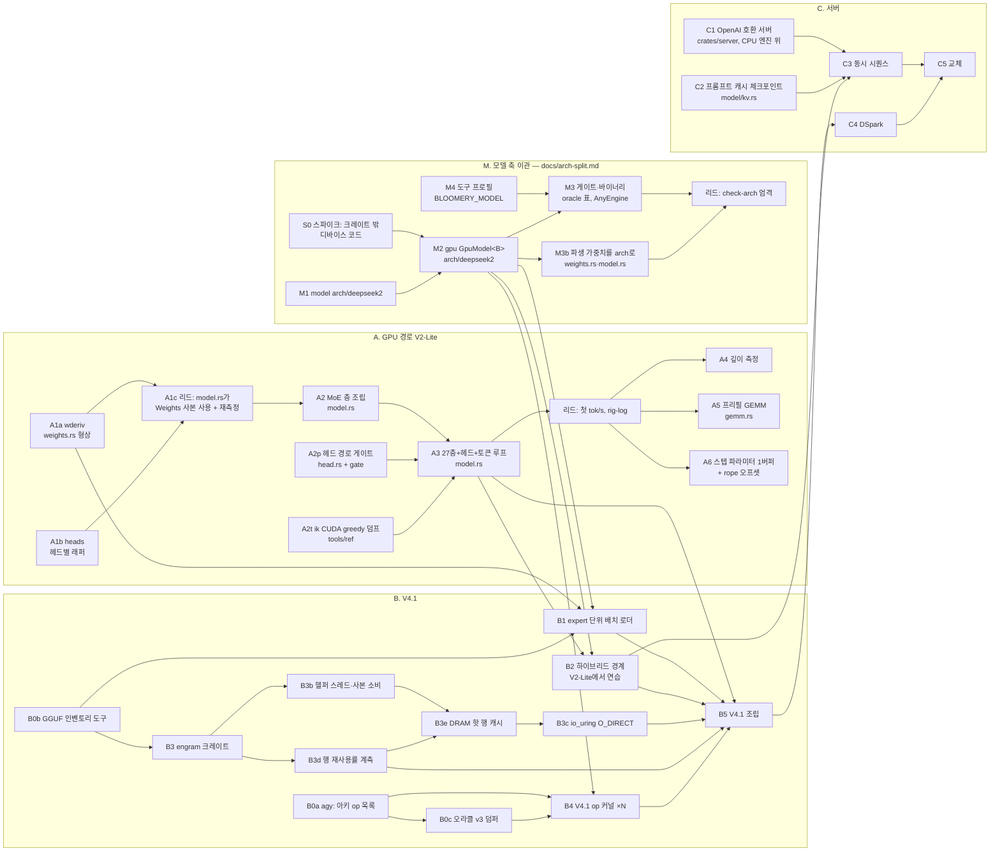

# bloomery — 계획

이 문서는 계획이고, 숫자는 [rig-log](https://github.com/midagedev/rig-log)에 측정된 뒤에만 여기 옮겨 적는다. 통과 기준은 전부 측정으로 쓴다.

이 문서는 계획·현재 상태·라운드 운영을 갖는다. `HANDOFF.md`와 `docs/orchestration.md`는 2026-09-22에 여기로 병합됐고, 두 파일의 마지막 판은 커밋 `5ce25f4`에 있다(`git show 5ce25f4:HANDOFF.md`). 새 세션은 `AGENTS.md`(규칙 정본) → 이 문서의 "지금"까지 읽으면 일을 시작할 수 있다. **끝난 것은 [`plan-ledger.md`](plan-ledger.md)(장부)에 있다** — 닫힌 라운드 카드, 지난 파동과 인계, 로드맵 A의 행별 기록, 라운드 이력을 2026-09-23에 원문 그대로 옮겼다. 옮기기 전 판은 `git show 8707bf1:docs/plan.md`다.

## 지금

**2026-09-23 오후(사용자 "적극적으로 병렬 오케스트레이션, 자율 진행")** — main은 harness2 머지(`98a8825`)와 리드 보정 `354240c` 위다. 머지 파동마다 푸시한다(아래 「결정」 ①). 끝난 파동, 그 사이의 리드 몫, 결정 원문은 장부 「「지금」에서 옮긴 것」에 있다.

- **비행 중(전부 opus, 17:30~)**: ~~`b4-index`~~(머지: 인덱서 두 런치 — TC 점수 hi/lo f16 분할, radix top-k; 층 케이스 32개 ik와 symdiff 0, 항등 목록 접두와 비트 동일, 깊이 32,768 동점 심기; 시간은 안 잼, 점유율 16.7 % 예측 일치·레지스터 195는 예측 밖) ‖ ~~`b5attn`~~(머지 `7af14e2`: attention 조각·G1 게이트 290검사, 노드 15/21/20 예측 일치, 링·압축 행은 σ 전파 z ≤ 9 — ik의 q8_2·q8_K 입력 양자화 때문에 비트 동일 불가) ‖ ~~`b5ffn`~~(머지 `3507b72`: MoE 조각·`HostExperts` 트레이트·G1 게이트 121검사, 카드 층 12노드·호스트 층 9; 같은 임대 A/B — CPU 87.10 대 base 87.71(−0.6 % ± ~1.3, 4바퀴, 자 안), 하이브리드 n_l=32 p50 6.57 대 6.63 ms(3바퀴, 자 안), all-card 4.28 = 4.28) ‖ ~~`b5glue`~~(머지 `e757bd1`: glue 조각·G1 게이트·b5load 후속 셋, 핀 8개 FAIL-first). 스펙은 세션 스크래치 `wave-m4/`(`common.md`·`chain.md`·`spec-*.md`). 조각의 계약은 `chain/mod.rs`에 있다(prep `326b2a2`): 적재 때 한 번 짓고, enqueue는 발사만 하고, 공유 버퍼와 `Weights`를 인자로 받는다 — `Body`는 받지 않는다. 게이트는 `Weights::load_where`로 층 하나만 올린다. 17:40부터 둘 더: ~~`harness3`~~(머지 `b36f131`: 열셋 전부, 판정 줄·ptx-scan 14표 base와 동일, lint 169) ‖ ~~`idxkey3`~~(닫힘: fp4 변형 +0.0089 ± 0.0013 = PR 단독, fp4는 원인 아님; 분리 변형(비율 2만 새 키) +0.0098 ± 0.0012, r = 0.97 — 증가분 전부 비율 2 스트림(층 2·8·14), 비율 1 몫 −0.0010 ± 0.0007. 예측(hca 75 %)은 틀림. #2507에 네 줄 올림, rig-log 09-23#v41-index-key-variants. 다음 수: 비율 2 소스의 채점 깊이 스텝 덤프, 거울 팔 20분).
- **닫힘(15:50–17:15, 원문은 장부 「「지금」에서 옮긴 것」)**: `iksink`(`2d9988a` — ik CPU의 T=1 인덱스 분기가 스레드 첫 헤드 기준으로 sink를 읽던 결함을 전후로 쟀고, [ik#2511](https://github.com/ikawrakow/ik_llama.cpp/pull/2511)로 보냈다) ‖ `b5host`(`292a484` — V4.1 호스트 expert 티어. A/B는 GPU n_l=0 −1.8 % ± 1.1 %, 나머지는 판정 불가: [rig-log](https://github.com/midagedev/rig-log/blob/main/log/2026-09-23.md#b5host-ab)) ‖ `b5load`(`715118b` — V4.1 적재 이음매·본체 뼈대·`SlotMap`. A/B는 세 팔 모두 차이가 보이지 않는다) ‖ `gates3a`(`ad8d1c6` — ptx-scan의 드라이버 JIT 열 둘, e2e 호스트 노드 0, Q5 독립 전사, bench_v41 digest) ‖ `harness2`(`98a8825` — V4.1 op 게이트를 하니스 위로, lint 169) ‖ `idxkey2`(조사 — #2507의 PPL 상승을 CPU에서 재현, 인덱스 경로는 model.py와 같다, 기제는 모른다) ‖ 리드 보정 `354240c`(attn 게이트가 `# build`로 sink 규칙을 고른다). **ptx-scan 표는 이제 열이 둘 더 많다** — gates3a 전의 표와 견줄 때는 끝 19자와 배너의 `jit-` 필드를 뗀다. **gpu-gates lib는 V4.1 디바이스 크레이트를 부르지 않는다** — 부르면 그 번들이 `deepseek41` 바이너리 전부에 링크돼 ptx-scan 표가 바뀐다(harness2). README를 오늘 기준으로 고쳤다(`2ffb780`). cuda-oxide [#1314](https://github.com/NVlabs/cuda-oxide/pull/1314)는 **머지됐다(09-23 09:16Z)** — main 백엔드에서 `oxide-ice-unroll` 재현기가 컴파일된다(핀 이동 라운드에서 은퇴). 그 여세로(사용자 09-23 밤 "승인 확률 높은 PR") cutile-rs [#309](https://github.com/NVlabs/cutile-rs/pull/309)(`CudaContext::mem_info`, 원장 #13)를 냈고, cuda-oxide 원장 #11(`#[unroll]`이 `while i + C <= N`을 못 읽음 — main에서 FAIL-first 실측)은 `oxideoffset` 라운드가 #1314 재랜딩 모양으로 구현 중이다(스펙 `spec-oxide-offset.md`, 워크트리 `~/repo/upstream/cuda-oxide-offset`).
- **V4.1 오라클(현재)**: `/home/user/ik-idxkey`의 로컬 브랜치 `v41/idxkey-fix`가 deepseek41 프로필의 ik 트리다 — `49ef19d0`(인덱스 키 결함 수정, [ik#2507](https://github.com/ikawrakow/ik_llama.cpp/pull/2507)) 위에 `db517b69`(T=1 인덱스 분기의 sink 한 줄, [ik#2511](https://github.com/ikawrakow/ik_llama.cpp/pull/2511)과 같은 줄; 17:05 커밋, 17:10 재빌드 — 빌드 로그에 `iqk_flash_attn.cpp`가 다시 컴파일됐다). 공유 세트 `ref_deepseek41`(5토큰)과 스텝 세트 여섯(`…_step4`, `…_d1n`, `…_d1`, `…_d1_unfused`, `…_d2`, `…_d2_unfused`, 모두 `_every_node`)을 이 트리에서 `-t 32`로 다시 떴다(17:14–17:24, 세트당 4초–2분 46초, 페이지 캐시 웜). 5토큰 세트와 step4는 바이트까지 같고, d-세트 다섯은 파일 4,079–4,647개가 바뀌었다 — d1n에서 처음 달라지는 노드는 `fattn-2`다(예측대로). 새 세트에서 V4.1 게이트 전부 초록이다: attn의 iqk 층은 헤드마다 자기 sink로 ik 시뮬 2.05e-6(밴드 4.95e-6), 수정 전 attn 게이트는 빨강(ik 시뮬 3.09e-2). `ds41_host`의 빌드 핀을 `db517b69`로 옮겼다(`82a76a7`, 층 40줄이 재덤프 전과 같다). 옛 세트(`49ef19d0`)는 `/root/bloomery-data-pre-sinkfix/`에 하드링크로 두었다 — 파동이 닫히면 지운다. 인덱스 키 투영은 `-t`에 따라 커널 경로가 바뀌므로 스텝 세트는 ik `-t 32`의 답이다. `dump.sh`는 `$IK` 밖 라이브러리를 싣는 덤퍼를 거부한다. attn 게이트는 `# build`로 sink 규칙을 고른다(위 `354240c`). ik 저장소에 git으로 쓸 때는 `sudo -u user -H`로 한다 — root로 쓰면 root 소유 객체가 생겨 user 커밋이 막힌다(오늘 두 번, 두 번째는 다른 세션의 `worktree add`). 닫힌 라운드의 요약은 장부 「「지금」에서 옮긴 것」.
- **[ik#2507](https://github.com/ikawrakow/ik_llama.cpp/pull/2507)(09-23)**: 메인테이너가 c4096·70청크·GPU `-cmoe`로 PR이 PPL을 올린다고 반문했다(main 2.9575, PR 2.9767 — 짝 차이 청크당 +0.0065 ± 0.0010, 56/70청크). `idxkey2`가 CPU에서 짝지어 재현했고(ln 비 +0.0088 ± 0.0013, 13/16청크, 그의 청크별 결과와 r = 0.70), c512(선택 없음)에서는 로짓이 바이트까지 같다 — 변경은 인덱서의 선택으로만 작용한다. 인덱스 경로는 model.py와 반올림 안에서 같고 q·k의 fp4 반올림만 다르다. 역설의 기제는 모른다. 16:44에 네 줄 후속을 달았다. 다음 수는 fp4 변형과 스트림 분리 빌드의 c4096 PPL(각 ~20분, 합쳐 ~40분 — 사용자 승인 대기)이다. 우리 PR 본문의 c2048·4청크 수치가 오차 안이었는데 개선처럼 읽히게 적은 것은 잘못이었다 — 반문에 대한 첫 답(15:05)에서 그렇게 밝혔다.
- ~~**비행 중 셋째(19:00~)**: `cpu1`~~ 닫힘(전제 소멸): 얕은 깊이의 CPU 디코드는 이미 ik보다 빠르다 — N=96 깊이 6→101 **87.87 대 ik 85.87 tok/s(+2.3 % ± 1.0, 같은 임대)**; 메인 스레드는 dot 68 %·장벽 18 %이고 직렬 항목은 전부 1 % 아래(doubling probe 넷 다 자 안). 격차는 깊이에 선형인 어텐션이다: 1024에서 71.4 대 79.9, 4096에서 44.6 대 59.9 — `attn_heads_fused`가 16행만 디스패치해 32스레드 중 16개가 논다(깊이 4096 스텝의 44.3 %, 9.9 ms[유도]). 다음: `cpu2`(비트 동일 분할 — 행을 (head, latent 절반)으로, V 누적만 256/256; 4096에서 ~7.6 ms, +11 %[유도]; 키 축 split-K는 ik의 4.9 ms에 닿지만 float 순서 클래스). 레버 `BLOOMERY_STEAL_BLOCKS`(2/8/16 모두 4보다 못함), `just perf-decode`.
- ~~비행 중(21:30~)~~: ~~`b5index`~~(머지 `a1708a2`, 2단계: 인덱서 층이 발사 4개(압축기 없는 층 5개)로 자기 스트림의 리스트를 쓰고 스트림의 모든 층이 그 리스트로 압축 행을 읽는다 — 깊이와 무관하게 같은 발사, n_vis ≤ top_k면 항등 리스트라 접두 어텐션과 비트 동일; `top_k`는 조각 사본의 워드(`Body::set_indexer_top_k`). 게이트 `--select`(d1 top_k 64·d2): 리스트가 자기 점수의 정확한 top-k, q/w 포락선, ik 리스트와 동률 밴드 안 — 76줄 PASS, FAIL-first 6종 빨강. G6: e2e·chain-ffn·glue·index·p10 base와 동일, 나머지는 예측한 줄만(노드 1074 → 1110, attention 조각 −66 MB, lists 16 KB). **G4 PPL c4096×2: ours 1.8859 대 ik 1.8834, Δ +0.133 %, KLD 0.0059, top-1 98.56 %** — 예측(KLD 0.015–0.035)보다 가깝다: 깊은 문맥이 두 분포를 날카롭게 한다. 예측 빗나간 항: 밴드에 가장 가까운 층(20~36 예측, 실측 L2·L14), PPL 벽시계(26 ms/스텝 예측, 81 ms[유도] — 로짓 복사·호스트 f64 어휘 처리, 타이밍 아님)) ‖ ~~`b5gen`~~(머지 `9e66997`: `generate_ds41` — 프롬프트 id나 lcg 깊이를 실제 스텝으로 먹이고 greedy `-n`, eager|graph, `--time/--warm`, pos ≥ 512 도달은 적재 전 거부; `depth-ds41.sh`가 두 엔진을 한 임대에 A6000에서; 레시피 `gen-ds41`·`time-gpu-ds41`·`depth-gpu-ds41`. eager = graph 토큰 동일(p7, 1074노드), e2e·ds41-step 판정 base와 동일, lint 169. **표는 아직 없다**: 한 번 돈 깊이 6은 다른 라운드의 `gate_deepseek41_step`(CPU 13–17코어)과 겹쳐 무효(p50 103.6 ms, 예측 38–50 ms — 마지막 10스텝도 88 ms라 페이징·engram fault 의심, warm=0), **ik 팔은 적재 실패**: `-ngl 999 --n-cpu-moe 34`가 호스트 컨텍스트 전체(34층 expert + engram 표 ≈ 400 GiB)를 mmap 가지가 아니라 핀드 CUDA_Host 버퍼 하나로 잡으려다 죽는다(프로필 주석에 적음; `-ngl 0` PPL은 mmap으로 열린다 — 가르는 순서는 llama-bench `-ngl 0` 적재 → 로더의 `ncmoe` 인자). **리드가 쟀다(b5time, 09-24 00:23–00:31, 재부팅 2 직후, A6000 300 W, 배치 (a), `--warm 8`, 깊이 6·400 3바퀴): 깨끗한 행 39.31·39.49 ms/스텝 @ 깊이 400 = 25.4·25.3 tok/s @ n=96, 깊이 6 40.31(24.8)** — 예측 밴드 38–50의 빠른 끝. 무효 행: r1(재부팅 뒤 첫 적재, 페이지인), r3 깊이 6(cpu4 빌드 rustc 383 %). rig-log 09-23#v41-first-tps. ik 열은 적재 실패(위)라 비어 있다).
- ~~비행 중(20:30~)~~: ~~`cpu3`~~(머지 `9a05ae1`: 프리페치 거리 레버 `BLOOMERY_KV_PREFETCH_ROWS`, **기본 1 → 16** — 리드가 조용한 창에서 같은 임대·같은 바이너리로 잰 깊이 4096: ROWS=1 46.42, 8 51.39, 16 52.46 tok/s(6바퀴, A/A 0.5 % 안, 8 → 16 짝 차이 +1.07 ± 0.49), 둘째 잡 16 52.55 대 32 51.49(4바퀴 전부), 깊이 1024는 8/16/32가 0.5 % 안. 예측(L2 스트리머가 앞질러 읽어 자 안쪽)은 틀렸다: ROWS=1의 스트림은 스레드당 12.8 GB/s[유도]로 코어당 상한(~15) 아래였고 16에서 닿는다 — 다음 레버는 프리페치가 아니라 키당 바이트(헤드 번들 = cpu4). 스핀 팔은 라운드의 창이 전부 오염돼 판정 못 함, 1024 깨끗한 4바퀴에서 1 % 안. rig-log 09-23#cpu-kv-prefetch-distance. 스코어보드 4096: **52.5 대 ik 59.9**) ‖ `cpuresearch`(코드 없음 — 사용자 09-23 "스칼라를 피하고 캐시를 최대한 쓰는 것을 한 설계로 묶을 방법": ik `iqk_flash_attn.cpp` 독해 + 문헌으로 head-안쪽 루프·split-K combine·CCD 고정 키 배분·q8 KV를 우리 형상 수치로, 스펙 `spec-cpuresearch.md`). **결정(리드 추천, 사용자 09-23 "판단은 네 추천대로")**: 깊은 행은 키 분할 + combine(ik의 모양, float 순서 클래스)으로 간다 — 모양은 cpuresearch 뒤에 정한다.
- **비행 중(09-24 01:15~, 전부 opus, base `1260aab`)**: `cpu5`(연구 메모 (d) — 세그먼트 안 8head×1key KQ 타일·8head×1d V 타일, 변환 재사용 8배, 레버 `BLOOMERY_ATTN_BUNDLE`, 스펙 `spec-cpu5.md`) ‖ ~~`b5deep`~~(머지 `7486967`: 거부 삭제, 적재 뒤 `top_k` 일치 검사, 3090에서 깊이 1024 eager = graph 토큰 16개 동일, 깊이 600 통과, step 게이트 76줄 PASS; 트리아지 ㉗ `body.rs:680` 캐시 가득 판정이 `history.capacity()`(Vec은 요청값 이상만 보장 — 저장된 ctx_max와 비교, XS) ㉘ `generate_ds41::run`의 `fed > a.ctx`가 요청 ctx만 봐 계획의 `ctx_max`가 더 작으면 스텝 중 오류(몇 줄, XS)) ‖ ~~`ikload`~~(머지 `e473e0e`: 원인은 CPU buft 오버라이드가 하나라도 있으면 ik 로더가 호스트 컨텍스트 전체의 mmap을 끄는 것(`llama-load-tensors.cpp` `use_mmap_buffer &= !has_buft_overrides`, 오버라이드 buft가 `:269-271`에서 CUDA_Host로 바뀌어 `:468`이 세움) — 우회는 **사용자의 ik#2444 `GGML_CUDA_NO_PINNED_WEIGHTS=1`**이고 우리 러너가 안 넘겼을 뿐. 프로필 `IK_GPU_ENV`, 러너가 `env $IK_GPU_ENV`. ik 깊이 6 ROW **17.83 tok/s**(1바퀴, A6000, 처음 34층 expert CPU) 대 우리 25. 업스트림 후보 ㉙: llama-bench `--n-cpu-moe N`은 층 0..N−1을 CPU에, 로더의 `ncmoe`(llama-server `-ncmoe`)는 #2262 뒤 마지막 N층 — 두 도구가 다른 배치를 잰다(`llama-bench.cpp:458-466` 대 `llama-load-tensors.cpp:275-291`, 도움말 `common.cpp:3310`은 "first N"); 실측 FAIL-first(`--print-overrides` 대조·적재 층·tg) 뒤 제출 판단 — MUL-7. 트리아지 ㉚ `depth-ds41.sh` `[cpu-busy]`(= ⑩) ㉛ ik 팔만 돌 때도 `generate_ds41`을 빌드(XS) ㉜ `IK_GPU_ENV` 빈 값 팔 불가(`:-` 대신 `-`, XS)). 리드 몫: 세 보고 → 머지 → V4.1 깊이 표(6/1024/4096, ik 열 포함) → 아침 보고.
- **머지(09-24 03:0x)**: `cpu5`(`9c8ebf0`, head 8묶음 타일 — 4096에서 60.81 → 69.38 tok/s(+13.97 % ± 1.00), **ik 66.92를 처음 넘었다**; 1024·6은 자 안; `BLOOMERY_ATTN_BUNDLE=1`이 같은 바이너리 팔), `b5prof`(`77908e7`, `just nsys-gpu-ds41` — 스텝 41.8 ms 중 커널 합 17.5, 호스트 다리 28.2–28.5, 노출 합류 빈틈 23.8 ms(57 %), 합류 0 하나가 ~1.7 ms; 예측이 틀린 항은 호스트 다리(+1.5–2.3 ms, 실효 121 GB/s)와 GPU 직렬(−1.6 ms)). 트리아지 ㉝~㊱ 아래.
- **비행 중(09-24 03:1x~)**: 파동 13(~~감사 넷~~ 넷 다 처분 ㊲–㊵ ‖ ktok ‖ dspark ‖ ~~specresearch~~). ~~ktok~~(머지 `77eaf88`, 선형 판정) ‖ ~~dspark~~(설계 메모, ㊷) — 파동 13 전부 착륙. **03:45부터 둘 더(base `7ae5c79`)**: `hotset`(B12 — `ExpertList`, 스택당 gather 버퍼, 레버 `BLOOMERY_HOT_LIST`, `tools/ref/router-hotlist.py`; 항등에서 게이트 전부 비트 동일, 리스트에서 호스트 슬롯 수 감소 증명, 스펙 `spec-hotset.md`) ‖ ~~`dsread`~~(착륙 04:25, 리드 재실행 중 — `GgmlType::MXFP4`(id 39, 17 B/32, 스케일 2^(E−128) `ggml_e8m0_to_fp32_half` ggml-impl.h:40 — 메모 옮김 맞음), dequant 64행×5120 ggml `to_float`와 0/327,680 차이, FAIL-first kvalues[15] 4,306 차이 red; `arch::dspark` hparams 20개 전부 메모와 일치(`rms_eps` 1e-20은 target도 같음, YaRN 키 있으나 ratios 0, `output_hc_*`·`conf_proj.bias` 없음, mask id는 `tokenizer.ggml.mask_token_id`); **E 범위 115–128이라 |값| ≤ 12, Q8_0 넓히기 정확**[유도]; 바이트 표: 3090 상주 (iii) **8,647,007,112 B**(expert 7,219,445,760 + 초안 나머지 748 MB(bf16→f32 넓힘 포함 885 MB) + 헤드 543 MB — 메모의 "1.30 GB + 헤드"는 헤드 이중 계산). 스펙 이탈: **03:44 build-ref를 임대 중에 돌림**(g++ 11개 + 1 GB 읽기 — 그때 잡의 수치 오염 가능, 리드 확인 필요), `placement.rs:187` 한 줄(`CardFormat::of` MXFP4 → None, hotset과 충돌 여지), `arch/mod.rs`에 `DFLASH`·`is_dflash`. 스펙 밖: `CardFormat` MXFP4 네이티브 없음(dsmx 몫, S); 원본: `GgmlType::MXFP4` + ggml 규칙 dequant + 하네스 덤프 비트 동일 게이트, 드래프트 hparams·이름·바이트 표, 스펙 `spec-dsread.md`). ~~03:55 `ngram`~~(머지 `db10553`, E5 답함 — 「실험 큐」)(원래: E5, 빌드·임대 없음 — `tools/ref/draft-accept.py`, 네 코퍼스에서 prompt-lookup·order-1 Markov의 수락률 오프라인, 스펙 `spec-ngram.md`). 04:10 `probes`(E4 순수 읽기 팔 `read-mmap`/`read-thp` in bench_v41_host, E8 `vram_free` in STEP_STATS; 스펙 `spec-probes.md`). **04:30 `skew`**(ktok-skew, base `f56e770` — 2행 층 어긋남 패스 + `rollback`, 게이트 = 순차 2스텝과 비트 동일(logits·링·압축 행·키·상태·history) + r=0 되감기, FAIL-first는 행별 버퍼 하나를 일부러 공유; 스펙 `spec-ktok-skew.md`). 박스 빌드 상한 4, engshadow+hotset 뒤 적재 라운드. **03:35부터 둘 더(base `ba7b949`)**: ~~`engshadow`~~(머지 `f56e770`, 리드 재실행 check·lint 169·fmt·recipes·step/hc/moe 게이트 전부 rc=0: 사이트 0·1의 6커널이 0층·13층 그늘로(`ShadowWork` 훅, `enqueue_shadowed`), 그늘 집합 게이트 FAIL-first(6커널 임계) → PASS, 노드 1110/1030/80 동일, `--sets` 438줄 바이트 동일, ptx-scan 동일; C: 죽은 커널 셋 삭제(ptx-scan −3행, moe NODES 8→7 PIN). nsys(임대, 판정 아님)에서 두 합류 앞 커널이 `ds41_engram_key_norm` = 그늘 안 확인. **시간 A/B는 리드 몫**(base `52210e0` 대 머지본, 깊이 6·1024, 4–6바퀴 → E13). 스펙 밖: nsys 0층 bridge 2.1–2.7 ms(계획 0.85의 2.5–3배, 스텝 최대 exposed — 원인 축소 후보, 0층은 전부 호스트 Q5_K), `enqueue_engram_kv` 호출처가 chain_glue 게이트 하나(XS), `SHADOW_CARD/HOST` 표를 조각이 내보내면 한 주인(S)) — 원래: (㊲②·㊳④·㊵ P1 — engram 6커널을 호스트 다리 그늘로, −0.48…−0.51 ms 예측; Q1 층별 그늘 집합 게이트 FAIL-first; Q7 죽은 커널 셋 삭제, 스펙 `spec-engshadow.md`) ‖ ~~`telem`~~(머지 `c1e733e`: `BLOOMERY_PIN_MAIN`(기본 켬, `load` 줄에 pin_main/pinned), `BLOOMERY_STEP_STATS=1`로 스텝별 leg_us·straggle·host_slots·host_w2·go_early·parks·majflt/minflt + summary, `depth-ds41.sh`가 summary 에코, verdict-diff 마스크. 3090 배관 실행(측정 아님)에서 majflt 51–476/스텝이 첫 스텝에 몰리지 않았다 — plan_gate라 페이지 캐시 압박 섞임, 판정은 A6000 (a)에서 E1로. 스펙 밖: `HybridStats.straggle_max_ns`가 누적 최댓값이라 창 max 불가(10줄), 3090 게이트 실행 전부 스텝마다 major fault 수백 — 게이트 시간이 페이징에 묶였을 수 있음(조사), `depth-ds41.sh:155` distinct_tokens가 step 0까지 셈(한 줄)) — 원래: (㊴ P5·Q1, ⑪ — `generate_ds41`에 `BLOOMERY_PIN_MAIN`, `BLOOMERY_STEP_STATS=1`로 스텝별 leg_us·straggle·host_slots·majflt/minflt, 스펙 `spec-telem.md`; 이게 있어야 b5time2 한 임대로 깊이 역전·실제 텍스트 교차·호스트 항 직접 측정을 한꺼번에 답한다). 그 앞의 `b5prof`(nsys로 V4.1 스텝 39 ms의 귀속 — 커널 합 대 창 벽시계, 층별 호스트 합류 갭 38개, 상위 커널 24, 예측 항 19.2/26.5/−3.7과 대조; 스펙 `spec-b5prof.md`).
- **V4.1 첫 두-엔진 깊이 표(09-24 01:20–01:45, 리드, A6000 300 W, 3바퀴, rig-log 09-23#v41-first-tps)**: 우리 p50 40.5 / 39.4–40.5 / 39.2–39.4 ms = **24.7 / 25.1 / 25.4 tok/s @ 깊이 6 / 1024 / 4096**, ik(`-ngl 999 --n-cpu-moe 34`, `GGML_CUDA_NO_PINNED_WEIGHTS=1`) 20.15 / 20.10 / 19.92 → **1.23–1.28배**. 배치가 다르다(우리 층마다 접두, ik 층 0..33 전부 CPU). 두 엔진 다 깊이에 평평. 우리 4096 행은 lcg 프롬프트의 퇴화 반복(`distinct_tokens 3`)이라 호스트 티어에 유리했을 수 있음 — 실제 텍스트 프롬프트 행이 다음 수(b5time2). 스텝의 어느 항이 겹치는지는 스텝 프로파일이 없다(GPU 직렬 19.2 + 호스트 다리 26 예측 대 실측 39: 절반이 숨는다).
- **cpu4 닫힘(09-24 01:00, 머지 `0f01679`)**: 키 32세그먼트 split-K(연구 메모 (b)) — 디코드 행의 키를 32키 블록 위 고정 32세그먼트로 잘라 (세그먼트, head) 항목을 풀에 블록 가중치로 배분, 고정 순서 merge. 체인 오라클·스칼라 쌍둥이가 같은 플랜이라 비트 게이트 유지, 오라클 핀·`KNOWN_DIVERGENCE {}` 무변경, 새 게이트 둘(32 대 1세그먼트 재배열 밴드, 스레드 1/32/3 바이트 동일 @1025·4097 — mt는 6토큰이라 이 부류를 못 본다). 깊이 표(3바퀴): 4096 **53.33 → 60.61(+13.7 % ± 0.3)**, 1024 +4.8 %, 6 −1.8 %(자 안). 예측 58.8–63.3 적중, 틀린 항은 L2에 있는 head 2..16의 key-head당 비용(308 cyc[유도] ≈ DRAM 스트림의 291): 바이트가 아니라 명령 수 — **(d) head 묶음 타일이 다음 레버**. 리드 수정: 16블록(512키) 이하 행은 단일 디스패치 경로(깊이 6 자 안; 400은 −1.3 % — 그 경로도 세그먼트를 직렬로 돌아서, 다음 소수정 ㉑). 레버 `BLOOMERY_FLASH_SEGMENTS`. rig-log 09-23#cpu-splitk-attention. **스코어보드 4096: 60.2 대 ik 67.4, 1024: 76.8 대 81.6, 6: 89.2 대 88.6**(재부팅 2 뒤 계열).
- **첫 V4.1 토큰(21:22, `b5step` 머지 `ec4406f`)**: 조립 1단계(pos < 512). G2 1074노드(커널 994·memop 80, 예측 정확), eager = replay 비트 동일; G1 step4·d1n PASS(seam 82개, pinned ratio 최대 0.93; step4는 L12 라우터 근접 동률로 ik 경로를 벗어나 면제); G3 greedy p7 첫 토큰부터 갈림(우리 margin 0.61 < 1.5 규칙 PASS — ik 0.26); **G4 PPL c512×16: ours 2.1881 대 ik 2.1887, Δ_PPL −0.027 % ± 0.45, KLD 0.0158, top-1 97.5 %**; FAIL-first 6종 전부 빨강 확인. 리드 재핀: `gate-ds41-load` check v — 컨텍스트의 첫 그래프 캡처가 8 MiB를 쥐고 둘째 캡처는 0(드라이버 몫, 모델 누수 아님; 적재마다 4 MiB 누수 변이로 FAIL-first). 예측 빗나간 항: 오차 포락선(항등 전파 R을 3–7배 과대평가 → 국소 핀 Z=1.5로), step4 라우터 flip, G3 첫 불일치 위치, G4 예측 밴드(+0.2~+0.9 %)보다 낮음. 스텝 스레드 메이저 폴트 41.8/스텝(engram mmap).
- ~~비행 중(20:00~)~~: ~~`cpu2`~~(머지 `fa8f54b`, 예측 빗나감: (head, latent 절반) 분할은 비트 동일이고 게이트(`hw_attn_heads_split_bit_identical`, 깊이 7/1025/4097 + 프리필)로 증명됐지만 **모든 깊이에서 느리다** — `attn_heads` 4096에서 9.87 → 10.50 ms, 1024에서 3.06 → 3.57. 틀린 항: 행은 발행 바운드가 아니라 키 행 스트림(키당 1152 B)을 따라가서, 절반 둘이 점수용으로 행 전체를 읽어 읽는 이만 두 배가 된다. 기본은 1(`HALVES=1` 대 base +0.00 % ± 1.16, 같은 임대), 레버 `BLOOMERY_ATTN_HALVES=2`. ik는 스레드 하나가 K 스트림 하나를 16 head에 쓰고 우리는 같은 바이트를 16 스트림으로 읽는다 — head 방향 분할로는 ik의 깊이 기울기(키당 0.85 대 우리 2.55 µs)에 못 닿고, 다음 설계는 키 분할 + combine(float 순서 클래스, 사용자 판단). 기본값 1의 깊은 행 A/B는 오염돼(`gate_hybrid` 100 %, load 24.7) 리드가 다시 쟀다(22:20–22:27, 3바퀴, main 대 `bloomery-cpu2-base` 대 ik — 다른 라운드 둘의 빌드와 겹쳐 절대값은 무효): 4096에서 44.02 대 44.96(짝 차이 −2.1 % ± 4.2), 1024에서 65.85 대 68.47(r2·r3 짝은 +0.6 %), ik 58.0/73.6 — 회귀는 자 안에서 보이지 않고, 깨끗한 표는 IOMMU 전후 표가 겸한다. 워크트리와 base는 그때까지 둔다).
- **다음(리드)**: 재덤프 → 새 세트로 V4.1 게이트 전부 재실행(파동의 base; iqk 층의 수치는 바뀌고 판정은 초록이어야 한다 — attn의 T=1 층은 이제 헤드마다 자기 sink) → 파동 발사. 그다음 `b5step` → `b5index` → `b5time`. 띄울 것(막힌 것 없음): 테스트 env ①b, gates3b(③의 남은 것), 32행 아래 잔차 탐침(⑨), 코드 모양 ⑧. **기계(09-23 저녁, 사용자 승인 "둘다 진행해줘"·"네 제안대로 할게")**: 스왑 제거, 3090 캡 250 W(측정이 A6000으로 옮겨 연속성 사유가 없어졌다), lease 중 netdata 동결(`netdata-lease-gate.service`, `lease_take`가 상태를 찍는다) — 셋 다 적용했다. 남은 순서: ~~C2 C-state A/B(런타임, 한 lease 안)~~(19:51 닫힘 — 스텝은 자 안(하이브리드 −0.9 % ± 1.8, all-card −0.6 % ± 0.9), 블로킹 hostfn의 깨는 시간만 3–22 µs; C2는 켠 채로, rig-log 09-23#cstate-c2-ab) → ~~IOMMU 전 측정 → `iommu=pt` 재부팅 → 후 측정 → `mitigations=off amd_pstate=active` 두 번째 재부팅 → 측정~~ **둘 다 끝(09-24 00:07·00:15, rig-log 09-23#machine-0923 추가분 둘, MUL-6)**: 커널 줄 `pci=realloc=off iommu=pt mitigations=off amd_pstate=active`(원본 `/etc/default/grub.bak-20260923`·`-20260924`), gdscheck 두 카드 패스스루, amd-pstate-epp(EPP performance), spectre_v2 완화 해제. GPU 셋(토큰 그래프 19,486/19,508 µs, C2 A/B 하이브리드·all-card)은 두 번 다 자 안. CPU depth-decode 3바퀴(재부팅 2 뒤): **우리 6/4096 = 89.3/53.1, ik 89.9/68.1** — ik만 저녁 값(85.9/59.9)에서 +4.7/+13.6 %(귀속 미분리; 갈라 보려면 `mitigations=off`만 남긴 재부팅 한 번 + 표 20분). **스코어보드 4096: 53.1 대 ik 68.1**(cpu3의 52.5 대 59.9는 재부팅 전 값). 재부팅 뒤 타이밍 표는 이 줄부터 새 계열이다. 사용자 판단 대기: `attn_output`을 더 낮은 비트로 둘지(토큰당 3.21 GB로 그래프의 약 26 %, 유도 — KLD로 값을 매긴 뒤). 조용한 틈에: 하이브리드 재측정과 nsys M1, engram 임대 측정, `measure-qdot-rate`. `/home/user/ik-sinks{,-base}`와 `/root/bloomery-data-iksink{,-base}`(각 3.5 G), `/root/bloomery-data-idxkey2`, `/home/user/ik-pplnan`(#2513)은 그 PR들이 정리될 때까지 둔다. 지켜볼 것: ik#2511·#2507, cuda-oxide #1314.
- **결정(사용자 위임, 09-23 아침 — "작업속도와 성능개선에 긍정적인 방향으로")**: ① 머지 파동마다 푸시한다. ② ik의 13.3 재빌드는 ik 트리가 움직일 때 한 번에 한다(그때까지 컴파일러는 비대칭 — ik는 ptxas 13.0 AOT, 우리는 R615 JIT). ③ 3090도 서빙에 쓴다 — (b)가 서빙 목표, (a)는 대비 배치. ctx_max는 32k. 호스트 expert RAM은 서빙할 때만 잠근다. 라우터 id 추적은 승인됐다. ④ V4.1 디바이스 코드는 `crates/gpu-deepseek41`, 엔트리 접두는 `ds41_`. ⑤ #2455는 (a)안 — 따로 둔 ik 트리에서 고치고, 리드가 PPL 전후를 잰 뒤 오라클을 다시 뜬다. ⑥(09-23 낮) B5는 (a) 한 카드로 먼저 낸다 — 서빙 목표 (b)는 그대로이고 (b)냐 (b′)냐는 B12 뒤에 정한다(「B5 라운드」).
- **툴체인**: 박스는 CUDA 13.3(`~/bloomery-env.sh`)이고 ik는 13.0에 고정했다. 드라이버 JIT는 PTX `.version` 9.4까지 받지만 LLVM(= cuda-oxide·nightly 핀)은 옮기지 않는다 — 다시 볼 조건은 장부. ncu 러너는 2025.3.1에 이름으로 고정했다(「GPU 선 트리아지」 ⑦).
- **열린 결정 후보**: 스칼라 세그먼트 패스(와 그것만 재는 keyaxis 계기 8개)를 지울지 — 「성능이 먼저」는 엔진이 경로 하나만 싣는다고 했다.

### GPU 선

**2026-09-22 저녁부터 기본 flash 패스는 MMA다**(`294d907`). ~~아래 스코어보드와 깊이 표는 전부 스칼라 패스로 잰 것이고, 다음 A6000 표부터는 MMA로 잰다~~ **잤다(2026-09-22 밤, A6000 한 임대·팔 여섯 번갈아·세 바퀴·n=96, 리드 측정)**:

| 깊이 | 우리(MMA 기본) | 산포 | ik | 산포 | 비 |
|---|---|---|---|---|---|
| 6 | **229.54** tok/s | 1.13 % | 205.47 | 2.54 % | **1.117배** |
| 1024 | **222.24** | 1.06 % | 193.96 | 1.85 % | **1.146배** |
| 4096 | **199.62** | 0.57 % | 179.00 | 0.53 % | **1.115배** |

**깊이 4096의 역전이 사라졌다** — 세 깊이 전부 ik보다 빠르다. 키당 기울기는 파생으로 우리 0.160 µs(6→4096; 구간 0.141·0.166), ik 0.176(0.282·0.140) — 「모델」 `c_key` 행에 **유도로** 적어 둔 0.160 µs와 측정이 맞는다. 카드와 패스가 둘 다 바뀌었으므로 옛 3090 표와 나란히 놓지 않는다: 패스에 대한 귀속은 a4e의 같은 카드 A/B(d4096 6.511 → 5.048 ms, −22.5 %)가 하고, 이 표는 새 기본값의 절대 위치다. 기록 rig-log [09-22-o](https://github.com/midagedev/rig-log/blob/main/log/2026-09-22-o-the-depth-table-on-the-new-default-and-the-reversal-is-gone.md). 옛 스코어보드와 깊이 표(**스칼라 패스·3090**, 계열 비교용)는 장부 「GPU 선 이력」에 있다.

### CPU 선

- **커널**: Q3_K×q8_K, Q4_K/Q5_0/Q5_1/Q6_K×q8_2_x4 전부 융합(crates/qdot). MUL-38 q_nope2 Q8_0×Q8_0(vpsignb 부호접기 maddubs, 비트 동일). MUL-36 flash SIMD(kq_dot 8레인 합순서 + V j축; 폴백 레버 `BLOOMERY_FLASH_SIMD=0`). MUL-37 직렬 activation quant 풀 이양 + moe gate/up 이중양자화 제거(ptr::eq). 커널률은 ik의 95–99%(Q3_K만 ik 대조 미측정).
- **디스패치 경로가 느리면 첫 질문은 스레드 스윕이다**(`SWEEP="8 16 24 32" just measure-decode`): 곡선이 평평하면 일이 아니라 기다림. 프로파일이 꺼진 청크는 락을 잡지 않는다(AGENTS.md).
- **게이트**: 14개 just 레시피(gate-ops/attn/ffn/moe/head/forward/kv/derived/mt/profile/threads/qdot/prompts/1-1). 머지 후에는 영향 게이트 + mt/forward/prompts 재실행이 관례.
- **핀 상태**: prompts KNOWN_DIVERGENCE = ~~**{24}**(MUL-36 재핀, A/B 입증됨 — 이전 {14})~~ **{}**(2026-09-21 밤 `qdot::swiglu` 재핀, `crates/model/tests/prompts.rs` — 24는 0.151 근타이의 제비가 ik 쪽으로 떨어진 것). forward L_OUT_BANDS = (0,3e-3)(3,2e-3)(24,7e-2) + 날짜 주석. gate-mt는 재핀 불허 항목(스레드 무관 비트 동일).
- **스코어보드(2026-09-23 저녁, 같은 임대, cpu1)**: N=96 깊이 6→101 **87.87 tok/s 대 ik 85.87(+2.3 % ± 1.0)**; 깊이 1024 71.4 대 79.9, 4096 44.6 대 59.9(키당 우리 2.7 µs 대 ik 1.25[유도]). 스레드 스윕 8/16/24/32 = 58.0/82.5/87.7/88.0 — 24에서 포화, convoy 아님. ~~(2026-09-20 저녁)**: N=96 **61.48 tok/s** 대 ik 82.88 → **잔여 1.35배**~~(아침 39.71/2.10배). 경위는 rig-log -j: 청크 끝의 무조건 수집 Mutex 제거(+44%) → 메인 스레드 고정 → mmap 프리폴트(+3.5%; 프리필 +18%는 6토큰 프롬프트 기준). → rintf libm 호출 제거(+8.3%, 2b2fdb6).
- **남은 산수**: 레벨2 dot 합/32 = 8.5 ms/step(완전 병렬 내적), ik 스텝 전체 12.1 ms, 우리 16.3 ms → 비내적 7.8 ms를 3.6 아래로. perf상 임계 경로는 메인 스레드 하나(워커는 표본의 51%를 스핀으로 대기): rintf 10% · memset 6.6% · expf 3.2% · 자기 청크+장벽 18%.
- ~~**스테이지 표(N=96, 레벨1, 24.18 ms/step)**~~ (락 아래서 잰 표 — 새 표는 rig-log -j): batch Q3_K 24.1% · Q3_K 단일 18.4% · batch Q5_0 14.9% · Q4_K 13.5% · Q6_K(lm_head) 5.3% · q_nope2 5.1% · swiglu+F32+접착부 ~10% · **flash 0.40ms(1.6%)**. 전체 54.8 GB/s = STREAM의 37%.
- 주의: 레벨2 quant 열은 MUL-37 이후 워커 CPU합(벽시간 아님).

세션별 스코어보드(밤 → 아침 4)는 장부(`plan-ledger.md`)에 있다. 가장 최근 값은 그 목록의 첫 항목이다.

### 어디에 무엇이 있는가

| 위치 | 내용 |
|---|---|
| `~/repo/bloomery` (이 리포) | 엔진 본체. AGENTS.md = 규칙 정본. docs/research/ = 조사 문서(CPU 조사 종합표는 `cpu-llm-ideas.md`, 패킹이 1순위), docs/RESULTS-*.md = 라운드 산출, docs/plan.md = 단계 계획 |
| `~/repo/rig-log` | 측정 기록(한국어 산문). 임대·증인 있는 숫자만. README 로그 표가 전체 인덱스. ~~최근: 2026-09-20-a…-h~~ 최근: 2026-09-22-a…-e. 증상으로 먼저 찾는다 — `tools/recall.sh '<키워드>'` |
| gadak 트래커 | `GADAK_HOME=$HOME/.gadak gadak --workspace gdk`, 프로젝트 MUL. Done: MUL-1…38 전부 종결(코멘트에 판정). 미완: MUL-30(GPU — ~~착수 대기~~ **진행 중**: A3 종료, A4 측정 완료, A4b 비행 중), MUL-6(CUDA 13.3 툴킷 — cutile-rs 스파이크의 전제) |
| 박스 | 접근은 오직 `./tools/box.sh '<cmd>'`(rsync 단방향 → 박스 편집 금지). 원격: /root/repo/bloomery, 데이터: /root/bloomery-data, 임대 락: /root/bloomery-cpu.lock. GPU: 기본은 3090. ~~**A6000(idx 1) 금지**~~ **정정(사용자, 2026-09-21)**: A6000도 개발에 쓸 수 있다 — `BLOOMERY_CARD=a6000\|both`로만 가고, `llm.service`가 살아 있거나 컴퓨트 프로세스가 있으면 rc 75로 거부된다. ~~**시간 숫자는 3090에만**(기준선이 거기서 나왔다)~~ **정정(2026-09-22 저녁)**: 3090 낙하 두 번 뒤로 **시간 숫자는 A6000에서** 잰다. 3090은 게이트·빌드 카드(300 W 캡) |
| 세션 메모리 | ~~`~/.zcode/cli/memories/projects/rig-log-*/memory/`~~ `~/.claude/projects/-Users-hckim-repo-rig-log/memory/`(`MEMORY.md`가 색인) — 이 워크스테이션의 세션에만 유효하고, 규칙이 아니라 **사건 원본**만 산다. 새 곳에서는 이 파일이 대체 |

## 모델 — 먼저 유도하고, 측정은 유도가 빗나갈 때만 (2026-09-22)

여기까지의 라운드는 대부분 "만들고 재 본다"였다. 그런데 닫힌 라운드를 되짚어 보면 결과의 상당수가 이미 가진 상수로
미리 계산되는 것이었다. 그래서 규칙을 바꾼다. **라운드는 예측을 들고 연다.** 측정은 예측이 밴드를 벗어났는지 보는 두 번째
행위이고, 벗어나면 그때 모델의 어느 항이 틀렸는지가 그 라운드의 발견이다.

### 비용 모델 (디코드 스텝)

`step_ms ≈ Σ_k max(bytes_k / BW, instr_k / issue, t_floor_k) + N_node · c_node + N_barrier · c_barrier + depth · c_key`

`t_floor`는 B9에서 들어온 항이다(2026-09-23). 격자가 한 파동이 안 되거나 작으면 런치 시간은 바이트가 아니라 행 하나를 걷는
적재 사슬로 정해지고, 같은 격자·같은 K에서도 커널마다 다르다(K = 5120·격자 64에서 q8_0 16.8 µs, q3_K 5.8 µs).

| 상수 | 값 | 교정한 측정 | 카드 |
|---|---|---|---|
| `c_node` | 0.80 µs | A3d lfold, 독립 계기 둘이 4% 안 | 3090 |
| `c_barrier` | 0.72 µs + 협동 런치 0.20 | A3g fmerge | 3090 |
| `BW` | ~700 GB/s. 이 근처의 커널은 발행 바운드가 아니다 | A3f q4kdec: 명령 37% 감소, 스텝 +0.38% | 3090 |
| `c_key` | 우리 0.46 µs, ik 0.16 µs (캐시된 키 하나당) | A4 depth | 3090 |
| `c_key` (기본 MMA 패스) | 우리 0.160 µs, 스칼라 패스 0.526, ik 0.160 — **파생, 재교정 전**: 09-22-j 3바퀴의 깊이 6과 4096 스텝 차를 4090키로 나눴다(MMA 4.395→5.048, 스칼라 4.360→6.511, ik 4.929→5.582 ms; ctx는 512·4192라 죽은 세그먼트 런치가 들어 있다). 위 3090 행은 스칼라 패스의 것이다. **재교정됨(2026-09-22 밤)**: 새 기본값의 깊이 표에서 우리 0.160 µs(구간 0.141·0.166), ik 0.176(0.282·0.140) — 유도값과 측정이 맞았고, ik 쪽만 0.160 → 0.176으로 올린다(그 유도는 09-22-j의 두 점에서 나왔고 이번 것은 세 점이다) | A4e 3바퀴(파생) → 09-22-o 깊이 표(측정) | A6000 |
| 잡음 | 3바퀴 기준 ±1% | A6 잔여 | A6000 |
| `c_node` | 0.852 µs(784노드), 0.871 µs(504노드) — 빈 `touch` 그래프 | B9 `time-gpu-v41`(09-23 08:07) | A6000 |
| `BW` (큰 런치) | 567–701 GB/s — 한 런치가 수십 MB면 575 가정이 맞거나 낮다(q8_0 ~~567–598~~ B11 뒤 615–680, `q4k_gemv_sel` 579, `q3k_gemv_sel` 619–639, 헤드 q6_K 701) | B9, B11 | A6000 |
| `t_floor` | 작은 격자의 런치 하한: K = 5120에서 q8_0 ~~16.8 µs(격자 64)·20.2 µs(160), f32 16.4 µs(48)~~ ~~12.0 µs(64)·16.0 µs(160)~~ **8.0 µs(64)·14.0 µs(160)**, f32 **13.5 µs(48)**, q3_K 5.5–5.8 µs(4–64); K = 4096 q8_0 ~~15.3 µs(128)~~ ~~11.9 µs~~ **10.0 µs**; K = 512 q3_K 1.45 µs(16). 굵은 값은 B11b(레인당 워드, 워프 적재당 코드 128 B) 뒤다. f32는 B11 값 그대로다 | B9, B11 ABAB(09-23 09:03), B11b ABAB(11:08) | A6000 |
| `BW_host` | V4.1 호스트 expert 다리 128–130 GB/s(16–32스레드 평균, 가장 빠른 라운드 131–137), 8스레드 90. 16스레드에서 포화한다. **09-24 03:03 ktok 임대(조용한 기계, 증인 loadavg 0.73)에서는 135–137 GB/s** — 행 1 24.89 ms(3.369 GB), 교정 짝 engine:6도 같은 −5 %. 재교정은 다음 임대에서 재현되면(rig-log 09-24#v41-host-tier-k-rows). 디스패치 고정비 6.9 µs[유도: 같은 바이트를 엔진 82 대 행렬마다 720디스패치로] | b2h 스윕(09-23 10:24) | 호스트 |

시간 카드가 A6000으로 옮겨졌으므로 3090 상수는 **한 번씩만 A6000에서 다시 교정**한다. 교정은 상수마다 측정 하나다.
그 다음부터 라운드마다 재는 일은 없다.

점유율은 측정할 값이 아니라 계산할 값이다. 입력은 블록당 레지스터·smem·스레드(ptxas `-v`)와 SM 수이고, 스펙이 이 숫자를
먼저 적는다.

### 변경 클래스와 증명 방식

| 클래스 | 증명 | 런타임 게이트 | A/B |
|---|---|---|---|
| 이동·분할·이름 바꾸기 (의미 보존) | PTX 표 동일(커널만 증명한다). 호스트 디스패치 코드면 구조 줄도 불변이어야 한다 — 그래프 노드 수, eager = replay, e2e 집합 동일 | 그 구조 줄뿐 | 없음 |
| 정수 경로 재배열 | 결합법칙이 성립하므로 비트 동일, 게이트 하나 | 해당 게이트 1회 | 없음 |
| 런치 수만 바뀜 | Δt = ΔN · `c_node`로 예측 | 해당 게이트 | 점유율도 바뀔 때만 1회 |
| ~700 GB/s 근처 커널의 명령 수 | 모델상 이득 0. **라운드를 열지 않는다** | — | — |
| 점유율·기하 | 계산한 점유율을 스펙에 적는다 | 해당 게이트 | 예측 확인 1회 |
| 부동소수점 합산 순서·정밀도 | 아래 오차 모델 | e2e | 예측 확인 1회 |

측정으로만 답하는 잔여 클래스도 이름을 붙여 둔다. 하드웨어 고장(Xid 79), 컴파일러 레지스터 할당, 캐시 이상(깊이 1024에서
ctx를 키웠더니 오히려 0.9% 빨라진 것처럼 기제가 안 잡힌 것)이다. 이 클래스는 측정이 먼저다.

컴파일 시점에 결정되는 것(노드 수, 런치 수, 커널별 명령·레지스터 수)은 `ptx-scan` 류의 래칫으로 잡고, 런타임에서 다시 재지 않는다.

### 되짚기 — 모델이 미리 말했을 것

| 라운드 | 모델이 말했을 것 | 실측 |
|---|---|---|
| A3f f16 레버 | ~700 GB/s에서 발행 바운드가 아니므로 이득 0 | 명령 −37%, 스텝 +0.38% |
| A4d MMA | 격자 18블록 < SM 84개. 도는 SM에서 점유율은 4워프/48 = 8.3%, 66개 SM은 유휴 | 달성 점유율 8.3%, 모든 깊이에서 느림 |
| A4e | 512스레드에 K 타일 56 KB면 SM당 블록 수가 정해지고, 점유율은 그 산수로 나온다 | 33% (MIO가 다음 벽. 이것은 측정만으로 알았다) |
| B9 V4.1 밀집 읽기 | 묶음 `wo_a`(8그룹 × 40층 = 320런치)를 한 런치로 합쳐도 노드 비용만 준다: ~0.22 ms(b9h 유도). 토큰 그래프 22.73 ms | 같은 바이트를 한 런치로 두면 2.24 ms가 준다. 틀린 항은 `c_node`가 아니라 `t_floor`다 — 0.38파동 런치 하나가 15.3 µs(유도 8.2). 토큰 그래프 24.66 ms |
| B11 `LANE_UNROLL` 4 → 8 | 왕복 수가 반이 되고 왕복 지연(421–506 ns)은 그대로이므로 작은 격자 런치가 반으로 준다(`attn_kv` 16.8 → 8.4 µs). 토큰은 −3.2 ms. 큰 런치는 575 GB/s 근처라 0 | 작은 격자는 반이 아니라 0.72–0.79×였다(`attn_kv` 12.0 µs). 토큰은 −2.16 ms(−8.7 %). 틀린 항은 왕복 지연이 상수라는 가정이다 — 비행 중 바이트가 두 배가 되자 왕복당 지연이 늘었다(고정 항이 없다면 417 → 599 ns, 사이트에 따라 +44–58 %). 큰 q8_0 런치는 대역에 있지 않았다(567–598 → 615–680 GB/s). 토큰 이득 가운데 −0.6 ms가 거기서 나왔다 |
| B2h V4.1 호스트 다리 | 디스패치당 바이트 법칙(09-20, V2-Lite)과 다중 스레드 상한 사이에서 91–136 GB/s, n = 6에 30–44 ms. 행렬마다 팔은 5–8 MB 디스패치라 47–51 GB/s, 79–86 ms | 128–130 GB/s(31.1–31.5 ms)로 대역의 위쪽 끝, 행렬마다 팔은 35.5 ms. 틀린 항은 법칙이다 — 이 크기와 지금 코드에서 5–8 MB 디스패치가 110–119 GB/s를 낸다. 16스레드에서 포화하므로 한 코어 커널 차이는 이 다리에서 값이 없다 |
| B11b 레인당 워드 | 왕복 지연이 비행 바이트를 따르면 토큰 그래프 22.58 → 21.2 ms, 적재 명령 수를 따르면 19.3 ms. `attn_kv` 7.59 / 6.26 µs, SASS가 미룬 적재 둘이 왕복을 한 번 더 치르면 ~12 µs | 20.87 ms, `attn_kv` 8.01 µs — 앞쪽 모형에 가깝고 미룸은 쌌다. 큰 격자 한 런치(`wo_a` 밀집)는 624 GB/s 그대로였다. 모형 밖이었던 것: V2-Lite의 K = 128 행(`q_nope2`)이 새 본문에서 0.66 µs 느려졌다 — 행이 단계 하나뿐이면 이득 항이 없고 고정비만 남는다 |
| B11c q8_0 스케일 f16 | 바이트만 움직인다(값당 1.125 → 1.0625 B, 사이트마다 −5.56 %): 토큰 그래프 −0.50 ms(대역 −0.42…−0.50, 바닥 사이트까지 바이트 비례면 −0.72). V2-Lite 짧은 행 경로로 스텝 −15…−30 µs | −1.23 ms(20.87 → 19.64, −5.9 %, A6000 ABAB 세 바퀴). 바이트대로(−5.4…−6.4 %) 움직인 것은 K가 1,280·2,304인 셋(`attn_q_b`, 인덱서 `q_b`, shared down)과 격자 양 끝의 둘(`attn_kv` 64블록, `engram_wkv` 3,200블록)이다. K ≥ 4,096이고 격자 128–1,024블록인 여섯(`attn_q_a`, `wo_a` 묶음·밀집, `wo_b`, shared gate·up)은 −9.5…−13.9 %로 바이트 몫의 1.7–2.5배였다. 틀린 항은 "바닥 사이트는 그대로"다 — 기제는 재지 않았다. V2-Lite는 `q_nope2` 10.02 → 9.20 µs(b11b 전 9.13 근처로 돌아옴), 스텝 −8 µs(유도보다 작다) |
| B2b 하이브리드 경계(V2-Lite) | 노드 n_l 32 → 778, 0 → 700(종류별 증감까지). 스텝 n_l 32 겹침 켬 6.0–6.6 ms·끔 7.3–7.9, n_l 0 켬 8.6–9.2·끔 9.1–9.8(호스트 다리 H 128–138·226–242 µs, 합류 왕복 18–22 µs, 겹치는 GPU 몫 50·20 µs/층). 겹침 이득 = 층당 min(G_ov, RT + H) → 1.3·0.5 ms | 노드 778·700, 종류까지 맞았다. 겹침 이득 1.37·0.48 ms로 맞았다. 스텝은 6.92·8.29·9.75·10.22 ms로 밴드 위쪽 끝보다 0.3–0.55 ms(호스트 층당 12–21 µs) 길다 — RT·H·첫 go 지연(b2b M2) 중 어느 항인지 아직 가르지 않았다(nsys 한 번, ⑨). 다른 트랙 빌드가 돌던 임대라 호스트 다리가 흔들렸다(팔 안 SD ~2 %, loadavg 2.6–25) |

맞은 줄의 클래스는 증명된 것으로 보고, 빗나간 줄이 측정이 필요한 자리다. 표는 새 라운드가 닫힐 때마다 한 줄씩 늘린다.

### 성능이 먼저, 정확도는 선택 (사용자 결정, 2026-09-22)

빠른 쪽과 정확한 쪽이 갈리면 기본값은 빠른 쪽이고, 엔진에는 그 경로 하나만 둔다. 더 정확한 변형은 엔진의 두 번째 경로가
아니라 검증 쪽에 둔다 — f64 심판 `exact_ref --act f64|ours|ik|ik16`이 반올림 규칙마다 시뮬레이션한다. 버그 판정은 엔진을
자기 규칙의 시뮬(`--act ours`)과 대조한다: σ를 넘게 어긋나는 위치는 버그 후보, σ 안은 반올림이다. σ와 forced_exact 버킷은 기본값이 참값에서 얼마나 떨어져 있는지 알려 주는
진단이지, 성능 변경을 막는 핀이 아니다. 정확도 핀은 버그를 잡는 것만 남긴다(forced_exact 개수 핀 ≤ 6, 참조 게이트).

계기는 errsrc였다. 원인은 활성값 양자화 블록 크기였다 — K-quant 입력을 128값 블록 대신 32값 블록으로 자르면 f64 시뮬에서
불일치가 41 → 25, σ 0.378 → 0.255로 ik CUDA(25, 0.271)와 같아진다(1023위치, `docs/research/errsrc/sim/judge-ours-ik.out`).
그 값은 활성 스케일 4배, 비트 게이트 전부의 재핀, CPU와 GPU 규칙의 분리다. 기본값은 128 그대로다. GPU에 선택 스위치로
32값 경로를 두는 안도 검토했다가 버렸다 — 두 번째 경로는 썩지 않게 할 게이트가 따로 필요하고, 검증은 시뮬로 충분하다.
32값은 `exact_ref --act ik`로만 존재한다.

### 오차 모델 (진단)

지금 e2e 핀은 이산 개수다(마진 ≥ 0.5인 불일치 수 ≤ 6). 표본이 작아서 6과 7 사이는 동전 던지기에 가깝다. MMA 레버가 핀
경계 6에 정확히 걸린 것이 그 예다. `exact-forced-32.tsv`가 1023위치 **전부**의 참 마진을 갖고 있으므로 연속량 σ를 진단으로
함께 찍는다(핀은 아니다 — 위 절). `gate-gpu-e2e`의 `forced_sigma` 줄이고, `--margins PATH`가 위치별 마진을 파일로 남긴다.
첫 실측(main c5b2b22, 스칼라 팔, 3090): σ 0.3518, 편향 −0.0206, 마진 ≥ 0.5에서 기대 3.58 대 실제 4. MMA 팔은 σ 0.3641,
기대 4.12 대 실제 6. 우리 규칙 시뮬(0.378)과 같은 자리다.

1. 팔마다 σ 하나를 잰다. 전 위치에서 (우리 마진 − 참 마진)의 RMS이고, 실행 한 번으로 나온다.
2. 기대 불일치 수는 Σ_i Φ(−m_i / σ)이다(m_i는 참 마진). 핀은 이 값의 분포에서 유도한다. 스칼라 변형을 여러 번 돌려
   산포를 표집할 필요가 없어진다.
3. 먼저 확인할 것: 마진 ≥ 0.5 불일치 4곳(8/2, 18/31, 21/24, 29/27)이 매끄러운 오차인지, 라우터 전문가 선택이 뒤집힌
   불연속인지. 불연속이면 σ는 라우터 마진에 대해 잡아야 한다. **불연속 쪽 증거가 하나 있다**(2026-09-22 저녁): 위치별 차의 꼬리가
   어느 쌍에서나 가우시안보다 훨씬 두껍다. RMS의 4배를 넘는 위치가 가우시안 기대 0.1개인데, 활성 반올림만 다른 시뮬 대 참값도 11개다
   (`docs/research/errsrc/engine/cmp-mma-scalar.out`). 라우터 뒤집힘을 직접 본 것은 아니다.

팔 비교(스칼라 대 MMA)는 σ 두 개의 비교가 된다. 개수 비교보다 검정력이 훨씬 크다.

### 단위는 조건을 달고 다닌다

모든 숫자는 `tok/s @ n=N, 깊이 D, 카드` 형태로 적는다. 조건이 없으면 숫자가 아니다. 중간 비들을 잃은 사건(n=32 대 n=96)은
단위 오류였다.

**새 환경 체크리스트**: ① 두 리포 클론(bloomery, rig-log — 둘 다 GitHub에 푸시돼 있음) ② 박스 SSH 설정 + `tools/box.sh` 동작 확인 ③ gadak 설치/설정(또는 이슈 상태는 이 문서의 「대기열」로 대체 가능) ④ 맥에서 게이트 금지(arm64) — 모든 게이트는 box.sh 경유.

## 목표

DeepSeek-V4.1-Flash를 이 워크스테이션(RTX A6000 48 GB + RTX 3090 24 GB, 둘 다 sm_86, Threadripper 5975WX 32코어, 256 GB)에서 우리 엔진으로 서빙한다. 호스트는 Rust, GPU 커널은 CUDA Rust(지금은 cuda-oxide, 툴킷 13.3 라운드 뒤 cutile-rs), CPU expert 티어는 Rust SIMD. 기준선은 같은 자리에서 잰 것이다. ~~ik_llama.cpp: 서빙 프로파일 PPL 2.2355, 디코드 25.05 tok/s(2026-09-16).~~ **선 그음 2026-09-19 — 그 한 줄이 엔진 둘을 합쳐 놨다.** PPL 2.2355는 **ik 포트**(ik_llama.cpp #2455)가 plain Q3_K_M 324 GB에서 낸 값이고, 디코드 25.05 tok/s는 **mainline 포크**(vcruz305/llama.cpp — `iqk` 디렉터리가 없다)가 grafted 445 GB 파일에서 낸 값이다. 이 박스의 V4.1 서빙은 처음부터 mainline이었다(rig-log `log/2026-09-12-deepseek-v41-first-run.md`가 "mainline llama.cpp지 ik 아님"이라고 적어 뒀고, 여기 옮겨 적으면서 틀렸다). `llm.service`가 띄우는 것은 또 다른 구성이다 — ik + DeepSeek-V4-Flash-**0731** Q4_K_XL 155 GB, 포트 8000.

같은 배치에서 둘을 나란히 잰 표가 #2455 본문에 있다: PPL 2.2355(ik) 대 2.2556(mainline), 디코드 20.4–20.7(ik) 대 21.2(mainline). **두 엔진이 3 % 안에 있다.** 이것이 이 프로젝트에 주는 것은 둘이다 — (1) 넘어야 할 선은 사실상 하나다, (2) ik의 존재 이유인 `iqk_mul_mat`이 이 배치의 호스트 expert 항에서 값을 못 받고 있다. 아주 다른 두 CPU 커널이 3 % 안에 떨어진다는 것은 그 항이 커널이 아니라 **대역폭**에 묶여 있다는 방증이고, `docs/roofline.md`가 그렇게 예측했다.

왜 직접 만드는가: 이 박스가 실제로 서빙하는 모델은 mistral.rs가 로드하지 못하고, ik의 MoE 디코드는 배치를 못 하며, 어느 쪽이든 고치려면 업스트림 머지를 기다려야 한다(2026-09-19 기준 mistral.rs는 09-08 이후 정지, 외부 PR 40건 대기). 발견은 계속 업스트림에 코멘트로 보내되, 엔진은 머지에 의존하지 않는다.

## 디딤돌

V4.1 Flash는 engram 테이블 NVMe 지연 읽기, 공유 압축 KV, 지연 하이퍼커넥션, 저랭크 query norm, CPU expert 티어, DSpark 드래프트를 한꺼번에 요구한다. 먼저 **DeepSeek-V2-Lite-Chat Q3_K_M**(8.1 GB, `deepseek2`, MLA, MoE 64 expert, 3090에 들어감)으로 로더·MLA·MoE·게이트를 세우고, V4.1 고유 부분은 ik 포트(ik_llama.cpp #2455)를 참조로 얹는다.

## 단계

| 단계 | 만드는 것 | 통과 기준 |
|---|---|---|
| 0 | cuda-oxide로 쓴 Q3_K gemv를 같은 텐서의 ggml `mmvq`와 대조 (MUL-1, rig-log WKS-35) | ~~최대 상대 오차 ≤ 1e-4~~ f32 활성값이면 1e-4, q8_1 활성값이면 1e-2(설계를 명시) — 2026-09-19 선 그음: 2라운드가 ggml처럼 q8_1로 갔고 오차 4e-3은 그 설계의 것이다. 대역폭 `stack` M=1에서 ggml의 0.9배 이상. **통과 2026-09-19: 1.05배**(348 대 333 GB/s, 3090). M=8 0.83배는 MUL-8, Q4_K·Q6_K·A6000 행은 MUL-9 |
| 1 | V2-Lite 순전파. 세로로 다섯 라운드, 각 라운드가 끝에서 끝까지 도는 것 하나를 내고 자기 게이트를 가진다(장부 「1단계를 세로로 자른다」) | 고정 프롬프트에서 ik greedy와 토큰 동일, wikitext-2 PPL이 ik 오차 안 |
| 2 | 호스트 expert 티어: 일부 층 expert를 CPU에, 양자화 상태 sparse gemv를 코어 전체에. 커널은 이미 있다(MUL-3, ggml의 1.1배) — 남은 것은 호출자다 | 층·토큰당 비용을 같은 런의 ik와 대조(참조 급: Qwen3.6에서 ik 0.20 ms), batch 2가 batch 1보다 느리지 않음 |
| 3 | V4.1 아키: engram mmap + WILLNEED 프리페치, 하이퍼커넥션, 공유 KV, query norm | ~~PPL 2.2355 행 패리티, 같은 배치에서 25.05 tok/s 대비~~ B5 카드의 목표(서빙 파일에서 고친 ik 대비 PPL 패리티, tok/s 대 ik) |
| 4 | DSpark 드래프트 + 스케줄러, 빠른/느린 모델 라우팅(결정은 로컬·1 ms 아래, 출력이 바뀌므로 φ 측정으로 먼저 판정 — `research/jev-routing.md`) | 수락률·tok/s가 ik 서빙 프로파일 이상 |

## 로드맵 (2026-09-21 재정리 — 순서: GPU 경로 → V4.1 배치·engram·NVMe → 서버)

위 표의 2~4단계는 2026-09-19의 서술이고 그대로 둔다. 그 뒤 이틀의 실측이 순서와 경계를 바꿨으므로
여기 다시 적는다. 각 국면의 끝은 숫자 하나다 — 그 숫자가 rig-log에 실리기 전에는 다음 국면을 열지 않는다.
사용자 결정(2026-09-21): **GPU 경로를 끝내고, engram과 NVMe 오프로딩을 하고, 그 다음 서버.**
라운드 단위의 운영(파일 경계·병렬·순차·파동)은 아래 "라운드 운영" 절에.

### A. GPU 경로 — V2-Lite 전체를 3090에서 (닫힘)

A 국면은 닫혔다. 끝 숫자는 위 「지금 / GPU 선」의 A6000 깊이 표(MMA 기본값)이고, 행별 기록(A1~A4)은 장부 「로드맵 A」에 있다. 남은 A5(프리필)는 「열린 라운드 카드」에 있다.

A3이 국면의 끝이다. A4·A5는 B로 넘어가기 전에 **재기만** 하고, 손대는 것은 B의 배치 결정이 나온 뒤.
근거: V4.1에서는 dense 7.66 GB/토큰이 전부 VRAM에 있고(roofline) 그 항이 GPU 시간의 대부분이므로, V2-Lite에서
얻은 GPU 스텝 효율이 그대로 V4.1의 GPU 항이다.

### B. V4.1-Flash를 이 기계에 — 배치, CPU expert 티어, engram, NVMe

바이트가 말하는 것(roofline, 2026-09-16 서빙 배치 기준): 토큰당 11.7 GB 중 dense 7.66 GB는 VRAM, 라우팅 expert
4.04 GB 중 3.34 GB가 DDR4(33블록), 0.71 GB가 VRAM(7블록); engram 194.9 GiB는 **토큰당 48행(12.75 KiB)**만 읽는다.
가중치 249 GiB(444 − 195)는 RAM 256 + VRAM 72에 들어가므로 **expert의 NVMe 오프로딩은 이 양자화에서는 필요 없다**;
NVMe에 두는 것은 engram 하나다. 더 큰 양자화(Q4)를 올리려면 그때 expert 일부가 NVMe로 가고, 그것은 별도 측정 뒤의
선택이다.

| 행 | 만드는 것 | 끝의 숫자 |
|---|---|---|
| B0 | 선행: V4.1 아키 독해 — ik 포트(#2455)를 참조로 하이퍼커넥션·공유 압축 KV·저랭크 query norm·engram 조회 경로를 op 목록으로; ik에서 V4.1 중간 텐서 덤프(오라클 v3) | 덤프 세트 + op 인벤토리(문서) |
| B1 | 로더: 텐서마다 (디바이스, dtype) 주소를 로드 시 배정(층 단위가 아니라 expert 단위 — mistral.rs가 못 하는 그것); GGUF 444 GiB의 mmap 창 | 로드 시간, 상주 바이트 표(어디에 몇 GB) |
| B2 | **CPU expert 티어**(옛 2단계): 라우팅 expert의 sparse gemv를 CPU 풀에 — 커널은 이미 ik의 95~99%; 남은 것은 GPU 스텝과의 경계(활성값 전송, 동기) | 층·토큰당 호스트 항 ms 대 roofline 하한(3.34 GB ÷ 147.7 GB/s = 22.6 ms); GPU↔호스트 왕복 µs; **GPU 유휴 비율** — 호스트 하한에 닿고도 GPU가 40% 노는 라운드가 초록으로 읽히면 안 된다(`research/hybrid-engines.md`의 R1: 공유 전문가를 호스트 다리와 겹친다) |
| B3 | **engram**: 테이블은 NVMe mmap, 토큰당 48행(12.75 KiB, 흩어진 272 B 읽기)을 `WILLNEED`/`io_uring` 선행 읽기로; ~~캐시 안 하는 것이 설계~~ 캐시 여부는 실 스트림의 행 재사용률(B3d)을 잰 뒤 결정(2026-09-22 조사 `research/nvme-read-techniques.md`) | 조회 지연 µs(p50/p99, 콜드·웜), **스텝 스레드에서의 몫**(벽시계가 아니라) |
| B4 | V4.1 고유 op 셋(B0 목록)을 GPU 커널로, 오라클 v3 대비 게이트 | 층 탭 표 밴드 안 |
| B5 | 조립 + 첫 V4.1 토큰 | ~~**PPL 2.2355(ik) 패리티, tok/s 대 25.05(mainline, 2026-09-16)**~~ **서빙 파일에서 고친 ik PPL 1.8989 ± 0.0491 대비 패리티, tok/s 대 ik 20.4–20.7**(A6000에서 다시 잰다) |

B의 순서는 위험 큰 것부터다 — B0·B1이 없으면 나머지가 잘못된 형상 위에 선다. B2는 V2-Lite에서 미리 연습할 수 있다
(일부 층 expert를 CPU에 두는 하이브리드; A3 뒤, 경계 하나만 더하는 일).

### C. 서버 — `llm.service`를 대신한다

지금 그 자리는 ik + DeepSeek-V4-Flash-0731 Q4_K_XL(포트 8000, OpenAI 호환, tailnet 공개)이다. 우리 서버는 같은
자리에 같은 API로 서고, 바꿔 끼운 뒤 속도가 돌아왔는지 같은 러너로 확인하는 것이 끝이다.

| 행 | 만드는 것 | 끝의 숫자 |
|---|---|---|
| C1 | OpenAI 호환 HTTP(`/v1/chat/completions` 스트리밍, `/props`, 청크별 `timings` — toktape가 첫날부터 녹화) | toktape 한 클립 |
| C2 | **프롬프트 캐시 체크포인트**: 편집 한 번에 13k 프리픽스가 통째로 재프리필되던 것(rig-log 2026-09-17)을 메시지 경계 체크포인트로 | 재프리필 토큰 수, 편집 후 첫 토큰 지연 |
| C3 | 동시 시퀀스 — 호스트/GPU 2단 파이프라인(roofline: 처리량 1.67배 **도출**, 독립 시퀀스 ≥ 2일 때만) | 동시 2·4 스트림 합계 tok/s |
| C4 | DSpark 드래프트 + 검증 배치(옛 4단계; k* ≈ 2.2 실측이 검증 폭의 상한) | 수락률, 단일 스트림 tok/s |
| C5 | systemd 유닛·임대 협약~~(A6000 야간 학습과의 양보)~~(야간 학습은 2026-09-21에 끝났다 — 협약 상대는 우리 측정 라운드뿐)·교체 | 교체 전후 같은 러너의 tok/s |

## 라운드 운영

날짜 2026-09-21. 이 절은 위 로드맵을 **위임 라운드 단위**로 자른 것이다(2026-09-22 병합 전에는 `docs/orchestration.md`였다).
라운드 하나 = 워크트리 하나 = 파일 경계 하나 = 게이트 하나 = 완료 보고 하나. 리드는 스펙·diff 독해·게이트 재실행·
임대 측정·머지만 한다. 이 절의 크기 표기(S/M/L)는 추정이고 실측이 아니다 — 라운드가 끝날 때마다 실제 소요를 옆에 적는다.

### 원칙

**백엔드(2026-09-21 오후 개정)**: 새 위임은 opus 서브에이전트(Agent 도구, `model:"opus"`)다 — 카드의 "GLM"은 그렇게 읽는다. 돌던 GLM 라운드만 끝까지 둔다.
 (병렬성을 정하는 것은 파일 경계다)

1. **같은 파일을 두 라운드가 동시에 만지지 않는다.** `crates/gpu/src/model.rs`가 GPU 경로의 병목 파일이다 — 조립 라운드는
   전부 여기를 지나므로 **model.rs를 만지는 라운드는 한 시점에 하나**. 커널·게이트·도구·다른 크레이트는 자유롭게 병렬.
2. **오라클이 직렬을 팬아웃으로 바꾼다**(plan.md 1단계에서 실증). 조립 입력이 앞 라운드의 출력이라도, ik 덤프가 그 입력을
   파일로 갖고 있으면 병렬로 열 수 있다. 그래서 오라클 덤프 라운드(A·B 각각)가 다른 무엇보다 먼저다.
3. **리드가 직렬 지점이다**: diff 독해·게이트·임대 측정·머지. 임대는 한 번에 하나. 그래서 동시 비행은 **3~4 라운드**가 상한이고
   ~~(GLM 쿼터도 같은 상한을 준다 — 주간 창은 09-26 11:54 리셋), 그 이상은 조사(agy) 라운드로 채운다.~~
   **개정(2026-09-22)**: 위임이 opus라 쿼터가 상한을 주지 않는다. 상한을 정하는 것은 둘뿐이다 — 리드의 검수 대역과 **박스 임대 하나**.
   박스로 재는 라운드는 한 시점에 하나이고, 코드 읽기·문서 라운드는 그 옆에 몇이든 붙는다.
4. **조사는 코드보다 먼저 병렬로 간다.** ~~agy~~ 조사 라운드는 파일을 안 만지므로 언제나 병렬이고, 그 결론(B0)이 없으면 B의
   코드 라운드가 잘못된 형상 위에 선다. 지금 A를 돌리는 동안 B0를 돈다.
5. ~~**끝의 숫자가 없는 라운드는 열지 않는다.**~~ **예측이 없는 라운드는 열지 않는다**(2026-09-22 개정). 스펙은 「모델」 절에서 유도한 값과 밴드, 그리고 변경 클래스에 따른 증명 방식을 적는다. 측정은 예측을 확인하는 행위이고, 이동 전용 클래스는 PTX 표 동일로 끝난다.
6. **원인이 측정되지 않은 느림에는 구현 라운드를 열지 않는다**(2026-09-22 신설). 먼저 원인 축소를 병렬로 셋 — 우리 쪽 **배가 프로브**
   (그 일을 두 번 시켜 늘어난 만큼이 그 일의 값), **참조 독해**, 그리고 **커널 카운터**(`tools/ref/ncu-gpu.sh`). 구현 스펙은 셋이 같은
   단계를 가리킨 뒤에 쓴다. 첫 사례가 A4b다. 근거는 사고다 — 참조를 안 읽고 세운 가설 셋이 한나절을 먹은 적이 있다.
7. **계기를 한 번 의심한다**(2026-09-22 신설). 새 계기의 첫 표는 값이 아니라 **그 계기가 무엇을 잡았는지의 증거**와 함께 읽는다.
   실측: ncu 첫 실행이 깊이 4096에서 `flash_latent_seg` 10.8 µs를 냈는데 깊이 6의 9.15 µs와 거의 같았다 — `--launch-count`가
   프롬프트 스텝(m=4096)의 첫 층들을 잡은 것이었다. ~~지금 러너는 스텝당 54런치를 건너뛰고 그리드 크기를 찍어 증명한다.~~
   정정(같은 날 저녁): 그 증명은 거짓이었다. `step(&prompt)`는 토큰마다 그래프를 한 번씩 재생하므로 54런치는 프롬프트 두 토큰이고,
   그리드는 캐시 높이에서 나와 깊이 0에서도 528이다. 그래서 "깊이 4096에서 flash 11.2 µs, 깊이 비용의 97%가 flash 밖"이라는 결론은
   깊이 2의 측정이었다 — 두 번째 표도 첫 표와 같은 이유로 틀렸다. 계기의 증거는 계기가 찍는 형상이 아니라 **그 계기와 독립인
   산술**(건너뛴 런치 = (프롬프트 길이 + 버릴 스텝) × 스텝당 런치)과 지표가 깊이를 따라 움직이는 것이다. 시간이 어느 커널에 가는가는
   ncu가 아니라 `tools/ref/nsys-gpu.sh`가 답한다(재생마다 한 번 나오는 커널로 스텝 경계를 긋고, 경계 수가 프롬프트 길이와 맞는지 스스로 확인한다).
   그 답(같은 날 저녁, 재생 621커널, 경계 9/9·4099/4099, 스텝 벽시계 3.90/5.89 ms = 기록과 일치): 깊이 8 → 4098에서 `flash_latent_seg`
   6.55 → **75.77 µs/층**, `flash_merge_q8` 2.54 → 8.98. 스텝 증가 1.98 ms 가운데 두 커널이 1.98 ms — **깊이 비용은 flash가 전부다.**
8. **박스를 쓰는 라운드 스펙에는 "카드가 떨어지면 즉시 멈춤"을 넣는다**(2026-09-22 신설). 재시도·재부팅·수정 없이 시각과 마지막
   출력만 보고한다. `Xid 79` 뒤의 재부팅은 사람이나 BMC를 요구한다(장부 「GPU 선 이력」).
9. **단계 경계마다 감사 파동을 한 번 돈다**(사용자 제안, 2026-09-23). 시선은 둘이다. 수학자·과학자의 시선은 실측한 토큰
   예산을 비용 모델의 항으로 나누고, 어느 카드에도 속하지 않은 잔차를 찾는다. 시니어 커널 엔지니어의 시선은 합쳐야 하는데
   안 합친 것, 비효율적으로 짠 것, 도입할 알고리즘을 안 쓴 것, 비동기·배치로 해야 하는데 안 한 것을 찾는다. 감사는 경계를
   **지난 뒤**에 한다. 조립된 경로와 실측한 끝 수가 있어야 잔차가 보이기 때문이다. 경계 사이의 설계 시점 감사는 스펙이
   맡는다. 구현 스펙은 넷을 적는다. ① 이웃 op과의 융합 후보 ② 겹칠 수 있는 비동기 구간 ③ 묶을 배치 ④ 대안 알고리즘이다.
   넷 모두 유도 Δ(항 이름과 조건)를 달고, 모델이 기각한 것도 한 줄씩 적는다. 다음 경계는 B5다(카드 B13).

### 의존 그래프



### 열린 라운드 카드

~~백엔드: **GLM** = glm-5.3 구현(`outsource-run.sh --effort max`), **agy** = 조사·보고 전용, **리드** = 이 세션.~~
**백엔드(2026-09-22)**: 표의 "GLM"·"agy"는 전부 **opus 서브에이전트**(Agent 도구, `model:"opus"` 명시)로 읽는다. **리드** = 이 세션.
크기: S 반나절 이하 / M 하루 / L 하루 넘음(쪼갤 후보).

#### A — GPU 경로

| id | 라운드 | 파일 경계 | 백엔드 | 게이트(끝의 숫자) | 앞 | 크기 |
|---|---|---|---|---|---|---|
| A2-2 | 스테이지 분할(2스테이지 = 1스테이지 비트 동일). A2-1은 머지됐고(`c9f5ace`) 전 층 조립은 e2e(`0294d4a`)가 한 그래프로 끝냈으므로, 남은 것은 **여러 스테이지로 나누는 것**뿐이다 — 카드는 두 카드에 걸칠 때 값을 받는다. 단 3090을 expert 전용 층으로만 쓰면(v41-placement (b′), (b)보다 R1에서 3 % 낮음) 스테이지 절단 없이도 3090을 쓴다 — 이 카드는 사용자의 3090 서빙 결정과 B2 뒤로 | `gpu/model.rs` | opus | 2스테이지 = 1스테이지 비트 동일 | e2e | M |
| A5 | 프리필: m>1 활성값 다리 + IMMA GEMM 커널(m 16~512) | 새 `gpu/gemm.rs`, 새 `gate_gemm.rs`; 조립은 별도 라운드 | GLM(커널) → GLM(조립, model.rs) | 커널 밴드 + 프리필 tok/s | A3m; 커널 부분은 A2와 병렬 가능 | L |

#### M — 모델 축 이관(2026-09-22 밤 신설, 설계는 `docs/arch-split.md`)

전부 **이동 클래스**다: 증명은 `ptx-scan` 표 동일·648노드·eager = replay·e2e 집합 동일·게이트 초록·lint 불상승이고 시간은 재지 않는다.
파동 {S0 ‖ M1 ‖ M4} → {M2} → {M3}. 라운드마다 축 하나(R21).

| id | 라운드 | 파일 경계 | 백엔드 | 게이트 | 앞 | 크기 |
|---|---|---|---|---|---|---|

#### B — V4.1

**2026-09-22 밤: B1·B2·B4·B5는 M2 뒤에 연다** — 넷이 지나는 `gpu/model.rs`·`gpu/weights.rs`·`dispatch.rs`·`model/derived.rs`를 이관이 먼저 지난다(`docs/arch-split.md`). B0c·B3은 그 파일을 안 만지므로 순서가 바뀌지 않는다.

| id | 라운드 | 파일 경계 | 백엔드 | 게이트 | 앞 | 크기 |
|---|---|---|---|---|---|---|
| B8 | **`f32_gemv`의 bf16 변형**: 라우터 40텐서를 파일 그대로(bf16 → f32는 `bits << 16`이라 정확). f32 디코드 대비 VRAM 157 MB·토큰당 ~0.27–0.29 ms(유도) — 막는 항목은 아니다. b4moe 유도: `ds41_router`의 grid 48이 A6000 SM 36개를 놀리므로 bf16 상주(층당 7.86 → 3.93 MB)와 블록당 4행(grid 96)을 같이 해야 최대 −0.27 ms/토큰[유도], ~50줄 | 새 커널 또는 `q8f32.rs` 옆 | opus | `f32_gemv`(디코드한 f32)와 비트 동일 | — | S |
| B1c | **카드별 장치 아레나**: 텐서마다 따로 잡는 할당이 2 MiB 단위로 반올림돼 (b)안에서 A6000 285 MB, 3090 264 MB를 버린다(b1b 측정). 한 카드에 큰 할당 하나를 잡고 텐서를 256 B 정렬로 잘라 쓰면 그 몫이 expert 약 17·16개로 돌아온다 [유도: 285 MB ÷ 16,773,120 B/expert]. 디코드 값은 작다 — 토큰당 약 0.05 ms [유도, 접두 규칙]. B12의 뜨거운 집합에서는 슬롯 하나의 값이 커진다. `DeviceTensor`에 행 오프셋 뷰가 없는 것(`tensor.rs:12`)과 같은 자리다 | `crates/gpu/src/tensor.rs`, `weights.rs` 업로드 | opus | 적재 게이트 ②의 반올림 항이 카드당 그래눌 반올림 한 번으로 줄고 n_l이 다시 핀된다, 전 게이트 비트 동일 | ~~B1b~~ | M |
| B12 | **상주 expert 집합을 id 접두에서 층마다 뜨거운 집합으로**(B10 결과, rig-log 09-23#v41-router-coverage): 층당 hot-64가 받는 선택 몫이 held-out에서 61–74 %, 코퍼스를 건너면 40–49 %다. 접두 규칙은 16.7 %다. (a)안 기준 [유도, 건넌 목록 40.1–49.4 % 대 접두 16.6 %; 2–39층 expert 읽기 3.824 GB/토큰(B9의 천장과 같다) 중 GPU 몫이 그만큼, 0·1층 0.219 GB는 그대로 호스트]: 호스트 expert 읽기가 토큰당 3.409 GB에서 2.15–2.51 GB로, 호스트 항 ~~23.08 ms가 14.6–17.0 ms로~~ 26.54 ms가 16.7–19.5 ms로(auditcpu 정정: 2.15–2.51 GB ÷ 128.4 GB/s; 이득 7.0–9.8 ms) 준다. (~~이 행의 호스트 대역은 147.7 GB/s 기준이고~~ 선 그은 값은 147.7 GB/s 기준이었고 「B5 라운드」의 26.54 ms는 128 GB/s 기준이다 — specresearch 지적; b5prof 실측 실효는 121 GB/s.) GPU 쪽 expert 읽기는 0.634 GB에서 1.53–1.89 GB로 늘어 575 GB/s에서 2.7–3.3 ms다(배치 1 디코드, 선택 몫 = VRAM에서 나오는 읽기 몫). 해야 할 것: ① 커널이 읽는 id → 슬롯 재매핑(층마다 384칸 표, `_sel`의 범위 밖 계약을 재매핑 표의 '없음'으로 — 합치는 쪽은 여전히 id로 가린다) ② 로더가 접두 대신 층마다 id 목록을 올린다(B1b의 접두는 목록 0..n_l의 특수한 경우다) ③ 목록의 출처 — 정적 파일(두 코퍼스 합친 목록이 자기 목록보다 3–6포인트만 잃는다)인지 온라인 갱신인지. ~~**열기 전에**: 서빙에 가까운 셋째 코퍼스(채팅·자연어·한국어)의 추적 — 지금 둘은 한 프로젝트에서 나왔다. 5만 토큰에 11–13분이다~~ 쟀다(리드, 09-23, rig-log 09-23#v41-router-four-corpora). korean(이 레포의 한국어 문서)과 threads(ik 이슈·PR 스레드)는 held-out hot-64가 73.5 %·57.6 %다. 한 코퍼스의 목록을 다른 코퍼스에 쓰면 28.6–49.4 %까지 벌어진다(가장 낮은 것은 code 목록을 한국어에). 나머지 셋을 합쳐 배운 목록을 넷째에 쓰면 40.1–48.9 %다 — 위 유도의 대역(40.1–49.4 %)이 네 코퍼스 교차 검증에서도 선다. 그래서 정적 목록은 한 도메인이 아니라 여러 도메인을 합쳐 배운다. 합친 목록과 자기 도메인 held-out(57.6–73.5 %)의 차이 약 10–33포인트가 온라인 갱신의 값이다[유도] | `gpu`의 `_sel` 커널들과 그 런처, `weights.rs` expert 업로드, 새 목록 파일 | opus | 재매핑 없음(항등 목록)에서 지금 게이트 전부 비트 동일, 재매핑 목록에서 `_sel`이 슬롯마다 그 expert의 `q*_gemv`와 비트 동일, 셋째 코퍼스의 건넌 몫 | B1b, B10 | M |
| B3c | **`io_uring` `O_DIRECT` `READ_FIXED` `DEFER_TASKRUN\|SINGLE_ISSUER`**, 헬퍼 위, 48 × 8 KiB 정렬 고정 버퍼(행의 6.25 %가 4 KiB 경계를 넘는다 — 51.0 페이지/토큰), `enter` 한 번. 크레이트 `io-uring`(새 의존성 — 정당화: 6.8에 liburing 없음). 같은 라운드에 증인 교체(`majflt`·`read_bytes`는 `O_DIRECT`에서 눈을 감는다 → 링 완료 수 + `/sys/block/nvme0n1/stat` 델타 + `buff/cache` 델타)와 fio 512 B 대 4 KiB QD1 팔(러너에 넣는다). **예측**: 헬퍼 CPU 220 → 19–144 µs(출처 둘이 갈림), 페이지 캐시 증가 0. 하지 않는 것: `IORING_OP_MADVISE/FADVISE`(v6.8 `advise.c:42` 무조건 io-wq), `process_madvise`(`CAP_SYS_NICE`, 상한 40 µs), SQPOLL(유휴 깨움 ~30 µs), 패스스루(FIEMAP) | `crates/engram`, `tools/ref/engram-rate.sh` | opus | 임대 표 + 새 증인 | B3b, ~~B3e~~ | M — 하루 |
| B4 | V4.1 고유 op 커널 ×N — op마다 자기 파일·자기 모듈·자기 게이트(결정 6). **B9에서 넘어온 것**: 8그룹 블록 대각 `wo_a`를 한 런치로 도는 커널의 걸린 몫 ~~2.24 ms/토큰~~ **B11 뒤 1.64 ms/토큰**(A6000 ABAB, 묶음 토큰 그래프 22.58 ms 대 밀집 20.93 ms — 같은 바이트 한 런치의 하한이고, 그 커널의 시간은 아니다. 그 모양의 커널은 이미 있다: `q8_0_gemv_heads`(`gpu/src/model/kernels.rs:94`)가 헤드마다 x 창과 y 구간을 받는다. 이 형상에서 재지 않았을 뿐이다 — b4plan); `Q8Act`의 k ≤ 10944가 `hc_*_fn`(K = 20480)을 막는다(`tensor.rs:106`); `DeviceTensor`에 행 오프셋 뷰가 없다(`tensor.rs:12`) | ~~`gpu/<op>.rs`~~ `crates/gpu-deepseek41/src/<op>.rs`(엔트리 접두 `ds41_`, arch-split의 닫힌 S0) + `gate_deepseek41_<op>.rs` 각각 | ~~GLM~~ opus ×N 병렬 | 오라클 v3 밴드(세트 `$BLOOMERY_DATA/ref_deepseek41`, 5토큰 — 인덱서 top-k 노드는 이 길이에서 안 생긴다, `oracle.md`; 디코드 스텝 세트 D1·D2는 `b4dump` 뒤 리드가 뜬다). **b4plan(09-23 10:20 보고, 원문 [`research/v41-b4-plan-report.md`](research/v41-b4-plan-report.md))이 자른 라운드**: {`b4infra` ‖ `b4dump` ‖ `ikfix`} → {`b4-hc` ‖ `b4-rope` ‖ `b4-attn`(무거운 것 하나) ‖ `b4-moe`, 빈 자리에 `b4-engram`·`b4-woa`·`b4-plan`} → {`b4-comp` ‖ 리드 D1/D2 덤프} → `b4-index` → `b4-attn-sel`. op마다 덤프 노드·ik CPU 산술·재사용·게이트·비용 블록이 그 보고 §1에 있고, 스펙이 그 블록을 복사해 간다. ik 규칙을 호스트로 옮기면 5토큰 세트의 op가 거의 다 덤프와 비트 동일하다. 조건은 FMA 자리가 ik와 같고 RMS·SUM_ROWS 합을 f64로 하는 것이다. FA만 예외로, ik의 generic FA는 V를 f16으로 누산한다. **#2455 결정 (a)**: 우리 포트의 인덱스 키가 rope 뒤 잠재에서 투영된다(측정: rope 뒤 입력이 `node_201`과 2.5e-7로 맞고, rope 전 입력은 pos > 0에서 11–101 % 어긋난다. 포트 첫 커밋부터 있었다). 엔진은 참조(rope 전)를 따른다. ik는 따로 둔 트리에서 고친다(`ikfix`). 두 라운드가 닫히면 리드가 고친 ik로 5토큰 세트를 다시 뜨고 PPL 전후를 잰다. #2455에 올리는 것은 사용자 승인 뒤다 | B0a, ~~B0c~~(세트 있음, 09-23 06:37) | op당 S~M |
| B5 | V4.1 조립 + 첫 토큰 — **아래 「B5 라운드」 표의 열 라운드로 잘랐다**(b5plan, 09-23) | 라운드별 | opus → 리드 | ~~**PPL 2.2355 패리티**~~ **서빙 파일의 고친 ik(`49ef19d0`) PPL 1.8989 ± 0.0491(c2048 4청크, CPU) 대비 짝 KLD 패리티**(2.2355는 plain Q3_K_M에서 인덱스 키 결함을 가진 채 잰 값이다), **tok/s 대 ~~25.05~~ ik 20.4–20.7**(25.05는 DSpark 드래프트를 켠 값 — `roofline.md`에 선 그어 정정; 드래프트 없는 mainline은 17.7; ik는 A6000에서 다시 잰다). Q5_K가 모델 안에서 처음 타는 자리(0·1층 down, `ops.rs`의 융합 경로)도 여기서 판정된다 — V2-Lite 게이트에는 Q5_K가 없다 | A3, B1~B4 | L |
| B13 | **감사 파동**(원칙 9, B5 뒤). 코드 영역별 감사자 넷이 두 시선을 자기 영역에 함께 쓴다. 넷의 몫은 다음과 같다. ① GPU 스텝: `crates/gpu`의 그래프·디스패치·커널. ② CPU expert 티어: qdot, model의 ops·moe·attn, threads. ③ V4.1 적재·배치·하이브리드 경계: gguf, `weights.rs`, `placement.rs`, engram, B2. ④ 예산 대조: 실측한 토큰 ms를 비용 모델 항으로 나누고, 1 ms도 빠짐없이 열린 카드나 "카드 없음" 행에 넣는다. 발견 행마다 적을 것: `path:line`, 시선, 종류(융합·비효율·알고리즘·비동기·배치), 기제, Δ[유도 — 항과 조건], 변경 클래스와 증명, 크기, 비행 중 라운드와의 간섭. 모델이 기각한 목록은 따로 받는다. 감사자에게는 열린 카드, 트리아지, 「되짚기」 표, 버린 항목을 넘긴다. 이미 카드가 있는 것은 새 기제나 새 수가 있을 때만 다시 올린다. 원인을 재지 않은 느림은 구현 카드가 아니라 원인 축소 항목이다(원칙 6). 박스는 쓰지 않는다. 컴파일 산출물(ptx-scan 표·SASS)은 리드가 넘기고, 더 필요한 것은 목록으로 받는다. 감사자는 고정 커밋의 읽기 전용 워크트리 하나를 같이 읽는다 | 없음(읽기 전용) | opus ×4 | 트리아지 — 행마다 "지금 한다 / 카드 / 버린다" | B5 | 파동 하나 |

#### B5 라운드 (b5plan 절단, 2026-09-23 — 원문 [`research/v41-b5-plan-report.md`](research/v41-b5-plan-report.md), 노드 모델 `research/v41-b5-plan/nodes.py`)

**결정(리드, 사용자 위임 "작업속도와 성능개선에 긍정적인 방향으로")**
- **B5는 (a) 한 카드로 먼저 낸다.** A2-2가 B5의 임계 경로에서 빠지고 두 목표가 (a)에서 닫힌다: 예측 ~~R1 40.6 ms(24.6 tok/s, 대역 24.2–25.1), 직렬 44.4 ms(22.5)~~ B11c 뒤 R1 39.7 ms(25.2 tok/s, 대역 24.7–25.6), 직렬 43.3 ms(23.1) @ n=1, 깊이 4096, A6000 + 호스트[유도] 대 ik 20.4–20.7. 서빙 목표는 여전히 (b)다(결정 ③, 직렬 +8.8 %·R1 +10.6 %). (b)냐 (b′)냐는 B12 뒤에 정한다. 사슬을 층 `Range`로 짜 두면 (b)가 사슬을 다시 쓰지 않는다.
- **스텝 하나가 캡처 그래프 하나다**: 노드 1,068(커널 988 + memop 80)[유도]. 그래프가 호스트를 기다리는 자리는 층마다의 expert 합류 40개뿐이다. 압축 행 출현·인덱서·고른 행 수는 개수를 파라미터에서 읽는 정적 커널로 고정한다(인덱서 노드는 늘 두고, n_vis ≤ top_k면 항등 id를 쓴다). 계획 정수, rope 표 셋, 임베딩 bf16 행, engram 행은 런치 전에 호스트가 H2D 한 번(~24.2 KB/스텝)으로 올린다.
- **시간은 호스트 다리에 있다**: GPU 임계 12.95 ms, 호스트 26.54 ms(65 %). shared expert와 GPU expert는 호스트 다리의 그늘에서 돌아 R1에서 토큰 값이 0이다. 그래서 레버 순위는 임계 경로 쪽이 위다(「GPU 선 트리아지」 ⑤). `engram_wkv`(0.51 ms)는 토큰 id에만 달려 있어 0층 그늘로 간다.
- **engram 행 id는 현재 토큰에서 시작한다**(ik `llama_set_engram_rows`의 `ctx[0]`, 리드가 원본에서 확인). "한 스텝 앞서"는 성립하지 않는다. 조회는 런치 전 스텝 스레드에서 한다(0.31 ms[측정]). 0층 attention과 겹치는 것은 나중 레버다(−0.31 ms, 대기 +1).
- **적재 여유**: ~~(a) 적재 뒤 A6000 여유 997 MB[측정 b1b]에 상태 110 MB(ctx 32k)와 scratch 64 MiB를 얹으면 1 GiB 여유 아래로 내려간다. 배치 예산이 상태와 scratch를 세어 n_l이 필요한 만큼 한 칸 내려가게 한다(비용 +~0.08 ms/토큰[유도…]). B1c가 285 MB를 돌려주면 다시 오른다.~~ **정정(09-23 낮, 리드가 원본에서 확인)**: 배치 예산은 이미 KV(`KvLayout`, ctx 32k)·scratch 64 MiB·context 512 MiB·margin 1 GiB를 빼고 n_l을 정한다(`placement.rs`, usable − KV − context − scratch − margin). 적재 게이트 check 2가 '적재 뒤 여유 ≥ headroom + KV + scratch'를 재고, b11c 뒤 (a)에서 1,510,998,016 B ≥ 1,260,388,352 B로 통과했다[측정]. b5plan은 KV와 scratch를 두 번 뺐다 — n_l 조정은 필요 없다.
- **PPL 패리티는 짝 비교다.** ik(고친 트리)가 `--kl-divergence-base`로 쓴 파일(토큰 + 채점 위치마다 전 어휘 log-prob, 4청크 ~1.06 GB[유도])을 우리 teacher-forced 러너가 읽는다. 판정은 d = NLL_우리 − NLL_ik의 평균과 SE로 한다. ik가 붙인 ±0.0491은 짝 없는 SE라 이 비교의 해상도가 아니다. 빨강은 4청크 Δ_PPL > +1.5 %다[유도: σ_rel ≈ 0.47 logit을 V2-Lite에서 옮긴 가정]. 첫 실행이 sd(d)와 σ_rel을 직접 잰다. ~~대조군 ik 대 ik(`-b 512` 대 2048)가 경로 차이만으로 생기는 바닥이다.~~ **정정(2026-09-23, b5ppl·ubsplit)**: `-b 512`는 ubatch가 둘 다 512라 A/A다(KLD 0). ik의 경로 차이는 ubatch 크기에서 나온다 — `is_dequant_better`가 32행(Q6_K는 64)부터 재포장·재반올림 경로로 바꾸고, MoE는 expert당 행 수가 ubatch를 따르며, 32행 아래에도 잔차가 있다(ub1↔ub16 0.0068). 우리 엔진은 ub1이므로 **비교 기준은 ik의 ub1 기준 파일**이고, 눈금은 ik 자신의 경로 간 거리다(c512×4: ub1↔ub16 0.0068, ub1↔ub512 0.0118; ln(PPL_ub1/PPL_ub512) +0.0098 ± 0.0067). 1단계는 c512 16청크로 먼저 본다(두 엔진 모두 인덱서를 짓지 않는 길이다).

**게이트.** G1 스텝 게이트: 스텝 세트(`…_step4`·`_d1`·`_d2_every_node`, `-unfused` 쌍, 1단계용 `d1n`)의 input 행을 우리 레이아웃으로 싣고 한 스텝을 재생한다(ik raw 셀은 마지막 128행만 링으로 옮긴다). 핀은 사슬의 계약만 건다: 라우터 id 정수 일치, top-k 집합 일치(경계에 가까운 것은 `-unfused` 점수로 제외), 층별 스트림 포락선(B4 밴드 전파), `result_output` top-1·마진. op 핀은 B4에 있으므로 두 번 걸지 않는다. G2 구조: 캡처 노드 수 = 예측 표, memop 80(캡처 시점 래칫). G3 greedy 64토큰 대 ik: 첫 불일치 위치에서 우리 마진 < 1.5면 통과[유도, ≈3σ_rel]. G4 PPL/KLD(위). G5 forced_ik: argmax가 어긋나고 ik 마진 ≥ 0.5인 위치 수 ≤ E + 3√E(버그 잡이이지 정밀도 순위가 아니다). G6 V2-Lite 불변(`b5load`는 이동 클래스). tok/s는 리드가 같은 임대에서 깊이 6/1024/4096으로 잰다.

| id | 라운드 | 파일 경계 | 게이트 | 앞 | 크기 |
|---|---|---|---|---|---|
| ~~`b5meta`~~ 닫힘(`3f57ba2`·`f1b504f`) | hparams 전 키·`LayerKind`·이름 표 — 원문은 장부 | | | | |
| ~~`b5ppl`~~ 닫힘(`71c2936`) | `ik-ppl.sh --kld-base`, KLD 파일 리더 — 원문은 장부 | | | | |
| ~~`b5load`~~ 닫힘(`715118b`·`b67c2ed`) | 적재 이음매·본체 뼈대·스텝 이미지·게이트 배치 — 원문은 장부 | | | | |
| ~~`b5host`~~ 닫힘(`292a484`) | V4.1 호스트 expert 티어 — 원문은 장부 | | | | |
| `b5attn` | attention 서브층(층 종류 전부, 1단계) | 새 `gpu-deepseek41/src/chain/attn.rs` + 게이트 | G1 층별(step4, d1n) | b5load; op rope·attn·woa·**comp**·hc | M–L |
| `b5ffn` | MoE 서브층 + 합류 + combine + 그늘 배치 | 새 `chain/ffn.rs` + 게이트 | G1 라우터 id·combine | b5load·b5host; op moe | M |
| `b5glue` | 임베딩 브로드캐스트, HC 접착, engram(0층 그늘 wkv), `hc_out`, 헤드·argmax | 새 `chain/glue.rs` | G1 `engram_out`·`result_output`, 호스트 행 id = int 행 | b5load; op hc·engram | S–M |
| `b5step` | 조립, 1단계(pos < 512, 인덱서 없음) | `body.rs` + 게이트 | G2, G1(step4·d1n), G3, G4 c512 | 위 셋 | M |
| `b5index` | 2단계: 인덱서 + id attention, 깊이 ≥ 512 | `chain/attn.rs` | G1(d1·d2·`-unfused`), G4 c2048, G5 | b5step; op index·attn-sel | M |
| `b5time` | ik A6000 재측정 + 우리 (a) R1·직렬 | 리드 | 깊이 6/1024/4096, 같은 임대 | b5index | — |

순서: 지금 `b5meta` ‖ `b5ppl` → b2b 머지 뒤 `b5load` ‖ `b5host` → `b5attn` ‖ `b5ffn` ‖ `b5glue`(op가 도착하는 대로) → `b5step` → `b5index` → `b5time`. 1단계에도 압축기와 인덱스 키 쓰기(b4-comp)는 pos 0부터 필요하다 — 20층 hca는 비율 1이라 pos 0에 행 0을 쓰고 20–39층이 그것을 읽는다. V4.1 전 모델 게이트는 적재하는 동안 3090 게이트 락을 잡으므로, 무거운 V4.1 게이트 라운드는 한 번에 하나만 돈다. 설계 규칙 둘은 스펙이 처음부터 싣는다: 스트림은 핑퐁이다(80 KB 복사 노드 금지). 합류 부분합은 복사 노드 없이 combine이 매핑 메모리에서 직접 읽는다.

#### C — 서버

| id | 라운드 | 파일 경계 | 백엔드 | 게이트 | 앞 | 크기 |
|---|---|---|---|---|---|---|
| C1 | OpenAI 호환 HTTP: `/v1/chat/completions` 스트리밍, `/props`, 청크별 `timings`; 엔진은 trait 뒤(CPU 엔진으로 먼저) | 새 `crates/server` | GLM | toktape 한 클립이 녹화됨, 통합 테스트 | — (CPU 엔진은 있다) | M |
| C2 | 프롬프트 캐시 체크포인트(메시지 경계) | `crates/model/kv.rs`, `forward.rs` | GLM | 편집 후 재프리필 토큰 수, 로짓 비트 동일 | — | M |
| C3 | 동시 시퀀스 스케줄러 + 호스트/GPU 2단 파이프라인 | `crates/server`, `crates/model` | GLM | 동시 2·4 스트림 합계 tok/s(도출 1.67배 대조) | C1, C2, B2 | L |
| C4 | DSpark 드래프트 + 검증 배치. **09-24 새벽 유도([`research/dspark-cost.md`](research/dspark-cost.md))**: ik식 검증 배치(층마다 k+1행)는 우리 엔진에서 손익분기 아래다(k=1 24.7, k=2 22.4 tok/s 대 25.3 — dense 몫이 ik 65 %, 우리 33 %라 상각할 것이 적고, 라우팅 expert 바이트는 위치마다 다시 읽힌다). 이기는 형태는 **한 층 어긋난 파이프라인**(카드가 행 t+1의 l층 attention을 도는 동안 호스트가 행 t의 l층 expert를 읽음): ~~k=1에서 30.3 tok/s [유도, D=3], B12 뒤 49.2~~ k=1 29.0–30.3(D=3)/오늘 H로 2H+D = 49.8+D, B12 뒤 38–46(카드 공동 임계). **파동 13 결과(09-24 03:20)**: ① ktok이 호스트 티어의 k배를 쟀다 — **선형**(행당 최대 −1.35 % ± 0.42, 행마다 따로 불러도 같음; rig-log 09-24#v41-host-tier-k-rows) → ik 규칙이 우리 티어에서도 서고 평범 배치는 진다, 티어는 호출당 한 토큰 그대로 두고 층마다 k번 부른다. ② ktok 설계: 어긋남(a′)은 k토큰 커널이 필요 없고 순차 스텝과 비트 동일, k=1 롤백에 복원할 상태가 0(압축기 상태 스냅샷은 드래프트 ≥2에서만 24 KB), 손익분기 수락률 0.34(평범 배치 0.67). 라운드 넷 제안: `ktok-skew`(M, 2행 패스+r∈{0,1} 롤백 = 순차 비트 동일 게이트) → `ktok-kernels`(M, q8_0 m>1을 m=1 레인 순서로 — dspark `dsm`과 공유) → `ktok-batch`(M, (a)(i) 토큰별 attention 교차) → `prefill8`(M, K_MAX=8 청크 프리필 ~25 ms/토큰[유도], 4096토큰 160→~100 s). ③ dspark 설계([`research/dspark-report.md`](research/dspark-report.md)): 드래프트는 3090에(A6000 여유 1.5 GB), 헤드 Q6_K 543 MB 복사, 특징은 호스트 경유 61 KB; **expert 형식 권고 MXFP4 네이티브 `_sel` 커널**(7.2 GB, 체크포인트와 비트 동일; Q8_0 넓히기는 적재 때 정확하므로 변환기 불필요, 대체 경로); D(k=1) 2.4–2.8 ms[유도, ik 10.3의 1/3–1/4]; ik 결함 넷(target_layers off-by-one, 블록 causal, **과거 창 1+j 결함**, 블록 길이 n_max — 5토큰 학습 블록과 다른 분포)은 따르지 않는다; 오라클 A = ik 패치 트리 덤프(`ik-dsv41-draft.py`는 어느 트리에도 미적용, 새 `dump_draft.cpp`), B = `model.py` 순수 torch(박스에 torch 없음, 3090에 11 GB[유도]); 게이트 G-d1…d4, **G-d3 무손실은 ktok 게이트가 서면 등식**. 라운드 일곱 `dsread`‖`dsref`‖`dsm` → `dsmx`‖`dshc` → `dsgraph` → `dsloop`. 순서: B12 → ktok-skew → ktok-kernels(=dsm) → 드래프트 포트 → 어긋난 스케줄. **E5(09-24 04:05) 뒤 보탬**: 어긋남이 서면 첫 드래프트는 DSpark가 아니라 **n-gram lookup**(D≈0, VRAM 0)이다 — code 0.595·threads 0.477이 손익분기 0.34를 넘고(텍스트 목표 대리 척도), korean 0.29는 못 넘어 DSpark는 한국어·산문용으로 뒤에 온다. ktok-skew의 첫 서빙 팔 = 어긋남 + lookup. ~~사용자 판단 3건은 메모 끝에~~ **사용자 승인(09-24 03:40 "다 해보자 그것뿐 아니라 다양한 실험을 해서 끌어올려보자")**: 셋 다 진행, 실험 큐는 「실험 큐」 절 | `crates/gpu-deepseek41`(k행 스텝·되감기), 새 드래프트 크레이트(3090), `gpu/hybrid.rs`(어긋난 다리) | opus | 수락률, 단일 스트림 tok/s, k행+되감기 = 순차 r+1스텝 비트 동일 | B5, ktok, B12 | L |
| C5 | systemd 유닛·임대 협약·`llm.service` 교체 | `configs/`, rig-log | 리드 | 교체 전후 같은 러너 tok/s | C3, C4 | S |

### 파동 (동시 비행 3~4, 리드 직렬 지점 표시)

지난 파동 표(1~7′)와 `model.rs` 점유 순서의 옛 판은 장부 「파동 이력」에 있다. 지금 파동:

| 파동 | 병렬로 뜨는 것 | 리드가 그 사이 하는 것 | 파동을 닫는 조건 |
|---|---|---|---|
| **10 (2026-09-23 아침, 07:41 발사)** | ~~`b1b`~~ 머지 `e886a4b` ‖ ~~`b4plan`~~(읽기 전용) 닫힘 ‖ ~~`b2a`~~ 머지 `3663f9a` ‖ ~~`b11`~~ 머지 `9ea91c9` ‖ ~~`b2h`~~ 머지 `6488d24` ‖ ~~`b11b`~~ 머지 `277d989` — 이어 `b4infra` ‖ `b4dump` ‖ `ikfix`(10:50) ‖ `b2b`(11:07) | b11·b11b의 A6000 ABAB, b2h의 CPU 임대 스윕, 배치 tok/s 재유도(`measured.py`) | b4infra·b4dump·ikfix·b2b 머지 |
| 11 (09-23 11:49 발사) | B4 op {`b4hc` ‖ `b4rope` ‖ `b4attn` ‖ `b4moe`}와 `b4plan2`, 자리가 나면 `b4woa`·`b4engram` ‖ B5 첫 둘 `b5meta` ‖ `b5ppl` ‖ 테스트 env ‖ 도구(트리아지 ①·②) | ~~ikfix PPL 전후, 고친 ik로 오라클 재덤프와 D1/D2~~(닫힘), b2b의 A6000 A/B, `d1n` 덤프 | op 라운드 전부 머지 |
| 12 (예정) | `b5load` ‖ `b5host`(b2b 머지 뒤) → `b5attn` ‖ `b5ffn` ‖ `b5glue` → `b5step` → `b5index` | 라운드마다 V2-Lite 불변 증명, `b5time` | 첫 V4.1 토큰 + PPL 패리티 |
| **13 (09-24 03:1x 발사)** | B13 감사 넷 `auditgpu` ‖ `auditcpu` ‖ `auditload` ‖ `auditbudget`(읽기 전용, `bloomery-audit` 워크트리 `2f0182f`) ‖ `ktok`(k행 스텝 지도·되감기·프리필 설계 + 호스트 티어 k배 실측, 워크트리 `bloomery-ktok`) ‖ `dspark`(드래프트 설계 메모, 읽기 전용) ‖ `specresearch`(투기 디코딩 문헌, ik보다 나은 형태). 박스는 ktok의 임대 잡 하나. 03:35 추가: `engshadow` ‖ `telem`(빌드·3090 게이트만; 임대가 잡혀 있으면 빌드 대기) | cpu5·b5prof 마무리(둘 다 모니터가 안 깨워 02:46에 인박스로 재촉), `research/dspark-cost.md`, 아침 보고 | 감사 행마다 지금 한다/카드/버린다 처분, ktok의 k배 판정, 사용자 결정 3건 |

`model.rs` 점유 순서(하나씩): ~~`m3b`~~(`c179548`) → B2(`b2b` 비행 중) → `b5load`(B5에서 `model.rs`를 만지는 유일한 라운드) → A5 조립 ‖ B5의 나머지 → C4. A2-2(두 카드 스테이지 분할)는 서빙 목표 (b)로 갈 때 필요하다. ~~B5를 (a) 한 카드로 먼저 낼지는 B5 스펙에서 정한다~~ B5는 (a) 한 카드로 먼저 낸다(「B5 라운드」 결정) — 3090을 스테이지 절단 없이 expert 전용 층으로 쓰는 (b′)는 (b)보다 R1에서 3 % 낮다([`v41-placement.md`](v41-placement.md) 결론 2). 다만 (b′)도 배치 코드와 3090 서버 그래프가 필요해 비용이 0은 아니다.

### 갱신 규칙

라운드가 끝나면 이 표의 크기 칸에 실제 소요(발사 → 머지)를 적고, 파동 표의 해당 칸에 머지 커밋을 적는다. 순서를 바꾸면
바꾼 이유를 그 줄에 날짜와 함께 남기고 옛 줄은 선을 긋는다.

## 법칙과 교훈 (근거는 rig-log -g와 lib.rs 주석)

- **디스패치당 바이트 법칙**(MUL-35): 사이트 달성 GB/s는 디스패치당 바이트의 단조 포화 함수(172MB→119, 16.8→75, 2–10MB→47–51, 0.5–1.1MB→13–23 GB/s). 커널 MT 상한 122.6–136.3 GB/s(qdot-rate-mt), 풀 디스패치 세금 4.65µs×322회=1.5ms/step(pool-rate) — 커널·풀 무죄, 범인은 얇은 패킹. 활용도 낮은 사이트(예: q_nope2 25%)에서 커널 가속은 ×활용도만 벽시간에 나온다(MUL-38 실증).
- **`#[target_feature]` 교훈**(MUL-26/27): 누락되면 에러 없이 수십 배 느려짐(0.6 GB/s 사례). 헬퍼 분리 자체도 10–13% 손해 — 단일 함수 선호. 분리 시 헬퍼에도 속성.
- **게이트 3중 패턴**(MUL-27+): 인코더/커널 vs 에뮬레이터(인트린식 그래프 흉내 — 손 레인 유도는 틀림), vs ik 자체 커널(하네스에서 bx=행 스트라이드). 정수 경로는 결합법칙으로 비트 동일 — 에뮬레이터 불필요(MUL-38).
- **재핀 규율**: 집합 변화는 되돌림 레버 한 실행으로 A/B 입증(flash는 BLOOMERY_FLASH_SIMD=0).
- **리뷰 판정(2026-09-20 저녁)**: qdot의 `_mm*` 헬퍼(`hsum_i32`·`field_dot`·`q5x_codes`·`hsum_float_8`)는 속성 없이 `#[inline(always)]`로 호출자의 기능을 물려받는 형태이고, 릴리스 바이너리에 독립 심볼이 없음을 `nm`으로 확인했다 — 위 교훈의 "헬퍼에도 속성"은 인라인이 보장되지 않는 헬퍼에 한한다. 전역 RUSTFLAGS가 없으므로 속성은 전부 하중을 받는다(AGENTS.md Known state).
- **사고 보강**(ef9e579): 게이트 타임아웃·box-gc·트랙 체크리스트. "조용한 에이전트는 상태가 아니라 증상" — 박스 `pgrep -fa '<원격 경로>'` 부터.
- **하드웨어 판단 기록**: 3995WX(Zen2 64C) 교체는 무이득~역행(같은 DDR4 평면, 코어당 0.65배). 플랫폼을 바꾼다면 대역폭(8채널 DDR5).

## 대기열

**2026-09-22**: 아래는 **CPU 선**의 대기열이고, 마지막 CPU 라운드는 09-21 아침 4(rig-log 09-21-e)다. GPU가 리드인 동안 여기서 멈춰 있으므로,
"다음"이라는 말은 전부 그 시점의 다음이다. GPU 선의 다음은 위 「라운드 운영 / 열린 라운드 카드」에 있다.

트래커가 정본이다: **MUL-39**(패킹, 설계 라운드부터) · MUL-40(gate·up 결합 GEMM) · MUL-41(전문가 블록 배치 GEMM) · MUL-42(워커 수 재스윕). 각 이슈에 지금까지 잰 값과 "무엇을 재면 끝나는가"가 있다. 아래는 그 요약.

**전제 변경(2026-09-20 저녁)**: 아래의 '디스패치당 바이트' 근거는 수집 Mutex가 있던 엔진에서 잰 것이다. 패킹의 새 근거는 디스패치 횟수(401/step)와 디스패치당 앞뒤 비용 11–60 µs, 그리고 메인 스레드의 직렬 구간이다. 순서: ① swiglu를 병렬 디스패치 안으로(MUL-40 에필로그) ② quant를 행 디스패치에 접기·shexp를 라우팅 배치에·같은 입력 q_a/kv_a 한 디스패치·스텝 내 할당 제거. 기각된 것: 폭 제한 디스패치, 동적 행 분배, malloc trim, 거버너, n-gram 추측(MUL-43).

~~ik 잔여 2.10배의 마지막 기제 = 스케줄링 구조~~(ggml식 텐서당 1노드·행-방향 연속 청크·노드별 장벽만으로 ik는 STREAM의 73%를 뽑음). 구체 후보(우선순위):
1. **gate·up 결합 GEMM + SiLU·mul 에필로그**(A×[B1,B2] 단일 GEMM) — swiglu 직렬 0.87ms + 디스패치 52→26 + batch Q3_K quant 잔여를 한 방에(Intel 실측 +12% 계열).
2. **MoE topk_ids 정렬 → 전문가별 블록 배치 GEMM**(게더의 GEMM 흡수, ZenDNN group_matmul 계열).
3. **텐서-1노드 연속 청크/디스패치 굵히기** — batch Q3_K 24.1%가 첫 표적. 잔여 상한 ~10ms/step(레벨2 유도).
설계 라운드로 시작할 것(청크 밸런스·같은-k 사이트 결합 — Q4_K의 53호출은 k 혼재 2,048/2,816). 게이트: 비트 불변이면 재핀 0(quant·패킹 이동), 산술 변화면 재핀+A/B.
**공짜 실험**: 워커 수 스윕(BLOOMERY_THREADS 8/16/24/32 — ZenDNN이 "128코어 단일 인스턴스 < 2×64 인스턴스"임을 공식 인정한 것과 같은 현상, 문헌상 20–30% 차이 사례).

이슈: MUL-43(스펙 디코딩 타당성 — n-gram 수용률 오프라인 계수가 먼저) · MUL-44(KV q8_0, 조건부) · MUL-30(GPU) · MUL-46(정리 라운드 — Done. 뼈대 분할이 들여온 swiglu 회귀는 d9626c4에서 닫음; 미결 잔여는 MUL-39에서 재측정: 디코드 swiglu 42.6 대 28.3 ms/32스텝, moe_trace·wv_b_heads·moe_expert_io +13 ms, 워커 파킹 64→590) · MUL-45(게이트 종료 코드 사고, 기록).

- **스펙 디코딩**(PARD식 k토큰 검증, 우리 추정 1.5–2.5×) — lm_head 대역폭 벽+고정비를 통째로 상각. 초안 모델 필요(후보: ~~자기 자신 Q3_K or~~ n-gram — 자기 자신은 드래프트 비용이 본체와 같아 성립하지 않는다; 수용률부터 센다, MUL-43).
- **GPU 단계**(MUL-30)의 기준선은 위 "지금 / GPU 선"에, 라운드 이력은 장부(`plan-ledger.md`) "GPU 단계"에 있다.
- 구조 부채(패킹 라운드 전에 볼 것): `ops.rs`의 `matmul_q_multi` 397줄, `moe.rs`의 `moe_ffn` 326줄 — 패킹은 바로 이 두 함수에 얹힌다. 양자화 사전 패스·PairWork 조립·행 워커를 나눠 두면 설계 라운드의 diff가 읽힌다. 비트 불변 리팩터이므로 mt/forward/prompts가 판정한다.
- 디코드 경로의 호출당 할당(리뷰 발견, 미측정): `wv_b_heads`가 스텝마다 헤드별 `Tensor2`·`TensorInfo`·`format!` 이름을 다시 짓고(호출당 ~35회), `MlaParams::read`가 스텝당 27번 메타데이터를 다시 읽는다. 레벨2 표에서 접착부 전체가 0.8ms/step(3%대)이라 상한은 작다 — 로드 시점으로 올리는 일은 패킹 라운드에 끼워서.
- Q5_0/Q5_1 커널 쌍과 flash 스칼라/AVX2 쌍은 의도된 쌍둥이다(헬퍼 분리 10–13% 손해 실측). 합치지 말고 TWIN 주석을 따라 양쪽을 같이 고친다. `tools/ref/*_ref.cpp`·`*_rate.cpp` 다섯 쌍의 복제는 하네스라 우선순위 낮음.
- 소형: KV q8_0(flash 이후 ctx 기울기), kq 부분합 4→8, 발산 {24} 원인(마진 0.151의 근타이 — 우선순위 낮음), THP 1회 A/B 노벨.
- ik 발전 감시: ik가 달라지면 오라클/참조 재생성(just build-ref-dump / argmax-ref).

### GPU 선 트리아지 — 열린 항목(2026-09-23 낮, 받을 라운드별로 다시 묶었다)

라운드 보고의 항목 6과 리드의 처분 원문(09-22 밤 ~ 09-23 오전, 라운드별)은 장부 「GPU 선 트리아지 원문」에 있다. 닫은 것과 버린 것은 거기에만 있다. 여기에는 아직 할 일만 받을 라운드별로 적고, 트래커로 옮기기 전까지는 여기가 원본이다. 크기는 XS·S·M으로 적는다.

① **테스트 env 라운드**(b4infra·b4dump 머지 뒤, 한 라운드)
- V4.1 첫 샤드 경로의 사본 여섯(`gate-1-1` 기본값, `gguf/tests/oracle.rs:17`, `model/tests/placement.rs:23`, `models/deepseek41.sh`, `build-qdot-ref.sh:36`, `qdot.rs`의 `Q5K_MODEL`)과 Rust가 모델·데이터 경로를 다시 적는 12곳을, 테스트 크레이트가 의존할 자리 하나로 모은다(M). 프로필을 `box.sh` 안에서 소스하면 export된 V2-Lite `BLOOMERY_REF_MODEL`이 이긴다.
- 데이터 디렉터리 이름이 `ref-v41`(디퀀트 덤프)과 `ref_deepseek41`(오라클 세트)로 갈린다. `ref_dir`가 `Arch`를 받게 한다. qdot·dequant 참조 파일을 오라클 세트 디렉터리에서 떼어 낸다(V2-Lite `ref`를 v3로 다시 뜨면 `dump.sh`가 그 17개를 지운다). `topk_ids_logical`이 `.logical.i32` 사본을 읽는다.
- `common/oracle.rs`에서 `common/model.rs`를 떼어 낸다 — 남은 dead-code 13줄 대부분의 출처다(S). `oracle.rs`의 매니페스트 위치 인덱스 파싱에 헤더 핀이 없다(S, b4infra의 리더를 먼저 본다). 테스트 전용 GGUF 작성기가 세 벌이다(`gguf/tests/inventory.rs:25`, `lib.rs` `split_tests`, `model/tests/ops.rs` `one_tensor_file`; R14, S).
- `activation_format(F16)`은 `Ok(None)`인데 ggml F16의 `vec_dot_type`은 F16이라 거부가 맞다(XS).
- harness 뒤 잔여: 하니스 새 경로(`oracle.step_sets`, `open_named`, `man.header`, `man.step()`, `*_in` 리더)로 옮길 사본 — B4 라운드들의 게이트(b4attn f16 리더·마스크 검사, b4engram·b4hc·b4moe의 `STEP_SETS`·`open_set`·`# flags` 손 파싱, 합계 ~130줄)와 아직 선형 스캔(`find_ref_row`)을 쓰는 곳 ~40(p5, p8, p0b, real_x, head_gpu, moe_fused, gate_block, `block.rs`) — B4 파동이 다 머지된 뒤 기계 라운드 하나로. `lib.rs` `route_ref`의 `(64, 6)`은 V2-Lite 라우터 모양이 박힌 것(XS), `ref_tensor_logical_in`의 logical 분기가 읽기·변환·유한성 검사를 한 벌 더 갖는다(R14, S). `Oracle::open`(`# arch` 없어도 받음)과 `open_named`(거절) 규칙이 둘이다 — V2-Lite 세트를 다시 뜨면 하나로. `gate_p4.rs:70`의 `PROMPT`를 `man.header.tokens`와 대조한다(~3줄).
- b5meta: 모델 시험 크레이트에 매니페스트 파서가 둘이다(`tests/ds41_meta.rs`의 `Manifest`, `tests/common/oracle.rs`의 `Oracle`) — 세트 이름을 받는 읽기 함수 하나를 `tests/common`에(R14, ~60줄). harness가 본 셋째: model 크레이트는 gpu-gates에 의존할 수 없어, 하니스 리더와 합치려면 작은 공용 크레이트가 필요하다(M).
- `check-arch.sh:66`(②)과 `:102`(④)가 `crates/model/src/bin`을 공유 파일로 본다(S). 신선도 규칙이 둘이다 — `timing-card.sh:75` `assert_fresh_binary`는 트리 전체를 `-newer`로, `host-rate.sh`는 dep-info를 본다(하나로, S).
- 하니스(`crates/gpu-gates/src/lib.rs`, b4infra 항목 6): `ref_tensor`·`ref_tensor_logical`(`:774`·`:793`)이 부를 때마다 매니페스트를 다시 파싱하고 `gate_p4`가 층 루프 안에서 그것을 부른다(S). `topk_ids_logical`도 같다 — 호출자가 `RefManifest`를 들고 `_in`을 부르게(XS). 조회가 선형 스캔이다 — `(kind, name, occ)` 색인 한 번(S, V4.1 40층 op 게이트와 스텝 세트에서 커진다). `widened_f16_bits`는 파일 전체를 읽는다(XS). `:1167`의 `0..64`는 V2-Lite expert 수라 V4.1(384)에서 못 쓴다 — 상한을 인자로(XS). `:705` 오류 문구에 경로 구분자가 없다(XS). `safe_name` 규칙의 주인이 언어별로 셋이다(`dump_ref.cpp`, `check-int-twins.py`, `dump_stem`; 공유 픽스처 하나로, S). `check-arch` 허용 목록이 줄 철자에 묶여 필드 타입만 바꿔도 빨강이 된다(S). `crates/model/tests/common/oracle.rs:65`가 `# tokens`는 읽고 `# prefill`은 모른다(XS).
- 하니스(b4plan2 항목 5): 스텝 세트 이름을 `oracle/deepseek41.rs:7-13`의 오라클 표로 옮기면 `hw_ds41_oracle`도 스텝 세트를 읽는다(~15줄). `RefManifest::read`가 `# tokens`·`# decode_pos`·`# prefill`·`# model_file`·`# flags -c`를 읽으면 plan 게이트의 `Header`가 필요 없다(~30줄). 하니스가 f16 행과 비유한 값을 거부해 마스크를 못 읽는다 — plan 게이트의 `mask_bits`를 하니스로 올린다(~30줄).
- harness2(b4attn·b4woa → 한 라운드, b4comp 뒤): `gate_deepseek41_attn.rs`가 하니스 전 base에서 쓴 비공개 사본 — `STEP_SETS`(셋째 사본)·`ik_threads`(`# flags` 손 파싱)·선형 `tensor`/`input`·`f16_values`·`raw_mask`(`:140`·`:459`·`:483`·`:488`·`:502`·`:748`, XS씩) — 을 하니스 경로로. engram·woa 게이트가 따로 적은 ik q8_2 활성 전사와 Q8_0×Q8_2 점곱을 gpu-gates 모듈 하나로(R14, S). `gate_deepseek41_attn.rs:1882` `no_local_depot`는 `gate_p5.rs:170`의 사본이다 — 엔트리 목록을 받는 헬퍼로(R14, XS). `Meta::read`·`split_f32`·`ulps`가 rope·comp 게이트에 두 벌이다(`gate_deepseek41_rope.rs:121`·`:411`·`:468`, `gate_deepseek41_comp.rs:164`·`:418`·`:650`) — `FirstTouch`와 함께 lib로(b4comp, ~100줄).
- b5host·b5load·gates3a(09-23 저녁): `model/tests/ds41_host.rs:93` `Set`이 셋째 매니페스트 파서다(위 b5meta 줄과 같은 처분, S–M). `gate_deepseek41_load.rs:416` `step_of`가 MANIFEST를 다시 파싱한다 — `RefHeader`로(S). RopeSpec을 짓는 길이 셋이다(`gate_deepseek41_load.rs:217`, `gate_deepseek41_rope.rs:158`, `params::rope_spec`; S). `gate_p10.rs:90-92`·`gate_moe_fused.rs:66,199`가 모델을 Gguf와 Split으로 두 번 연다(S). FNV-1a 사본 셋(`gate_p1.rs:236`, `gate_p6.rs:579`, `bench_v41`)과 노드 종류 집계 네 벌(`bench_join.rs:1101`, `gate_hybrid.rs:138`, `gate_e2e`, graph.rs 시험)을 하니스 lib 하나로(R14, XS–S). `ptx.rs:95` `modules()`를 `Result`로 — 거부의 주인이 하나가 된다(호출처 여섯, XS).
- harness2(09-23 저녁, 줄 번호는 `98a8825` 기준): PTX 모양 루프 사본 둘(`gate_p6.rs:666-712`, `gate_p4.rs:762`이 `ptx::counts`를 직접 돈다 — 술어를 받는 lib 도우미로, S). 마스크 stem 훑기 중복(`gate_deepseek41_plan.rs:300` `raw_mask_name`, `gate_deepseek41_attn.rs:648` — `RefManifest` 조회 하나로, XS). `lib.rs:1573` `widened_f16_bits_in`에 contiguity 가드가 없다(V2-Lite 캐시 view의 일부 행을 읽는 쪽이라 contig 값부터 확인, XS). 64가 두 번 적혀 있다(`lib.rs:1466` `V2_LITE_ROUTER`, `:1725` `TOPK_IDS_BOUND`, XS). ik RMS norm 전사 둘(`gate_deepseek41_rope.rs:448`, `gate_deepseek41_comp.rs:235` — `ik_q8_2`처럼 모듈 하나로, R14, XS). 작은 도우미 사본(`U`·`gamma`·`butterfly`·`list` — woa:64·71·145, hc:92·98·431, comp:87·139·197·403, rope:68·293, engram:121·845, S). 모델 파일 arch 검사 넷(attn:253, engram:165, woa:578, moe:191 — lib의 `open_model(Arch, recipe)` 하나로, S). **ik 활성 규칙의 둘째 주인**: `gate_deepseek41_moe.rs:1197`·`:1210`이 엔진 쪽 `gguf::quant::quantize_row_q8_2_x4_roundtrip`을 부른다 — `ik_q8_2::quantize`로 합친다(결정: 게이트의 ik 시뮬은 엔진 코드를 부르지 않는다, gates3a의 Q5 독립 전사와 같은 원칙, S). 불 수 없는 검사(`gate_deepseek41_woa.rs:204` `ik_sign_fold_wraps`는 |code| ≤ 127이라 늘 0 — 지우거나 단언으로, XS). `ds41_meta.rs:31` 문구("this crate does not name" → "this library's source", XS).

② ~~**도구 라운드**~~ 닫힘(`tools2`, `9ed73ff` — 임대·witness·LCG·디코드 경로의 주인 `lease.sh`, 락 없는 호스트 bin 러너, 상설 도구 셋, `ptx-scan --features`, box-gc가 하네스 고아까지). 남은 것:
- ik-ppl(b5ppl): `ik-ppl.sh`의 `KLD_VOCAB` 리터럴과 `TEXT` 경로를 모델 프로필 속성으로(XS). `ik-ppl.sh`의 `witness()`·임대 사본은 tools2가 일부러 남긴 마지막 하나다 — `lease.sh`로(S).
- 임대의 둘째 주인(tools2): `justfile`의 `exact-ref`·`build-exact-forced`·`exact-taps`가 `flock -w 3600 /root/bloomery-cpu.lock`을 직접 잡고 witness가 없다 — `lease.sh`로(S). `tools/ref/measure.sh`는 임대 없이 3090이 쉬기만 기다린다 — 다른 러너와 규약이 다르다(S).
- 러너(tools2): `gate.sh`·`gpu-gate.sh`·`host-gate.sh`의 상한·rc 논리가 세 벌이다 — gpu-gate가 락을 잡은 뒤 host-gate를 exec하게(S). `ab-decode` 레시피가 env를 손으로 넘긴다 — `BLOOMERY_BOX_ENV`로(XS). `box.sh`의 `BLOOMERY_BOX_ENV` 검증이 rsync 뒤에 온다(XS). `gate-1-1`의 `dequant_ref`에 상한이 없다(바이너리가 `$BLOOMERY_DATA/bin`이라 host-gate의 인자 모양을 넓혀야 한다, XS). `kvclear_probe`가 `/root/bloomery-scratch/ikclear/bin`에서 돌아 box-gc 밖이다(XS).
- 도구 안(tools2): `sass_inflight.py:96`의 대기 판정이 레지스터 의존 기준이다 — SASS 제어 비트의 wait mask를 읽으면 정확해진다(M). `ptx-scan.sh`·`sass-scan.sh`의 `.oxart` 추출이 두 벌이다(XS–S). qdot 테스트의 병렬 출력이 한 줄에 섞여 `verdict-diff`가 DIFFERS로 짚는다 — `--test-threads=1`이나 한 번에 쓰기로(S).
- 사본(tools2): `engram-rate.sh:24`·`engram-corpus.sh:42`의 `BLOOMERY_V41_DIR` 기본값(XS). `prompts.tsv:20`과 `models/deepseek2.sh:37`의 같은 토큰 수열(XS). `gate_e2e.rs:593`의 `lcg_prompt`는 정확한 u64 연산이고 셸의 awk는 배정밀도라 셋째 id부터 갈린다(awk 14808, 정확값 14775 — 박스 실측). 같은 이름이 다른 수열을 뜻한다(S).
- KLD 도구(ubsplit): `ik-ppl.sh:71`의 `usage()`가 `sed -n '2,19p'`라 `--kld` 설명이 잘린다(XS). `kld.rs:644`의 `BLOOMERY_KLD_FILE`이 파일 하나만 받는다 — 쉼표 목록으로(XS). `kld_diff`를 `| head`로 넘기면 EPIPE로 패닉한다(XS). 위치별 TSV 출력(`--tsv`)이 있으면 위치 맞춤 비교가 요령 없이 된다(S).
- 덤퍼(b4dump·ikfix 항목 6): 연속 텐서의 logical 사본이 flat 파일과 같은 바이트다 — 세트 바이트의 35–40 %(`dump_ref.cpp:289`, `!contig`로만, S). 스텝 모드가 전체 캐시를 세 벌 쓴다(쓰기 대상 VIEW, SET_ROWS 출력, 상태 입력 — D1의 30 %, S–M). f16·bf16을 f32로 넓혀 쓴다(D1에서 569 MB → 285 MB 가능, 형식을 아는 리더가 필요, S–M). 융합·비융합 두 팔이 적재와 프리필을 두 번 한다(M). `--tokens`가 `atoi`라 검증이 없다(`:485-486`, XS). `ref-build-common.sh:33,39`의 링크가 RUNPATH라 `LD_LIBRARY_PATH`가 다른 ik를 가리키면 조용히 그쪽을 싣는다 — `-Wl,--disable-new-dtags` 한 줄(XS; 덤퍼 쪽은 `dump.sh`의 `[foreign-lib]`가 막는다). 박스 `user`의 ccache `base_dir`이 비어 ik 워크트리마다 콜드 빌드다(적중 1.41 %, 머신 설정이라 사용자 판단, XS).
- 덤퍼(iksink): `dump.sh:158`은 `-dirty`만 적어 서로 다른 패치를 못 가린다 — diff의 sha256을 남긴다(S). `[foreign-lib]`(`:124-131`)는 라이브러리 경로만 보고 빌드 신선도는 모른다 — lib의 sha256을 매니페스트에(S). `REF_THREADS_BATCH`(`-tb`) 노브가 있으면 프리필을 고정한 스레드 비교가 된다(XS).
- idxkey2: `ik-ppl.sh:143-157`의 오래된 빌드 검사가 작업 트리 diff만 본다 — 깨끗한 트리를 다른 커밋으로 체크아웃하면 통과한다. 바이너리가 찍는 `build = N (<hash>)`를 HEAD와 대조한다(XS). 위치별 KLD 짝 비교 `kldpos.py`(스크래치, ik 요약과 4자리 일치)를 `tools/ref/`로 — numpy가 박스의 `/home/user/ft/bin/python3`에만 있어 환경 결정이 먼저다(S). `models/deepseek41.sh`에 PPL 채점 깊이의 스텝 변형 `d3`(프리필 ~3000, `-c 4096`, `-unfused-every-node`)를 두면 비율 2 선택도 대조된다(XS).

③ **GPU 게이트 보강**(`gates3a`가 V2·계기 축을 닫았다 — p6 heads·p3 K 480은 이미 닫혀 있었고, bench_v41 digest·호스트 노드 0·`just gate`의 gate-gpu-lib·Q5 독립 전사·JIT 레지스터 열·`.func`/`call`·Cubin 거부·b4woa 셋. 남은 것은 gates3b 몫이다)
- `q4k_gemv`와 `q4k_gemv_sel`의 launch contract에 `4 * iters >= n_sb`를 넣는다. 언롤 루프(`cores.rs:334`)는 `iters`와 무관하게 `n_sb/4`까지 돌아, 지금은 호스트 산술만이 창 밖 읽기를 막는다(S).
- b4attn: `IK_SIM_BAND` 2e-7을 비트 동일로 조일지(generic 경로는 이미 0). `IkPath::Iqk`(T>1 iqk)와 `ik_index_sinks`의 나머지 분기(헤드가 스레드로 나누어떨어지지 않을 때), T>1 선택 행, 링이 한 바퀴 도는 배치를 거치는 세트가 없다(⑥ A5의 스텝 세트와 같이, S). iqk 층에서 모델 sink로 돈 커널을 ik와 대조한 적이 없다 — 고친 ik로 뜬 덤프가 생기면 그것이 된다.
- b5host: `ds41_host` 밴드가 관측보다 ~2000배 넓다(h_ratio ≤ 5.4e-4) — 커널별 체인 수와 실제 서브블록 scale로 조이면, 클램프 히트 여섯 중 지금 밴드로 안 보이는 둘도 보인다(S).
- b5load: `gate_hybrid.rs:681`이 결정적 개수와 경쟁 카운터를 한 줄에 찍어 diff에 가림이 필요하다(S). `gate_load_v41.rs:231,372`의 판정 줄에 런타임 free 값이 섞인다(한 번 65,536 B 흔들렸다, S). ds41-plan·ds41-meta 레시피의 줄 순서가 libtest 병렬로 흔들린다 — `--test-threads=1`(XS). `MoeDims::read`의 전 층 검사에 FAIL-first가 없다(XS).
- gates3a: p4·p5·p6·ds41-attn이 `Counts::calls`를 안 본다 — fma 하한 옆에 `calls == 0`(XS). `gate_hybrid.rs:547`의 호스트 0은 e2e에서 이행적으로만 나온다(XS). `gate_p10.rs:672,712`의 kid 행은 아직 로더의 `pack_q5_*`로 올린다(P10 계약 판단, XS). `ptx-scan.sh`에 카드 없는 정적 스캔 옵트아웃 `PTX_SCAN_JIT=none`(XS). awk의 JIT 열은 엔트리 이름만 키로 써서 두 모듈에 같은 이름이 있으면 충돌한다(XS). `bench_v41.rs:967` `launch()`의 드라이버 오류에 사이트 이름이 없다(R11, XS). oxart_jit에 `.reqntid`가 최대 스레드보다 큰 엔트리를 거부하는 열(XS).

④ ~~**V2-Lite 짧은 행 회복**~~ 닫힘(b11c, `e034536`) — 원문은 장부 「GPU 선 트리아지 원문」.

⑤ **레버 후보**(B11b 감사 — 카드로 올린다): b4hc(유도): 경계마다 [HC_POST + 접기 + 다음 서브층의 RMS·분할 K·HC_PRE]를 한 커널로 묶으면 토큰당 −160 µs(접기가 스트림 넷에 걸쳐 조각 기하와 안 맞아 L). HC_PRE의 f64 `exp`를 f32 `expf`로 −25…−45 µs/토큰 — 성능 우선이면 기본값 쪽이지만 HC_PRE가 ik와 비트 동일하던 것을 밴드로 바꿔야 하므로 두 배 탐침으로 값부터 잰다. post·fold 커널은 T=1에서 20블록이라 지연에 묶인다 — 스레드당 float4(작음). b4engram(유도, 모두 작다 — engram 층이 둘뿐이다): `ds41_engram_gate`의 f64 점곱을 double-f32나 블록 간 분할로 층당 −1.3 µs, T=1 격자 4블록을 행 분할로 넓히는 지연 레버(미측정), 스레드 0의 f64 `exp`를 f32로 −0.3 µs — 셋 다 규칙이 바뀌어 비트 핀을 다시 쓴다. q8_0 스케일 평면을 f16으로(값당 1.125 → 1.0625 B, `cvt.f32.f16`이 정확해 출력 비트 동일, 유도 −0.45 … −0.61 ms/토큰, 로더 `weights.rs`와 커널의 스케일 적재). `attn_kv`와 `attn_q_a`를 한 런치로(x와 K가 같다, −0.08 … −0.14 ms, 노드 −40). shared gate+up(+SwiGLU 에필로그)을 한 런치로(0 … −0.24 ms).
- **heads 커널과 q8_0 형상 레버**(b11c 감사, [유도]): `model/kernels.rs:112`의 `row / rows_per_head`가 첫 적재 앞에서 21명령짜리 32비트 나눗셈 에뮬레이션이다 — 2-D 격자(`blockIdx.y` = 헤드)나 시프트로 빼면 비트가 같다(S; `wo_a`를 이 커널로 돌리는 b4woa에서도 rows_per_head 1024라 같은 자리다) — **b4woa가 값을 매겼다**: A6000에서 heads − dense가 런치당 +1.64 µs, V4.1 `wo_a`에서 토큰당 약 66 µs(유도). 같은 나눗셈이 q3_K heads 커널 둘(`kernels.rs:182`·`:260`)에도 있다. `q8_0_gemv` 57 레지스터(SM당 4블록) 대 heads 40(6블록): 이번에는 heads가 느렸으니 점유율 가설은 갈리지 않았다 — 레지스터를 줄인 탐침으로 따로 잰다(S). 작은 격자 사이트(attn_kv 0.19파동·attn_output_a 0.38·attn_q_a 0.48)를 그래프 병렬 가지로(attn_q_a ∥ attn_kv, 상한 −0.32 ms, M). 작은 격자 split-K(float 순서 클래스, σ·e2e 핀 검토, M). heads K ≤ 128에서 warp당 4행(float 순서, M). int8 활성 + dp4a(정확도 클래스 — `exact_ref --act` 시뮬과 비트 게이트 재핀, L). b11c가 잰 q8_0 몫: 토큰 그래프 20.873 ms 중 ≈ 13.00 ms(대역 행 8.92 + 바닥 행 4.08)[유도] — 가장 큰 레버는 바이트가 아니라 런치 형상이다.
- **V4.1 임계 경로 레버**(b5plan 감사, B5 뒤 B13에 넘긴다; 전부 [유도], (a) R1): norm을 앞 커널의 마지막 블록에서 Σx²로 접고 소비 gemv 프롤로그에서 스케일을 적용(−0.4…−0.6 ms, 노드 −80…−120, M). HC_PRE(attn)를 캡처 안 갈래 스트림으로(−0.165 ms, M). combine + HC_POST + 접기를 한 커널로(1·14층은 engram 뒤에서 끊는다; 노드 −40, ~−0.1 ms, S). q_a + kv를 행 연결 한 런치로(b5plan은 −0.22 ms로 본다 — 층당 −5.5 µs; 위 `attn_kv`+`attn_q_a` 항목과 같은 것). 여러 블록 argmax(−50 µs, S). engram 조회를 0층 attention과 겹치기(−0.31 ms, 대기 +1, S). 32k에서 top-k를 여러 블록으로(~0.15 ms 중 대부분, M). rope 표를 적재 때 만들기(XS). **rope 융합**(b4rope 감사, [유도]): 원소별 작은 커널은 바이트(스텝당 3.07 MB, 5.3 µs)가 아니라 런치(136개, ~116 µs)에 묶인다 — `q_rope`를 q8_0 gemv 에필로그로(−40런치 ≈ −34 µs, M), ROPE_BACK을 attention merge로(−40, −34 µs, S–M), pooled·index key·indexer_q rope를 이웃 에필로그로(CSA가 완성되는 스텝에서 −16, S), K/V 커널이 kv를 두 번 읽는 것을 레지스터 + `shfl_xor(1)` 한 번으로(층당 왕복 −1, ≈ −18 µs, S), gain 적재를 배리어 앞으로(XS). shared expert·GPU expert 커널은 R1에서 호스트 그늘이라 순위를 내린다. 라우터 bf16은 B8 카드다. 가장 큰 레버는 여전히 B12(−7…−10 ms)다.
- **V4.1 어텐션 레버**(b4attn 감사, [유도]): `SEG_KEYS` 64 → 32면 T=1에서 40 → 80블록(84 SM)이고 층당 ~11.4 µs, 토큰당 −0.4 ms — 측정이 먼저(S). merge를 seg 에필로그로(마지막 블록 카운터, 토큰당 40런치·34 µs와 부분합 왕복, M). `flash.rs:508`의 `$row`를 스테이징 워드마다가 아니라 키 행마다 한 번(sel의 `ld.global` 49 → 33, `min` 18 → 2; `flash_latent_mma`의 PTX가 바뀌므로 ptx-scan과 A/B, S). PV를 텐서코어로(FLOP의 절반이 CUDA 코어 f32 — P를 f16으로 두는 오차 항을 먼저 세운다, 「성능이 먼저」, M). 토큰당 시간 유도는 0.62–0.98 ms(연산 한계 — 블록당 처리율 × 동시 블록 수)로 리드 밴드 0.39–0.57과 어긋난다: B5 첫 스텝 측정에서 층당 attention을 본다.
- **V4.1 압축기 레버**(b4comp 감사, [유도]): kv·score gemv를 가중치를 이어 붙여 1024행 한 런치로(토큰당 −14…−20 µs). rope 전 행의 q8_1 양자화를 `ds41_comp_pool` 안으로(블록이 이미 q8_1 블록 넷의 기하, 토큰당 −5.8 µs). 인덱스 키의 gemv(28 KB)·norm·rope·Hadamard를 한 블록으로(층당 −3…−4 µs). 압축기 사슬은 attention 직전까지 q 경로와 독립이라 그래프 가지로 겹칠 수 있다(층당 수 µs, 미측정).
- **호스트 레버**(b2b 감사, [유도]): 호스트 다리의 두 그룹 디스패치(gate/up, down)가 직렬이다 — expert마다 gate/up → down을 한 작업으로 끝내면 디스패치 고정비 하나(≈6.9 µs/층)가 빠진다(`moe.rs` `experts_into`, M; 두 배 탐침으로 값부터).
- **V2-Lite 레버**(b5plan, nsys 재생 추적 [측정 3090]): 잔차 memcpy 27노드를 핑퐁으로(간격 포함 45.7 µs/스텝, ~0.9 %, S). argmax를 여러 블록으로(42.6 µs, ~0.7 %, S). 블록 하나짜리 `router_topk` 8.39 µs × 26 = 218 µs/스텝(4 %)을 gemv 마지막 블록으로 융합(−0.15…−0.2 ms[유도], S–M). `norm_quant` ×54 = 216 µs/스텝을 위의 norm 접기로(M).

⑥ **카드 몫**(그 카드를 열 때 스펙에 넣는다 — B2의 V4.1 선행 셋과 B5의 Q5_K 게이트는 이미 카드에 있다)
- B1c: 작은 할당이 적재 순서 탓에 완전 패킹보다 25–52 MB를 더 쓴다. KV와 scratch도 같은 `Heap`에 태운다.
- B2: ~~V4.1 선행 셋(`moe.rs:150` n_expert > 64, `ops.rs:476` 샤드 동일성, `qdot::swiglu` 클램프).~~ b5host가 닫았다(`292a484`). `build-qdot-ref.sh:40`에 ik Q3_K 짝 하네스가 없어 호스트 바이트의 60 %(q3_K gate/up)에 ik 기준이 없다(S). 4 KiB 페이지 캐시의 TLB 비용 상한 0.8 ms/토큰[유도].
- B3: GDS — nvidia-fs를 설치했다(09-23 11:52, 사용자 승인 "할수 있는건 다해보자"; `nvidia-fs-dkms` 2.30.2, 새 패키지 하나·업그레이드 0·제거 0, DKMS가 6.8.0-139에 빌드, `modprobe nvidia_fs`). 그래도 `gdscheck -p`의 NVMe와 NVMe P2PDMA는 Unsupported이고(`use_pci_p2pdma: true` 사본으로도), 두 카드는 "supports GDS"다 — A6000 BAR1 65,536 MiB, 3090 256 MiB. 남은 걸림돌은 IOMMU 번역 모드다(그룹 72개 전부 `DMA-FQ`, `iommu: Default domain type: Translated`; gdscheck가 on/pt에서 동작을 보장하지 않는다고 경고한다). 다음 단계는 커널 파라미터 `iommu=pt`와 재부팅이라 사용자 판단이다. 값은 engram 행 직접 읽기 정도다 — 호스트 expert는 CPU가 RAM에서 128 GB/s로 도는 편이 NVMe 스트리밍보다 훨씬 빠르다[유도]. A6000의 DMA-BUF `mmap`(속성 152 = 1, 측정)은 CPU가 VRAM에 직접 쓰는 경로 후보다.
- B4 op 라운드: `tensor.rs:106` `Q8Act` 상한은 b4-hc, `bench_v41`의 `q8_0_gemv_heads` 사이트는 b4-woa.
- b4-comp(압축기): 비율 1 스트림(hca)의 상태 링은 죽어 있다 — 그룹이 `[p,p]`라 read가 늘 배치 안이다(세트의 hca `state_read`에 0이 한 번도 없다). ik는 20층에서 스텝마다 CONCAT 2·GET_ROWS 2·링 쓰기 2(≈5 µs[유도])를 도는데 우리는 링과 persist를 만들지 않는다(DS4_COMP의 score가 원소 하나일 때 결과에 관여하지 않는지는 그 라운드가 식으로 확인). 게이트 없는 hca 층의 kv 노드는 `hca_state_score-20`이라는 이름으로 찾는다(`oracle.md`). 본체는 비율 1 소스에 상태를 두지 않는다(b5load).
- B5: 계획(`plan.rs`)은 첫 스텝 뒤 할당이 없다(구조상, 측정 아님) — 엔진에 붙일 때 `gate-alloc`에 넣는다(b5load·b5step).
- B5(b2b → b5ffn): 호스트 서비스 루프는 `cuGraphLaunch` 앞에서 spin을 시작한다 — V2-Lite 재생의 대부분에서 첫 층 go가 launch 반환 전에 이미 와 있었다(`of_which_first_of_replay` 1,184–1,325/1,355, M). add를 combine에 융합(층당 −1노드), 카드 down 버퍼 memset을 없애고 combine이나 `_sel` down이 호스트 슬롯을 건너뛰게(−1노드), norm·라우터 에필로그가 handoff를 매핑 페이지에도 써서 D2H를 없앤다(−1 memcpy) — V4.1에서는 층 40개라 셋 합쳐 −120노드(S–M). 5·7번(할당 셋, 호스트 다리 내역)은 b5host 스펙, 재열기·`MoeDims::read`·프로토콜 오류 변형·`window` 이사는 b5load 스펙에 넣었다.
- B5(b4rope): K/V 커널의 f32 `out` 행은 게이트만 읽는다(토큰당 80 KB 쓰기) — B5 attention이 링만 읽으면 뺀다(b5attn, S). 링 칸 충돌은 런처가 `m ≤ window`만 본다 — 위치가 연속이라는 호출자 계약은 이미지 빌더가 단언한다(b5load, XS). rope 표 셋은 호스트 glibc로 지어 스텝 이미지에 싣는다(결정 — ik와 비트 동일이 여기서 나오고, H2D는 이미지 한 번에 들어간다; 디바이스 `sinf`로 바꾸면 노드는 같고 비트 동일만 깨진다).
- A5(b4engram): `q8f32.rs:512`의 배치 출력 `y[r·m + c]`와 engram 게이트가 받는 토큰 주 kv(`engram_gate.rs:19-21`)가 m > 1에서 맞지 않는다 — kv 스트라이드 인자냐 전치냐를 프리필 전에 정한다(S).
- A5(프리필): 128행 링으로는 T > 1 프리필을 못 받는다 — 필요한 행 수는 W + T − 1이다[유도]. pos > 0에서 T > 1인 스텝 세트(예: pos0 301, T = 16–64)가 있어야 계획의 다중 토큰 경우(한 스텝에 그룹 여럿, 링과 배치가 섞인 read, 다중 토큰 창 가림)를 비트로 닫는다 — 지금은 단위 걷기만 본다(b4plan2).
- B5(b4hc → b5glue·b5step): `ds41_hc_pre`를 서브층 본체와 나란한 그래프 가지에서 돌리면 HC_PRE 꼬리 ~2.4 µs를 숨긴다(토큰당 최대 −190 µs[유도]) — 동시에 도는 가지마다 `HcPreScratch`(티켓 카운터 포함)가 따로 있어야 한다. 0층 입력 접기는 one-hot `pre`라 스트림 0 복사와 같다 — 노드를 뺀다(−1). 하이퍼커넥션의 토큰당 비용은 ~0.61 ms[유도](b4plan은 ~0.4 — Sinkhorn 직렬 꼬리 ~2 µs × 80을 안 셌다), 노드는 162(모두 가르면 240).
- B5(b4moe → b5ffn): combine을 HC_POST로 접으면 임계 노드가 하나 줄고 20블록 바닥이 없어진다(−34 µs/토큰[유도]). 라우터 마지막 블록이 ids·가중치(48 B)를 플래그와 함께 매핑 페이지에 직접 쓰면 go 앞의 D2H 노드가 빠진다(b2b K3와 같은 것). 합류에서 ik와 비트를 맞추려면 호스트가 부분합이 아니라 슬롯별 down 행을 넘겨야 해 wait 뒤 최대 6 × 20 KB H2D가 임계 경로에 붙는다 — 성능 우선이므로 부분합을 넘기고 밴드를 다시 유도한다. 스케줄 (a)에서 그늘 안이라 가치가 ~0인 것: 공유 expert split-K, 라우팅 커널의 압축 슬롯 목록, h 양자화 융합.
- B5: Q5_K의 모델 수준 게이트. ik와 VRAM을 비교할 때는 ik 포크 KV의 의심 항 넷을 차이로 읽는다(장부, b1a 트리아지).
- B5(b4attn → b5attn): 선택 행 모으기를 그룹 단위로 — 여러 층이 목록 하나와 상태 하나를 같이 읽는다(2–7, 8–13, 14–19, 20–39층). 그룹당 한 번 모아 접두 엔트리로 읽으면 sel의 목록 간접 참조가 없어진다(S, 엔진 설계). `attn.rs:354` 클램프: 목록을 만드는 쪽이 항목이 `comp_rows` 안이라는 계약을 지면 없앤다. 지금은 스트림 밖 항목을 마지막 행으로 읽어 NaN이 아니라 그럴듯한 틀린 값을 내고, 깊이 케이스가 이 동작을 핀한다(계약 결정, XS–S).
- A5(b4woa): 프리필 T > 1은 `wo_a`·`wo_b` 층당 80 MB를 T번 다시 읽는다 — m > 1 q8_0 mma 커널이 빠진 알고리즘이다(아래 C3·C4의 m > 1 몸통과 같은 자리).
- A5(b4comp): `crates/gpu/src/lib.rs:1705` `enqueue_gemv_q3k`의 출력이 `[row·m + t]`라 T > 1 프리필에서 토큰 우선 소비자(압축기 커널들)와 어긋난다 — 게이트는 호스트에서 전치했다. 스트라이드 적재나 토큰 우선 출력 옵션(작음–중간). `ds41_index_key`는 블록당 워프 하나라 프리필에서 블록 슬롯 한도로 점유율 33 %(블록당 4그룹이면 comp_pool과 같은 모양, 작음).
- B5(ubsplit): 1단계(c512)의 ik 기준은 일반 CPU FA 경로다 — 인덱서 선택이 없으면 ik가 iqk FA를 끈다(`build_deepseek4.cpp:584–588`). KLD 비교 기준은 ik의 ub1 파일이다(「B5 라운드」 정정): `kldbase-c512x16-ub1`(~15분)과 `kldbase-c2048x4-ub1`(15–18분)[유도] — idxkey2가 끝난 뒤 짓는다(#2507이 오라클 트리를 바꿀 수 있다).
- C3·C4: `q8f32.rs`의 m > 1 일반 몸통은 1col이 대체한 굶는 모양 그대로다. 배치·추측 디코드가 m > 1을 부르게 되면 이것이 먼저다(M).
- 다음에 `weights.rs`를 만지는 라운드: `gate_load_v41.rs`의 `buffers()`를 `DevWeight::buffer_bytes`로(R14, XS).
- b5ffn(b5host·b5load): `model/tests/ds41_host.rs:368`의 Hparams+names → `HostLayerSpec` 연결을 `arch/deepseek41`로(S). 384 경로 `moe_ffn_with`를 V4.1 파일로 도는 게이트(V4.1 `MoeBlockPlan`과 함께). `bench_v41_host.rs:459`의 bench 엔진 모양을 `SwigluClamp`와 층 한도로(S) — b5host 항목 8(`bench_v41_host.rs`가 `Hparams`·plan을 쓰려면 check-arch ④에 디스패치 항목 하나, ~20줄)과 같이. V2-Lite `experts_into`는 스레드·모양별 첫 호출에서 `HostScratch`를 만든다 — 적재 때로(S).
- ~~b5glue(b5load): `Weights::load`가 `&Gguf`만 받아 `one_shard`가 필요하다; `PlacementError`·`PlanError`가 문자열 `Shape`가 되어 source 사슬이 끊긴다~~ 닫힘(b5glue `e757bd1`: `load(&Split)`→`load_where`, `GpuError::Plan{what,source}`, `PlanInputs`)
- harness3가 남긴 것(보고만): `gate_p4.rs:17-22,698,762,812,832` clippy 10건(lint −12 계산치, S)·`gate_p1.rs:59` type_complexity(−3); `gate_p1.rs:218` `q8_1_dequant`와 `gate_deepseek41_hc.rs:401` `q8_block`이 `lib.rs:148` q8_1 규칙의 사본(S); `gate_deepseek41_moe.rs:1466` 엔진 `quantize_activations(Q4_K)`·`:1327` `(Q3_K)`를 ik 전사로(항목 8과 같은 패턴, hc의 `q8k_ik`와 합쳐 q8_K 모듈 하나, S); **`ik_q8_2.rs:18` `quantize`가 끝의 부분 블록을 조용히 버린다** — 호출자 woa:193·engram:1136에 확인 없음(XS, 다음 하니스 라운드 첫 항목); `lib.rs:1512` `ptx_shapes`가 호출마다 실행 파일을 다시 읽는다(p6 4회, S); `tools/verdict-diff.py:47-51` MASKS에 `host_tier` 스케줄링 수치와 box-gc pid 추가(XS); `graph.rs:250,258` 노드 종류 필터 넷째 사본은 `count_kinds`를 `NodeInfo` 옆으로 옮겨야 합쳐진다(S); FNV 사본 `bench_v41.rs:896`(b4index 뒤)·`engram-reuse.rs:191`.
- b5ffn이 남긴 것(보고만): `gate_deepseek41_moe.rs:~1082` `ids3 &= idk == idd` — 근접 동률 제외가 없다(chain.md가 인용한 규칙은 없었고 chain_ffn 게이트의 면제는 새로 만든 것, S); `ffn.rs` `store4`는 `hc.rs:337 store_streams` 사본·`combine_post_at`의 hc 24로드는 `hc_post_at`과 중복(R14, S); 융합 커널이 게이트 탭용 y(층당 20 KB)를 계속 씀(S); `justfile:647` `ptx-scan` 둘째 위치 인자가 FEATURES가 아니라 ARGS — V4.1 bin이면 혼란스럽게 실패, 레시피가 거절(S); `Gpu::fused()` pub(crate)라 조각이 `FusedKernels`를 따로 적재(S); `ffn.rs`의 `q8act_bytes`·`hc_pre_scratch_bytes`·`ROUTER_TICKET_BYTES`가 바이트 수를 재계산 — 원본에 accessor(S, b5attn 항목과 같음); 게이트 로컬 `U`·`gamma`→`rounding::*`, `kinds()`→`nodes::count_kinds`, ik q8_2→`ik_q8_2::reconstruct`(다음 하니스 라운드, 후보 `row_stats`/`softplus_err`/`par_chunks`/`post_elem`/`fold_elem`/`Pred`/`gap_ratio`, M); **`hybrid.rs`: V2-Lite도 `handoff_target`+`enqueue_go`로 D2H 제거 가능 — 층당 memcpy −1(M, 504행 항목의 이음매)**; 면제 분기(`x_near=true`)는 세트에 근접 동률이 없어 한 번도 안 돎(시험 안 된 구멍); 남은 ⑥ 항목(공유 expert split-K·압축 슬롯 목록·h 양자화 융합) 미착수.
- b5step이 남긴 것(보고만): plan.md 「모델」 scratch 항목에 attn part_v(ctx 비례, ~67 MB) 누락(XS); engram_kv를 층 0 그늘에 넣을 hook이 ffn.rs에 없음(노드 1개, S); 조각마다 모듈 적재 — ffn +3.86 MB·attn +1.16 MB, 공유 모듈 캐시(M); `glue.rs:261,627` row bytes 직접 계산 → `engram_row_bytes`(2줄, XS); 스텝 스레드 page fault minor 120–250/스텝 — glue에 `Prefetcher` 연결(M); G3 기본 프롬프트를 7로(1줄); `gate_deepseek41_step.rs`의 `tie_margin`/`softplus_err`/`comp_ring`/`v_q8` 사본 → 하니스 lib(M, 다음 하니스 라운드); verdict-diff의 hybrid telemetry 줄 마스크(XS); 층 39 HC_POST+fold 융합 노드(−1 커널, 스펙이 미룸).
- cpu2가 남긴 것(보고만): `attn.rs:1386-1396` 프리페치가 한 행 앞만 본다 — 2–4행 앞 레버를 두고 같은 바이너리 팔로(비트 불변 캐시 힌트, 상한 깊이 항의 ~1.7×[유도], S — **다음 CPU 라운드 첫 항목**); head 묶음(스레드 하나가 K 스트림 하나로 head k개) + 키 분할·combine = ik의 모양(float 순서, M–L, 사용자 판단); halves=1 깊이 4096에서 워커 park 12,982/864 디스패치(행 ~365 µs가 스핀 예산을 넘음) — `BLOOMERY_SPIN` 팔로 값 매기기(S); `attn.rs` `#[allow(clippy::too_many_arguments)]`에 R16 `reason` 없음(XS); 레벨 1 표에 청크 평균 열이 없어 단일 호출 site의 skew를 못 잰다(`profile.rs:98-112`, S).
- cpu1이 남긴 것(보고만): `moe.rs:247-293` `route_inner`가 층마다 `vec!` 9개(603 alloc/스텝의 대부분, malloc/free 메인 1.1 %, M); `moe.rs:643` `Tensor2::zeros`·`:703` `sums.routed.clone()`은 scatter를 첫 기여자로 초기화하면 불필요(S); `arch/deepseek2/attn.rs:155-158` rope sin/cos 캐시를 27층이 같은 위치에 다시 계산 — 스텝당 한 번(S), `:195` `new_rows` 층마다 malloc(S); `ops.rs:878` `group_core`의 `TensorInfo`/`dims` 콜드 미스 — 로드 때 `Weight`로 풀기(0.1–0.2 ms/스텝, moe plan과 얽힘); `forward.rs:233` argmax 스칼라 102,400(0.06 ms/스텝).
- idxkey3가 남긴 것(보고만): `tools/ref/ik-ppl.sh:146-157` stale-build 검사가 바뀐 파일을 세 바이너리 중 가장 오래된 것과 비교해 `src/`만 고친 증분 빌드에서 거짓 양성 rc 3(이번에 한 번; `ninja -n`으로 묻거나 src→libllama·ggml→libggml 대응, 5줄); `:202-205` `--kld`가 청크 수 다른 베이스를 거부 — 앞 N청크 대조용 헤더 오프셋 `cmp` 보조(15줄); `.log`에 비텍스트 바이트가 섞여 Mac `grep`이 빈 결과(`grep -a`); `:141` root가 user 소유 ik 트리에서 `git diff` — 인덱스 재작성 시 root 소유 위험(가설, 1줄); `compare.py`(두 `--kld` 실행의 청크 짝 비교)와 `kldpos.py`를 `tools/ref/`로.
- b4index가 남긴 것(보고만): `params.rs:149,282` `n_visible_at`/`table_at` 비공개, `min(n_vis, top_k)` 필드 없음 — b5index에서 필요(XS); top-k 커널에 후보 버퍼를 두면 전체 스캔 3회 중 1회 절약(M); 엔진 연결 시 `n_vis ≤ top_k` 층은 gemv 둘을 건너뛸 수 있다(b5index, XS); **ik `iqk_bucket_topk` 반올림 불일치는 업스트림 후보 — 실측 FAIL-first 먼저(조사)**; ~~`bench-gpu-v41-check`/`time-gpu-v41`이 `--features gpu`라 인덱서 사이트가 빠진다 → `deepseek41`로(1줄 ×2, 리드가 b5time 전에)~~ 닫힘(리드, 09-23 저녁: 두 레시피를 `deepseek41`로, 인덱서 사이트 다섯 PASS); `lib.rs:218` `max_rel_err`가 비유한 값에 `Err` — 보고형 변형(XS); comp·woa 게이트 헬퍼(`rotate`/`fast_ht`/`q8_1_exact`/`q8k_exact`/`q3k_fields`/`load_q8`/`row_ref`)가 index 게이트에 복제, `key_of`/`exact_top`은 index 게이트와 bench_v41에 중복 — 다음 하니스 라운드(M); 인덱서 실측은 `bench_v41 --time --features deepseek41`(A6000, 리드).
- b5attn이 남긴 것(보고만): `params.rs:288` ImageLayout 오프셋 비공개 → 조각·게이트가 probe 이미지 트릭으로 얻음, `offsets()` 접근자(XS); params.rs가 커널 레이아웃을 직접 배치하면 스텝당 gather 노드 −1(M); `body.rs:569` `engram_row_bytes` pub(XS); `attn.rs:492,503` `q8act_bytes`/`hc_pre_bytes`는 할당 공식 사본 → `Q8Act`/`HcPreScratch::bytes()`(XS); `attn.rs:204` checked window view 사본 → `bloomery_gpu` 공용(XS); `attn.rs:630` 접두 경로 `part_v`가 ctx에 비례 — 2단계에서 stride(b5index); 링 전용 kv append 엔트리 미구현(스크래치 f32 out 행을 한 번 더 씀, b4rope 항목과 같음); **b5index 접점**: `attn.rs:436` `SelectedRows` 목록 버퍼 소유자, 선택 경로에서 vis[1]의 뜻이 '보이는 행 수'→'선택 수'; **b5step 접점**: 별칭 층은 소스 층 rows를 `&`, 소스 층은 `&mut`, 이미지 device copy는 `enqueue_step`에, 링·rows 높이는 ctx_max 기준; AttnKernels 격자가 접두 전 높이까지 돈다(비용 미측정, M); 하니스 후보 `host_q8`/`host_q3k`/`q8_2_err`/`var_q8`/`attn_var`/`hc_pre_rule`와 σ 전파 모델(b5step 게이트가 재사용).
- b5glue가 남긴 것(보고만): `params.rs:181` `ImageLayout` `embd_at`/`engram_at` 접근자(XS); `lookup.rs:41` `f32_gain`/`f32_tensor` pub(crate)라 glue가 조회를 다시 씀(S); chain_glue 게이트의 헬퍼(`scale_rel`/bands/`project`/`q8_block`/`ffn_pre`/`gamma`/`top2`)는 engram·hc·head 게이트의 사본 — 다음 하니스 라운드(M, ds41 상수는 인자로); port 창 차단 규칙이 `gate_deepseek41_plan.rs:340`과 `glue.rs:731` 둘 — engram crate `Hash`를 owner로(S); `body.rs:562` `engram_row_bytes`와 glue의 `key_len/32·34` 행 크기 owner 둘(XS); `glue.rs:304` piece마다 `HcKernels`/`EngramGateKernels`를 load — bundle 전체가 실리므로 b5step에서 공유(S); **b5step 계약 판단(리드)**: 39층 ffn이 fused HC_POST+fold로 `head.input_mut()`에 바로 쓰면 −1 노드 ~2.1 µs[유도]; `elem.rs:854` 여러 블록 argmax −49.9 µs/토큰[유도](S–M); `glue.rs:680` `StepRows::fill`은 호출 스레드에서 mmap fault — b5step은 `Prefetcher`/`RowCache`(M); `gate_deepseek41_engram.rs:163` hparams 손읽기 → `Hparams::read`(XS); chain_glue의 logits float 한계가 측정 오차의 500–1600배 — lane 부분합 기준으로(S).. Hparams → classify → KvLayout → plan → violations 파이프라인이 세 벌이다(`body.rs:68-88`, `gate_load_v41.rs:145-150`, `gate_deepseek41_load.rs:87-89`) — 주인 하나로(S–M). 돌려 보지 않은 것: `AnyEngine`의 V4.1 팔(컴파일만), `Body::reset`, 다장 카드 계획(`body::open`이 거부한다).
- B12(b5load): V2-Lite 카드 쪽에 컷을 읽는 둘째 판독자가 남았다 — `_sel` 커널들의 `id >= n_experts`(`q4k_sel.rs:89`, `lib.rs:1323`, `q5.rs:736`, `moe_fused.rs:99`). 슬롯 맵의 카드 사본을 읽게 하면 V2-Lite에서도 B12가 데이터 변경이 된다(M).

⑦ ~~**계기**~~ 닫힘(09-23 낮, ncu 러너 2025.3.1 고정) — 원문은 장부 「GPU 선 트리아지 원문」.

⑧ **코드 모양**(트래커행, 기계 라운드 묶음)
- R8 호스트 런처 잔여: allow로 가린 여덟(`fused.rs:612`, `moe_fused.rs:201`·`:321`, `q5.rs:1118`·`:1297`, `router.rs:365`·`:423`, `q4k_sel.rs`)과 allow 없는 넷(`q5.rs:1213`, `elem.rs:620`·`:665`·`:776`)을 `*Args`로(ptx-scan 동일이 증명, S–M). kernel-entry allow가 빠진 엔트리 여섯(`lib.rs:425`·`:612`·`:765`·`:1138`, `q5.rs:391`, `flash.rs:424`; lint −6, XS).
- R14(b2b): `bench_join.rs:194-245`·`:524-600`의 매핑 페이지와 memop 빌더가 `hybrid.rs`와 중복이다(~150줄) — 공용화하고 `bench_join --check`로 증명(S–M).
- R14(b4rope): block-RMS 1단계 접착(부분합·워프 트리·스케일)의 사본 넷(`elem.rs:285-307`, `fused.rs:125-147`·`:307-329`, `gpu-deepseek41/src/rope.rs:407-429`)을 `#[inline(always)]` 코어 하나로(ptx-scan 동일과 비트 게이트, S–M).
- R14: sel 프롤로그(row → slot → sel 로드 → 범위 밖 반환 → row_abs)의 사본 넷(`lib.rs:1307`, `q5.rs:731`, `moe_fused.rs:94`, `q4k_sel.rs:84`)을 `#[inline(always)]` 코어 하나로(S). `flash.rs` 런처 8개의 변환 블록 중복. `gate_p1.rs:218`의 비공개 `q8_1_dequant`를 lib 것으로(XS). `gate_p8.rs:728`·`:751`의 burst/replay 타이머를 lib로(XS–S). `gate_p10`의 `kid_*` 꼬리 25줄(M)과 `run()` 360줄(R12, M). `ops.rs`의 융합 판정 4중을 `fused_cb(ty,k)`로(S). qdot 지원 5타입 목록 4중(S).
- 작은 것: 무검사 곱 넷, `Q8Blocks32::new`의 상한 비대칭, `lib.rs:628` `route_ref`의 `type_complexity`(lint −1), `qdot/src/lib.rs:268`의 도달 불가 `_` 팔, `qdot.rs:501` `parse_ik_dot_dump`가 텐서 이름을 버린다(진단 문구만 틀린다), `threads/src/lib.rs:374`의 스레드 이름이 커널에서 15바이트로 잘린다, `dispatch.rs:81` 96열 — 전부 XS.
- engram(b4plan2): `crates/engram/src/lib.rs:35-38`의 "엄격한 리더가 이 샤드를 거부한다"는 낡았다(`GgmlType::Q8_0`이 있고 `Split::open`이 V4.1 세트를 연다) — 이 크레이트가 자기 매핑을 갖는 이유를 다시 적는다(XS). ik의 blocked n-gram 규칙이 plan 게이트의 `engram()` 안에만 있다 — `Hash::map_window`로 engram 크레이트가 소유하게(~25줄). `engram.max_ngram_size`를 읽는 곳이 `Hash::from_gguf`와 `Planner::from_file` 둘이다(~~주인은 b5meta가 정한다~~ b5meta가 정했다: 엔진 안은 `Hparams`가 주인이고, `engram::Hash::from_gguf`는 해시 표 길이를 n-gram으로 검증해야 해서 자기 읽기를 남긴다 — engram 크레이트는 model에 의존할 수 없다). 두 값이 같다는 핀은 plan 게이트의 `hash.n_gram() != n` 하나뿐이다 — 겹쳐 읽는 나머지 셋(`layer_ids`·`head_count`·`key_length`)도 거기서 맞춘다(~6줄).
- b4hc: V4.1 커널의 fma 개수를 gate_p6처럼 커널별로 핀하면 새 수축을 게이트가 잡는다(R29의 보조, 작음). b4comp가 이것이 필요한 이유를 쟀다: FMA 하나를 뺀 변이 둘(norm 제곱합, 풀링)을 게이트가 통과시켰다 — 값이 움직여도 밴드 안이다. 핀 값은 `ds41_comp_pool` 25, `ds41_comp_rows` 5, `ds41_index_key` 5. 같은 라운드에서 gemv 층 2의 ik 시뮬 밴드 모델을 바로잡는다: 항마다가 아니라 슈퍼블록 부분합에 `γ(n_sb+4)`를 매긴다(지금 10–500배 느슨, 몇 줄). `predict_mix`가 `|e_ours|`와 `|e_ik|`를 따로 찍으면 어느 규칙이 정확값에 더 가까운지 σ 진단이 된다(~10줄, 판정에는 안 쓴다). HC_PRE 단독은 우리 규칙과 비트 동일이고 ik 덤프와는 프리필 세 곳에서 1–2 ulp 다르다(glibc `expf`) — 정보 열로만 둔다.
- b4engram: `gate_deepseek41_engram.rs`의 ik 시그모이드 시뮬(`ik_sigmoid`, `EXP_REL`)은 `49ef19d0`의 스칼라 glibc `expf` 규칙이다. ik main의 4b0afb3e(#2457, 행이 스레드보다 적으면 8개씩 AVX2 `ggml_v_expf`)가 든 트리로 다시 뜨면 T=5 사이트가 빨강이 된다(실측 10/20) — 규칙을 매니페스트의 `# build`로 고르게 한다(~40줄).
- b4moe: `gate_deepseek41_moe.rs:126`의 `n_ik_f32(k) = k`는 ik의 합 순서를 읽지 않은 값이라 로짓 밴드가 ~1800배 헐겁다(~5줄). 기존 게이트에서 호스트 전사가 커널과 같은 함수를 부르는 곳(그 검사는 공허하다 — b4moe가 클램프를 지워도 초록이었다)을 찾아 규칙을 따로 적는다(게이트마다 ~20줄). 라우터 probs·가중치를 glibc `expf`·`logf`의 디바이스 전사로 덤프와 비트 동일하게 하면 밴드 검사가 비트 검사가 된다(~80줄, 토큰당 384값이라 비용은 무시).
- b11c: `half_bits_to_f32`(`flash.rs:321`)를 q8f32도 쓰고 `cores.rs:758`은 같은 cvt를 인라인으로 쓴다 — `cores.rs`로 옮겨 주인을 하나로(R14, XS). `tensor.rs:11` 원소 타입 문서에 Q8_0 스케일 평면(u16)이 없다(XS). `probe.rs:50,54`(Q5_1·F32)와 `bench_v41.rs:456`(F32)에 소유자 옆 손 산식이 남았다(R14, XS). `weights.rs:117` `resident_bytes()`가 호출마다 Vec을 할당한다(적재 때만 불려 무해, XS).
- 커널 본문: Q4_K/Q6_K 커널의 `needless_range_loop` 넷과 Q4_K 에뮬레이터의 `neg_multiply` 하나를 Q5_K 쌍둥이의 비트 동일 형태로(lint −5, 비트 게이트와 같은 임대 A/B, XS–S). mechlint가 핫 패스라 남긴 6줄(커널 본체 4 + roundtrip 2)은 V2-Lite에서 안 도는 폴백이라 지금은 A/B로 잴 수 없다 — V4.1 호스트 티어가 그 경로를 타는 라운드에서 그 라운드의 A/B로 닫는다.
- b4hc: 레인 기하 상수가 세 벌이다(`cores.rs:840-842`, `:933-935`, `hc.rs`의 `ds41_hc_pre`; R14, ~20줄, ptx-scan 동일).
- b4moe: sel 프롤로그 다섯 벌(`gpu/lib.rs:1308`, `q5.rs:736`, `moe_fused.rs:99`, `q4k_sel.rs:89`, `gpu-deepseek41/experts.rs:172`)을 `cores::sel_row` 하나로(R14, ~20줄, ptx-scan 동일). R28: 먼저부터 `pub`이던 `cores::q3k_row_dot`(`cores.rs:904`)이 안전한 `pub fn`이다(XS). R29: `elem.rs:177-181`의 "no fused multiply-add"는 PTX와 다르다(`weighted_sum`·`moe_combine`의 fma 3, XS).
- b5meta: `PlacementError`가 이제 V4.1 파일 읽기 전반의 오류다 — 이름을 바꾸거나 `ModelError`로 합친다(R9, model 크레이트의 오류 열거형이 셋, 기계 라운드). `moe.rs:159` `expert_weights_scale`의 `unwrap_or(1.0)` — ik의 deepseek2 적재기가 이 키를 선택 키로 읽는지 먼저 확인하고, 아니면 기본값을 걷는다(XS).
- rustdoc 경고 28건에 래칫이 없다(`attn.rs:563`·`:1504`·`forward.rs:62`·`plan.rs:5`의 중복 명시 링크, gguf·qdot 문서의 `[0]`·`[32]` 미해결 링크; S–M). `model::probe`를 `instrument`로 개명, 커널 모듈 `pub` 52개의 가시성, exact_ref 가중치 재역양자화 캐시.
- b5host: `ops.rs:855` `combine_timed`의 클램프 가지는 `ffn.rs:30` `swiglu_timed`의 사본이다(R14, S). `ops.rs:1465`·`:2294`의 인라인 k/n → `k_of`/`n_of`(XS). `ops.rs:592` `ShardTensor::file`이 Split 지문(샤드 파일 길이 등)을 대조하면 다른 Split에 쓰는 틈이 닫힌다(XS). `moe.rs:680` `Vec<GroupInput>`을 스택 배열로 — 스텝당 할당 26개·1,456 B가 사라진다(호출 수가 바뀌니 할당 래칫 라운드, XS). V2-Lite 경로의 `(Gguf, TensorInfo)` 짝을 `ShardTensor`만으로(M).

⑨ **게이트·측정 공백**(트래커행)
- x4 커널의 i16 한계가 유도로만 닫혀 있다(Q5_K 8·31·127 = 31,496, Q6_K 8·32·127 = 32,512 — 여유 255). ik와 에뮬레이터가 똑같이 wrap해서 gate A·B는 못 본다. 최대 코드 × ±127 합성 행을 f64와 대조하는 게이트로 고정한다(S).
- 배치의 `SMALL_ALIGN`과 first-fit은 맞춘 값이지 잰 값이 아니다 — 게이트 ②에서 작은 할당의 디바이스 포인터를 기록하면 직접 잰다(S–M). `research/v41-placement/spread.py`는 선형 비용이라 낡았다(S). `bench_v41`의 +504,534,368 B에는 이 규칙을 적용해 보지 않았다.
- B2 계측: `join_probe.rs:326` — 블록마다 원시 `%globaltimer`를 원자 연산 없이 자기 칸에 쓰는 탐침으로, C 시작 이상값이 시계 읽기 탓인지 64비트 원자 min 탓인지 가른다(S). `bench_join` 시간 모드가 memop 카운터를 작업자 1과 N 두 셀로 한 실행에서 돌린다(S). `cargo oxide build`마다 나오는 `DynamicSharedArray … shared_mem_bytes` 경고의 출처(XS).
- b11c: heads 런처의 스트라이드 거부 경로(`kernels.rs:452`)를 밟는 게이트가 없다 — 커버리지 판단(XS).
- b2b: 하이브리드 재생 하나를 A6000 nsys로 — 층마다 wait 노드 길이가 max(0, RT + H − G_ov)를 바로 주고, 스텝이 유도 밴드보다 0.3–0.55 ms 긴 까닭(합류 왕복·호스트 다리·첫 go)을 가른다(리드, 조용한 틈, S). `gate_hybrid`의 σ 경계 √(3h)가 측정과 모양이 다르다(h 0.5 → 1.0에서 σ 0.294 → 0.282) — 층별 라우팅 뒤집힘률로 판정(S). `TAIL_FACTOR` 9가 측정 꼬리보다 4배 넘게 헐겁다 — 재핀 규칙으로 조인다(S).
- b4engram: `elem.rs:131` `rms_partial_sq`의 런타임 상한 루프에서 로드와 FMA가 번갈아 나온다 — ptxas가 로드를 앞으로 끌어올리는지 SASS로 본다(`sass_inflight`, XS).
- b4moe: 라우터 꼬리(마지막 블록의 한 워프가 여섯 라운드, 나머지 일곱 워프는 논다; 1–2 µs[유도])와 combine의 바닥, go/wait 합류 비용은 재지 않았다 — 셋 다 임계 경로 위라 B5의 첫 nsys에서 먼저 본다.
- ubsplit: 32행 미만 잔차(ub1↔ub16 KLD 0.0068)의 원인 op — `-ub 2`·`-ub 4` 대 `-ub 16`이 (i) 행 수별 커널 변형(`iqk_mul_mat.cpp:121` `funcs[n_left-1]`, `nrc_y == 1` 특수화)과 (ii) 경계마다 걸리는 이월 상태 산술을 가른다(c512×4 1–2분씩[유도]). b4comp: 비용 모델의 미측정 항 둘 — 1블록 커널의 t_floor(0.55–1.1 µs[유도])와 이 노드들의 c_node. 스텝당 ~80 µs 예측이 둘에 기댄다(B5 첫 nsys).
- b4attn: 키 행 재읽기 — 16헤드 그룹마다 블록이 따로 타일을 스테이징해 층마다 키 행을 네 번 읽는다. 추가 L2 트래픽은 75.5 MB/토큰이고 전부 DRAM으로 가면 +131 µs다[유도]. L2 대역은 재지 않았다(B5 첫 nsys에서, S).
- b4rope: 「모델」의 `t_floor`에 gemv 형상만 있다 — 원소별 작은 커널의 런치 하한을 B9식 그래프 재생 한 번으로 핀한다(S). ~~`/root/bloomery-data-ikfix`(1.3 G, 헤더 `c10fbbcc`, 내용은 `49ef19d0` 세트와 같다)는 읽는 곳이 없다 — 파동 뒤 지운다(XS).~~ 이미 없다(09-23 16:20 확인).
- `just fmt`가 맥의 Homebrew rustfmt(1.9.0)를 쓸 수 있다 — 고정 nightly는 1.10.0이다(판정은 박스 fmt-check가 하므로 맥 편의의 문제, 확인 필요, XS). `engram-corpus.sh:48-52`의 정렬이 박스 로케일을 따른다(`LC_ALL=C`로 고정하면 코퍼스 파일이 바뀌어 거기 기댄 수치를 재핀해야 한다, XS).
- 리드 몫(b5plan 항목 8): ~~`research/v41-placement/measured.py`의 NONGEMV(0.9–1.4)·KV(0.16) 가정을 b5plan 노드 표의 항으로 바꾼다~~ 했다(09-23 낮) — 임계 1.89, attention 0.39–0.57 + merge 0.11, engram 조회 0.31 추가, `engram_wkv` 0.51은 그늘로. (a) R1이 25.2 → 24.6이 됐다[유도]; `v41-placement.md` 「재유도」에 다시 센 표. V2-Lite 재생 추적 `nsys-d6-graph-234345`는 3090(device 0)에서 떴다 — A6000 시간 규칙에 맞춰 `nsys-gpu.sh`로 다시 뜬다(XS).
- b5host: CPU 디코드 −0.68 % ± 0.40 %(빌드 간 1 % 아래라 판정하지 않았다) — 가르려면 한 바이너리 안의 레버 팔이 필요하다. `group_core`로 합친 뒤 핫 루프의 인라인이 바뀌었는지 `perf annotate`로 한 번 본다(선택, S).
- harness2: hc 게이트는 d1n을 읽지 않고, moe 게이트는 d1n과 `-unfused` 둘을 읽지 않는다 — 세트를 더하면 판정 줄이 바뀌므로 따로 한 라운드(S).

⑩ **#2455 결함 클래스의 구조적 봉쇄**: 제자리 연산 별칭 검사기(`tools/`, S) — 제자리 op가 덮은 버퍼를 나중에 읽는 노드를 찾는다. 매니페스트 src 열의 occurrence가 선행이다(`dump_ref.cpp:272`).
  ikfix가 잰 것: 지금 매니페스트로는 이 부류를 기계적으로 못 가린다(이름 기반 sweep이 네 투영 노드를 옛 세트에서도 0개 잡았다 — 투영의 src1 이름이 rope 출력의 이름과 같다). 행마다 데이터 주소(또는 버퍼 오프셋)와 `ggml_nbytes`, src 전부를 `이름#occurrence`로, `view_of`가 있으면 오프라인 검사로 잡힌다(규칙: src의 바이트가 그 src 행 뒤·소비자 행 앞에 다른 행에게 덮였고 루트가 리프가 아니다; 덤퍼 20–30줄 + 파이썬 60–80줄). `fattn`의 src[5]인 `mask_to_idx`도 src2–src5 열이 없어 안 보인다(덤퍼 약 5줄 + 리더 폭, S). MUL_MAT_ID의 ids(src2)도 같은 이유로 매니페스트에 없다(b4moe, `dump_ref.cpp:667`).

⑪ **문서(XS)**: `docs/oracle.md:81`의 파일 순서 규칙에 한 줄 — 상태 입력과 그것을 가리키는 정수 입력이 같은 첫 접촉자를 가질 수 있다(prefill·step4의 `csa_k_state_persist-L`에 `dsv4_csa_persist_dst`와 링 leaf가 함께 붙는다). 통하는 필터는 f32이면서 링 모양인 것이다(`gate_deepseek41_comp.rs:281` `FirstTouch::inputs_of`, b4comp). `docs/oracle.md`에 운영 규칙 한 줄 — ik 규칙을 시뮬할 때의 참조는 매니페스트 `# build`가 가리키는 박스 트리다. 맥 체크아웃이 아니다(b4engram: 맥의 ik main은 이미 #2457을 담아 시그모이드 규칙이 다르고, 맥의 idxkey 사본은 객체가 빠진 부분 클론이라 `git log -S`가 promisor 오류를 낸다). `docs/oracle.md:52`에 한 문장 — 덤퍼의 노드 콜백은 전부 ik의 비융합 CPU 경로이고 `argmax_ref.cpp`는 `cb_eval`이 없어 융합 경로를 타므로, 두 기준이 동점 근처에서 갈릴 수 있다. rig-log `docs/v41-serving.md:174`의 "ik KV 셀에 토큰 id가 없다"는 `c10fbbcc`에서 낡았다(`llama-context.h:55`의 `tok`).

⑫ **업스트림 후보**(제출 전에 FAIL-first): ~~**ubsplit — ik `perplexity.cpp:1946`**: `sqrt(a²+b²−2cov)`가 두 계열이 같으면 음수 근호가 되어 `-nan`을 찍는다(박스의 `kldctl-b512.log` `Mean ln(PPL(Q)/PPL(base)) : 0.000000 ± -nan`으로 **관측** — 이 목록에서 실측 증상이 붙은 첫 항목, 0 하한 클램프 한 줄).~~ **제출 — [ik#2513](https://github.com/ikawrakow/ik_llama.cpp/pull/2513)(09-23 17:36)**: 세 곳(`:1947`·`:1993`·`:2002`)의 분산을 `sqrt` 전에 0에서 자른다(+3/−3). 중복 점검은 ik 이슈·PR 쿼리 열아홉(하나는 괄호 탓에 검색 오류), 디스커션 하나, mainline 셋으로 0건이고, perplexity.cpp를 만지는 열린 PR이 없고, mainline도 같은 코드다(스크래치 `ikppl-nan/dup-queries.txt`). FAIL-first는 upstream main `346cd5a4`를 CPU로 빌드해(`/home/user/ik-pplnan`) V4.1 `-c 512 -b 512 --chunks 4` 자기 KLD로 했다: 패치 전 1청크 줄이 `± -nan`(두 번 돌려 두 번), 패치 뒤 `± 0.00000`이고 나머지 출력은 같다. V2-Lite 자기 KLD는 두 실행이 조금 달라 분산이 양수라 전후 출력이 같다. 박스 트리의 diff와 PR 브랜치의 md5가 같다. 같은 파일 `:1814`(베이스의 n_ctx가 크면 안내만 찍고 계속), `:1826`(n_vocab 불일치에 경고만), `:1954`(rms가 정확히 0이면 inf·0)는 코드 독해뿐. b4comp(가설): ik의 hca 1칸 링(층·스텝마다 CONCAT 2·GET_ROWS 2·SET_ROWS 2)은 읽히지 않는 죽은 상태이고 hca DS4_COMP의 expf는 항등이다 — 이득 작음. **b4attn — ik iqk T=1 인덱스 분기의 sink 오프셋**: `iksink`가 전후를 잰다(중복 점검 끝, 「지금」). b4engram(코드 독해): 우리 V4.1 포트(#2455)의 `ds4_build_engram`이 bf16 게인을 스텝마다 `as_f32` GET_ROWS로 바꾼다(층당 4노드) — 적재 때 한 번이면 된다(ik 쪽 ~10줄, 가치 작음). b5ppl(코드 독해뿐): ik `llama-perplexity`의 작은 결함 넷 — KLD 모드가 n_ctx·n_vocab 불일치에 경고만 하고 계속 돈다(`examples/perplexity/perplexity.cpp:1814-1828`); `kl_divergence()`가 void라 기준 파일을 못 읽어도 rc 0; 기준 파일 스트림의 쓰기 실패를 보지 않아 디스크가 차면 잘린 파일을 쓰고 rc 0(`:314, 595-596, 649-651`); ~~ln 비 불확도의 음수 sqrt가 `-nan`(`:1947, 1993`)~~ — ik#2513으로 냈다. 업스트림 main에서 FAIL-first와 중복 검색을 한 뒤 작은 PR 후보. cuda-oxide는 FP 수축을 함수·식 단위로 끌 수 없고 `{mul,add}_rn_f32`가 호스트에서 `unreachable!()`이다 — 연산마다 반올림하는 디바이스 코어를 호스트 단위 시험에서 못 돌린다(ledger 17, 기능 요청·낮음, b4rope 코드 독해 — 중복 검색과 HEAD 확인 전). Nsight Compute 2026.2.1의 `derived__local_spilling_requests_pct`는 분자와 분모가 같은 합이라, 스필이 하나라도 있으면 100 %로 읽힌다(코드 독해뿐 — 스필하는 커널을 두 판에서 잰다). ~~ik의 `fused_idx_topk` — 확인했다(09-23 낮, 박스의 ik 트리): … 끌 방법이 없다 …~~ **제출 — [ik#2508](https://github.com/ikawrakow/ik_llama.cpp/pull/2508)(09-23 13:00) → 머지(13:54, ikawrakow 승인)**. #2098이 `-fidx`를 옵트인(기본 끔)으로 넣었고 #2165가 기본값을 켬으로 바꾸면서 끄는 플래그와 주석을 남겨 두지 않았다. `-no-fidx`/`--no-fused-indexer-topk`를 형제 플래그(`-no-fmoe`·`-no-fug`)처럼 더하고, "off by default"가 남은 주석 셋(`common.h`, `include/llama.h`, `llama-cparams.h`)과 `docs/parameters.md` 줄을 고쳤다. 기본값은 그대로다. 중복 검색은 쿼리 8개 × PR·이슈로 0건이었다(`fidx`, `fused-indexer-topk`, `fused_idx_topk`, `no-fidx`, `indexer topk`, `fused indexer`, `idx_topk`, `dsa_idx_topk`). FAIL-first는 박스에서 upstream main `c5b5773b`를 CPU로 빌드해 확인했다(`/home/user/ik-nofidx`): 패치 전 `-no-fidx`는 `error: unknown argument`, 패치 뒤 V4.1 `-c 2048`의 그래프 노드가 기본·`-fidx` 3,631, `-no-fidx` 3,671(인덱서 8층 × 5)이다. 박스 트리의 diff는 PR 브랜치와 md5가 같다. 우리 쪽 쓸모도 있다: b5ppl의 대조군(ik 대 ik)에 경로만 바꾸는 스위치가 생긴다 — 오라클 트리(`49ef19d0`)에는 아직 없다. skelectric 포트의 같은 제자리 패턴(`build_deepseek4.cpp:898-906`, 재지 않음 — 알림만).
- ik 쪽 추가(코드 독해뿐, 제출 전 FAIL-first): `ggml-alloc.c`의 할당 순회에서 "리프가 아닌 중간 텐서에 in-place 쓰기가 일어나는데 루트에 아직 처리 안 된 자식이 있다"를 env로 켜서 경고(약 20줄, 모든 모델에 걸린다 — #2507 부류의 구조적 봉쇄). `build_deepseek4.cpp:113-121` `dsv4_append_zero_row`가 0행을 실제 행 × 0(또는 0배 −inf 바이어스)으로 만든다 — 그 행에 inf·NaN이 있으면 NaN(`ggml_fill`로 약 2줄). `INDEXER_TOPK` op에 이름이 없고 `:1321`이 `:1354`의 이름(`comp_kv_getrows`)을 `csa_k`로 덮는다(XS).
- iksink: ik `iqk_flash_attn.cpp`의 split-K 두 분기(`:403`/`:409-421`, `:455`/`:466-489`)가 sink를 버린다(`:558-567`처럼 접어야 한다). 지금 sink 모델은 이 분기에 닿지 않는다(DSV4는 `build_deepseek4.cpp:588`에서 IQK를 끄고, gpt-oss는 nek2 > 1). 코드 독해 가설이고 증상이 없다(S).
- idxkey2: ik의 V4.1은 후보 사전필터(`candidate_source_layer_id` 20)를 구현하지 않았다 — 압축 행 16K 이상에서 레퍼런스와 달라진다[코드 독해]. 긴 문맥 덤프로 실측한 뒤에만 낸다(M). CUDA `rope_norm_inplace`가 flipped 오프셋을 스스로 갖지 않고 호스트가 포인터를 옮긴다(`rope.cu:893`) — 지금은 맞으니 결함이 아니다(버린다).

**cpu4 트리아지(2026-09-24 새벽)**: ㉑ 16블록 이하 행의 플랜을 세그먼트 하나로(체인 오라클·게이트가 같은 소유자 함수를 타게; 깊이 200–500의 −1.3 % 회수, S) ㉒ `attn.rs` prefetch가 L2에 이미 있는 head 2..16에도 키마다 걸린다 — 청크의 첫 head에만(XS, 값 무관) ㉓ `tests/kv.rs:77,:115`·`tests/mt.rs`가 전부 6토큰이라 32키 넘는 깊이의 "프리필 = 증분 디코드"·스레드 불변을 못 잰다(M) ㉔ `attn.rs` `#[doc(hidden)] pub` 레버 접근자들의 R27 위반(S) ㉕ 프로파일 `attn_heads` 한 줄이 디스패치 셋을 합친다 — 디스패치별 span 열(S) ㉖ **(d) head 묶음 타일**(스레드 하나가 여러 head로 키 행을 한 번만 읽는 8head×1key 타일, 메모 §2; 큰 라운드, cpu5).

**cpu3 트리아지(2026-09-24 새벽, 보고만 받은 것)**: ⑱ `measure-profile` 레시피가 레버 env·`BLOOMERY_PROFILE_DEPTH`·`LEVELS`를 못 넘긴다(XS — ab-decode의 `BLOOMERY_AB_DEPTH` 전달은 머지에 넣었다) ⑲ `attn.rs` 거리 d에서 행 0..d−1은 프리페치되지 않는다 — 루프 진입 전 첫 d행을 미리 거는 수 줄(측정 필요, XS) ⑳ `threads/src/lib.rs` 기본 spin 20000은 공유 CPU에서 park·재기상으로 처리량이 반토막(오염 창 관측) — 조용한 창에서 SPIN=160000 6바퀴(~17분) 뒤 재검토(S).

**b5index 트리아지(2026-09-23 밤, 보고만 받은 것)**: ⑬ `Seam::Attn.list`가 `layer_io`와 따로 `lists.get(j)`를 고른다 — 리스트 핀이 커널 인자가 아니라 장부를 검사한다(m4b에서 envelope가 대신 잡았다); `layer_io`가 돌려준 참조를 Seam에도 쓰게 해 소유자를 하나로(S) ⑭ `check_selection` own 핀은 점수가 퇴화하면(전부 0) 헛통과(m2) — 비퇴화 조건이나 ik 점수 거리(S) ⑮ `score_band`의 동률 밴드가 깊은 층에서 행 거의 전부를 덮는다(d1 L14 148/151, d2 L20 1006/1026) — ik 리스트 핀이 사실상 무력, 밴드 모델 재검토(M) ⑯ `place`의 조각 scratch 추정 67 MB 대 실측 2.7 MB(S) ⑰ cuda-oxide 원장 후보: codegen이 PTX를 트리 루트에 쓰고 `box.sh --delete`가 지운다(`*.ptx` 제외, XS); 공유 백엔드 캐시 `.so`를 트랙들이 제자리에서 다시 빌드해 다른 트랙의 rustc가 SIGBUS(가설 — 원자적 rename, 원장에 적을 것). verdict-diff의 hybrid 카운터 마스크(XS)는 머지에 넣었다.

**b5gen 트리아지(2026-09-23 밤, 보고만 받은 것)**: ⑩ `depth-ds41.sh`·`depth-gpu.sh`가 CPU 경합을 거부하지 않는다 — `[other-busy]`와 `BLOOMERY_OTHER_STRICT`는 다른 카드만 본다; `busiest` 증인이 침입자를 찍으면 `[cpu-busy]` 표시·STRICT 확장(S, 러너 라운드) ⑪ `generate_ds41::decode`에 스텝별 major/minor fault 텔레메트리가 없다 — `gate_deepseek41_step`의 것을 옮긴다(S; 깊이 6 표에서 페이징과 계산을 가르는 데 필요) ⑫ ik llama-bench의 `add_cpu_buft_overrides`가 일반 CPU buft를 넣는데 로더 로그는 `CUDA_Host`로 찍힌다 — ik 적재 실패의 원인을 가를 자리(조사 S, MUL-7 후보). ik 실패 로그 절단(XS)은 머지에 넣었다.


㉝ (cpu5) `attn.rs` `flash_segment`: 블록 경계 + 8묶음에서 세그먼트 0만 블록이 하나 더 많을 때의 불균형(4097키 1.24배, 1025키 1.94배 — 1024에서 이득이 0인 원인). 경계를 키 단위(최소 32)로 고르게 자르면 3 %·1.25배[유도]. 계획 변경이라 split-K 밴드 게이트가 다시 판정. M.
㉞ (cpu5) `heads_split_k`의 `SPLITK_R` 세그먼트 우선 배치 — 병합이 한 헤드의 부분합을 32 KB 간격으로 읽어 bundle 1 팔이 base보다 +0.1 ms. 헤드 우선으로 되돌리는 패치가 `scratchpad/cpu5/headmajor.py`에 있고 적용 전 측정 1회. S.
㉟ (cpu5) ~~`tools/ref/depth-decode.sh:24`가 경로를 받으면 rc=2 — `basename` 한 줄. XS.~~ 닫힘(리드, 09-24 03:2x). 2단계 KQ0 DRAM 스트림(32스레드 동시)을 두 묶음 교차 + prefetch로 펴기[유도, 미측정]. M.
㊱ (b5prof) `hybrid.rs:948` 합류 0이 매 스텝 ~1 ms 더 — 스텝 사이 풀 park/첫 go 대기 의심(nsys에 호스트 타임라인이 없어 미확정; NVTX 범위를 `generate_ds41`에 넣으면 갈린다, S). 층당 겹침 70–150 µs 대 다리 690 µs — wait 앞으로 당길 카드 일(다음 층 attention)이 있는지 구조 조사(M). `nsys-gpu.sh`(V2-Lite)는 CPU 샘플링을 안 끄고 ctx d+128 고정(XS).

㊲ (auditbudget, 원문 [`research/v41-audit-budget-report.md`](research/v41-audit-budget-report.md)) 토큰 39.4 ms가 항 안에 다 들어간다(모델 40.1, 0.7 과대). **카드 없음 행 둘**: ① 호스트 다리 128.8 대 기계 읽기 147.7 GB/s의 3.39 ms — 층당 깨움·디스패치 고정비인지 4 KiB 페이지 워크(상한 0.8 ms)인지 원인 축소(b5prof 층별 갭 + `bench_v41_host` + 워커 dTLB 카운터, 한 임대). ② `body.rs:480` `enqueue_engram_kv`가 층 루프 앞 단일 스트림에 있어 wkv 0.33 GB가 임계에 있다 — 0층 그늘로 옮기면 **−0.48 ms**(이동 클래스, S) — **다음 GPU 라운드 후보 1순위(작고 확실)**. 천장[유도]: B12+B8+임계 레버 32.2–35.4 tok/s, attn_output q4_K까지 34.7–38.4, 물리 바닥 32–38. **깊이 역전 1.3 ms**: 4096 행은 lcg 퇴화 출력(distinct 3)이라 engram·expert 집합이 반복된다 — 헤드라인 25.4가 퇴화 몫인지 실제 텍스트 프롬프트로 교차 측정(b5time2, ~15분) 전까지 25.4는 조건을 단다. 트리아지 정리: ⑤ shared gate+up 한 런치(이미 `experts.rs:407`), ⑥ combine→HC_POST(이미 `enqueue_join`), ⑥ 라우터 D2H 제거(이미 handoff가 이미지에 씀), ⑤ q8_0 스케일 f16(B11c) — 넷 닫힘; ⑤ b4hc 경계 융합은 attn 경계만(−0.08, ffn 쪽은 이미 그늘), ⑥ HC_PRE 갈래는 −0.10. 노드 1,110 대 모델 1,068의 +42는 G2 예측표 갱신(XS). k토큰: 평범한 k=1은 오늘 진다(24.7), B12 뒤 손익분기; **층 스큐 k=1은 오늘 29.0(D=3)/25.9(D=10), B12 뒤 38–42/33–36** — 리드 유도(30.3/49.2)를 슬롯 단위 max와 채움 1.1 ms·핸드셰이크 1.6 ms로 정정. 스큐가 필요로 하는 것 다섯: 행마다 scratch 사본, **인덱서 리스트 행마다**(t+1의 2층이 리스트를 덮어쓸 때 t의 3–7층이 읽는다), 층당 핸드오프 슬롯 둘(memop 80→160), 노드 ~2배, 되감기(engram 문맥·history). 스큐 팔은 m>1 gemv가 필요 없다.

㊳ (auditload, 원문 [`research/v41-audit-load-report.md`](research/v41-audit-load-report.md), 읽기 전용 감사·박스 0회) 적재·배치·engram 경계. **큰 발견 셋**: ① `glue.rs:680-760` `StepRows::fill`이 engram 48행을 스텝 스레드가 mmap에서 곧바로 읽는다(QD1 팔) — `Prefetcher`·`RowCache`는 engram 크레이트 안에만 있고 엔진 호출 0개(리드 확인). B5 결정의 0.31 ms는 선행 읽기 팔 값이라 코드와 안 맞는다. 콜드 행 몫[측정 팔 유도] 코드 스트림 +0.67–0.82 ms, 산문 +2.06–2.51 ms; 페이지 캐시에 있으나 미매핑 minor fault 120–250/스텝 = 0.30–0.63 ms. 처방: argmax 직후 헬퍼에 제출, `engram_kv` 앞 wait 노드 1–2개(런치 수 클래스, M). ② `HostLock`을 부르는 곳은 `gate_load_v41.rs:645` 하나뿐(리드 확인) — 엔진은 호스트 expert를 잠그지 않아 새 프로세스가 처음 만지는 expert마다 fault. 구조 원인: `HostLock<'a>`가 `&Split` 빌림이라 `Body`가 소유 못 함. 깊이 역전(6이 400·4096보다 0.8–1.0 ms 느림)의 후보 — ㊲의 lcg 퇴화 가설과 **같은 임대에서 갈라야 한다**(C1: 스텝별 `RUSAGE_SELF` major/minor 차 + `--warm 400` 팔 + populate 팔). 잠그면 적재 +31–164 s[유도]. ③ `weights.rs:299-340` 카드 업로드가 mmap 읽기라 48 GB가 페이지 캐시에 남아 ≥4.37 GB를 밀어낸다 — span마다 `fadvise(DONTNEED)` 한 줄(XS). ④ `body.rs:480` engram_kv 그늘 — ㊲와 같은 항, R1 예측이 이 0.48을 그늘로 셌으니 39.4≈39.7 일치는 우연. **B12 범위 좁힘**: V4.1 커널 경로(`chain/ffn.rs:106`, `experts.rs:172`, `SlotMap`)는 이미 목록을 받는다; 접두 가정은 `placement.rs:780-808`·`:339-362`, `weights.rs:196-201`·`:320-324`·`:457-459`, 두 적재 게이트, `host_lock.rs` span, `deepseek2/mod.rs:566-612` `hybrid_row`(가짜 `Plan`, R14). **expert별 세그먼트는 2 MiB 반올림으로 25 %(10.1 GB) 낭비** — 스택마다 gather 버퍼 하나, `Segment.experts`는 목록 타입. 기각(산수): B3c io_uring 스텝 값 ≈0(①이 들어오면 헬퍼 대기 1 µs), rope 표 <0.03 %, 이미지 H2D ≤7 µs, `token_embd` 카드 상주는 −0.16 ms 손해. 3090 둘째 모델(DSpark)의 걸림돌 여섯: `body.rs:84-92` 카드 하나, `MappedHost` `PORTABLE` 없음(`hybrid.rs:333`), peer 없음, 전역 풀, q8_0 `_sel` 없음, 게이트 카드 예산 충돌 — 싼 길은 `PORTABLE|DEVICEMAP` 호스트 경유 + `cuStreamWaitValue32`. 품질 XS 여섯(`quant.rs:448/490` unwrap, `engram lib.rs:77` 오류 문맥, `glue.rs:11-15`·`lib.rs:1378` 문서 불일치, 세 번 여는 Split, 트리아지 ① 경로 정정 `ops.rs:2441`). 처분: ①②③은 **다음 적재 라운드 하나**(engram 헬퍼 + 소유형 HostLock + fadvise, 게이트는 스텝별 fault = 0 텔레메트리 ⑪), C1은 b5time2 교차 측정과 한 임대.

㊴ (auditcpu, 원문 [`research/v41-audit-cpu-report.md`](research/v41-audit-cpu-report.md), 읽기 전용) 호스트 expert 티어. 바이트 3.409 GB는 행렬 모양에서 재검산 일치(가중치 밖 읽기 0, x 양자화는 층당 1회). 128.4 대 147.7 GB/s의 13 % = **3.47 ms/토큰**(㊲ ①과 같은 항)을 가르는 것: 원인 축소 A(mlock mmap 대 익명 THP 순수 읽기, 한 임대) → 같으면 디스패치·단계·꼬리(B·C·D), 다르면 TLB·4 KiB 경계 HW 프리페치. **P1(L, ktok 뒤)**: 카드 구간 0.324 ms/층 동안 32스레드가 `wait_go`에서 돌고 DRAM은 논다 — 층 l+1 라우터를 층 l handoff x에 미리 적용해 예측한 expert의 레인 앞머리를 L3로 끌면 창당 41.6 MB(층 바이트의 절반, CCD당 10.4 MB), 천장 −12.95 ms × 적중률 h. 적중률·L3 보존은 오프라인 E로 먼저(B10 추적 기반). **P3(S–M)**: 층당 풀 디스패치 셋(wait_go, gate/up, down) = 토큰당 120회, 0.19–0.83 ms — go를 본 워커가 handoff에서 바로 행으로 가면 −40회. **P5(XS, 측정 조건)**: `generate_ds41`이 `pin_caller`를 안 부른다(리드 확인) — `BW_host`는 고정 호출자로 교정됐는데 스텝은 안 고정. `BLOOMERY_PIN_MAIN` 넣고 같은 임대 A/A·A/B. **Q1(XS)**: `generate_ds41`이 `HybridStats`(leg_ns 등)를 안 찍어 24.8 tok/s 바이너리에서 호스트 항을 직접 못 읽는다 — `leg_us_mean × 40`이 곧 호스트 항 실측. P2 꼬리(레인 4블록, 상한 2.2 ms — `STEAL_BLOCKS` 4/16/64 A/A 여섯 바퀴), P4 클레임 단계(블록 단위 클레임은 스케일이 블록 안에 닫혀 구성상 비트 동일, 값은 프로파일 레벨 1의 `host_x_quant`). **k토큰 구조(ktok 참고)**: `moe.rs:811` ne1≠1 거부, handoff x 하나, `EXPERTS_INTO_MAX=8`(합집합 최대 12 넘침), `GROUP_INLINE=16`, k>1이면 지연 양자화·인라인 SwiGLU가 꺼져 combine이 호출자 직렬로 돌아온다; 합집합 바이트가 0.37×(Q3_K)/0.28×(Q4_K) 아래로 내려가면 k열 커널(ik nrc_y 모양) 없이는 이득 없음. 기각: go-early 건너뛰기(의존 사슬상 ~0), 예측 없는 SW 프리페치(16스레드 포화), CCD/NUMA, 층별 park, host_sum 접기. 품질 XS: `hmax_ps` Safety 문구, `Sink::Into` 원시 포인터(S), `moe.rs:285` unwrap, (id,f32) 튜플 이름. 처분: P5+Q1은 **다음 측정 라운드 앞에 XS로 먼저**(호스트 항 직접 계측이 없으면 ㊲/㊳/㊴의 3.47 ms 축소가 전부 간접), A는 b5time2와 한 임대, P1은 ktok 설계 뒤 카드.

㊵ (auditgpu, 원문 [`research/v41-audit-gpu-report.md`](research/v41-audit-gpu-report.md), 읽기 전용) V4.1 GPU 스텝. 층 격자를 코드에서 다시 읽어 임계 289.6 µs/층(b5plan 291.7, 차 −2.1은 combine+HC_POST 융합분): BW 묶임 q_b·wo_a·wo_b 셋이 70 %, t_floor gemv(q_a·kv) 21.9, 1블록·c_node 노드 12개+memop 2개 65 µs(22 %). **P1 = ㊲②·㊳④와 같은 항** — 세 감사자가 독립으로 찍었다: 코드 기준 GPU 임계는 12.95가 아니라 ~13.46 ms, engram 6커널을 0층 그늘로 −0.51(B11c 뒤 −0.48). **Q1(S, 게이트)**: G2가 노드·종류 수만 세고 층별 그늘 집합(go–wait 사이 커널)을 핀하지 않아 P1 이탈을 어느 게이트도 못 봤다 — 캡처 순서 또는 `cuGraphGetEdges`로 층별 그늘 집합을 예측표와 대조, FAIL-first는 지금 코드. P1 라운드에 Q1을 같이 넣는다(수정의 3층). P2(S, 측정 먼저): 층당 ~0.56 ms GPU 유휴에 다음 층 t_floor 사이트 가중치(kv 2.79 MB, q_a 앞 1 MB)를 L2 프리페치 −0.15…−0.3(cuda-oxide에 `prefetch.global.L2` 없으면 원장). P3(M) `wait_go` 조인+디스패치 접기 ≤−0.28 = ㊴ P3와 같은 항. P4(S–M) handoff 런치 제거 −0.09…−0.15(norm이 매핑 페이지에도 쓰고 router 마지막 블록이 ids·sel을 씀). P5(XS) 인덱서 8층 q_b 두 런치 연결. Q2(XS) replay=eager가 D2(선택 살아 있고 파일 top_k)에 핀 없음 — structure 루프에 D2 추가. Q3(XS) `BLOOMERY_HYBRID_OVERLAP=0`을 도는 레시피·게이트 0건(리드 확인). Q7 죽은 경로: `ds41_hc_pre_mix`(호출 0), `ds41_hc_post_streams`·`ds41_moe_combine`(게이트만 호출, 리드 확인) — 엔진이 안 도는 경로를 게이트가 핀한다: **지운다**(참조 팔이 필요하면 git에 있다; 게이트 제거는 날짜 사유 달아). Q5 SAFETY "as above" 14곳(XS×14), Q6 층→조각 인덱스 불변식 7곳 반복(S), Q8 런타임 assert(XS). 기각: 0·1층 expert 카드 상주(합 ~0), csa 키 건너뛰기(10 µs), go 분할, 재양자화(KLD 패리티 계약), n=1 층간 겹침(배치 필요 → C3/ktok). 원인 축소: 모델 40.2(P1 포함) 대 실측 39.4의 0.8은 호스트 실효 137 GB/s면 설명(b5prof nsys 층별 wait + `leg_ns`), 합류 왕복 분해(층 번호를 이미지에 넣어 barrier 하나로 / `ffn_post`가 Cnt 직접 스핀 / BAR1 로컬 쓰기), 1블록 커널 5–6개(norm 접기 카드와 같은 항, 하나만), 스텝 사이 유휴(헤드 0.85 ms 동안 위치 의존 일). **다음 GPU 라운드 확정(작고 확실)**: P1+Q1+Q4 문서 정정+Q7 삭제 한 라운드(S), 시간 A/B 1회.

㊶ (ktok, 원문 [`research/ktok-report.md`](research/ktok-report.md), 머지 `77eaf88` — 탐침은 `bench_v41_host` 팔 문법 `<n_host>x<rows>`·`engine-sep`로 남김, 리드 재실행 check·lint 169·fmt·recipes·comments·arch 전부 rc=0) 한 토큰 가정 지도 27행(C4 카드에 요약). 지금 할 것: **`attn.rs:701` gm≠1 거부**(비율 1 스트림 20층이 k=2에서 오늘 거부됨, S), `head.rs` m=1 assert(dspark도 막힘), `hc.rs:83` `HC_MAX_TOKENS=8`·gemv m≤8·`Q8Act` m≤8이 K_MAX 벽(스펙의 `tensor.rs:106`은 K축 한계라 틀림). 스펙 밖: `bench_v41_host.rs:425` `blocks()`가 시간 안에서 할당(XS), `ops.rs:1599` `MAX_DEFER_SLOTS` 16 초과 그룹이 호출자 결합으로(행당 +0.19 ms[유도], XS–S), `cores.rs:817` q3_K 1col = 다열 열 0 비트 핀 없음(XS 게이트).
㊷ (dspark, 원문 [`research/dspark-report.md`](research/dspark-report.md), 읽기 전용) 스펙 밖: `router.rs:41,44` `N_EXPERT`/`N_USED` 컴파일 상수(128/3 드래프트 불가, const generic S), `experts.rs:49` combine 슬롯 리터럴 6(S), `gguf/quant.rs:33` MXFP4(39) 없음(XS–S), `experts.rs:23` SwiGLU clamp 규칙(ik `min(silu(g),10)` 대 `model.py` `silu(min(g,10))`, g>10에서 ~5e-5) 문서 없음(XS). 3090 BW는 250 W 캡 아래 미확인(D 유도의 전제).

## 실험 큐 (사용자 09-24 "다양한 실험을 해서 끌어올려보자")

한 임대 자리(≤30분)에 묶을 수 있는 것은 묶는다. 결과는 rig-log에 먼저, 여기는 상태만.

| # | 실험 | 무엇을 정하나 | 비용 | 소유 | 막는 것 |
|---|---|---|---|---|---|
| E1 | 실제 텍스트 프롬프트 대 lcg, 깊이 4096 (+ 깊이 6 fresh 대 `--warm 400`, majflt 계수) | 헤드라인 25.4가 퇴화 몫인지; 깊이 역전이 fault인지 라우팅인지 | 임대 ~15분 | 리드 | telem |
| E2 | `BW_host` 재현(ktok 팔 engine:5·6, 조용한 창) | 135–137이 재현되면 모델 재교정 | 임대 ~5분 | 리드 | — |
| E3 | `BLOOMERY_HYBRID_OVERLAP=0` 같은 바이너리 팔 + `STEAL_BLOCKS` 4/16/64 (bench_v41_host, A/A 포함) | ㊵ Q3, ㊴ P2 꼬리 상한 2.2 ms | 임대 ~10분 | 리드 | — |
| E4 | mlock 4 KiB mmap 대 익명 THP 순수 읽기 16·32스레드 | ㊴ A: 3.47 ms 틈이 TLB인지 디스패치인지 | 임대 ~5분, 마이크로벤치 한 팔 | 라운드(XS) | — |
| E5 | ~~**n-gram/prompt-lookup 수락률**을 네 코퍼스 토큰 스트림에서 오프라인~~ **답함**(ngram, `db10553` `tools/ref/draft-accept.py`, 원문 [`research/draft-accept-e5-report.md`](research/draft-accept-e5-report.md), rig-log 09-24#free-draft-acceptance-offline): 텍스트 자체를 목표로 한 대리 척도, acc/positions 한 문서 / 2048 청크 — **code 0.595/0.514, threads 0.477/0.403 통과**, prose 0.382/0.310 경계, **korean 0.288/0.180 불통과**; a₂ 0.68–0.75(korean 0.45). 이기는 몫은 n=3 실제 반복. 다섯 코퍼스 중 prose-all은 prose와 같은 측정. 손익분기 표기: 0.34는 D=0, spec-decoding-report의 0.36은 Markov 헤드 D≈0.15 — 둘 다 맞음 | D≈0 드래프트 — 코드·스레드 서빙이면 DSpark 없이 어긋남+n-gram이 먼저(VRAM 0); 한국어는 DSpark 필요 | 오프라인, 1초 | 리드 | **다음**: 같은 스크립트를 우리 엔진의 greedy 출력 토큰열에(E5b, generate_ds41 `-n 2000` 한 팔, 임대 ~3분) |
| E6 | **Markov 헤드 단독 argmax 일치율** 오프라인(`markov_w1/w2` bf16, 66 MB) | D≈0.15 ms 드래프트의 수락률(손익분기 0.36) | 오프라인 CPU 몇 분 | 라운드(S), dsread 뒤 | dsread |
| E7 | 3090 250 W 캡 아래 실효 BW (`bench-gpu-kernels` 3090 팔) | dspark D 유도의 전제(700 GB/s) | 게이트 카드, 임대 없음 ~5분 | 리드 | — |
| E8 | VRAM margin: 캡처 뒤 재생 1,000회 `cuMemGetInfo` 최솟값 | ㊳ C4: margin 1 GiB 중 실제 쓰는 몫 → n_l 재핀(−0.18 ms 상한) | 임대 ~5분 | 라운드(XS) | — |
| E9 | engram 콜드 팔(`Site::evict_rows` 뒤 측정, `read_bytes` 증인) | ㊳ C3: 콜드 행 비용이 표에 없다 | 임대 ~10분 | 리드 | telem |
| E10 | 층 l+1 라우터를 층 l handoff x에 적용한 예측의 바이트 가중 적중률 | ㊴ P1(L3 끌기, 천장 −12.95 ms × h) 열지 말지 | 엔진 덤프 레버 + 오프라인 | 라운드(S) | — |
| E11 | 뜨거운 목록으로 깊이 표 6/1024/4096 + ik 열 | B12 실측(예측 30–33 ms) | 임대 ~20분 | 리드 | hotset |
| E12 | 어긋난 2행 패스 시간 | 2H+D 검증(예측 49.8+D) | 임대 ~10분 | 리드 | ktok-skew |
| E13 | engshadow 시간 A/B (base 대 머지본, 깊이 6·1024, 4–6바퀴 교차) | −0.48…−0.51 ms 예측(~1.2 %, 자 ±1.0 % @4바퀴) | 임대 ~15분 | 리드 | engshadow 머지 |
| E14 | 0층 bridge 2.1–2.7 ms(nsys, 판정 아님) 원인 — 계획 0.85의 2.5–3배; 0층 전부 호스트 Q5_K 6 expert | 스텝 최대 exposed 항 | E1과 한 임대(STEP_STATS leg_us 층별은 없음 → nsys 층별) | 리드 | — |

## 측정 프로토콜 치트시트

```
just measure-decode                    # N=8 창 + 같은 임대 ik (헤드라인)
just gate-alloc                        # 정상 상태 스텝의 할당자 호출 수 (내려가기만 하는 래칫)
just ab-decode bloomery-<track>        # 같은 임대 A/B — 디스패치 경로를 만진 라운드의 완료 조건 (절대값은 창마다 ~5% 움직인다)
./tools/box.sh 'BLOOMERY_DECODE_N=96 bash tools/ref/decode-measure.sh'   # N=96 창
./tools/box.sh 'BLOOMERY_DECODE_N=96 bash tools/ref/profile-measure.sh' # 스테이지 표 L1+L2
cargo build --release -p bloomery-qdot --bin qdot-rate-mt && .../qdot-rate-mt   # 커널 MT 상한(참고)
```
비교는 같은 임대 안에서만. 스텝 표의 첫 구간 편향(MUL-28) 주의. 기록 순서: bloomery 커밋 → rig-log 기록 + README 행 → gadak 코멘트+Done → 메모리.

## 라운드 전에 정해 둔 설계 규칙 (2026-09-19, 1단계에서)

라운드 전에 리드가 정해 두는 것(정하지 않으면 세 군데서 따로 발명된다): 텐서 레이아웃은 ggml의 `ne[]`
순서 그대로 — 비교가 전부 같은 모양이 된다. 양자 타입은 `quant` 크레이트 하나가 소유하고 CPU·GPU 커널이
같이 쓴다. 오라클 경계는 `$BLOOMERY_DATA/ref/`에 ik가 떨군 중간 텐서이고 게이트는 거기서 읽는다.
오류 타입은 라이브러리 `thiserror`, 바이너리 경계 `anyhow`.

**mistral.rs를 읽고 추가된 것** (2026-09-19, `docs/research/mistralrs-prior-art.md`). 이것들은
나중에 못 고치는 부류라 라운드 전에 박는다.

- **텐서마다 (디바이스, dtype) 주소를 로드 시점에 준다.** 층 단위 배치 + 전역 dtype 조합을 쓰지
  않는다. mistral.rs의 `DeviceMapper`는 층 인덱스만 받아서 expert 단위 배치를 아예 표현하지
  못하고, 그것이 2단계에서 우리가 필요한 바로 그것이다.
- **MoE CPU 경로는 첫날부터 라우팅된 expert만 도는 sparse dots다.** 폴백이 라우팅 안 된
  expert를 디퀀트하면 죽는 게이트를 1-3에 건다. 그 폴백이 mistral.rs의 442 ms다.
- 모델 하나는 파일 하나. 이름 표는 표로, arch마다 여섯 파일에 흩뿌리지 않는다.
- GGUF인지 아닌지는 가중치 소스 경계에서 한 번 푼다. 모델 코드가 컨테이너 형식으로 분기하지 않는다.
- 1단계 디스패치는 monomorphic. 토큰 경로에 `Mutex<dyn Trait>`·`Box<dyn Any>`를 두지 않고,
  넣어야 할 때는 비용을 먼저 잰다.
- KV는 미리 잡은 버퍼에 제자리 append. 디코드 경로의 clone-in/clone-out을 금지한다.
- MLA는 CPU에서 latent 위의 weight-absorbed 형태로 먼저. 융합 커널은 나중의 최적화지 설계가 아니다.
- **활성값은 첫 줄부터 `[ne0=embd, ne1=n_tokens]`다.** 라운드 표가 "M=1"이라고 적은 것은 그
  라운드가 재는 것이 토큰 하나라는 뜻이지, API가 토큰 하나만 받는다는 뜻이 아니다. 루프라인이
  말하는 가장 큰 지렛대는 한 번 읽은 가중치로 여러 토큰을 내는 것(`docs/roofline.md`)이고,
  M=1로 쓴 순전파는 거기로 싸게 못 간다. 블록 0은 dense라 지금은 배치 차원이 공짜다.
  1-3(expert 디스패치)은 `docs/research/quant-decode-efficiency.md`의 Q6가 도착한 뒤에 연다 —
  `ne1 > 1`에서 expert 디스패치가 어떻게 생겨야 하는지가 거기서 정해진다.

**리서치를 해가며 진행한다**(사용자 지시 2026-09-19). 라운드 스펙마다 "선행 조사:" 한 줄로
근거가 된 `docs/research/` 문서를 가리킨다. 루프라인은 `docs/roofline.md`가 소유하고,
어떤 기법이든 "루프라인의 어느 항을 얼마나 줄이는가"로 환원되지 않으면 설계 입력이 아니다.

## 이 모델에 실제로 들어 있는 것 (2026-09-19 GGUF 헤더 직접 파싱)

DeepSeek-V2-Lite-Chat Q3_K_M, GGUF v3, 텐서 377개, 블록 27개(블록 0은 dense, 1~26이 MoE),
expert 64개 중 6개 사용, 임베딩 2048, 헤드 16.

| ggml 타입 | 개수 | 어디 |
|---|---:|---|
| F32 (0) | 108 | 모든 norm, 라우터 `ffn_gate_inp` |
| **Q5_0 (6)** | 26 | `blk.N.ffn_down_exps` — expert down 투영 |
| **Q5_1 (7)** | 1 | `blk.0.ffn_down` — dense 블록의 down |
| Q3_K (11) | 188 | `token_embd`, `attn_q`, `attn_kv_a_mqa`, `attn_kv_b`, gate/up 전부 |
| Q4_K (12) | 53 | `attn_output`, `ffn_down_shexp` |
| Q6_K (14) | 1 | `output.weight` |

**선 그음:** 앞선 기록이 expert down을 Q5_K라 적었는데 실제는 **Q5_0**이다. K-quant가 아니라 레거시
계열이라 블록 기하가 완전히 다르다(32값, f16 d + 4비트 qs + 5번째 비트를 담은 u32). 1-3 스펙이 이걸
전제로 쓰여야 한다. 전체 순전파에 필요한 디퀀트 경로는 다섯이다: Q3_K, Q4_K, Q5_0, Q5_1, Q6_K.

## 이 기계에 맞춘다는 것 (사용자 요구, 2026-09-19)

목표는 범용 엔진이 아니라 **이 장비에서의 최선**이다. CPU 쪽 사실은 박스에서 읽었다(2026-09-19 `lscpu`, `/proc/cpuinfo`): Threadripper PRO 5975WX, **Zen 3**, 32코어 64스레드, CCD 4개에 L3 32 MB씩 128 MB, L2 512 KB/코어, NUMA 노드 1개(NPS1), SMT 켜짐, THP `madvise`. ISA는 **AVX2·FMA3·F16C·BMI2**까지이고 **AVX-512도 VNNI도 없다.** 메모리 읽기 실측 147.7 GB/s(잠정 — 4라운드에서 두 엔진이 317 MB 작업 집합으로 이 값을 넘었다, 재측정 WKS-35)(rig-log, 32스레드).

이 사실이 2단계(호스트 expert 티어)의 설계를 정한다.

- **정수 내적은 AVX2 `vpmaddubsw`/`vpmaddwd` 사슬**이다. VNNI가 없으니 ik의 `iqk_mul_mat`가 AVX2에서 하는 그대로, 활성값을 Q8로 양자화해 int8×int8→int16→int32로 누산한다. Rust는 `std::arch::x86_64` AVX2 intrinsics가 stable이고, 박스 빌드는 `-C target-cpu=znver3`, 런타임 감지는 `is_x86_feature_detected!`. f32 FMA 경로는 대조군으로만 둔다.
- ~~**스레드 수는 재서 정한다.**~~ **쟀다 (2026-09-19, 1-5 스레드 라운드, 한 임대 안):**

  | 스레드 | tok/s | ms/토큰 | 1스레드 대비 | 효율 |
  |---:|---:|---:|---:|---:|
  | 1 | 0.2976 | 3359.9 | 1.00배 | — |
  | 8 | 1.7345 | 576.5 | 5.83배 | 73 % |
  | 16 | 3.0764 | 325.1 | 10.3배 | 65 % |
  | **32** | **4.2503** | **235.3** | **14.3배** | **45 %** |
  | 64 (SMT) | 1.1433 | 874.6 | 3.84배 | 6 % |

  **32(물리 코어)가 답이고 SMT 64는 3.7배 느리다.** "나을 이유가 없다"고 썼는데 나쁠
  이유가 있었다: 풀이 새 일을 기다리며 스핀하므로, 코어를 초과 구독하면 스핀하는
  형제가 실제로 일하는 스레드의 사이클을 뺏는다. `BLOOMERY_SPIN=0`으로 확인했다 —
  64스레드가 1.1433 → **2.1805**(1.9배)로 회복하지만 여전히 32에 못 미치고, 같은
  플래그가 32스레드에서는 4.2503 → 3.7913으로 **손해**다. 스핀은 스레드 ≤ 코어일 때
  이득이고 초과 구독에서 손해다. 나머지 절반은 SMT 경합이다.
  효율이 8 → 32에서 73 %에서 45 %로 떨어지는 것은 아직 대역폭이 아니다(유효 5.5 GB/s,
  147.7의 1/27) — 동기화와 직렬 구간이다. GPU 스트림·서버 스레드 몫을 뺀 코어 예산은
  2단계에서 다시 잰다.
- **CCD 친화성.** 코어 8개씩 L3를 공유하니 expert 행 블록을 CCD 단위로 배정하고 스레드를 `sched_setaffinity`로 고정한다. 라우팅된 expert 8개를 CCD 4개에 나누면 L3에서 서로 밀어내지 않는다. NPS1이라 메모리 채널은 인터리브 하나다 — NPS2/NPS4가 대역폭을 바꾸는지는 BIOS 라운드(rig-log WKS-22)의 질문이고 여기서 가정하지 않는다.
- **페이지.** 가중치 mmap에 `madvise(MADV_HUGEPAGE — 4라운드(2026-09-19) 초 단위 벤치에서 THP 미발동(`AnonHugePages` 0 kB), 효과 미확인)`(THP가 `madvise` 모드라 이게 유일한 경로), 행 블록 선행 프리페치, 그리고 engram처럼 안 읽는 바이트는 안 올린다.
- **천장을 먼저 계산한다.** 토큰당 이 티어가 읽는 바이트(라우팅 expert 수 × 층 × Q3_K 행 크기)를 147.7 GB/s로 나눈 값이 하한이고, 게이트는 그 하한 대비 비율로 쓴다. ik의 0.20 ms/층(Qwen3.6, 2026-09-17)이 참조 급이다 — V4.1의 같은 하한은 0.684 ms/층(유도, `research/hybrid.md`)이므로 3.4배를 회귀로 읽지 않는다.

GPU 쪽도 같은 원칙이다. sm_86은 `dp4a`(int8 내적)와 int8 텐서 코어(IMMA)를 갖고 있고 FP8은 없다. M=1 gemv는 대역폭에, M=8 이상 배치는 IMMA에 거는 것이 이 카드의 형태다. 0단계 2라운드의 q8_1 선택지가 그 첫 걸음이다.

## 규칙

- 시간 수치는 3090에서(ik 기준선이 거기 있다). ~~A6000은 서빙과 야간 학습이 쥐고 있고, 0~2단계는 그것을 건드리지 않는다.~~ 정정(사용자, 2026-09-22): **두 카드 다 우리 것** — 야간 학습은 09-21에 끝났고 `llm.service`는 꺼져 있다. A6000은 게이트·빌드 검증을 3090 임대와 병렬로 돈다(`BLOOMERY_CARD=a6000`). 툴킷 13.3 승격만이 기계 변경이고, 그때는 rig-log의 machine-changes에 기록한다.
- 첨부 프로토콜(`/props` + 청크별 `timings`)은 1단계부터. toktape가 어느 단계든 녹화할 수 있어야 한다.
- GGUF 파서·토크나이저는 기존 crate. 이 엔진의 가치는 배치·스케줄러·커널이다.
- 측정은 조용한 기계 프로토콜(rig-log `docs/quiet-machine.md`)로, 행마다 증인을 남긴다.
- 게이트 완화 금지 — 재핀은 A/B 입증 + 날짜 주석과 함께만. 측정 안 된 수를 기록에 쓰지 않는다. 유도/추정은 명시.
- 게이트 판정은 출력 문구가 아니라 종료 코드로 읽는다(`tools/gate.sh`의 첫 형태 `… || echo`는 빨간 게이트도 0으로 끝냈고 e3bb924가 닫았다). 프로파일 표도 측정이다 — 옆에서 빌드 하나만 돌아도 비율이 흔들린다.
- 한국어: 산문·커밋. 영어: 코드 주석. 커밋·푸시는 라운드 종결 시.
- 병렬 트랙: git worktree + box.sh 원격 디렉터리 자동 유도. 시작·끝 `just box-gc`. 에이전트 프롬프트는 자립적(AGENTS.md 먼저 읽기, push/main/임대 금지, 설명 없는 게이트 실패 시 정지 보고). 임대 창은 메인 단독(페이즈 분리: 0=메인 임대 덤프 → 1=병렬 트랙(박스 CPU 사용자 1개 + Mac전용/읽기전용) → 2=메인 머지·측정·기록).
- **머지 순서 규율**: 재핀 없는 트랙(비트 불변 주장)을 먼저 머지, 산술 순서를 바꾸는 트랙(재핀 발생)을 마지막에 — 재핀 귀속이 흐려지지 않게.

## 툴체인 (2026-09-19 박스에서 확인)

nightly-2026-08-28(각 crate의 `rust-toolchain.toml`이 고정), LLVM 21.1.8은 apt가 아니라 릴리스 타르볼(`~/opt`), ~~CUDA 13.0~~ CUDA 13.3(2026-09-23 전환 — 「지금」; 13.0은 옆에 남아 `/usr/local/cuda`가 가리킨다), 드라이버 615.71.09. `cargo oxide doctor` 전 항목 통과, `vecadd`가 `.target sm_86` PTX로 3090에서 정답. 빌드·실행은 `tools/box.sh`가 트리를 박스로 rsync한 뒤 돈다.
