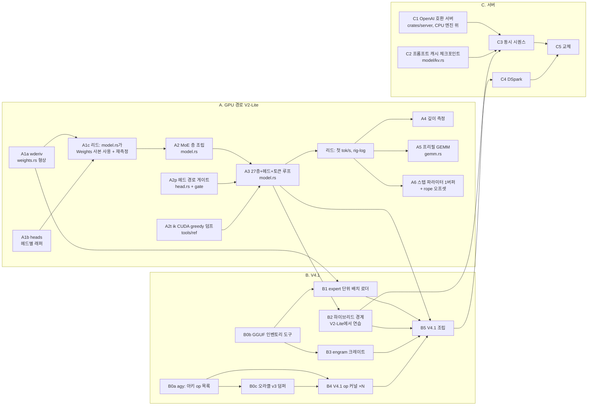

# bloomery — 계획

이 문서는 계획이고, 숫자는 [rig-log](https://github.com/midagedev/rig-log)에 측정된 뒤에만 여기 옮겨 적는다. 통과 기준은 전부 측정으로 쓴다.

이 문서 하나가 계획·현재 상태·라운드 운영·장부를 전부 갖는다. `HANDOFF.md`와 `docs/orchestration.md`는 2026-09-22에 여기로 병합됐고, 두 파일의 마지막 판은 커밋 `5ce25f4`에 있다(`git show 5ce25f4:HANDOFF.md`). 새 세션은 `AGENTS.md`(규칙 정본) → 이 문서의 "지금"까지 읽으면 일을 시작할 수 있다. **"장부" 절부터는 이력이다 — 계획을 읽는 데는 필요 없다.**

## 지금

**비행 중(2026-09-22 아침)**: A4b 두 라운드 — `kprobe`(flash 단계별 배가 프로브, 박스 임대)와 `ikread`(ik·메인라인 디코드 어텐션 독해), 그리고 `peerread`(llama.cpp 계열 밖 — exllamav3·FlashInfer·vLLM·FlashMLA). **다음**: 셋이 같은 단계를 가리키면 A4c(구현). 이 문서는 병합 라운드 `planmerge`가 만들었다.

### GPU 선

**GPU 스코어보드(2026-09-22 01:24, 임대·증인)**: 디코드 스텝 **3.8251 ms = 261.43 tok/s**, ~~ik 216.6의 1.207배~~ **창을 맞춘 비 1.199배**(우리 헤드라인은 `-n 32`, ik의 216.6은 n=96 — 같은 구성을 n=96으로 재면 258.81 대 215.82), 단일 CUDA 그래프 648노드. 하룻밤 네 라운드로 240.16 → 261.43(**+8.9%** — 창이 같으므로 이 계열 비교는 선다). ~~1.109배 → 1.207배~~ **중간 비들은 못 고친다**: 옛 바이너리를 n=96으로 잰 적이 없고 카드가 죽어 이제 못 재며, 두 창의 차는 깊이와 기울기를 타서 파생으로 메울 수 없다. 맞춘 비가 있는 것은 끝 바이너리뿐이다(1.199배, mean_ms 기반 — ik의 tg가 총시간 처리율이라 같은 통계로 맞췄다. p50으로 재면 1.204배). **깊이 0의 숫자이고, 깊이에서 뒤집힌다** — ~~아직 안 쟀다~~ 쟀다(2026-09-22 새벽, 한 임대·팔 번갈아·세 바퀴·산포 ≤0.5%, n=96 창): **깊이 6 258.81 대 ik 215.82 = 1.199배 / 1024 237.64 대 204.28 = 1.163배 / 4096 171.88 대 188.54 = 0.912배(역전)**. 캐시된 키당 스텝 시간 우리 0.46 µs 대 ik 0.16 — **2.8배 가파르다**(CPU 라인의 3.4 대 0.87과 같은 모양). 오늘 밤 네 라운드는 전부 깊이와 무관한 항을 고쳤으니, 이것은 회귀가 아니라 **어텐션의 키 축을 아직 안 열었다**는 말이다. 기록 rig-log 09-22-c. ~~**⚠ 박스 GPU 사용 불가**~~ **해소(2026-09-22 아침, 재부팅).** 깊이 표가 끝난 뒤 3090이 `Xid 79`로 버스에서 떨어져 두 카드에 `OS Reboot` 플래그가 섰고(전례 WKS-31, 이번 건 WKS-40), 재부팅 뒤 **두 카드 정상 복귀·Xid 0·AER 0**. 위 헤드라인은 **재현됐다**(261.43 → 261.40, 0.01%, 노드 648 불변) — **별표 없음.** 같이 닫힌 것: 유휴 2.5 GT/s는 정상 ASPM 강등이고 부하를 걸면 루트 포트·양 카드 모두 **16 GT/s**로 올라간다(391 W·99% 내내 AER 0). 기록 rig-log 09-22-e. **운영 규칙: `Xid 79` 뒤의 재부팅은 사람이나 BMC를 요구한다 — `systemctl reboot`이 끝나지 않고 10분 IPMI 워치독도 못 살린다. 기다리지 말 것**(이번에 15분을 태웠다). ~~완화책 **250 W 캡은 걸지 않는다**(사용자 판단 — 동작점이 바뀌면 이 계열이 무효다).~~ **2026-09-22 저녁 정정: 3090이 같은 날 두 번째로 떨어졌다**(21:38Z, kprobe `gate-gpu-e2e` 도중, Xid 79 + 두 카드 Xid 154; 하드리셋). 사용자 결정으로 **시간 측정은 A6000으로 옮기고 기준선(base·ik·nsys)을 거기서 다시 잰다** — 위 3090 수치 계열은 그 카드의 기록으로 닫히고 A6000 표와 한 표에 놓지 않는다. 3090은 게이트·빌드 카드가 되어 300 W 캡을 걸었다(동작점 논거는 시간 카드에만 해당했다; 캡 상태에서 같은 부하 `gate-gpu-e2e` 9팔 통과·Xid 0 — 한 번이라 전력 가설을 확정도 기각도 못 한다). 러너 배선 `c894dc6`, 기록 rig-log 09-22-g. 새벽 고장은 기존 NCCL·2카드 재현 셋과 서명이 다른 **네 번째 얼굴**이라 09-18의 transient 결론이 덮지 못한다. 계기: `--time`에 워밍 라운드가 없어 같은 바이너리 `--ab` base보다 느리게 읽는다 — ~~4.4%, 클럭 램프 유력·미측정~~ **쟀다(09-22-c). 클럭 램프는 기각**(모든 `--time` 행의 첫 열 스텝 p50이 3.819~3.825로 같았고, 직전 증인이 210 MHz·29.94 W인 식은 카드로 시작한 행도 포함). 차는 상수가 아니라 **창을 탄다** — 깊이 6 n=32 3.81%, n=96 0.71%, 깊이 1024에서 사라짐. 그래서 **판정이 갈리는 깊이에는 보정할 편향이 없고**("보수적"은 성립하지 않는다) 깊이 4096의 역전도 계기의 산물이 아니다. 교차 엔진 비는 `--time`에 선다. 정상상태 차의 기제는 열려 있다.

- **GPU 단계**(MUL-30, cuda-oxide 확정) — **ik 3090 기준선(09-21 아침, n=3): 216.6 / 204.6 / 189.7 tok/s(깊이 0/1024/4096, `-ngl 99 -mla 3 -fa 1 -fmoe 1`), 유도 천장 700의 31%**: 박스 완비(nvcc 13.0·cargo-oxide 0.2.1·핀=업스트림 HEAD), Q4_K·Q6_K CUDA 커널 이미 존재(q4k_gemv 809.8 GB/s, MUL-9). 라운드 이력은 아래 「장부 / GPU 단계」에 있다.

### CPU 선

- **커널**: Q3_K×q8_K, Q4_K/Q5_0/Q5_1/Q6_K×q8_2_x4 전부 융합(crates/qdot). MUL-38 q_nope2 Q8_0×Q8_0(vpsignb 부호접기 maddubs, 비트 동일). MUL-36 flash SIMD(kq_dot 8레인 합순서 + V j축; 폴백 레버 `BLOOMERY_FLASH_SIMD=0`). MUL-37 직렬 activation quant 풀 이양 + moe gate/up 이중양자화 제거(ptr::eq). 커널률은 ik의 95–99%(Q3_K만 ik 대조 미측정).
- **디스패치 경로가 느리면 첫 질문은 스레드 스윕이다**(`SWEEP="8 16 24 32" just measure-decode`): 곡선이 평평하면 일이 아니라 기다림. 프로파일이 꺼진 청크는 락을 잡지 않는다(AGENTS.md).
- **게이트**: 14개 just 레시피(gate-ops/attn/ffn/moe/head/forward/kv/derived/mt/profile/threads/qdot/prompts/1-1). 머지 후에는 영향 게이트 + mt/forward/prompts 재실행이 관례.
- **핀 상태**: prompts KNOWN_DIVERGENCE = ~~**{24}**(MUL-36 재핀, A/B 입증됨 — 이전 {14})~~ **{}**(2026-09-21 밤 `qdot::swiglu` 재핀, `crates/model/tests/prompts.rs` — 24는 0.151 근타이의 제비가 ik 쪽으로 떨어진 것). forward L_OUT_BANDS = (0,3e-3)(3,2e-3)(24,7e-2) + 날짜 주석. gate-mt는 재핀 불허 항목(스레드 무관 비트 동일).
- **스코어보드(2026-09-20 저녁, 같은 임대)**: N=96 **61.48 tok/s** 대 ik 82.88 → **잔여 1.35배**(아침 39.71/2.10배). 경위는 rig-log -j: 청크 끝의 무조건 수집 Mutex 제거(+44%) → 메인 스레드 고정 → mmap 프리폴트(+3.5%; 프리필 +18%는 6토큰 프롬프트 기준). → rintf libm 호출 제거(+8.3%, 2b2fdb6).
- **남은 산수**: 레벨2 dot 합/32 = 8.5 ms/step(완전 병렬 내적), ik 스텝 전체 12.1 ms, 우리 16.3 ms → 비내적 7.8 ms를 3.6 아래로. perf상 임계 경로는 메인 스레드 하나(워커는 표본의 51%를 스핀으로 대기): rintf 10% · memset 6.6% · expf 3.2% · 자기 청크+장벽 18%.
- ~~**스테이지 표(N=96, 레벨1, 24.18 ms/step)**~~ (락 아래서 잰 표 — 새 표는 rig-log -j): batch Q3_K 24.1% · Q3_K 단일 18.4% · batch Q5_0 14.9% · Q4_K 13.5% · Q6_K(lm_head) 5.3% · q_nope2 5.1% · swiglu+F32+접착부 ~10% · **flash 0.40ms(1.6%)**. 전체 54.8 GB/s = STREAM의 37%.
- 주의: 레벨2 quant 열은 MUL-37 이후 워커 CPU합(벽시간 아님).

세션별 스코어보드(밤 → 아침 4)는 장부에 있다. 가장 최근 값은 그 목록의 첫 항목이다.

### 어디에 무엇이 있는가

| 위치 | 내용 |
|---|---|
| `~/repo/bloomery` (이 리포) | 엔진 본체. AGENTS.md = 규칙 정본. docs/research/ = 조사 문서(CPU 조사 종합표는 `cpu-llm-ideas.md`, 패킹이 1순위), docs/RESULTS-*.md = 라운드 산출, docs/plan.md = 단계 계획 |
| `~/repo/rig-log` | 측정 기록(한국어 산문). 임대·증인 있는 숫자만. README 로그 표가 전체 인덱스. ~~최근: 2026-09-20-a…-h~~ 최근: 2026-09-22-a…-e. 증상으로 먼저 찾는다 — `tools/recall.sh '<키워드>'` |
| gadak 트래커 | `GADAK_HOME=$HOME/.gadak gadak --workspace gdk`, 프로젝트 MUL. Done: MUL-1…38 전부 종결(코멘트에 판정). 미완: MUL-30(GPU — ~~착수 대기~~ **진행 중**: A3 종료, A4 측정 완료, A4b 비행 중), MUL-6(CUDA 13.3 툴킷 — cutile-rs 스파이크의 전제) |
| 박스 | 접근은 오직 `./tools/box.sh '<cmd>'`(rsync 단방향 → 박스 편집 금지). 원격: /root/repo/bloomery, 데이터: /root/bloomery-data, 임대 락: /root/bloomery-cpu.lock. GPU: 기본은 3090. ~~**A6000(idx 1) 금지**~~ **정정(사용자, 2026-09-21)**: A6000도 개발에 쓸 수 있다 — `BLOOMERY_CARD=a6000\|both`로만 가고, `llm.service`가 살아 있거나 컴퓨트 프로세스가 있으면 rc 75로 거부된다. **시간 숫자는 3090에만**(기준선이 거기서 나왔다) |
| 세션 메모리 | ~~`~/.zcode/cli/memories/projects/rig-log-*/memory/`~~ `~/.claude/projects/-Users-hckim-repo-rig-log/memory/`(`MEMORY.md`가 색인) — 이 워크스테이션의 세션에만 유효하고, 규칙이 아니라 **사건 원본**만 산다. 새 곳에서는 이 파일이 대체 |

**새 환경 체크리스트**: ① 두 리포 클론(bloomery, rig-log — 둘 다 GitHub에 푸시돼 있음) ② 박스 SSH 설정 + `tools/box.sh` 동작 확인 ③ gadak 설치/설정(또는 이슈 상태는 이 문서의 「대기열」로 대체 가능) ④ 맥에서 게이트 금지(arm64) — 모든 게이트는 box.sh 경유.

## 목표

DeepSeek-V4.1-Flash를 이 워크스테이션(RTX A6000 48 GB + RTX 3090 24 GB, 둘 다 sm_86, Threadripper 5975WX 32코어, 256 GB)에서 우리 엔진으로 서빙한다. 호스트는 Rust, GPU 커널은 CUDA Rust(지금은 cuda-oxide, 툴킷 13.3 라운드 뒤 cutile-rs), CPU expert 티어는 Rust SIMD. 기준선은 같은 자리에서 잰 것이다. ~~ik_llama.cpp: 서빙 프로파일 PPL 2.2355, 디코드 25.05 tok/s(2026-09-16).~~ **선 그음 2026-09-19 — 그 한 줄이 엔진 둘을 합쳐 놨다.** PPL 2.2355는 **ik 포트**(ik_llama.cpp #2455)가 plain Q3_K_M 324 GB에서 낸 값이고, 디코드 25.05 tok/s는 **mainline 포크**(vcruz305/llama.cpp — `iqk` 디렉터리가 없다)가 grafted 445 GB 파일에서 낸 값이다. 이 박스의 V4.1 서빙은 처음부터 mainline이었다(rig-log `log/2026-09-12-deepseek-v41-first-run.md`가 "mainline llama.cpp지 ik 아님"이라고 적어 뒀고, 여기 옮겨 적으면서 틀렸다). `llm.service`가 띄우는 것은 또 다른 구성이다 — ik + DeepSeek-V4-Flash-**0731** Q4_K_XL 155 GB, 포트 8000.

같은 배치에서 둘을 나란히 잰 표가 #2455 본문에 있다: PPL 2.2355(ik) 대 2.2556(mainline), 디코드 20.4–20.7(ik) 대 21.2(mainline). **두 엔진이 3 % 안에 있다.** 이것이 이 프로젝트에 주는 것은 둘이다 — (1) 넘어야 할 선은 사실상 하나다, (2) ik의 존재 이유인 `iqk_mul_mat`이 이 배치의 호스트 expert 항에서 값을 못 받고 있다. 아주 다른 두 CPU 커널이 3 % 안에 떨어진다는 것은 그 항이 커널이 아니라 **대역폭**에 묶여 있다는 방증이고, `docs/roofline.md`가 그렇게 예측했다.

왜 직접 만드는가: 이 박스가 실제로 서빙하는 모델은 mistral.rs가 로드하지 못하고, ik의 MoE 디코드는 배치를 못 하며, 어느 쪽이든 고치려면 업스트림 머지를 기다려야 한다(2026-09-19 기준 mistral.rs는 09-08 이후 정지, 외부 PR 40건 대기). 발견은 계속 업스트림에 코멘트로 보내되, 엔진은 머지에 의존하지 않는다.

## 디딤돌

V4.1 Flash는 engram 테이블 NVMe 지연 읽기, 공유 압축 KV, 지연 하이퍼커넥션, 저랭크 query norm, CPU expert 티어, DSpark 드래프트를 한꺼번에 요구한다. 먼저 **DeepSeek-V2-Lite-Chat Q3_K_M**(8.1 GB, `deepseek2`, MLA, MoE 64 expert, 3090에 들어감)으로 로더·MLA·MoE·게이트를 세우고, V4.1 고유 부분은 ik 포트(ik_llama.cpp #2455)를 참조로 얹는다.

## 단계

| 단계 | 만드는 것 | 통과 기준 |
|---|---|---|
| 0 | cuda-oxide로 쓴 Q3_K gemv를 같은 텐서의 ggml `mmvq`와 대조 (MUL-1, rig-log WKS-35) | ~~최대 상대 오차 ≤ 1e-4~~ f32 활성값이면 1e-4, q8_1 활성값이면 1e-2(설계를 명시) — 2026-09-19 선 그음: 2라운드가 ggml처럼 q8_1로 갔고 오차 4e-3은 그 설계의 것이다. 대역폭 `stack` M=1에서 ggml의 0.9배 이상. **통과 2026-09-19: 1.05배**(348 대 333 GB/s, 3090). M=8 0.83배는 MUL-8, Q4_K·Q6_K·A6000 행은 MUL-9 |
| 1 | V2-Lite 순전파. 세로로 다섯 라운드, 각 라운드가 끝에서 끝까지 도는 것 하나를 내고 자기 게이트를 가진다(아래 표) | 고정 프롬프트에서 ik greedy와 토큰 동일, wikitext-2 PPL이 ik 오차 안 |
| 2 | 호스트 expert 티어: 일부 층 expert를 CPU에, 양자화 상태 sparse gemv를 코어 전체에. 커널은 이미 있다(MUL-3, ggml의 1.1배) — 남은 것은 호출자다 | 층·토큰당 비용을 같은 런의 ik와 대조(참조 급: Qwen3.6에서 ik 0.20 ms), batch 2가 batch 1보다 느리지 않음 |
| 3 | V4.1 아키: engram mmap + WILLNEED 프리페치, 하이퍼커넥션, 공유 KV, query norm | PPL 2.2355 행 패리티, 같은 배치에서 25.05 tok/s 대비 |
| 4 | DSpark 드래프트 + 스케줄러, 빠른/느린 모델 라우팅(결정은 로컬·1 ms 아래, 출력이 바뀌므로 φ 측정으로 먼저 판정 — `research/jev-routing.md`) | 수락률·tok/s가 ik 서빙 프로파일 이상 |

## 로드맵 (2026-09-21 재정리 — 순서: GPU 경로 → V4.1 배치·engram·NVMe → 서버)

위 표의 2~4단계는 2026-09-19의 서술이고 그대로 둔다. 그 뒤 이틀의 실측이 순서와 경계를 바꿨으므로
여기 다시 적는다. 각 국면의 끝은 숫자 하나다 — 그 숫자가 rig-log에 실리기 전에는 다음 국면을 열지 않는다.
사용자 결정(2026-09-21): **GPU 경로를 끝내고, engram과 NVMe 오프로딩을 하고, 그 다음 서버.**
라운드 단위의 운영(파일 경계·병렬·순차·파동)은 아래 "라운드 운영" 절에.

### A. GPU 경로 — V2-Lite 전체를 3090에서 (지금)

지금 있는 것: 모델의 모든 가중치 타입에 대한 커널, MLA flash, 라우터, 융합 MoE, 블록 0의 캡처된 그래프
(33노드, 264 µs — 유도 바닥 ~42 µs의 6배). 남은 행, 이 순서로:

| 행 | 만드는 것 | 끝의 숫자 |
|---|---|---|
| A1 | 헤드별 래퍼 커널(gather 6노드·m=8 낭비 제거), `Q8_0Derived` 형상 수정 | 블록 0 스텝 µs(임대), 탭 표 동일 |
| A2 | MoE 층 조립(`moe_fused` + 라우터 + 층별 KV), 2스테이지 = 1스테이지 비트 동일 | 블록 1 탭 표가 밴드 안, 층 스텝 µs |
| A3 | 27층 + lm_head + argmax를 한 그래프(또는 층 그래프의 사슬)로, 토큰 루프 | 고정 프롬프트 32개에서 ik CUDA와 greedy 토큰 비교(발산 집합 핀), **첫 tok/s 대 ik 216.6**(깊이 0) — **첫 라운드 머지(e2e 0294d4a, 2026-09-21)**: 1그래프 755노드, **198.7 tok/s = 0.918×**(graph, 3090, n=2, SMOKE); 남은 것 = 발산 집합 3개(프롬프트 8·10·18) 핀. ~~참조 파일이 `kv_cache_clear` 오염~~ → 원인은 캐시가 아니라 ik의 워밍업 판정식이 첫 그래프를 64전문가로 넓힌 것이었고(ikclear 7dd92cb), 참조 재생성·설치 완료 — 우리 엔진 쪽 발견은 없다 |
| A3b | 활성값 1열 lane 몸통(ILP) + 워프 top-6 — rtr 라운드 | **스텝 4.2755 ms = 233.89 tok/s = ik의 1.080배**(3090, 임대, 리드 재측정 233.79); ~~남은 것 = 같은 패턴의 K-quant 코어~~ → A3c |
| A3c | 같은 레버를 K-quant 코어에 — ilp 라운드 | **스텝 4.1638 ms = 240.16 tok/s = ik의 1.109배**(리드 측정, 증인 전후 깨끗). 가드는 `q3k_gemv`·`q4k_gemv`에만 있었고 융합 MoE 커널은 이미 상수 접힘 — **K-quant가 700 GB/s 아래인 원인은 가드가 아니다**. 클래스 천장은 디코드 명령 수(최대 팔 Q3_K 598 / Q4_K 708 / Q6_K 868). 남은 레버: `model.rs` MoE 경로의 작은 quantize 런치 5개(~6 µs/층)와 `gemv_q3k_heads` 두 런치 합치기(~1.5 µs/층) |
| A3d | 런치 쪽 — 작은 런치를 프로듀서에 접거나 합치기, lfold 라운드 | **스텝 4.1006 ms = 243.87 tok/s = ik의 1.126배**, 그래프 755 → 701노드(리드 측정). **이 그래프에서 노드 하나 = 0.80 µs**(독립 계기 둘, 4% 안). fold는 기하가 막는다 — 양자화기 스케일 단위가 연속 32·128행이라 접으면 상주 워프 −33% 또는 82 SM 중 22·16개. merge 둘로 −75.7 µs ± 3.8(같은 바이너리 롤백 대조), 비트 동일 |
| A3e | Q3_K 디코드 명령 수 — q3kdec 라운드 | **스텝 3.9293 ms = 254.50 tok/s = ik의 1.175배**(리드 측정, 두 실행 0.02% 차). m=1 루프 170 → 125 명령, Q3_K 최대 팔 565.2 → 635.7 GB/s. 리드 가설(16레인 중복 계산) **기각** — SIMT는 워프에 한 번 발행한다(브로드캐스트 프로브 +5 명령·제거 0). 실제는 스케일 경로 48/87: 하드웨어 `cvt.f32.f16`(17 → 1) + `q3k_sub_scales4`(31 → 20). **명령 −26%에 팔 +12.5%로 1:1이 아니다** — 팔이 DRAM 천장의 67.9%, 기울기가 평평해지는 구간 |
| A3f | ~~같은 f16 레버를 Q4_K에(두 배 크기)~~ + 죽은 mov + 주소 강도 감소 — `q4kdec` | **스텝 3.8919 ms = 256.94 tok/s = ik의 1.186배**(리드 측정). **f16 레버는 기각 — 명령 37%를 줄이고도 느리다**(SASS 312 → 196, 블록 15 → 1, 스텝 +0.38% 3/3, op +6.7%): **~700 GB/s에서 이 커널들은 발행 바운드가 아니다.** 값은 "작은 항목" 쪽에 있었다 — m==1 엔트리가 1col 코어를 직접 부르니 Q3_K 팔 615.8 → 682.9 GB/s, 루프 125 → 117. **커널 쪽 A3는 여기서 닫는다**: `q4k_nibble`의 −8 바이어스 24연산도 같은 이유로 버린다(116 명령을 빼서 느려졌는데 24를 빼서 벌 수 없고, 비트 동일까지 깨진다) |
| A3g | 런치 쪽 2 — `flash_merge`의 q8_1 side output, MoE 양자화 둘 병합, **grid barrier 가격 실측** — `fmerge` | **스텝 3.8251 ms = 261.43 tok/s**, ~~ik의 1.207배~~ → 창을 맞춘 **1.199배**(258.81 대 215.82, n=96, mean_ms 기반), 그래프 701 → 648노드(리드 측정). **장벽 ≈ 0.72 µs + 협동 런치 0.20 = 0.92 대 노드 0.80** — 경계 하나를 닫는 fold는 런치 산수만으로 손해고 점유율 대가는 그 밖이다. fold 셋은 닫힌 채로. 단, 장벽 단독은 노드보다 싸서 경계 N ≥ 3을 한 커널로 닫으면 산수는 뒤집힌다(점유율 대가 미측정). 레버 2 = 1.18 µs/층, 레버 3 = 1.38 µs/층. 계기 결함(0 가중치 벤치) 수정 + zerow 상설 대조 팔 |
| **A3 종료** | 커널 쪽·런치 쪽 둘 다 닫혔다 | 하룻밤 네 라운드로 240.16 → **261.43 tok/s(+8.9%)**. ~~ik의 1.109배 → 1.207배~~ — **이 열의 모든 비는 창이 어긋나 있다**(아래) |
| A4 | 깊이 — 1024·4096에서 같은 대조; flash의 키 루프가 깊이에 따라 어떻게 커지는지 | **완료(2026-09-22, `depth` 라운드, 코드 변경 0)**: n=96 창으로 **깊이 6 258.81 대 215.82 = 1.199배 / 1024 237.64 대 204.28 = 1.163배 / 4096 171.88 대 188.54 = 0.912배 — 역전.** 캐시된 키당 스텝 시간 우리 0.46 µs 대 ik 0.16(**2.81배**). 구간 기울기: 우리 0.236 → 0.535 µs/키로 가팔라지고 ik는 0.257 → 0.133으로 누워진다 — **첫 구간은 같고 벌어지는 것은 전부 깊은 쪽이다.** 계기 둘 다 보정 통과. 클럭 램프 가설 **기각**. 러너 `tools/ref/depth-gpu.sh`. 기록 rig-log 09-22-c. 같이 나온 구조 사실: `model.rs:3069`+`flash.rs:1309`의 분할 그리드가 `q_rows × segments_for(ctx_max)`라 **죽은 세그먼트도 런치된다** — 깊이 6에서 ctx를 512 → 4192로 키우면 1.8% 느리다(그런데 깊이 1024에서는 같은 확장이 0.9% **빨라진다** — 기제 미측정). 그래프에 잡힌 그리드는 디바이스 값을 못 따라가므로 튜닝이 아니라 구조 문제다. **다음 국면의 본체는 여기다 — 어텐션의 키 축** |
| A5 | 프리필(m > 1) — 활성값 레이아웃 다리(`y[r*m+c]` 대 토큰-주), IMMA는 여기서 처음 의미가 있다 | 프리필 tok/s 대 ik |

**A3 행들의 "ik의 N배"는 전부 창이 어긋나 있다**(2026-09-22 발견): 우리 값은 `generate`의 기본 `-n 32`이고 ik의 216.6은 n=96이다. 창을 맞춘 비가 있는 것은 A3g의 끝 바이너리뿐이다(1.199배, mean_ms 기반). 중간 바이너리들은 n=96으로 잰 적이 없고 카드가 죽어 이제 못 재며, 두 창의 차는 깊이와 기울기를 타서 파생으로 메울 수 없다. **스텝 ms와 tok/s는 창이 같으므로 계열 비교는 그대로 선다.**

A3이 국면의 끝이다. A4·A5는 B로 넘어가기 전에 **재기만** 하고, 손대는 것은 B의 배치 결정이 나온 뒤.
근거: V4.1에서는 dense 7.66 GB/토큰이 전부 VRAM에 있고(roofline) 그 항이 GPU 시간의 대부분이므로, V2-Lite에서
얻은 GPU 스텝 효율이 그대로 V4.1의 GPU 항이다.

### B. V4.1-Flash를 이 기계에 — 배치, CPU expert 티어, engram, NVMe

바이트가 말하는 것(roofline, 2026-09-16 서빙 배치 기준): 토큰당 11.7 GB 중 dense 7.66 GB는 VRAM, 라우팅 expert
4.04 GB 중 3.34 GB가 DDR4(33블록), 0.71 GB가 VRAM(7블록); engram 194.9 GiB는 **토큰당 48행(12.75 KiB)**만 읽는다.
가중치 249 GiB(444 − 195)는 RAM 256 + VRAM 72에 들어가므로 **expert의 NVMe 오프로딩은 이 양자화에서는 필요 없다**;
NVMe에 두는 것은 engram 하나다. 더 큰 양자화(Q4)를 올리려면 그때 expert 일부가 NVMe로 가고, 그것은 별도 측정 뒤의
선택이다.

| 행 | 만드는 것 | 끝의 숫자 |
|---|---|---|
| B0 | 선행: V4.1 아키 독해 — ik 포트(#2455)를 참조로 하이퍼커넥션·공유 압축 KV·저랭크 query norm·engram 조회 경로를 op 목록으로; ik에서 V4.1 중간 텐서 덤프(오라클 v3) | 덤프 세트 + op 인벤토리(문서) |
| B1 | 로더: 텐서마다 (디바이스, dtype) 주소를 로드 시 배정(층 단위가 아니라 expert 단위 — mistral.rs가 못 하는 그것); GGUF 444 GiB의 mmap 창 | 로드 시간, 상주 바이트 표(어디에 몇 GB) |
| B2 | **CPU expert 티어**(옛 2단계): 라우팅 expert의 sparse gemv를 CPU 풀에 — 커널은 이미 ik의 95~99%; 남은 것은 GPU 스텝과의 경계(활성값 전송, 동기) | 층·토큰당 호스트 항 ms 대 roofline 하한(3.34 GB ÷ 147.7 GB/s = 22.6 ms); GPU↔호스트 왕복 µs; **GPU 유휴 비율** — 호스트 하한에 닿고도 GPU가 40% 노는 라운드가 초록으로 읽히면 안 된다(`research/hybrid-engines.md`의 R1: 공유 전문가를 호스트 다리와 겹친다) |
| B3 | **engram**: 테이블은 NVMe mmap, 토큰당 48행(12.75 KiB, 흩어진 272 B 읽기)을 `WILLNEED`/`io_uring` 선행 읽기로; 캐시 안 하는 것이 설계 | 조회 지연 µs(p50/p99, 콜드·웜), 스텝에서의 몫 |
| B4 | V4.1 고유 op 셋(B0 목록)을 GPU 커널로, 오라클 v3 대비 게이트 | 층 탭 표 밴드 안 |
| B5 | 조립 + 첫 V4.1 토큰 | **PPL 2.2355(ik) 패리티, tok/s 대 25.05(mainline, 2026-09-16)**·ik 20.4~20.7 |

B의 순서는 위험 큰 것부터다 — B0·B1이 없으면 나머지가 잘못된 형상 위에 선다. B2는 V2-Lite에서 미리 연습할 수 있다
(일부 층 expert를 CPU에 두는 하이브리드; A3 뒤, 경계 하나만 더하는 일).

### C. 서버 — `llm.service`를 대신한다

지금 그 자리는 ik + DeepSeek-V4-Flash-0731 Q4_K_XL(포트 8000, OpenAI 호환, tailnet 공개)이다. 우리 서버는 같은
자리에 같은 API로 서고, 바꿔 끼운 뒤 속도가 돌아왔는지 같은 러너로 확인하는 것이 끝이다.

| 행 | 만드는 것 | 끝의 숫자 |
|---|---|---|
| C1 | OpenAI 호환 HTTP(`/v1/chat/completions` 스트리밍, `/props`, 청크별 `timings` — toktape가 첫날부터 녹화) | toktape 한 클립 |
| C2 | **프롬프트 캐시 체크포인트**: 편집 한 번에 13k 프리픽스가 통째로 재프리필되던 것(rig-log 2026-09-17)을 메시지 경계 체크포인트로 | 재프리필 토큰 수, 편집 후 첫 토큰 지연 |
| C3 | 동시 시퀀스 — 호스트/GPU 2단 파이프라인(roofline: 처리량 1.67배 **도출**, 독립 시퀀스 ≥ 2일 때만) | 동시 2·4 스트림 합계 tok/s |
| C4 | DSpark 드래프트 + 검증 배치(옛 4단계; k* ≈ 2.2 실측이 검증 폭의 상한) | 수락률, 단일 스트림 tok/s |
| C5 | systemd 유닛·임대 협약~~(A6000 야간 학습과의 양보)~~(야간 학습은 2026-09-21에 끝났다 — 협약 상대는 우리 측정 라운드뿐)·교체 | 교체 전후 같은 러너의 tok/s |

~~**열어 둔 질문 하나(사용자 판단)**: C1을 A3 직후 V2-Lite 위에 얇게 먼저 세울 수도 있다 — 동시 스트림·캐시 측정
하네스가 B 내내 있게 되고 toktape 클립이 일찍 나온다. 대가는 A4·A5·B0 앞에 한 라운드가 끼는 것. 지금 순서(GPU →
V4.1 → 서버)가 사용자 결정이므로 기본은 그대로 두고, A3이 끝나는 시점에 한 번 다시 묻는다.~~

**닫음 — 사용자 결정(2026-09-21 저녁): 얇은 끝-끝 경로를 먼저 뚫는다.** 근거는 사용자 경험("얇게라도 서빙 경로를
뚫어두면 개발 속도가 빨라지더라")과 fuse1의 실측(노드 4개를 뺐는데 스텝 µs가 산포 안이라 이득을 주장 못 함 — tok/s
러너가 없어서). 시점은 **kern2·prof2 머지 뒤, fuse2 앞** — 속도가 목적인 첫 라운드 직전. 그 앞 라운드들은 비트 동일이
판정이라 러너가 필요 없고, 그 뒤부터는 매 라운드 "스텝 ms 전/후" 한 줄이 판정이다. 층 종류 둘(밀집 블록 0, MoE 층 1)이
이미 비트 동일로 닫혀 있어 전 층 루프는 배선 작업이고, prof2의 op별 바이트·GB/s 계기가 있어야 그 tok/s를 분해할 수
있다. 더 늦추면 B2 경계 설계를 실측 없이 하게 된다.

얇음의 정의(A3의 축소판, 이것이 A3의 첫 라운드가 된다): V2-Lite 전 층 3090 상주, 위치 0부터 greedy(argmax만) 토큰
루프, `bloomery generate <gguf> <prompt> -n N` CLI, 프롬프트는 토큰 하나씩 디코드 경로로(프리필 커널 없음),
스트리밍·배치·채팅 템플릿 없음. 게이트는 ik greedy와 첫 N 토큰 일치(배선 검증이지 정확도 주장이 아님)이고, 이 CLI가
곧 A/B 러너다(`time-gate.sh`로 스텝당 ms 한 줄). HTTP는 그 다음 라운드에 `/v1/completions` 하나만(스트리밍 없이) —
toktape를 붙일지는 그때 본다. A3의 나머지(32프롬프트 발산 집합 핀, 한 그래프로 묶기)는 그 뒤 라운드.

## 라운드 운영

날짜 2026-09-21. 이 절은 위 로드맵을 **위임 라운드 단위**로 자른 것이다(2026-09-22 병합 전에는 `docs/orchestration.md`였다).
라운드 하나 = 워크트리 하나 = 파일 경계 하나 = 게이트 하나 = 완료 보고 하나. 리드는 스펙·diff 독해·게이트 재실행·
임대 측정·머지만 한다. 이 절의 크기 표기(S/M/L)는 추정이고 실측이 아니다 — 라운드가 끝날 때마다 실제 소요를 옆에 적는다.

### 원칙

**백엔드(2026-09-21 오후 개정)**: 새 위임은 opus 서브에이전트(Agent 도구, `model:"opus"`)다 — 카드의 "GLM"은 그렇게 읽는다. 돌던 GLM 라운드만 끝까지 둔다.
 (병렬성을 정하는 것은 파일 경계다)

1. **같은 파일을 두 라운드가 동시에 만지지 않는다.** `crates/gpu/src/model.rs`가 GPU 경로의 병목 파일이다 — 조립 라운드는
   전부 여기를 지나므로 **model.rs를 만지는 라운드는 한 시점에 하나**. 커널·게이트·도구·다른 크레이트는 자유롭게 병렬.
2. **오라클이 직렬을 팬아웃으로 바꾼다**(plan.md 1단계에서 실증). 조립 입력이 앞 라운드의 출력이라도, ik 덤프가 그 입력을
   파일로 갖고 있으면 병렬로 열 수 있다. 그래서 오라클 덤프 라운드(A·B 각각)가 다른 무엇보다 먼저다.
3. **리드가 직렬 지점이다**: diff 독해·게이트·임대 측정·머지. 임대는 한 번에 하나. 그래서 동시 비행은 **3~4 라운드**가 상한이고
   ~~(GLM 쿼터도 같은 상한을 준다 — 주간 창은 09-26 11:54 리셋), 그 이상은 조사(agy) 라운드로 채운다.~~
   **개정(2026-09-22)**: 위임이 opus라 쿼터가 상한을 주지 않는다. 상한을 정하는 것은 둘뿐이다 — 리드의 검수 대역과 **박스 임대 하나**.
   박스로 재는 라운드는 한 시점에 하나이고, 코드 읽기·문서 라운드는 그 옆에 몇이든 붙는다.
4. **조사는 코드보다 먼저 병렬로 간다.** ~~agy~~ 조사 라운드는 파일을 안 만지므로 언제나 병렬이고, 그 결론(B0)이 없으면 B의
   코드 라운드가 잘못된 형상 위에 선다. 지금 A를 돌리는 동안 B0를 돈다.
5. **끝의 숫자가 없는 라운드는 열지 않는다.** 각 라운드 카드의 "게이트" 칸이 비면 스펙을 쓰지 않는다.
6. **원인이 측정되지 않은 느림에는 구현 라운드를 열지 않는다**(2026-09-22 신설). 먼저 원인 축소를 병렬로 셋 — 우리 쪽 **배가 프로브**
   (그 일을 두 번 시켜 늘어난 만큼이 그 일의 값), **참조 독해**, 그리고 **커널 카운터**(`tools/ref/ncu-gpu.sh`). 구현 스펙은 셋이 같은
   단계를 가리킨 뒤에 쓴다. 첫 사례가 A4b다. 근거는 사고다 — 참조를 안 읽고 세운 가설 셋이 한나절을 먹은 적이 있다.
7. **계기를 한 번 의심한다**(2026-09-22 신설). 새 계기의 첫 표는 값이 아니라 **그 계기가 무엇을 잡았는지의 증거**와 함께 읽는다.
   실측: ncu 첫 실행이 깊이 4096에서 `flash_latent_seg` 10.8 µs를 냈는데 깊이 6의 9.15 µs와 거의 같았다 — `--launch-count`가
   프롬프트 스텝(m=4096)의 첫 층들을 잡은 것이었다. ~~지금 러너는 스텝당 54런치를 건너뛰고 그리드 크기를 찍어 증명한다.~~
   정정(같은 날 저녁): 그 증명은 거짓이었다. `step(&prompt)`는 토큰마다 그래프를 한 번씩 재생하므로 54런치는 프롬프트 두 토큰이고,
   그리드는 캐시 높이에서 나와 깊이 0에서도 528이다. 그래서 "깊이 4096에서 flash 11.2 µs, 깊이 비용의 97%가 flash 밖"이라는 결론은
   깊이 2의 측정이었다 — 두 번째 표도 첫 표와 같은 이유로 틀렸다. 계기의 증거는 계기가 찍는 형상이 아니라 **그 계기와 독립인
   산술**(건너뛴 런치 = (프롬프트 길이 + 버릴 스텝) × 스텝당 런치)과 지표가 깊이를 따라 움직이는 것이다. 시간이 어느 커널에 가는가는
   ncu가 아니라 `tools/ref/nsys-gpu.sh`가 답한다(재생마다 한 번 나오는 커널로 스텝 경계를 긋고, 경계 수가 프롬프트 길이와 맞는지 스스로 확인한다).
   그 답(같은 날 저녁, 재생 621커널, 경계 9/9·4099/4099, 스텝 벽시계 3.90/5.89 ms = 기록과 일치): 깊이 8 → 4098에서 `flash_latent_seg`
   6.55 → **75.77 µs/층**, `flash_merge_q8` 2.54 → 8.98. 스텝 증가 1.98 ms 가운데 두 커널이 1.98 ms — **깊이 비용은 flash가 전부다.**
8. **박스를 쓰는 라운드 스펙에는 "카드가 떨어지면 즉시 멈춤"을 넣는다**(2026-09-22 신설). 재시도·재부팅·수정 없이 시각과 마지막
   출력만 보고한다. `Xid 79` 뒤의 재부팅은 사람이나 BMC를 요구한다(위 「지금 / GPU 선」).

### 의존 그래프



### 열린 라운드 카드

~~백엔드: **GLM** = glm-5.3 구현(`outsource-run.sh --effort max`), **agy** = 조사·보고 전용, **리드** = 이 세션.~~
**백엔드(2026-09-22)**: 표의 "GLM"·"agy"는 전부 **opus 서브에이전트**(Agent 도구, `model:"opus"` 명시)로 읽는다. **리드** = 이 세션.
크기: S 반나절 이하 / M 하루 / L 하루 넘음(쪼갤 후보).

#### A — GPU 경로

| id | 라운드 | 파일 경계 | 백엔드 | 게이트(끝의 숫자) | 앞 | 크기 |
|---|---|---|---|---|---|---|
| A2-2 | 스테이지 분할(2스테이지 = 1스테이지 비트 동일). A2-1은 머지됐고(`c9f5ace`) 전 층 조립은 e2e(`0294d4a`)가 한 그래프로 끝냈으므로, 남은 것은 **여러 스테이지로 나누는 것**뿐이다 — 카드는 두 카드에 걸칠 때 값을 받는다 | `gpu/model.rs` | opus | 2스테이지 = 1스테이지 비트 동일 | e2e | M |
| ~~A2~~ | ~~MoE 층 조립: `Stage`를 층 l 일반화, `moe_fused`+라우터+층별 KV, 2스테이지=1스테이지 비트 동일 | `gpu/model.rs`, 새 `gate_p8b.rs`, `block.rs`(MoE 탭 밴드 표 인쇄) | GLM | 블록 1 탭 표 인쇄(리드가 핀), eager==replay, 2스테이지 비트 동일 | A1c — **A2-1 머지 c9f5ace**(opus): 층 1 = 31노드, 라우터 ids 정수 일치, 다른 입력 재생이 라우팅을 따라감, 밴드 미핀(A6 뒤 gate_p8과 함께) | L → 둘로: A2-1 층 조립·탭, A2-2 스테이지 분할~~ — **A2-1 끝남, 남은 A2-2는 위 행으로 옮겼다(2026-09-22)** |
| A4b | **키 축 원인 축소**: flash 단계별 배가 프로브(`StepProbe` 레버 + `generate --ab-set keyaxis`) ‖ ik·메인라인 독해 ‖ 그 계열 밖 독해(exllamav3·FlashInfer·vLLM·FlashMLA) | `gpu/flash.rs`, `gpu/model.rs`(StepProbe·flash 호출부), `generate.rs`, `depth-gpu.sh` ‖ 독해 둘은 읽기 전용 | opus ×3 병렬(`kprobe`·`ikread`·`peerread`) | 깊이 1024·4096 단계별 분해표 + 합 검사(Σ단계 대 `base(깊이) − base(6)`), 프로브 팔 값 불변 단언(FAIL-first), 참조 나란히 표 | A4 | M — **비행 중**(2026-09-22 아침) |
| A4c | ~~키 축 구현 — A4b가 지목한 자리에~~ **닫힘(측정 미달, 2026-09-22 밤)**: 헤드 16개를 한 블록에 모은 스칼라 `flash_latent_hseg`가 A6000에서 깊이 4096 층당 −8.6 µs(목표 −55), 깊이 6 +32 µs, 세그 32로 블록 4배에도 무변화, ncu 1024에서 102.7 대 32.4 µs(블록 9, SM당 1블록). A4b 표(QK 37 + V 30 µs = 층의 85%, softmax·셔플·배리어 2.3)와 합치면 비용은 바이트가 아니라 **로드 명령 수** — 공유메모리 브로드캐스트로는 안 줄어든다. 브랜치 `a4c`(`14c97d1`) 기록, 미머지. 다음: **A4d — Q를 MMA 조각에**(`cuda_device::wmma::mma_m16n8k16_f32_f16`·`ldmatrix_x4` 확인됨). 기록 rig-log 09-22-h | 닫힘 | opus | (성공 기준은 A4d로: 같은 카드 hseg→MMA 비율, ik 대비 깊이 4096 ≥ 1.0) |
| A4d | **닫힘(1팔 측정 미달, 2026-09-22 밤)**: QK 내적을 `mma.m16n8k16`에 올린 `flash_latent_mma`(블록 = 헤드 16개 × 세그먼트, 128스레드, Q f16 smem, K 192차원 청크, V 스칼라)가 정확하고(밴드 8.5e-4 → `FLASH_MMA_BAND` 1.7e-3, 재생 비트 동일, FAIL-first 둘) **모든 깊이에서 느리다** — A6000 스텝 d6 4.34→6.15, d1024 4.73→6.70, d4096 6.48→7.08 ms. ncu d1024: SM 2.2%, DRAM 5.9%, 달성 점유율 8.3%, 멈춤 49% long_scoreboard — 격자 18블록×4워프. 산술은 벽이 아니게 됐고 지연을 숨길 워프가 없다(A4c의 벽에 반대쪽에서 도착). 레버 아래 e2e 발산 3→5(f16 Q, ik 마진 0.77·0.89 자리) — 레버 기본 off. 브랜치 `a4d`(`0537327`) 기록, 미머지. 다음 후보 A4e: 블록 512스레드(V 루프를 스레드당 1차원), seg 32 + `flash_merge_q8` (행, latent 청크) 분할(그 커널도 grid 16, long_scoreboard 62%), Q hi/lo 분할로 정밀도 회복, K 타일 상주(`dynamic_shared` 계약으로 48 KB 초과 가능 — 장부 #9) | 닫힘 | opus | (A4e 성공 기준: d4096 스텝 ≤ 5.52 ms, 발산 집합 ≤ 3) |
| A4e | **속도 기준 통과, 정밀도 핀 미달(2026-09-22 새벽, 브랜치 `a4e` `269a024`, 미머지, 레버 기본 off)**: 512스레드·K 타일 동적 smem 상주(56 KB)로 점유율 8.3→33 %, d1024 층당 97.7→44.8 µs. A6000 3바퀴 레버 on: d6 +0.81 %, d1024 −4.6 %, **d4096 6.511→5.048 ms(−22.5 %, ik 5.582 — 깊은 컨텍스트에서 처음 ik를 이김, 1.11×)**. 되돌린 셋(전부 MIO 파이프 `mio_throttle` 42.5 %가 새 벽): 머지 (행, latent 청크) 분할(+), Q hi/lo(밴드 8.5e-4→1.0e-5·발산 5→4이나 d1024 +9 %), V 루프 live 트림. **e2e 발산 5 > 핀 3** — 세그 크기는 집합을 안 움직이고(스칼라 seg 64도 3) 산술 클래스가 움직인다. 결정 필요: 정밀도(hi/lo, d4096 5.459) 대 속도(hi만, 5.048), 그리고 핀의 의미(ik 마진 가중) | 열림 | opus | 리드·사용자 판정 → 머지 여부 |
| A6 잔여 | **닫힘(2026-09-22 밤, `03c1a28`)**: 스텝 파라미터 4버퍼·4카피 → `step_params` 1버퍼·1카피(비소유 뷰로 커널 인자 불변). 값 불변(e2e 집합·648, p8 18, 슬롯 맞바꿈 변이 25/33 빨강). 스텝 µs는 A6000 3바퀴 d6 −16 µs / d1024 +4 µs — ±1 % 자 안, 못 가름. 남은 것: `copy_from_host`의 매번 `synchronize()`(핀드+async), `cs` Vec 재사용 | 닫힘 | opus | 자 문제(호스트 제출 경로 µs 계측기) 선행 |
| W41 | **닫힘(2026-09-22 밤, `c1fc704`)**: 깊이별 ik 참조표(A6000 값), 타이밍 루프 밖 출력, `--warm W`(러너 `BLOOMERY_GEN_WARM`, ROW `warm`·`ik_ref` 열). `--time` 대 `--ab` 2.2 % 차는 워밍이 아니라 구조(`--ab`는 reset+재캡처 후 측정) — 미해결 | 닫힘 | opus | (`just lint`가 gpu 피처를 안 봄 — 도구 라운드) |
| A5 | 프리필: m>1 활성값 다리 + IMMA GEMM 커널(m 16~512) | 새 `gpu/gemm.rs`, 새 `gate_gemm.rs`; 조립은 별도 라운드 | GLM(커널) → GLM(조립, model.rs) | 커널 밴드 + 프리필 tok/s | A3m; 커널 부분은 A2와 병렬 가능 | L |
| A6 | 스텝 파라미터 1버퍼(pos/n_keys/token/cs를 구조체 하나, 비동기 카피) + `enqueue_rope` src/dst 오프셋(f_rope gather 2개·kvr gather 제거) | `gpu/elem.rs`, `gpu/flash.rs`, `gpu/model.rs` | GLM | gate_p8 동일 탭, 노드 26→~22, 스텝 µs(리드) | A1c; model.rs가 비는 창(A2 전 또는 A3 후) | M |

#### B — V4.1

| id | 라운드 | 파일 경계 | 백엔드 | 게이트 | 앞 | 크기 |
|---|---|---|---|---|---|---|
| B0c | 오라클 v3: ik에서 V4.1 중간 텐서 덤프(덤퍼 확장) — 실행은 RAM 250 GB·두 카드를 쓰므로 **llm.service 중단 + 임대** | ik 트리 덤퍼 패치, `tools/ref/dump-ref-v41.sh` | GLM(도구) → 리드(실행) | 덤프 세트 + MANIFEST | B0a | M |
| B1 | 배치 로더: 텐서마다 (디바이스, dtype) 주소를 로드 시 배정, expert 단위; 444 GiB mmap 창; 상주 표 인쇄 | `gpu/weights.rs`, `crates/model` 로더, 새 `gate_place.rs` | GLM | 배치 표가 설계와 일치, 상주 바이트 합 | A1a, B0b | M |
| B2 | 하이브리드 경계: 일부 층 expert를 CPU 풀에(V2-Lite로 연습), 활성값 왕복·동기 | `gpu/model.rs`, `crates/model/moe.rs` | GLM | 로짓 대 순GPU 밴드, 왕복 µs, 층 ms 대 하한, **GPU 유휴 비율**(겹침이 목표다 — 경계는 토큰의 1%, 직렬화가 40/60% 유휴; `research/hybrid-engines.md`), 합류 수단 결정(스트림 메모리 연산 대 호스트 노드 — 첫 확인은 드라이버 속성과 바인딩 유무) | A3 | M |
| B3 | engram 크레이트: NVMe mmap, 토큰당 48행(272 B × 48 = 12.75 KiB, 임의 읽기), 행 id는 GGUF 메타데이터의 해시 상수로, 선행 읽기(`WILLNEED`/`io_uring`), 마이크로벤치 | 새 `crates/engram` | GLM | 조회 p50/p99 콜드·웜(임대 아래 리드 실행) | B0b(테이블 레이아웃) | M |
| B4 | V4.1 고유 op 커널 ×N — op마다 자기 파일·자기 모듈·자기 게이트(결정 6) | `gpu/<op>.rs` + `gate_<op>.rs` 각각 | GLM ×N 병렬 | 오라클 v3 밴드 | B0a, B0c | op당 S~M |
| B5 | V4.1 조립 + 첫 토큰 | `gpu/model.rs`, `crates/model` | GLM → 리드 | **PPL 2.2355 패리티, tok/s 대 25.05** | A3, B1~B4 | L |

#### C — 서버

| id | 라운드 | 파일 경계 | 백엔드 | 게이트 | 앞 | 크기 |
|---|---|---|---|---|---|---|
| C1 | OpenAI 호환 HTTP: `/v1/chat/completions` 스트리밍, `/props`, 청크별 `timings`; 엔진은 trait 뒤(CPU 엔진으로 먼저) | 새 `crates/server` | GLM | toktape 한 클립이 녹화됨, 통합 테스트 | — (CPU 엔진은 있다) | M |
| C2 | 프롬프트 캐시 체크포인트(메시지 경계) | `crates/model/kv.rs`, `forward.rs` | GLM | 편집 후 재프리필 토큰 수, 로짓 비트 동일 | — | M |
| C3 | 동시 시퀀스 스케줄러 + 호스트/GPU 2단 파이프라인 | `crates/server`, `crates/model` | GLM | 동시 2·4 스트림 합계 tok/s(도출 1.67배 대조) | C1, C2, B2 | L |
| C4 | DSpark 드래프트 + 검증 배치 | `crates/model`, `gpu/model.rs` | GLM | 수락률, 단일 스트림 tok/s | B5 | L |
| C5 | systemd 유닛·임대 협약·`llm.service` 교체 | `configs/`, rig-log | 리드 | 교체 전후 같은 러너 tok/s | C3, C4 | S |

### 파동 (동시 비행 3~4, 리드 직렬 지점 표시)

| 파동 | 병렬로 뜨는 것 | 리드가 그 사이 하는 것 | 파동을 닫는 조건 |
|---|---|---|---|
| **1** | A1a, A1b(비행 중) ‖ **B0a**(agy) ‖ **B0b**(GLM) | 두 GLM 회수·머지, A1c(model.rs 10줄 + 재측정) | A1c 머지, 블록 0 µs 갱신 |
| 2 | A2-1(model.rs) ‖ A2p(head.rs) ‖ A2t(tools) ‖ B3(engram, B0b 뒤) | 블록 1 밴드 핀, A2t 덤프를 임대 아래 실행, B0c 도구 스펙 | A2-1·A2p 머지 |
| 3 | A2-2(스테이지 분할, model.rs) ‖ B0c(도구) ‖ B1(weights.rs·로더) ‖ C1(server) | A2-2 머지 후 A3-1 스펙; B0c 실행(llm.service 중단, 임대) | A2-2 머지, 오라클 v3 존재 |
| 4 | A3-1 → A3-2(model.rs, 순차) ‖ A5 커널(gemm.rs) ‖ B4 op 커널 ×2~3 ‖ C2 | **A3m: 첫 tok/s + rig-log** | A3m 기록 |
| 5 | A6(model.rs 비는 창) ‖ A4 러너 ‖ B2(A3 뒤, model.rs — A6과 순차) ‖ B4 나머지 | 깊이 측정, 하이브리드 측정 | B1~B4 전부 머지 |
| 6 | B5(model.rs) ‖ C3 ‖ A5 조립(B5 뒤) | PPL·tok/s 측정 | B5 숫자 |
| 7 | C4 ‖ C5 준비 | 교체 리허설 | 교체 |

**개정(2026-09-22)**: 파동 2~4는 적힌 대로 돌지 않았다. A3가 한 라운드가 아니라 레버 라운드 여섯(rtr·ilp·lfold·q3kdec·q4kdec·fmerge)이
됐고, B·C는 B0a·B0b 뒤로 열리지 않았다. 위 표는 그대로 두고(계획이 어떻게 어긋났는지가 기록이다) 지금 도는 것을 아래에 잇는다.

| 파동 | 병렬로 뜨는 것 | 리드가 그 사이 하는 것 | 파동을 닫는 조건 |
|---|---|---|---|
| **5′ (지금, 2026-09-22 아침)** | `kprobe`(flash.rs·model.rs·generate.rs·depth-gpu.sh, 임대) ‖ `ikread`·`peerread`(읽기 전용) ‖ `planmerge`(docs, 끝남) | 병합 검수·끊긴 참조 수선, ncu 러너(`tools/ref/ncu-gpu.sh`)로 깊이별 커널 카운터 | A4b 세 보고 → A4c 스펙 |
| 6′ | ~~A4c(flash.rs·model.rs) ‖ `seeddepth`(측정 준비 시간 제거) ‖ B0c 도구 ‖ C1(`crates/server` 신설)~~ **끝(2026-09-22 밤)**: A4b 프로브 머지 `76c8673`(첫 분해표), seeddepth 머지 `c21fd71`(±1% 안, 씨앗-대-씨앗 규칙), A4c 닫힘(위), `env=` 팔 `06a51f3`, ik #2501 제출. 3090 두 번째 낙하로 시간 카드가 A6000이 됨(09-22-g). B0c·C1은 미발사 | A4d 스펙 | — |

model.rs 점유 순서(하나씩): A1b → A1c → A1d → A2-1 → ~~A2-2~~ → A3-1 → A3-2 → A6 → B2 → A5 조립 → B5 → C4.
**갱신(2026-09-22)** 여기서부터: `kprobe`(비행 중) → A4c → A6 잔여 → A2-2 → B2 → A5 조립 → B5 → C4. `generate.rs`는 별도 축이다: `kprobe` → W41 → `seeddepth`.

### C1을 앞으로 당기는 문제 (plan.md의 열어 둔 질문)

의존 그래프를 그리면 답이 절반은 나온다: **C1·C2는 A·B의 어느 파일도 만지지 않는다**(`crates/server` 신설, `model/kv.rs`). 앞으로
당기는 비용은 GPU 레인이 아니라 리드의 검수 시간과 GLM 쿼터다. 파동 3의 네 번째 자리가 그래서 비어 있고, 거기에 C1을 넣은 것은
제안이다 — 사용자 결정은 "GPU → V4.1 → 서버"의 **완료 순서**이고, 병렬 착수는 그 순서를 깨지 않는다. 넣지 말라면 그 자리는
B4 커널 하나가 대신 든다.

**닫힘(2026-09-21 저녁)**: 사용자 결정은 서버가 아니라 **얇은 끝-끝 경로**였고, A3 첫 라운드(e2e `0294d4a`, `generate` CLI)가 그것이다.
C1 자체는 여전히 C 국면의 첫 행이고 파일 경계가 비어 있으므로, 파동 6′의 한 자리에 들어갈 수 있다.

### 갱신 규칙

라운드가 끝나면 이 표의 크기 칸에 실제 소요(발사 → 머지)를 적고, 파동 표의 해당 칸에 머지 커밋을 적는다. 순서를 바꾸면
바꾼 이유를 그 줄에 날짜와 함께 남기고 옛 줄은 선을 긋는다.

## 법칙과 교훈 (근거는 rig-log -g와 lib.rs 주석)

- **디스패치당 바이트 법칙**(MUL-35): 사이트 달성 GB/s는 디스패치당 바이트의 단조 포화 함수(172MB→119, 16.8→75, 2–10MB→47–51, 0.5–1.1MB→13–23 GB/s). 커널 MT 상한 122.6–136.3 GB/s(qdot-rate-mt), 풀 디스패치 세금 4.65µs×322회=1.5ms/step(pool-rate) — 커널·풀 무죄, 범인은 얇은 패킹. 활용도 낮은 사이트(예: q_nope2 25%)에서 커널 가속은 ×활용도만 벽시간에 나온다(MUL-38 실증).
- **`#[target_feature]` 교훈**(MUL-26/27): 누락되면 에러 없이 수십 배 느려짐(0.6 GB/s 사례). 헬퍼 분리 자체도 10–13% 손해 — 단일 함수 선호. 분리 시 헬퍼에도 속성.
- **게이트 3중 패턴**(MUL-27+): 인코더/커널 vs 에뮬레이터(인트린식 그래프 흉내 — 손 레인 유도는 틀림), vs ik 자체 커널(하네스에서 bx=행 스트라이드). 정수 경로는 결합법칙으로 비트 동일 — 에뮬레이터 불필요(MUL-38).
- **재핀 규율**: 집합 변화는 되돌림 레버 한 실행으로 A/B 입증(flash는 BLOOMERY_FLASH_SIMD=0).
- **리뷰 판정(2026-09-20 저녁)**: qdot의 `_mm*` 헬퍼(`hsum_i32`·`field_dot`·`q5x_codes`·`hsum_float_8`)는 속성 없이 `#[inline(always)]`로 호출자의 기능을 물려받는 형태이고, 릴리스 바이너리에 독립 심볼이 없음을 `nm`으로 확인했다 — 위 교훈의 "헬퍼에도 속성"은 인라인이 보장되지 않는 헬퍼에 한한다. 전역 RUSTFLAGS가 없으므로 속성은 전부 하중을 받는다(AGENTS.md Known state).
- **사고 보강**(ef9e579): 게이트 타임아웃·box-gc·트랙 체크리스트. "조용한 에이전트는 상태가 아니라 증상" — 박스 `pgrep -fa '<원격 경로>'` 부터.
- **하드웨어 판단 기록**: 3995WX(Zen2 64C) 교체는 무이득~역행(같은 DDR4 평면, 코어당 0.65배). 플랫폼을 바꾼다면 대역폭(8채널 DDR5).

## 대기열

**2026-09-22**: 아래는 **CPU 선**의 대기열이고, 마지막 CPU 라운드는 09-21 아침 4(rig-log 09-21-e)다. GPU가 리드인 동안 여기서 멈춰 있으므로,
"다음"이라는 말은 전부 그 시점의 다음이다. GPU 선의 다음은 위 「라운드 운영 / 열린 라운드 카드」에 있다.

트래커가 정본이다: **MUL-39**(패킹, 설계 라운드부터) · MUL-40(gate·up 결합 GEMM) · MUL-41(전문가 블록 배치 GEMM) · MUL-42(워커 수 재스윕). 각 이슈에 지금까지 잰 값과 "무엇을 재면 끝나는가"가 있다. 아래는 그 요약.

**전제 변경(2026-09-20 저녁)**: 아래의 '디스패치당 바이트' 근거는 수집 Mutex가 있던 엔진에서 잰 것이다. 패킹의 새 근거는 디스패치 횟수(401/step)와 디스패치당 앞뒤 비용 11–60 µs, 그리고 메인 스레드의 직렬 구간이다. 순서: ① swiglu를 병렬 디스패치 안으로(MUL-40 에필로그) ② quant를 행 디스패치에 접기·shexp를 라우팅 배치에·같은 입력 q_a/kv_a 한 디스패치·스텝 내 할당 제거. 기각된 것: 폭 제한 디스패치, 동적 행 분배, malloc trim, 거버너, n-gram 추측(MUL-43).

~~ik 잔여 2.10배의 마지막 기제 = 스케줄링 구조~~(ggml식 텐서당 1노드·행-방향 연속 청크·노드별 장벽만으로 ik는 STREAM의 73%를 뽑음). 구체 후보(우선순위):
1. **gate·up 결합 GEMM + SiLU·mul 에필로그**(A×[B1,B2] 단일 GEMM) — swiglu 직렬 0.87ms + 디스패치 52→26 + batch Q3_K quant 잔여를 한 방에(Intel 실측 +12% 계열).
2. **MoE topk_ids 정렬 → 전문가별 블록 배치 GEMM**(게더의 GEMM 흡수, ZenDNN group_matmul 계열).
3. **텐서-1노드 연속 청크/디스패치 굵히기** — batch Q3_K 24.1%가 첫 표적. 잔여 상한 ~10ms/step(레벨2 유도).
설계 라운드로 시작할 것(청크 밸런스·같은-k 사이트 결합 — Q4_K의 53호출은 k 혼재 2,048/2,816). 게이트: 비트 불변이면 재핀 0(quant·패킹 이동), 산술 변화면 재핀+A/B.
**공짜 실험**: 워커 수 스윕(BLOOMERY_THREADS 8/16/24/32 — ZenDNN이 "128코어 단일 인스턴스 < 2×64 인스턴스"임을 공식 인정한 것과 같은 현상, 문헌상 20–30% 차이 사례).

이슈: MUL-43(스펙 디코딩 타당성 — n-gram 수용률 오프라인 계수가 먼저) · MUL-44(KV q8_0, 조건부) · MUL-30(GPU) · MUL-46(정리 라운드 — Done. 뼈대 분할이 들여온 swiglu 회귀는 d9626c4에서 닫음; 미결 잔여는 MUL-39에서 재측정: 디코드 swiglu 42.6 대 28.3 ms/32스텝, moe_trace·wv_b_heads·moe_expert_io +13 ms, 워커 파킹 64→590) · MUL-45(게이트 종료 코드 사고, 기록).

- **스펙 디코딩**(PARD식 k토큰 검증, 우리 추정 1.5–2.5×) — lm_head 대역폭 벽+고정비를 통째로 상각. 초안 모델 필요(후보: ~~자기 자신 Q3_K or~~ n-gram — 자기 자신은 드래프트 비용이 본체와 같아 성립하지 않는다; 수용률부터 센다, MUL-43).
- **GPU 단계**(MUL-30)의 기준선은 위 "지금 / GPU 선"에, 라운드 이력은 아래 "장부 / GPU 단계"에 있다.
- 구조 부채(패킹 라운드 전에 볼 것): `ops.rs`의 `matmul_q_multi` 397줄, `moe.rs`의 `moe_ffn` 326줄 — 패킹은 바로 이 두 함수에 얹힌다. 양자화 사전 패스·PairWork 조립·행 워커를 나눠 두면 설계 라운드의 diff가 읽힌다. 비트 불변 리팩터이므로 mt/forward/prompts가 판정한다.
- 디코드 경로의 호출당 할당(리뷰 발견, 미측정): `wv_b_heads`가 스텝마다 헤드별 `Tensor2`·`TensorInfo`·`format!` 이름을 다시 짓고(호출당 ~35회), `MlaParams::read`가 스텝당 27번 메타데이터를 다시 읽는다. 레벨2 표에서 접착부 전체가 0.8ms/step(3%대)이라 상한은 작다 — 로드 시점으로 올리는 일은 패킹 라운드에 끼워서.
- Q5_0/Q5_1 커널 쌍과 flash 스칼라/AVX2 쌍은 의도된 쌍둥이다(헬퍼 분리 10–13% 손해 실측). 합치지 말고 TWIN 주석을 따라 양쪽을 같이 고친다. `tools/ref/*_ref.cpp`·`*_rate.cpp` 다섯 쌍의 복제는 하네스라 우선순위 낮음.
- 소형: KV q8_0(flash 이후 ctx 기울기), kq 부분합 4→8, 발산 {24} 원인(마진 0.151의 근타이 — 우선순위 낮음), THP 1회 A/B 노벨.
- ik 발전 감시: ik가 달라지면 오라클/참조 재생성(just build-ref-dump / argmax-ref).

## 측정 프로토콜 치트시트

```
just measure-decode                    # N=8 창 + 같은 임대 ik (헤드라인)
just gate-alloc                        # 정상 상태 스텝의 할당자 호출 수 (내려가기만 하는 래칫)
just ab-decode bloomery-<track>        # 같은 임대 A/B — 디스패치 경로를 만진 라운드의 완료 조건 (절대값은 창마다 ~5% 움직인다)
./tools/box.sh 'BLOOMERY_DECODE_N=96 bash tools/ref/decode-measure.sh'   # N=96 창
./tools/box.sh 'BLOOMERY_DECODE_N=96 bash tools/ref/profile-measure.sh' # 스테이지 표 L1+L2
cargo build --release -p bloomery-qdot --bin qdot-rate-mt && .../qdot-rate-mt   # 커널 MT 상한(참고)
```
비교는 같은 임대 안에서만. 스텝 표의 첫 구간 편향(MUL-28) 주의. 기록 순서: bloomery 커밋 → rig-log 기록 + README 행 → gadak 코멘트+Done → 메모리.

## 1단계를 세로로 자른다 (2026-09-19)

가로로 자르면("로더를 쓴다", "어텐션을 쓴다") 마지막 조각이 들어올 때까지 잴 것이 없다. 세로로 자르면
라운드마다 ik와 대조할 수치가 하나 나온다. 각 라운드는 `just` 타깃 하나로 실행되는 게이트를 갖는다.

| 라운드 | 만드는 것 | 게이트 | 의존 |
|---|---|---|---|
| 1-1 | GGUF 로더와 텐서 맵, 양자 타입별 디퀀트 | ~~≤ 1e-6~~ **통과 2026-09-19: 여섯 타입 전부 차이 0(비트 정확)**, 텐서 377개 전부 해석. `just gate-1-1` | 없음. GPU 불필요 |
| 1-2 | 임베딩 + 블록 0(MLA 어텐션 + dense FFN), CPU, f32, M=1 | 블록 0 출력이 ik의 중간 텐서와 ≤ 1e-3 | 1-1 |
| 1-2 ffn | dense FFN(블록 0)과 shared expert | **통과 2026-09-19**: `ffn_up_gate-0` 3.6e-7, `ffn_out-0` 2.2e-5, `ffn_shexp-1` 5.4e-7 (게이트 1e-4). `just gate-ffn` | ops |
| 1-2 attn | MLA 어텐션(블록 0) | **통과 2026-09-19**: `q_nope2-0` 2.5e-3(한 컬럼 한정, 활성 코드 동점 뒤집힘 — 정확입력 짝은 3.8e-6), `kqv_compressed-0` 1.2e-4, `kqv_out-0` 8.9e-4. `just gate-attn` | ops |
| 1-3 | MoE 블록: 라우터, top-6, expert 디스패치 | **통과 2026-09-19**: 라우팅 id 36/36 정확, `ffn_moe_out-1` 2.0e-5, `ffn_out-1` 2.0e-5 (게이트 1e-4), `down` 2.8e-4 (게이트 4e-4, 유도는 호출부 주석). 구조 게이트: 라우팅된 25개만 디퀀트. `just gate-moe` | 1-2 |
| 1-4 head | 출력 헤드 | **통과 2026-09-19**: `result_norm` 9.5e-7, `result_output` 4.0e-5, argmax·top-5 정확 일치. `just gate-head` | 1-3 |
| 1-4 | 토큰 하나의 전체 순전파, CPU, M=1 | **통과 2026-09-19, 한 군데 정정**: `inp_embd` 비트 정확, `l_out-0`~`l_out-26` 상대 드리프트 7.0e-4 → 9.1e-3, `result_output` 2.2e-2(절대 6.1e-1). argmax는 ~~32/32~~ **32/33**(프롬프트 32번은 KV 캐시 라운드에서 추가) — 5번(`def add(a, b):`)이 ik의 0.262 마진 안에서 뒤집혔다. 첫 tok/s **0.0521**. `just gate-forward`, `just gate-prompts`, `just measure-decode` | 1-3 |
| 1-5 KV | KV 캐시 | **통과 2026-09-19**: 캐시·무캐시 로짓이 모든 분할에서 **비트 동일**(0e0). 디코드 0.0519 → **0.2730 tok/s**(5.26배), 스텝 폭 84.5% → 0.5%. `just gate-kv`, `just measure-decode` | 1-4 |
| 1-5 프로파일 | 디코드 스텝의 시간 귀속(`crate::profile`) | **통과 2026-09-19, 재통과 2026-09-20**: 커버리지 99.7% → (스레드 뒤) 91.6% → 훅 21개로 **98.1%**, 임계 80 → 98. 계측이 로짓을 비트 하나도 안 바꿈. `just gate-profile`, `just measure-profile` | 1-5 KV |
| 1-5 스레드 | `matmul_q` 행 병렬(`crates/threads` 상주 풀) + 토큰 무관 가중치 준비 캐시(`Derived`) | **통과 2026-09-19**: 스레드 1/3/32의 로짓이 **바이트 동일**, 0.2730 → **4.1639 tok/s**(15.3배), 생성 토큰 동일. 스레드 수는 **32(물리 코어)**로 확정 — SMT 64는 3.7배 느리다. `just gate-mt`, `just gate-derived`, `just measure-sweep` | 1-5 프로파일 |

**재판정 2026-09-20(MUL-28, 커널 코드젠 수정 뒤)**: 32 유지. 열 통제 비교(각 설정을 임대 첫 구간에서, N=8) — 32: 10.7729 tok/s, 64: 10.2899(스프레드 44.8% 대 32의 한 자릿수). 우위가 스프레드보다 작아 규칙 미충족. 부수 발견 둘: ① 러너 첫 구간이 같은 설정의 뒤 구간보다 16~25% 빠르다(부스트/열) — 스윕 내 교차 구간 비교는 편향된다, ② 스텝이 ctx와 함께 선형으로 자란다(N=96: ctx 6→101에서 103→285ms) — 어텐션 경로의 ctx당 비용, 실서빙 관문(MUL-29 후보).
| 1-5 커널 | AVX2 int8 융합 — 디퀀트와 내적을 한 번에(ik `iqk_mul_mat`의 AVX2 분기 형태) | **통과 2026-09-20(배선, MUL-21)**: `ops::matmul_q`가 Q3_K(k%256==0)만 `crates/qdot` 융합 경로로, 나머지 타입은 스칼라 코드 그대로. 디코드 4.1639 → **4.5369 tok/s**(+8.7%, 임대 안 측정). `gate-forward` 밴드 상수 불변 통과, 발산 집합 {5}→{14,24} 재핀(2개, 둘 다 ik margin < 1.0), dispatch 증명 테스트 `hw_matmul_q_q3k_fused_dispatch`(기준 A 융합 비트 동일 · 기준 B 옛 경로와 ≥1 원소 상이 · Q5_1 누출 감시 비트 동일) 추가. attn `max_cols` 1→2(tie 자리 재배치, 총 flip 2 불변)와 profile 커버리지 98→97(고정 글루 비중 상승, fused=false 통제 98.0%)은 리드 재기준 — 근거는 각 게이트의 날짜 주석. **다음 지력대(스테이지 표)**: ① Q3_K 사이트 wall 116ms 중 dot 워커합/32=87ms(도출) — 차액 ~28ms는 디스패치·동기·게더, ② Q4_K·Q5_0·Q6_K·Q5_1 융합 확장. 관측: 64스레드가 32를 처음으로 앞섬(4.5715 대 4.5274, 배선 전엔 3.7배 느렸던 축) — 원인 미상. 지렛대 표 전체(선행 조사): `docs/research/post-fused-levers.md` | 1-5 스레드 |
| 1-5 GPU | ~~dense 경로 GPU 오프로드 + 라우팅 expert에 `q3k-gemv`~~ → 아래 "1-5 GPU (개정)" 행(2026-09-20: 전체 GPU 먼저) | ~~같은 logits~~ CUDA 오라클 대비 logits, 3090에서 ik 대비 tok/s | 1-5 디스패치 |
| 1-5 디스패치 | 오케스트레이션의 분해와 축소 — 풀 파킹 카운터·`gather` 스테이지 계측, 워커의 `out` 직접 쓰기 | **통과 2026-09-20(MUL-23)**: 게이트 전 세트 **재핀 0**(gate-mt 바이트 동일 유지). 4.5369 → **4.8046 tok/s**(+5.9%, 스텝 220.4 → 208.1 ms). 계측이 못박은 것: 디스패치 1089/스텝에 워커 파킹 899/스텝(디스패처 파킹 1) — 긴 접착부 뒤의 재웨이크가 꼬리를 만든다. 스핀 스윕: `spin=0` −9.4%, 10배·100배도 손해(스핀이 대역폭을 훔친다) — 기본 20000이 근처 최적, "더 참기"는 레버가 아니다. 스테이지 표: 게더 7.4 → 2.1 ms(전 타입 합, 직접 쓰기), **남은 잔여 41.4 ms/스텝은 순수 프로토콜·꼬리** — 디스패치 수 자체를 줄이는 MUL-24(MoE 전문가 배칭)의 본체. 관측: 64스레드 4.9789로 역전 확대(스프레드 32.1%, 원인 미상), T=1 0.2552 불변(융합 경로 단일 스레드 비용, 미해결). `just gate-mt`, 러너 `SPINS=` 스윕 | 1-5 커널 |
| 1-5 MoE 배칭 | 전문가당 3번의 풀 디스패치를 층당 2번으로 접는다 — `matmul_q_batch`(게이트+업 1회, 다운 1회), 행 계산은 `PairWork`가 단일 소유 | **통과 2026-09-20(MUL-24)**: 게이트 전 세트 **재핀 0** + 신규 배칭 증명(`hw_matmul_q_batch_matches_sequential`, 4페어×1408행 비트 동일·혼합 ne1). 4.8046 → **5.4834 tok/s**(+14.1%, 스텝 208.1 → 182.4 ms). 디스패치 1089 → **673/스텝**, 배칭 사이트 잔여 3.4 ms — 잔여의 최대항은 이제 어텐션 소형 matmul(540회/스텝, 잔여 13.9 ms). 관측 둘(원인 미상): 프리필 5.98 → 4.72 tok/s(배칭 Q3_K 게이트+업이 순차 대비 +66%, 디코드와 다른 조건은 페어별 토큰 수 1..6 혼합뿐), 64스레드 **6.3860**(스프레드 52.7%)으로 우위 확대 — SMT가 대역폭 지연을 숨기는 방향. `just gate-moe`, `just gate-ops` | 1-5 디스패치 |
| 1-5 어텐션 배칭 | `wv_b_heads`의 헤드당 16번 matmul을 층당 1번 `matmul_q_batch`로 | **통과 2026-09-20(MUL-25)**: 게이트 전 세트 **재핀 0**(3연속, gate-mt 바이트 동일). 기구는 작동 — 풀 디스패치 673 → **268/스텝**, 어텐션 matmul 잔여 13.9 → 2.9 ms, 레벨1 프로파일 스텝 193.7 → 182.7 ms. **그러나 비프로파일 스텝은 두 임대에서 186.2/186.3 ms로 MUL-24의 182.4(1회, 스프레드 5.5%)보다 느리게 읽혔다** — 임대 간 잡음(ik 81.4→81.8→83.2)으로 단정 불가, 다음 라운드가 이 편차를 설명할 것. 워커 파킹은 ~930/스텝로 불변 — 파킹은 접착부 길이에 묶이고 디스패치 접기의 한계가 여기서 보인다. 다음: Q4_K 융합(dequant 17.4 ms). `just gate-attn` | 1-5 MoE 배칭 |
| 1-5 커널 코드젠 | `#[target_feature]` 부재 — 융합 커널이 SSE2로 컴파일되던 것을 고친다 | **통과 2026-09-20(MUL-26)**: 진단 벤치 `qdot-rate`(신규 bin)로 확정 — 코어당 0.3 → **10.8 GB/s**(36배, 속성 하나). 게이트 전 세트 재핀 0(커널 산술은 정수 결정론적, 코드젠과 무관 — gate-qdot 비트 동일이 증명). **5.3698 → 9.2846 tok/s(+73%)**, 스텝 186.2 → 107.7 ms; T=64 10.53, T=1 0.6723(미제 T=1 회귀 해결), 프리필 13.97. 남은 배수 **8.9배**(ik 82.40±0.68 같은 임대). 새 표: Q3_K 배칭 사이트 58.0 → 6.4 ms/스텝(62 GB/s) — 남은 스텝의 절반은 Q4_K 30.4·Q5_0 22.7·Q6_K 10.3·Q5_1 2.8의 스칼라 디퀀트 → MUL-27. `cargo build --release`가 무죄였던 이유: 인트린식은 명시적이라 에러 없이 느려진다 | 1-5 어텐션 배칭 |
| 1-5 어텐션 ctx 비용 | flash_attn_latent의 (토큰, 헤드) 행 공간을 풀에 병렬 — 산술 불변 | **통과 2026-09-20(MUL-29)**: 게이트 전 세트 재핀 0(gate-mt 바이트 동일). N=8: 9.2844 → **10.6089 tok/s**(+14.2%). **N=96: 5.7377 → 10.0991(1.76배), 스텝 폭 176.8% → 21.2%** — ctx 기울기 ~1.9 → ~0.21 ms/토큰, 디코드가 ctx에서 사실상 평탄. 사이트 73.8 → **6.9 ms/스텝**(42.2% → 7.0%, N=96 레벨1). 남은 배수 **7.8배**(N=8 기준, ik 82.38±0.42). 새 표: **Q4_K 29.8% · Q5_0 22.4%가 스텝의 절반** — MUL-27. T=64는 N=8 스윕에서 7.15로 재추락(작은 플래시 일에 64-way 분할 + 뜨거운 구간 — 32 확정 강화). `just gate-attn` | 1-5 커널 코드젠 |
| 1-5 커널 Q4_K | Q4_K 융합 — 이번엔 오라클의 진짜 짝 q8_2_x4로(34bd457이 q8_K 짝이 오라클 경로가 아님을 밝힘) | **통과 2026-09-20(MUL-27, 472180e)**: 게이트 3중 — 인코더 ik와 2304바이트 비트 동일(게이트 0), 미러는 인트린 **에뮬레이터**(팩 체인 레인 유도는 틀리기 쉬워 명령 그래프를 배열로 재현, 게이트 A 비트 동일), ik 커널과 64행 1 ULP(게이트 B). q8_K 짝 커널은 제거(둘을 들면 같은 실수 반복). 재핀 2, 둘 다 A/B 입증: argmax **31/33 → 33/33**(발산 집합 {14,24}→{}, supports 되돌림 한 번으로 재현), l_out 24-26 밴드 2.5e-2→7e-2(측정 2.79e-2, ik 방향 이동의 대가). **N=8: 10.6089 → 14.8683 tok/s(1.40x), N=96: 10.0991 → 14.0630(1.39x)**, 같은 임대 ik 78.07/83.00 — 남은 배수 **5.2x/5.9x**. **Q4_K 스테이지 29.8 → 3.6 ms(8.3x)**, 프리필 13.97 → 17.63(MUL-24 프리필 회귀 관측 소멸). 커널 단일코어률은 솔직한 패배: verbatim 14.4 · 재스케줄 14.1 · 헬퍼 분리 12.2/12.4(구조체/튜플 경유가 메모리를 돌고, **분리 헬퍼의 target_feature 누락은 0.6 GB/s** — MUL-26 교훈은 피호출에도) vs **ik 16.3-17.1**(q4k_x4_rate.cpp로 같은 형상 직접 재측정). 갭은 코드젠 — 엔진은 4.6 GB/s/스레드 변경이라 러너가 판정. 새 표: **Q5_0-batch 23.1ms(32.5%)가 머리**, q_nope2 11.0 · Q6_K 10.8(Q6_K도 ik에선 같은 q8_2_x4 짝 — 다음 커널 라운드가 상속) | 1-5 커널 코드젠 |
| 1-5 커널 Q6_K | Q6_K 융합 — qY 변형(qX 아님): 크기는 maddubs u8쪽, 부호는 활성값에 | **통과 2026-09-20(MUL-31, eb62974 → 병합 9ce9800)**: 게이트 3중(인코더 비트 동일 재확인 / 에뮬레이터 비트 동일 / ik qY 커널과 1 ULP), **엔진 재핀 0**. 커널률 **16.7 GB/s = ik 17.5의 95%**(q6k_x4_rate.cpp 직접 재측정) — Q4_K의 85%보다 작은 갭. 병렬 트랙 1/2(worktree + BLOOMERY_REMOTE, 첫 서브에이전트 라운드) | 1-5 커널 Q5_0 |
| 1-5 커널 Q5_0 | 짝을 dispatch에서 찾는다(이번엔 traits와 일치 = q8_2_x4) + k%256이 아닌 사이트의 계약 | **통과 2026-09-20(MUL-32, d215831 → 병합 9ce9800)**: 짝 = q8_2_x4(iqk_gemm_legacy_quants.cpp:2494→507, mul_mat_qX_1_q8_2_T<Q5_0_1_Unpacker>). k=1408=44×32이라 **융합 조건을 타입별 계약 qdot::k_granularity로**(32값 블록, 다른 타입 계약 불변) — 이 조건이 없으면 스테이지 머리 사이트가 발화조차 안 했다. 인코더는 ik 꼬리 규약(잔여 블록=36B block_q8_2)까지. 게이트 3중 통과. 재핀 1(A/B 입증): 발산 집합 {} → {14}, 대신 l_out 꼬리 2.79e-2 → **4.99e-3**. 커널률 13.2 대 ik 14.5(cvtph_ps 1회로 8.0→13.2). **병합 뒤: N=8 14.87 → 24.5228(1.65x), N=96 14.06 → 22.2480, 스텝 67→40.8ms, 프리필 17.6 → 32.0**, 같은 임대 ik 82.72 — 남은 배수 **3.4x**. 스테이지 Q5_0-batch 23.1 → 5.0ms. 새 머리: **q_nope2 11.0ms(26.7%)** — 부검 완료(셀 병렬 비트 동일 가능, (h,t,j) 독립, b축 분할만 금지) | 1-5 q_nope2 병렬 |
| 1-5 q_nope2 병렬 | 마지막 직렬 사이트의 셀 공간 분할 — 비트 동일 계약 | **통과 2026-09-20(MUL-33, f2afffc)**: (h,t,j) 셀 독립, b축 f64 축적은 셀 안 — 셀 분할=비트 동일(gate-mt 1/3/32 바이트 동일, 재핀 0). quantize_act 호출자 선계산(column-major qall), for_each_chunk+SharedOut, 청크별 CallAcc 병합. **첫 판은 무한루프** — 열 내 j_end를 절대 c에 대입(첫 세그먼트만 베이스 0이라 옳았음) → 게이트 60초+ 행잉, 병렬 에이전트 둘이 이 걸림에 갇혀 '무활동'으로 죽은 것도 이것(교훈: 걸린 게이트=에이전트 무활동의 첫 용의자). 수리 한 줄. **사이트 11.0 → 1.31ms(8.4배)** | 1-5 Q5_1 |
| 1-5 Q5_1 | 마지막 미융합 타입(k=10944, 꼬리 2블록) | **통과 2026-09-20(MUL-34, cd97715)**: 짝=q8_2_x4(dispatch iqk_gemm_legacy_quants.cpp:2329, traits 일치). d·m 둘 다 f16(과제 추측 d f32와 달랐음), 스케일 일괄 셔플+cvtph_ps. 게이트 3중(인코더 꼬리 포함 12312B 비트 동일 — 꼬리가 실제로 도는 첫 덤프), **엔진 재핀 0**(발산 집합 {14} 불변, worst dlogit 1.40→0.95), 커널률 15.0 = **ik 15.2-15.5의 98-99%**. ops 게이트의 누출 감시를 Q3_K식 디스패치 증명으로 전환. **병합 뒤: N=8 24.52 → 35.9990(1.47x), N=96 22.25 → 31.7909, 스텝 40.8 → 27.8ms, 프리필 49.3**, 같은 임대 ik 82.78 — 남은 배수 **2.30x**. Q5_1 사이트 2.9 → 0.23ms(12.6x). **스테이지 표가 평탄** — 최대 Q3_K 배치 22.1%, 모든 양자화 사이트 융합 완료 | 다음: 배칭 사이트의 대역폭 포화도 검토 |
| 1-5 포화도 진단 | 사이트별 달성 GB/s를 디스패치당 바이트로 설명한다 | **판정 2026-09-20(MUL-35)**: 대역폭 벽은 Q6_K(lm_head) 하나(119.3 GB/s = STREAM의 81%), 나머지 내적 사이트는 오케스트레이션(풀 평균 가동 9.1/32). 커널 MT 상한 122.6–136.3 GB/s, 디스패치 세금 1.5 ms/step — 둘 다 무죄. 원장: `docs/RESULTS-mul35-saturation.md`, 기록: rig-log 2026-09-20-g | 1-5 Q5_1 |
| 1-5 flash SIMD · quant 풀 · q_nope2 커널 | 병렬 3트랙 | **통과 2026-09-20(MUL-36/37/38)**: flash 6.01 → 0.40 ms/step(발산 {14}→{24} 재핀, `BLOOMERY_FLASH_SIMD=0` 한 실행으로 A/B), 직렬 quant 풀 이양 + gate/up 이중양자화 제거(재핀 0), q_nope2 부호접기 maddubs(비트 동일). **N=8 37.02, N=96 39.71 tok/s, 프리필 63.65**, 같은 임대 ik 82.43/83.27 — 남은 배수 **2.23배/2.10배**. 기록: rig-log 2026-09-20-h | 1-5 포화도 진단 |
| 1-5 (이후) | **이 표의 CPU tok/s는 2026-09-20 저녁에서 멈춘다.** 그 뒤 스코어보드(09-21: 깊이 6에서 86.0 대 ik 최속 84.1, 1024에서 71.3 대 77.9, 4096에서 45.7 대 64.4)는 이 문서의 "장부 / CPU 선 세션 기록"과 rig-log `log/2026-09-21-*`가 원본이다 | | |
| 1-5 정리 | 하루치 리뷰: 게이트 종료 코드, 하드닝, 주석 규약, 디스패치 뼈대 분할 | **진행 2026-09-20(MUL-45 사고, MUL-46)**: `tools/gate.sh`가 종료 코드의 단일 소유자(그 전 한나절은 빨간 게이트도 0으로 끝났다 — 재실행에서 가려진 빨강 없음). 전부 비트 불변·재핀 0이 계약 | 1-5 flash SIMD |
| 1-6 패킹 | 텐서당 1노드·행 방향 연속 청크로 디스패치를 굵힌다. 하위: gate·up 결합 GEMM(MUL-40), 전문가 블록 배치 GEMM(MUL-41) | **대기(MUL-39, 설계 라운드부터)**. 종료 조건: 같은 임대 decode N=8/N=96 + ik, 레벨1·2 표 — 잔여 배수, batch Q3_K 사이트 ms·GB/s, 디스패치 수, 풀 가동. 곁가지: 워커 수 재스윕(MUL-42) | 1-5 정리 |
| 1-7 스펙 디코딩 | k토큰 검증으로 lm_head 대역폭 벽과 스텝 고정비를 상각 | **타당성부터(MUL-43)**: n-gram 드래프트 수용률을 기존 프롬프트 32개로 오프라인 계수 — 스텝당 기대 토큰 τ가 1.3 미만이면 닫고 드래프트 모델 조사로, 1.5 이상이면 검증 배치 설계를 연다. "우리 추정 1.5–2.5×"는 수용률에 달린 추정이지 측정이 아니다 | 1-6 패킹과 직교 |
| 1-5 GPU (개정) | V2-Lite **전체**를 3090에 올려 ik CUDA와 tok/s 대조(2026-09-20 결정 — dense만 GPU·전문가 CPU의 하이브리드는 그 위에 경계 하나를 더하는 다음 일) | **착수(MUL-30)**: cuda-oxide 확정, cutile-rs는 MUL-6 뒤 선택 스파이크. 스테이지 0 커널(Q3_K/Q4_K/Q6_K)은 K=2048 전용 — 모델에는 K=1408·2816·10944와 Q5_0·Q5_1이 있다. **게이트의 기준은 CPU 오라클이 아니다**: GPU 커널은 활성값 q8_1(오차 바닥 3–5e-3)이라 ik를 `-ngl 99`로 돌려 뜬 CUDA 오라클이 필요하다. 첫 두 라운드: 라이브러리 패키징 스파이크, 연산·형상 인벤토리 | CPU와 병행(측정 임대만 직렬) |

### 1-5를 넷으로 쪼갠 근거 (2026-09-19 실측)

원래 1-5는 "dense 경로 GPU 오프로드" 한 줄이었다. 계측기를 붙여 재 보니 그 줄이
가리키는 곳에 비용이 없었다. 조용한 기계 임대 안, 디코드 2스텝, wall 7350.6 ms:

| site | ty | calls | weight MB | ms | % wall | dequant | dot |
|---|---|---:|---:|---:|---:|---:|---:|
| `matmul_q` | Q3_K | 1704 | 1267.1 | 3900.6 | 53.1 % | 1971.6 | 1986.0 |
| `matmul_q` | Q4_K | 106 | 296.1 | 1378.3 | 18.8 % | 1030.4 | 353.8 |
| `matmul_q` | Q5_0 | 312 | 618.5 | 862.0 | 11.7 % | 276.7 | 608.8 |
| `q_nope2_absorbed` | Q3_K | 54 | 24.3 | 614.6 | 8.4 % | 592.1 | 20.2 |
| `matmul_q` | Q6_K | 2 | 344.1 | 424.6 | 5.8 % | 151.3 | 283.0 |
| `matmul_q` | Q5_1 | 2 | 33.6 | 139.2 | 1.9 % | 103.9 | 29.8 |
| `matmul_q` | F32 | 52 | 27.3 | 7.0 | 0.1 % | 2.5 | 4.6 |

(단계 컬럼은 레벨 2에서 따로 잰 것이다. 행마다 `Instant::now()`를 두 번 불러 3.2 %의
타이머 세금이 붙고 두 단계에 고르게 붙는다 — 비율이 발견이고 절대값은 아니다.)

여기서 나온 것 넷:

1. **토큰당 1305 MB를 읽고 유효 대역폭은 0.35 GB/s다.** 32스레드 실측 147.7 GB/s의
   1/420이고, 1코어 대역폭으로 쳐도 1/38이다. **대역폭에 전혀 안 닿아 있다** —
   GPU 오프로드는 아직 답이 아니다. 답은 코어당 연산이다.
2. **디퀀트가 내적보다 크다**(56 : 44). 내적만 SIMD로 바꾸면 상한이 1.8배다.
   지렛대는 ik처럼 **디퀀트와 내적을 융합한 int8 커널**이지 빠른 f32 내적이 아니다.
3. **`q_nope2_absorbed`의 614.6 ms 중 592.1 ms가 토큰과 무관하다.** `wk_b`를 디퀀트해
   Q8_0으로 재양자화하는 일을 스텝마다 처음부터 다시 한다. 캐시할 것이지 빠르게 할
   것이 아니다. 그리고 이것은 "나중의 8 %"가 아니다 — `matmul_q`만 32배로 병렬화하면
   이 항이 스텝의 69 %가 되어 전체 배수가 8배에서 멈춘다. 같이 해야 24배다(도출).
4. **스칼라 디퀀트 비용이 타입마다 균일하지 않다.** 파라미터당 Q3_K 0.67 ns 대
   Q4_K 2.9 ns, 바이트당으로는 3.8배 차이다. 단, 융합 커널 라운드가 디퀀트 경로를
   전부 대체하므로 Q4_K만 따로 손보는 라운드는 낭비다 — 기록만 해 둔다.

~~1-1과 1-2는 파일이 겹치지 않으므로 병렬로 돌린다. 나머지는 직렬이다.~~ 2026-09-19 선 그음:
**오라클이 직렬 사슬을 팬아웃으로 바꾼다.** 1-2 → 1-3 → 1-4가 직렬이었던 이유는 각 라운드의
입력이 앞 라운드의 출력이었기 때문인데, 오라클이 그 입력을 이미 파일로 갖고 있다. 그래서
attn·ffn·moe·head·gemv 다섯을 한 번에 띄웠고 넷이 같은 오후에 들어왔다. 남은 직렬 의존은
1-4 조립(모듈을 `forward`로 엮는 것)과 1-5뿐이다.

그 팬아웃이 즉시 값을 낸 지점도 기록해 둔다. **같은 사실이 세 라운드에서 따로 발견됐다** —
활성값 양자화 포맷이 가중치 타입마다 다르다(Q3_K만 Q8_K, 나머지는 Q8_2_X4). ffn이 Q5_1에서
먼저 찍었고, head가 Q6_K에서 409× 초과로 독립 재현했고, attn이 지금 같은 계열의 타이 플립을
쫓고 있다. 직렬이었으면 세 번 따로 나타났을 것이다.

라운드 전에 리드가 정해 두는 것(정하지 않으면 세 군데서 따로 발명된다): 텐서 레이아웃은 ggml의 `ne[]`
순서 그대로 — 비교가 전부 같은 모양이 된다. 양자 타입은 `quant` 크레이트 하나가 소유하고 CPU·GPU 커널이
같이 쓴다. 오라클 경계는 `$BLOOMERY_DATA/ref/`에 ik가 떨군 중간 텐서이고 게이트는 거기서 읽는다.
오류 타입은 라이브러리 `thiserror`, 바이너리 경계 `anyhow`.

**mistral.rs를 읽고 추가된 것** (2026-09-19, `docs/research/mistralrs-prior-art.md`). 이것들은
나중에 못 고치는 부류라 라운드 전에 박는다.

- **텐서마다 (디바이스, dtype) 주소를 로드 시점에 준다.** 층 단위 배치 + 전역 dtype 조합을 쓰지
  않는다. mistral.rs의 `DeviceMapper`는 층 인덱스만 받아서 expert 단위 배치를 아예 표현하지
  못하고, 그것이 2단계에서 우리가 필요한 바로 그것이다.
- **MoE CPU 경로는 첫날부터 라우팅된 expert만 도는 sparse dots다.** 폴백이 라우팅 안 된
  expert를 디퀀트하면 죽는 게이트를 1-3에 건다. 그 폴백이 mistral.rs의 442 ms다.
- 모델 하나는 파일 하나. 이름 표는 표로, arch마다 여섯 파일에 흩뿌리지 않는다.
- GGUF인지 아닌지는 가중치 소스 경계에서 한 번 푼다. 모델 코드가 컨테이너 형식으로 분기하지 않는다.
- 1단계 디스패치는 monomorphic. 토큰 경로에 `Mutex<dyn Trait>`·`Box<dyn Any>`를 두지 않고,
  넣어야 할 때는 비용을 먼저 잰다.
- KV는 미리 잡은 버퍼에 제자리 append. 디코드 경로의 clone-in/clone-out을 금지한다.
- MLA는 CPU에서 latent 위의 weight-absorbed 형태로 먼저. 융합 커널은 나중의 최적화지 설계가 아니다.
- **활성값은 첫 줄부터 `[ne0=embd, ne1=n_tokens]`다.** 라운드 표가 "M=1"이라고 적은 것은 그
  라운드가 재는 것이 토큰 하나라는 뜻이지, API가 토큰 하나만 받는다는 뜻이 아니다. 루프라인이
  말하는 가장 큰 지렛대는 한 번 읽은 가중치로 여러 토큰을 내는 것(`docs/roofline.md`)이고,
  M=1로 쓴 순전파는 거기로 싸게 못 간다. 블록 0은 dense라 지금은 배치 차원이 공짜다.
  1-3(expert 디스패치)은 `docs/research/quant-decode-efficiency.md`의 Q6가 도착한 뒤에 연다 —
  `ne1 > 1`에서 expert 디스패치가 어떻게 생겨야 하는지가 거기서 정해진다.

**리서치를 해가며 진행한다**(사용자 지시 2026-09-19). 라운드 스펙마다 "선행 조사:" 한 줄로
근거가 된 `docs/research/` 문서를 가리킨다. 루프라인은 `docs/roofline.md`가 소유하고,
어떤 기법이든 "루프라인의 어느 항을 얼마나 줄이는가"로 환원되지 않으면 설계 입력이 아니다.

## 이 모델에 실제로 들어 있는 것 (2026-09-19 GGUF 헤더 직접 파싱)

DeepSeek-V2-Lite-Chat Q3_K_M, GGUF v3, 텐서 377개, 블록 27개(블록 0은 dense, 1~26이 MoE),
expert 64개 중 6개 사용, 임베딩 2048, 헤드 16.

| ggml 타입 | 개수 | 어디 |
|---|---:|---|
| F32 (0) | 108 | 모든 norm, 라우터 `ffn_gate_inp` |
| **Q5_0 (6)** | 26 | `blk.N.ffn_down_exps` — expert down 투영 |
| **Q5_1 (7)** | 1 | `blk.0.ffn_down` — dense 블록의 down |
| Q3_K (11) | 188 | `token_embd`, `attn_q`, `attn_kv_a_mqa`, `attn_kv_b`, gate/up 전부 |
| Q4_K (12) | 53 | `attn_output`, `ffn_down_shexp` |
| Q6_K (14) | 1 | `output.weight` |

**선 그음:** 앞선 기록이 expert down을 Q5_K라 적었는데 실제는 **Q5_0**이다. K-quant가 아니라 레거시
계열이라 블록 기하가 완전히 다르다(32값, f16 d + 4비트 qs + 5번째 비트를 담은 u32). 1-3 스펙이 이걸
전제로 쓰여야 한다. 전체 순전파에 필요한 디퀀트 경로는 다섯이다: Q3_K, Q4_K, Q5_0, Q5_1, Q6_K.

## 이 기계에 맞춘다는 것 (사용자 요구, 2026-09-19)

목표는 범용 엔진이 아니라 **이 장비에서의 최선**이다. CPU 쪽 사실은 박스에서 읽었다(2026-09-19 `lscpu`, `/proc/cpuinfo`): Threadripper PRO 5975WX, **Zen 3**, 32코어 64스레드, CCD 4개에 L3 32 MB씩 128 MB, L2 512 KB/코어, NUMA 노드 1개(NPS1), SMT 켜짐, THP `madvise`. ISA는 **AVX2·FMA3·F16C·BMI2**까지이고 **AVX-512도 VNNI도 없다.** 메모리 읽기 실측 147.7 GB/s(잠정 — 4라운드에서 두 엔진이 317 MB 작업 집합으로 이 값을 넘었다, 재측정 WKS-35)(rig-log, 32스레드).

이 사실이 2단계(호스트 expert 티어)의 설계를 정한다.

- **정수 내적은 AVX2 `vpmaddubsw`/`vpmaddwd` 사슬**이다. VNNI가 없으니 ik의 `iqk_mul_mat`가 AVX2에서 하는 그대로, 활성값을 Q8로 양자화해 int8×int8→int16→int32로 누산한다. Rust는 `std::arch::x86_64` AVX2 intrinsics가 stable이고, 박스 빌드는 `-C target-cpu=znver3`, 런타임 감지는 `is_x86_feature_detected!`. f32 FMA 경로는 대조군으로만 둔다.
- ~~**스레드 수는 재서 정한다.**~~ **쟀다 (2026-09-19, 1-5 스레드 라운드, 한 임대 안):**

  | 스레드 | tok/s | ms/토큰 | 1스레드 대비 | 효율 |
  |---:|---:|---:|---:|---:|
  | 1 | 0.2976 | 3359.9 | 1.00배 | — |
  | 8 | 1.7345 | 576.5 | 5.83배 | 73 % |
  | 16 | 3.0764 | 325.1 | 10.3배 | 65 % |
  | **32** | **4.2503** | **235.3** | **14.3배** | **45 %** |
  | 64 (SMT) | 1.1433 | 874.6 | 3.84배 | 6 % |

  **32(물리 코어)가 답이고 SMT 64는 3.7배 느리다.** "나을 이유가 없다"고 썼는데 나쁠
  이유가 있었다: 풀이 새 일을 기다리며 스핀하므로, 코어를 초과 구독하면 스핀하는
  형제가 실제로 일하는 스레드의 사이클을 뺏는다. `BLOOMERY_SPIN=0`으로 확인했다 —
  64스레드가 1.1433 → **2.1805**(1.9배)로 회복하지만 여전히 32에 못 미치고, 같은
  플래그가 32스레드에서는 4.2503 → 3.7913으로 **손해**다. 스핀은 스레드 ≤ 코어일 때
  이득이고 초과 구독에서 손해다. 나머지 절반은 SMT 경합이다.
  효율이 8 → 32에서 73 %에서 45 %로 떨어지는 것은 아직 대역폭이 아니다(유효 5.5 GB/s,
  147.7의 1/27) — 동기화와 직렬 구간이다. GPU 스트림·서버 스레드 몫을 뺀 코어 예산은
  2단계에서 다시 잰다.
- **CCD 친화성.** 코어 8개씩 L3를 공유하니 expert 행 블록을 CCD 단위로 배정하고 스레드를 `sched_setaffinity`로 고정한다. 라우팅된 expert 8개를 CCD 4개에 나누면 L3에서 서로 밀어내지 않는다. NPS1이라 메모리 채널은 인터리브 하나다 — NPS2/NPS4가 대역폭을 바꾸는지는 BIOS 라운드(rig-log WKS-22)의 질문이고 여기서 가정하지 않는다.
- **페이지.** 가중치 mmap에 `madvise(MADV_HUGEPAGE — 4라운드(2026-09-19) 초 단위 벤치에서 THP 미발동(`AnonHugePages` 0 kB), 효과 미확인)`(THP가 `madvise` 모드라 이게 유일한 경로), 행 블록 선행 프리페치, 그리고 engram처럼 안 읽는 바이트는 안 올린다.
- **천장을 먼저 계산한다.** 토큰당 이 티어가 읽는 바이트(라우팅 expert 수 × 층 × Q3_K 행 크기)를 147.7 GB/s로 나눈 값이 하한이고, 게이트는 그 하한 대비 비율로 쓴다. ik의 0.20 ms/층(Qwen3.6, 2026-09-17)이 참조 급이다 — V4.1의 같은 하한은 0.684 ms/층(유도, `research/hybrid.md`)이므로 3.4배를 회귀로 읽지 않는다.

GPU 쪽도 같은 원칙이다. sm_86은 `dp4a`(int8 내적)와 int8 텐서 코어(IMMA)를 갖고 있고 FP8은 없다. M=1 gemv는 대역폭에, M=8 이상 배치는 IMMA에 거는 것이 이 카드의 형태다. 0단계 2라운드의 q8_1 선택지가 그 첫 걸음이다.

## 규칙

- 시간 수치는 3090에서(ik 기준선이 거기 있다). ~~A6000은 서빙과 야간 학습이 쥐고 있고, 0~2단계는 그것을 건드리지 않는다.~~ 정정(사용자, 2026-09-22): **두 카드 다 우리 것** — 야간 학습은 09-21에 끝났고 `llm.service`는 꺼져 있다. A6000은 게이트·빌드 검증을 3090 임대와 병렬로 돈다(`BLOOMERY_CARD=a6000`). 툴킷 13.3 승격만이 기계 변경이고, 그때는 rig-log의 machine-changes에 기록한다.
- 첨부 프로토콜(`/props` + 청크별 `timings`)은 1단계부터. toktape가 어느 단계든 녹화할 수 있어야 한다.
- GGUF 파서·토크나이저는 기존 crate. 이 엔진의 가치는 배치·스케줄러·커널이다.
- 측정은 조용한 기계 프로토콜(rig-log `docs/quiet-machine.md`)로, 행마다 증인을 남긴다.
- 게이트 완화 금지 — 재핀은 A/B 입증 + 날짜 주석과 함께만. 측정 안 된 수를 기록에 쓰지 않는다. 유도/추정은 명시.
- 게이트 판정은 출력 문구가 아니라 종료 코드로 읽는다(`tools/gate.sh`의 첫 형태 `… || echo`는 빨간 게이트도 0으로 끝냈고 e3bb924가 닫았다). 프로파일 표도 측정이다 — 옆에서 빌드 하나만 돌아도 비율이 흔들린다.
- 한국어: 산문·커밋. 영어: 코드 주석. 커밋·푸시는 라운드 종결 시.
- 병렬 트랙: git worktree + box.sh 원격 디렉터리 자동 유도. 시작·끝 `just box-gc`. 에이전트 프롬프트는 자립적(AGENTS.md 먼저 읽기, push/main/임대 금지, 설명 없는 게이트 실패 시 정지 보고). 임대 창은 메인 단독(페이즈 분리: 0=메인 임대 덤프 → 1=병렬 트랙(박스 CPU 사용자 1개 + Mac전용/읽기전용) → 2=메인 머지·측정·기록).
- **머지 순서 규율**: 재핀 없는 트랙(비트 불변 주장)을 먼저 머지, 산술 순서를 바꾸는 트랙(재핀 발생)을 마지막에 — 재핀 귀속이 흐려지지 않게.

## 툴체인 (2026-09-19 박스에서 확인)

nightly-2026-08-28(각 crate의 `rust-toolchain.toml`이 고정), LLVM 21.1.8은 apt가 아니라 릴리스 타르볼(`~/opt`), CUDA 13.0, 드라이버 615.71.09. `cargo oxide doctor` 전 항목 통과, `vecadd`가 `.target sm_86` PTX로 3090에서 정답. 빌드·실행은 `tools/box.sh`가 트리를 박스로 rsync한 뒤 돈다.

---

## 장부

여기부터는 이력이다. 끝난 라운드와 지난 세션의 기록을 원문 그대로 옮겨 둔 것이고, 측정의 원본은 rig-log다.

### GPU 단계 — 라운드 이력

- ~~첫 일 = 엔진 배선 + 3090 ik 대비 tok/s.~~ 개정(2026-09-20 저녁): 첫 목표는 V2-Lite **전체**를 3090에 올려 ik CUDA와 대조(하이브리드는 그다음). 배선 전에 알아야 할 것 둘 — 스테이지 0 커널은 K=2048 전용이라 K=1408·2816·10944와 Q5_0·Q5_1·비-matmul 연산이 전부 남았고, GPU 커널은 활성값 q8_1(오차 바닥 3–5e-3)이라 CPU 오라클이 아닌 **ik `-ngl 99` CUDA 오라클**로 게이트해야 한다. ~~진행 중: 라이브러리 패키징 스파이크 + 연산·형상 인벤토리.~~ 
- **P0 뼈대 완료(2026-09-21 낮, 브랜치 gpu-p0)**: `crates/gpu`에 `Gpu`(컨텍스트 + **비블로킹 스트림 소유** — 캡처는 null 스트림에서 불법이라 스파이크의 `default_stream()`을 버림) · `graph.rs`(`Graph::capture/launch/node_count`, Drop destroy — cuda-bindings에 `cuGraph*`가 **있다**: bindgen 생성물, 처음의 "없다"는 소스만 grep한 오독, 장부 #2 철회·#3이 래퍼 후보) · `tensor.rs`(`DeviceTensor`, `Q8Act` 스크래치) · `model.rs`(`GpuModel::load/step` 골격, step은 P8까지 Err). **P0 게이트 `just gate-gpu-p0`**(release 호스트): 즉시 실행 = 그래프 재생 **바이트 동일**, 노드 2, y_ref 3.0e-3; FAIL-first(재생 출력 폐기 → identical=false, rc 1) 확인. 설계 참고치(공유 박스, 기록 아님): 2런치 스텝 호스트 제출 **eager 4.1 µs / graph 1.4 µs**, 디바이스 포함 7.5/6.9 µs. **노드 갭(정정, gpu-cores)**: 빈 커널 `touch`로 재면 순수 갭 **0.76 µs/노드**(700노드 0.53 ms = 대역폭 바닥 1.42 ms의 37%); 처음의 2.2–2.8은 작은 커널 몸통 포함 — 'op 조립은 ik 급에서 멈춘다'는 철회(gpu-design.md·rig-log 09-21-g에 선). 융합의 값 = 갭(최대 −27%) + 작은 몸통 흡수, 크기는 P0b(블록 0 FFN 융합 스파이크, 리드)가 잰다. **사용자 승인(09-21 오후 '모두 진행')으로 반영된 것**: 결정 6 개정(본체 = `cores.rs`류의 평범한 `#[inline(always)]` fn, `#[kernel]`은 얇은 래퍼; 실증: q4k 헬퍼 이전 후 3.020e-3·비트 동일 그대로, 한 크레이트에 `#[cuda_module]` 둘 공존 → **트랙마다 자기 파일·자기 모듈, lib.rs 무수정**), 결정 7(`GpuModel = Vec<Stage>`, `load_staged(cuts)`; 게이트는 3090 한 장의 2스테이지 = 1스테이지 비트 동일 — P8에서), P0b 추가. 
- **상태(09-21 오후)**: 커널 꾸러미 P1–P6·P9가 전부 main에 있고(`Gpu`가 모듈 다섯을 싣고 접근자로 내준다 — `q5()`·`q8f32()`·`elem()`·`flash()`·`router()`, `with_device(idx)`), 리드 게이트는 각자 rc 0. P9 = `q3k_gemv_sel`·`q5_0_gemv_sel`(전문가 id를 디바이스 버퍼에서 읽는다 — 캡처된 그래프는 런치 스칼라를 얼린다; 같은 그래프를 `sel`만 바꿔 재생해도 맞다, MoE 층당 전문가 런치 18 → 3). P5의 flash는 키 루프의 끝을 디바이스 버퍼에서 읽어 런치 기하가 깊이와 무관하다(깊이별 재캡처 불필요); KV 추가는 `pos` 버퍼 변형만 그래프에서 쓸 수 있다(스칼라 변형은 캡처 시점 행에 얼어붙는다 — 게이트가 단언). P6 라우터의 ids는 m=1에서 그대로 `sel`이다(`expert_table`은 P9 뒤로 쓸 일이 없다). 
- **P0b 머지(09-21 저녁, 1fa42fc)**: 블록 0 FFN 절반이 8 → 4런치([norm+양자화] [gate·up·swiglu] [32값 양자화] [down+잔차])이고 op 경로와 Q8Act·h·y 비트 동일, 그래프 노드 8/4·eager==replay; `Gpu::fused()`로 배선. Q3_K 행 본체는 `cores::q3k_row_dot`(P1 핀 12개 불변). **스텝 µs 잼(`just time-gpu-p0b`, 임대·증인, 3회)**: op 8노드 104.2 µs → 융합 4노드 84.5 µs(−19 %); 갭의 몫은 2.9 µs, 나머지 ~17 µs가 작은 몸통 흡수 — 답은 몸통 흡수 6 : 갭 1(gpu-design.md "P0b 측정"). 바이트 바닥 ~39 µs(유도)의 46 %라 남은 거리는 gemv 대역폭 효율이다. P0b 보고의 MoE 모양 분석(§11)은 P8 스펙의 입력: norm_quant에 f32 출력(라우터 입력)을 더할지, 6 전문가 gate·up·swiglu를 `sel` 간접 한 런치로. 미처분 아님 — 처분한 개선 항목: `reduce_cols` 코어 승격·`q4k/q6k_row_dot` 추출은 융합 사용자가 생길 때(트래커), `col0` 인자는 MoE 열 분할이 쓸 것이라 둠, `Q8Act` 문서의 10752 문장은 그 타입에 대해 정확해 버림. 
- **P7b 머지(09-21 저녁)**: 덤퍼가 VIEW/비연속 텐서마다 `<name>.<occ>.logical.f32` 트윈(ggml 색인 순서)을 쓰고 MANIFEST에 `contig logical src0 src1` 4열을 더한다 — 새 세트 `$BLOOMERY_DATA/ref_cuda_v2`(1612 파일, 트윈 456)이고 기존 `ref_cuda` 1155 파일과 바이트 동일·MANIFEST 앞 11열 동일(리드 cmp 재확인). 매니페스트가 밝힌 것: `ffn_up_gate`는 src0=up, src1=gate; dense 블록 0의 `ffn_out-0`은 ADD가 아니라 MUL_MAT(down 출력 자체), MoE 블록의 `ffn_out-L`만 ADD. `crates/gpu-gates/src/block.rs` = 탭 18종의 형상·op 계약, `compare_in`, `Bands`/첫 발산 보고; `gate-gpu-block`은 자기검증(자기 대 자기 0, CPU 대 CUDA 알려진 거리 5개 10% 이내 + argmax 8913, 오염 `ffn_norm-13`을 첫 발산으로 지목) rc 0. 승격 헬퍼 `view_flat`·`route_ref`·`f32_tensor`·`widened_f16_bits`(gpu feature — gpu-gates Cargo.toml에 model 의존을 얹으면 feature 없이 됨, 1줄 후속)·`ref_tensor_logical(_in)`·`ref_dir_named`/`BLOOMERY_REF_SET`. **리드가 할 일**: ① 밴드 핀 — P7b 보고 §5의 탭별 CPU-vs-CUDA 표(층 0/1/13/26 + head)가 눈금이다: 두 오라클 거리가 `q`~`kqv_compressed`에서 2e-2~1e-1, 잔차 합(`ffn_inp`·`l_out`)에서 5e-3~6e-3 — 블록 밴드는 이보다 좁을 수 없다. ② `ref_cuda_v2`를 기본 세트로 바꿀지(gate_p4·p5·p6 호출점을 승격 헬퍼로 옮기는 것과 함께; gate_p6의 "토큰 0만" 우회는 v2의 `ffn_moe_topk-L.0.logical.f32`로 전 토큰 비교가 된다). 트래커로 보낸 항목: real_x의 swiglu 피연산자 프로브 → 매니페스트 src 단언, `ref_tensor_logical_in`/`ref_tensor_of_in` 15줄 중복, 덤퍼 src 이름의 `(sort)` 접미, `last_attn-26`/`last_ffn_inp-26` 탭(엔진 블록 게이트가 설 때), 매니페스트 간선으로 `expect()` 체인 강화. 
- **gates-v2 머지(09-21 밤)**: 기본 세트가 `ref_cuda_v2`다(구 세트는 `BLOOMERY_REF_SET=ref_cuda`, 트윈이 없어 VIEW 탭을 읽는 p4·p6·real_x·block은 그 세트에서 설계상 rc 1 — lib 계약 "트윈 없는 VIEW는 오류, 조용한 평탄 읽기 아님"); gate_p4/p5/p6/real_x는 승격 헬퍼를 쓰고 `widened_f16_bits`는 gpu 피처 밖(gpu-gates에 bloomery-model 호스트 에지). gate_p6이 6토큰×6 ids를 route_ref와 정수 일치로 단언(L1 36/36·L13 36/36·L26 6/6); 편집 전후 수치 diff는 p4·block 빈, p5 경로 줄만. real_x는 swiglu 피연산자를 매니페스트 src0=up/src1=gate로 단언. 
- **MoE 융합 머지(09-21 밤)**: `moe_fused.rs`의 `expert_gate_up_swiglu_q3k`(6전문가 gate·up·swiglu 한 런치, sel 간접, 범위 밖 id는 슬롯 무접촉) + `moe_combine`((Σ w·down + shexp) + resid)으로 라우팅 절반이 8 → 4런치, op 경로와 h·Q8Blocks32·down·y 비트 동일, 그래프 8/4 노드·재생 동일; `Gpu::moe_fused()`로 배선. ik 거리(출력만): l_out-1 2.9e-4, ffn_moe_out-1 3.2e-3. `just gate-gpu-moe --time`은 리드가 임대 아래서만. 처분한 개선 항목: lib.rs 모듈 순서·`is_multiple_of` 4곳·gate_p0b 사본 `f32_tensor`·gate_block 기본 세트 단일 소유·block.rs 헤더는 지금 함; `kq_scale_of` 전사 중복(gate_p5, 이제 model 에지가 있으니 `MlaParams`에서 읽기)은 트래커; `topk_ids_logical` 승격과 두 readback의 공통 모양은 둘째 소비자가 생기면; 라우터·입력 양자화도 스텝 그래프에 들어간다(설계 메모 — 막는 것 없음). 
- **P8a 머지(09-21 밤, ff95939)**: `Stage`가 Weights·층별 KV·m=1 스크래치·디바이스 스텝 파라미터를 로드 시 확보(step 안 할당 0), `GpuModel::load_blocks(gguf, ctx_max, 0..1)` + `step_block0_taps`/`capture_block0`/`replay_block0`/`seed_block0_cache`; 블록 0 체인 = attn.rs `block_attn_cached` 순서를 게이트된 커널로, 그래프 **33노드**, eager==replay==재실행 비트 동일, 둘째 위치(pos 4) 재생도 eager와 비트 동일(디바이스 `pos_buf`/`n_keys_buf`의 값). 탭 표(엔진 대 ref_cuda_v2, 마지막 토큰): attn_norm 1.1e-7, q 4.2e-3, kv_rope_compressed 2.4e-3, q_rope 4.2e-3, k_rope 3.3e-3, kv_compressed 5.6e-3, kqv_compressed 3.4e-3, kqv_out 4.8e-3, ffn_inp 2.5e-3, **l_out-0 1.65e-3**(두 오라클 거리 5.0e-3 안쪽). **블록 밴드 PIN(2026-09-21)**: gate_p8 `BANDS`(`Bands::pinned`) — max(측정 2×, 오라클 쌍 거리) 한 자리 올림: attn_norm 1e-6, q 1e-2, kv_rope_compressed 5e-3, q_rope 1e-2, k_rope 7e-3, kv_compressed 1.2e-2, kqv_compressed 3e-2, kqv_out 2.5e-2, ffn_inp 1.2e-2, l_out 6e-3; FAIL-first l_out 1e-3 → rc 1. 위임자 판단으로 들어간 것(리드 승인, 잠정): P1–P7에 f32 concat/추출이 없어 `model.rs`가 pair-table `gather_pairs` 커널을 자기 모듈로 가짐 — 33노드 중 9개가 gather, 헤드별 두 사이트(q_nope2·wv_b)가 m=8 열 기하를 타서 가중치 트래픽 2배(+4.8 MB/스텝 ≈ +5 µs)와 8× 도트 낭비. **발견된 결함**: `weights.rs:155-163` `Q8_0Derived` 업로드가 블록 수(32768)를 행 수로 삼아 `d`가 32768×1(k 모순) — gate_p10은 되읽기 동일성만 봐서 못 잡았고, model.rs가 `Derived::wk_b_all_heads(0)`에서 8192×128로 재업로드해 우회(Weights의 사본 1.1 MB 사장). **다음 라운드 셋(리드가 스펙)**: ① weights.rs 파생 평면 형상 수정 + gate_p10에 소비자(gemv) 단언 + model.rs가 Weights의 것을 쓰게; ② 헤드별 래퍼 커널 둘(`cores::q3k_row_dot`의 row0/col0는 이미 지원, q8_0 쪽 x 오프셋 ~35줄)로 gather 6노드·m=8 낭비 제거(33 → ~27), `refresh_params` 4회 동기 카피를 구조체 1개 비동기 카피로; ③ P8b — MoE 층 조립(`moe_fused` + 라우터, `Meta::read` 이제 pub), Q8_0 패리티, 2스테이지 = 1스테이지 비트 동일. 작은 것: `enqueue_rope`에 src 열 오프셋(q 회전 3× 낭비), `block.rs::compare_in`에 last-token 모드, gate_p4의 `GpuModel::load`가 메타데이터 전용에 의존(mla-only 생성자). **스텝 µs 잼(09-21 밤, 임대·증인 — 두 카드 1 MiB·0 %, loadavg 0.4, IO 압력 0; `just time-gpu-p8`/`time-gpu-moe` 3회, 러너 `tools/ref/time-gate.sh <bin>`)**: 블록 0 스텝 33노드 **264.2 / 264.5 / 268.2 µs**(touch4 3.88); MoE 라우팅 절반 op 8노드 **63.1** → 융합 4노드 **57.6 / 57.9 / 57.6 µs**(−8.7 %; touch4 4.02·touch8 6.9 → 갭 몫 2.9 µs, 몸통 흡수 ~2.6 µs — dense FFN의 17 µs보다 작다: `_sel` 커널은 이미 여섯 전문가를 한 런치에 돌려 작은 몸통이 적었다). 읽는 법: 블록 0의 상주 가중치 ≈39 MB는 936 GB/s에서 **바닥 ~42 µs(유도)** 인데 264 µs는 그 6배 — FFN 절반이 84.5 µs이므로 어텐션 절반 ≈180 µs가 거의 전부 초과분이고, 거기가 gather 9노드·m=8 열 기하(가중치 2배·8× 도트)·작은 커널들이 사는 곳이다. 비교 눈금(설계 참고): ik 3090 216.6 tok/s = 4.6 ms/토큰, 27층 평균 ≈171 µs/층 — 우리 블록 0 하나가 그보다 크다. 다음 라운드 ②(헤드별 래퍼)의 값이 여기서 잰다. 
- **사고 하나**: FAIL-first 복원(`mv .bak`)이 mtime을 되돌려 박스 cargo가 변이 바이너리를 그대로 썼다(첫 time-gpu-p8 3회 rc 1, band=1e-3) — AGENTS.md에 규칙(복원 뒤 `touch`, 빌드 로그의 `Compiling` 확인), 메모리에 사건. 
- **파동 1 머지(09-21 오후)**: `gpu-wderiv`(42017e9 — `Q8_0Derived` 상주 형상 8192×32/8192×4, gate_p10 소비자 단언 셋: 메타데이터 기준 형상 27층·독립 f64 참조 대비 gemv 1.3e-7·kid 행 형상 출처; FAIL-first 원본 weights.rs rc 1) · `gpu-heads`(4c50f24 — model.rs `step_kernels`에 `q8_0_gemv_heads`·`q3k_gemv_heads`, `Gpu::enqueue_quantize_q8_1_at`(x 베이스), gather 7개·스크래치 7개 삭제, **33 → 25노드**, 탭 표 인쇄 자릿수까지 동일; 위임 발견: `launch_contract`의 `requires` 문법에 나눗셈이 없어 헤드 수를 스칼라 인자로 넘기고 커널 안 2차 가드로 묶음) · A1c(2abdaab, 리드 — 블록 0이 Weights의 파생 사본을 쓰고 `derived_planes` 삭제). 리드 게이트 p8·p10·p3·p0·check·fmt·comments rc 0. **재측정(임대·증인: 두 카드 1 MiB, loadavg 1.0 — 병행 GLM 라운드의 호스트 cargo, IO 압력 0)**: 블록 0 스텝 25노드 **224.6 / 222.6 / 219.7 µs**(33노드 264 → −16 %, touch4 3.83). 기대보다 작다: gather 7노드와 m=8 낭비를 걷었는데 40 µs만 빠졌고 어텐션 절반이 여전히 ~138 µs — **어디가 큰지 추측하지 않는다, 다음 라운드는 op별 µs 프로파일**(`gate_p8 --profile`: op마다 eager+sync n회, 표 인쇄)이고 A6(스텝 파라미터·rope 오프셋)의 범위는 그 표가 정한다. 처분한 개선 항목: `Weights::load`가 매번 전 블록 `Derived::new`(gate_p10에서 5회) → 트래커; `derived_ref_gemv` 승격은 둘째 소비자 때; `refresh_params` 4회 복사·f_rope gather 2개·rope 48열 중 16열만 소비 → A6; n_head ≤ 16 제약(양자화 m ≤ 8) → A2 설계 입력. 
- **B0b 머지(09-21 오후, e63caf3 `gpu-inv`)**: `gguf::inventory_of`(헤더 전용, 엄격 경로와 `parse_header` 공유 — gate-1-1 비트 동일) + `gguf-inventory` 바이너리 + `just inventory-v41`(표는 박스 /tmp에 쓰고 scp 회수), 표 `docs/v41-inventory.md`·`v41-inventory-exp8mxfp4.md`. 잰 것(engramQ8, 1046 텐서/9샤드, arch `deepseek41`): **40블록 전부 MoE**, 라우팅 240.996 GiB·토큰당 3.7656 GiB(루프라인과 정수 일치), engram 194.867 GiB = **blk.1·blk.14 두 사이트**의 `engram_embd`(각 ~97.3 GiB, 3.84억 행×256 q8_0, 행 수가 사이트마다 다르다: 384,006,168 / 384,016,682) + 사이트당 `engram_q`·`engram_k`(5120×4 bf16)·`engram_wkv`(6144×25600 q8_0), 어텐션 5.02 GiB(attn은 q8_0), `hc_attn_*`·`hc_ffn_*`(하이퍼커넥션, 블록당 6개)·`indexer.*`(24개)·`exp_probs_b_vl`. **엔진 `GgmlType`에 없는 타입: q8_0·bf16**(exp8 변형은 블록 0–7 전문가가 mxfp4) — B1 로더 전에 추가해야 하고 그때 `ggml_type_info` 표와 크기의 소유자를 하나로 모은다(설계 입력). mtp/nextn 텐서는 이 파일에 없다. roofline.md에 dense 행 정의(임베딩 테이블 제외)와 잔차 0.0003 GiB를 적음. 처분: box.sh `--delete`가 박스 산출물을 지우는 문제는 레시피를 /tmp 경유로 고쳐 닫음; oracle.rs MODEL 상수 서술 불일치는 버림(게이트 경로가 맞다). 
- **B0a 완료(09-21 오후, `v41-ops`, GLM)**: `docs/research/v41-ops.md`(리드 요약) + `v41-ops-report.md`(원문 571줄, 리드가 engram 인용 둘을 원본에서 확인). ~~전제 정정: 로컬 ik 스냅샷은 V4.1을 못 돌린다~~ — **리드 실수(사용자 지적)**: 스펙이 ik `main`을 가리켰다. V4.1 ik 포트가 셋 있다: 우리 PR #2455(`v41/model`), Skelectric `v41-on-vision`(이슈 #2438 링크, `llama-engram.cpp`·KV 양자화, 09-21에도 갱신), Phylliida `v41-flash`(#2449, **전문가 캐시 + engram SSD 서빙**, 3090 한 장 6–8 tok/s 보고) — `~/repo/upstream/v41-ports/{mine,skelectric,phylliida}`에 체크아웃, 나란히 읽는 조사 `v41-ports`(opus) **완료(61d3cc9)** — 요약 `docs/research/v41-ports.md`, 원문 `v41-ports-report.md`. 설계에 넣는 일곱 가지(engram 2패스 해시·KV 유도 이력·샘플링 직후 선행 읽기·major fault 계수, 전문가 캐시의 두 경로 값 마스크·둘째 미스 입장·pinned 스테이징, 색인 계획으로 푸는 비율 2, Skelectric의 KV 양자화기 명세, 다토큰 검증 배치 게이트)와 #2455 후보 둘(`Σ+1e-20` 분기에 DEEPSEEK41 누락 — 리드가 원본 확인, 인덱서 Hadamard 잔존)은 그 문서에. Phylliida의 6–8 tok/s는 트리 어디에도 없다. 수식의 1차 출처는 그대로 공식 참조 `model.py`. 설계에 남는 것: 40층 전부 MoE(√softplus 라우터·재정규화·×1.5·±10 클램프); 어텐션은 MLA가 아니라 층당 512 잠재 하나가 K=V, 64머리×512, sink·역-rope·그룹 출력 투영, 윈도우 128 링 + 공유 압축 행(소스 층 2·8·14·20) + 인덱서 top-512(소스 8층) → 디코드 어텐션은 최대 640행으로 깊이 무관, 깊이 비례는 인덱서 키 스캔뿐; 하이퍼커넥션 4벌 + Sinkhorn 20회, 믹스는 한 서브층 늦게 소비; engram은 1·14층에서 사이트당 24행 = **토큰당 48행 × 272 B = 12.75 KiB 임의 읽기**(plan·roofline의 5.2 KiB를 정정), 해시 상수는 GGUF 메타데이터에 있어 파일에서 읽는다, 다음 토큰의 행 id는 샘플링 직후 계산 가능(선행 읽기 여유 = 한 스텝); DSpark는 평범한 디코드에서 안 돌고 두 포트 모두 미구현. 오라클 v3(B0c)는 engram 행 id·인덱서 top-k id·라우터 top-6 id를 정수 일치 탭으로 가져야 한다. 
- **비행 중**: **위임 백엔드 변경(사용자 09-21 오후 "이제부터 glm 쓰지말고 opus 서브에이전트 써줘")**: 새 위임 라운드는 전부 Agent 도구 `model:"opus"`(워크트리는 리드가 만들어 절대경로로 넘기고, 스펙에 git 금지·화이트리스트·개선 여지 보고 문장을 본문으로 넣는다 — outsource 프리앰블이 안 붙는다). 이미 돌던 GLM 라운드는 끝까지 두고 회수만 한다. 
- **A2p 머지(09-21 오후, ec77d4e `gpu-head`)**: `gpu/head.rs` `Head`(rms_norm → q8_1 양자화 → q6k gemv 102400행 → argmax, **그래프 4노드**, 스크래치 432,452 B, `input_mut()`로 마지막 블록 잔차가 바로 쓴다) + `just gate-gpu-head`: result_norm 8.4e-8·result_output 1.21e-2·argmax 8913(디바이스=호스트=오라클=ik 핀), 재실행·재생·둘째 입력 재생 비트 동일. **헤드 밴드 PIN(2026-09-21)**: result_norm 1e-6, result_output 3e-2(두 오라클 거리 2.9e-2); FAIL-first 1e-2 → rc 1. 처분: model.rs의 `f32_gain` 등을 `pub(crate)`로 열어 `head_gain` 트윈 제거 → A2-1 스펙에 넣음; `globals=true`가 token_embd까지 올리는 것은 조립에서 필요하므로 버림; argmax 단일 워프는 프로파일에 잡히면. 
- **낡은 바이너리 사고의 진짜 원인(같은 오후)**: 박스 시계가 맥보다 4.1초 앞서 있어 복원 뒤 `touch`조차 직전 빌드 산출물보다 과거였다(헤드 밴드 핀에서 재발: 복원 소스인데 band=1e-2로 rc 1, 빌드 로그에 `Compiling` 없음). `tools/box.sh`가 이제 mtime을 싣지 않고 체크섬으로 동기화한다(`rsync -rlpgoDc`) — 옛 mtime(2026-01-01)으로 복원해도 `Compiling`·rc 0 실증. 
- **A1d 머지(09-21 오후, 5847fd2 `gpu-prof`; GLM 라운드는 rc 72였지만 마커 철자(`완료-DONE-prof`) 탓이고 작업은 완주)**: `enqueue_block0`에 관찰자 하나(정상·캡처 경로는 no-op — 탭 표·25노드·재생 비트 동일), `GpuModel::profile_block0`·`refresh_params_us`, `gate_p8 --profile`, `just prof-gpu-p8`, time-gate.sh가 추가 인자를 넘긴다; gate_p8 (e) 프로파일 뒤 eager 비트 동일 + op 수 = 노드 수(FAIL-first rc 1). **op별 µs(임대·증인: 두 카드 1 MiB, IO 압력 0, loadavg 1.0; 2회가 0.1 µs까지 일치; net = 동기화 바닥 5.2 뺀 값, 합 216, 그래프 재생 225–226)**: `flash_latent` **70.8**(키 6개에서!) · `ffn_down_add` 34.3 · `ffn_gate_up_swiglu` 32.5 · `attn_norm` **21.4** · `ffn_norm_quant` **16.5** · gemv attn_q 6.9 · kv norm 6.0 · attn_output 4.7 · kv_a 3.9 · q_nope2 3.7 · 나머지 각 ≤1.8; `refresh_params` 호스트 18.2 µs(그래프 밖, 매 스텝). 읽는 법: FFN gemv 둘은 가중치 바이트(19·24 MB)에 묶여 있지만, 키 6개 어텐션 71 µs와 2048값 norm 21 µs(같은 벡터의 양자화는 1.7)는 **커널 모양 결함**이다 — flash는 lane마다 576값 내적을 직렬로 + 블록당 shuffle 32회, rms_norm은 warp 하나에서 lane당 64원소를 두 번 직렬. 둘이 ≈115/216 µs. 
- **A2-1 머지(c9f5ace, 09-21 오후)**: `enqueue_block0` → `enqueue_layer`/`enqueue_attn`/`enqueue_ffn_dense`/`enqueue_ffn_moe`, 이름은 로드 때 `LayerNames`(MoE 여부는 라우터 가중치의 상주로 판정), `MoeDims::read`가 타입·행 수를 로드 때 대조(전문가 down = **Q5_0**, 공유 전문가 down = **K=2816의 Q4_K**). 층 1 그래프 **31노드**(어텐션 20 + MoE 11; 블록 0은 25 그대로), 상주 729,072,372 B(globals 포함 — 층 1만 올려도 token_embd·output이 올라간다, 아래 처분). `just gate-gpu-p8b`: 15탭 rel 3e-8–2.1e-2(l_out-1 1.289e-3, ffn_moe_out-1 8.9e-3), 라우터 ids 덤프·route_ref와 정수 일치, weights_err 6e-8, 재생·둘째 위치 비트 동일, **다른 입력(l_out-0 토큰 0)을 같은 그래프로 재생하면 슬롯 5개가 바뀌고 eager와 비트 동일** — `sel`이 라우터의 ids 버퍼 그 자체라서다. FAIL-first 둘(라우터에 정규화 전 벡터 → ids 불일치 rc 1; 캡처 시점 ids 동결 → second_pos·routing_probe만 빨강 rc 1, 캡처 입력에서는 초록이라 (f)가 따로 있어야 함이 증명됨). 리드 추가: `Stage.graph_of`(캡처한 (층, embed)를 재생이 요구). 밴드는 **미핀** — 구조 울타리 0.25만; gate_p8도 같은 상태라 A6 머지 뒤 둘을 한 번에 핀한다(A6가 gate_p8.rs를 쥐고 있다). 개선 항목 처분: `fused.rs` norm_quant의 f32 출력 팔(MoE 11→10 런치)·`q8_derived`의 스텝당 String 할당·`profile_layer(l)`·`topk_ids_logical` 승격과 `router_scale` → `Meta::read`·head.rs `f32_gain` 쌍둥이 제거는 A6 머지 뒤 한 정리 라운드로 묶는다(fused.rs·gate 파일이 A6 소유); 스테이지 종류별 globals는 A2-2(스테이지 분할)의 본체; clippy 1줄은 그 정리에. 
- **A6 머지(677481f, 09-21 오후) — 블록 0 스텝 217 → 115 µs**: 원인을 시간이 아니라 바이너리의 PTX(`objcopy --only-section=.oxart`)에서 읽었다. `flash_latent`는 lane별 누산 배열 둘(96 B)이 **로컬 디포로 쏟아져** 곱셈-덧셈마다 로컬 왕복(ld.local 42·st.local 57·하드웨어 f16 디코드 0 → 0/0/10), `rms_norm`은 쏟아진 것 없이 **런치 기하**(m=1에서 warp 하나만 상주, 64원소 두 번 직렬) → 토큰당 256스레드 블록·스레드당 8회·warp 합 여덟의 고정 트리, `norm_quant` A 단계가 같은 두 코어를 불러 P0b 비트 동일 유지. **리드 재측정(임대, 3090, net µs)**: flash_latent 키 6 **5.38** / 1024 **135.8** / 4096 **539.8**(전 70.8 / 4247 / 17047), attn_norm 3.58, ffn_norm_quant 3.16, ffn_gate_up 32.2, ffn_down_add 34.2, sum_net 114.7, graph_replay **131.0 / 255.6 / 660.5**(깊이 5/1023/4095), refresh_params 18.3. 밴드·핀 변경 0, 블록 0 탭 표 네 자리까지 동일, 게이트 8개 리드 재실행 rc 0(p8b 포함). 재발 방지 = `gate_p5`의 `no_local_depot`(수정 전 flash.rs로 rc 1); `gate_p4` 기하 단언은 독립 FAIL-first 없음(기존 런치 계약이 먼저 잡는다 — 에이전트가 그대로 보고). ILP 4→8은 깊이 4096에서 +7.7%라 기각. **눈금**: ik 3090은 층당 171 µs(깊이 0)·195 µs(4096) — 우리 밀집 블록은 얕은 데서 131, 깊은 데서 660이라 **남은 구조 결함은 flash의 점유**(그리드가 m·n_heads = 16블록뿐, 키를 블록에 나누려면 둘째 런치 + `Stage::scratch`의 부분합 버퍼 = model.rs 라운드 **A6b**). 의미 차이 하나: 전부-live V 경로가 `wl != 0.0` 건너뛰기를 버려, live 잠재 꼬리에 f16 inf가 있으면 0·inf = NaN(정규화된 활성값에서만 도달, 게이트 없음). 개선 항목 처분 — **정리 라운드 하나로 묶는다**(A2-1 항목과 함께): `elem.rs:380` argmax가 rms_norm과 같은 결함(warp 하나가 102400 로짓), `cores.rs:20` half_to_f32 → 하드웨어 `cvt`, PTX 스캔을 `tools/`의 상설 명령으로(§9 3층 — 이번 원인 둘을 찾은 계측기), gate_p4/p5의 find/count 헬퍼를 gpu-gates lib로; flash의 키 행 1.9× 재독은 A6b에서; 장부 #5(디포 유출 무진단)·#6(`#[unroll]` 미수출, 미확인) 기재. 
- **A6b 머지(351fdc6, 같은 오후) — flash의 점유를 닫음**: 같은 키 범위를 펼치는 블록 수만 바꾼 스윕이 원인을 확정했다(깊이 4096 net µs: 16블록 542 → 32 278 → 64 144 → 128 86 → 512 80; 1/S 뒤 무릎). `flash_latent_seg`((행, 구간)마다 최대 로짓·Σexp·Σexp·V) + `flash_merge`(구간 오름차순 고정 순서), `SEG_KEYS`=128(실측 선택, 레버 `BLOOMERY_FLASH_SEG` — 못 쓰는 값은 패닉, 리드 추가), 그리드는 `n_keys`가 아니라 캐시 높이에서(캡처한 그래프가 위치를 따라간다), 부분합은 로드 때 `LayerScratch`에(ctx 4096에서 1 MiB), 한 구간에 들어가는 캐시는 단일 런치 그대로라 ctx_max 64의 게이트는 25/31노드 그대로·더 큰 캐시는 26/32. **리드 재측정(임대, 3090, net µs)**: flash(+merge) 키 6 **5.6**(ctx 64) / **7.0**(ctx 4096) · 1024 **24.8** · 4096 **79.8**(전 5.4 / 136 / 540); 블록 0 graph_replay **129.1 / 146.1 / 201.5**(깊이 5/1023/4095; 전 131 / 256 / 660). 눈금: ik 층당 171 → 195 µs — 밀집 블록 0만의 비교이고 MoE 층은 아직 안 쟀다. 밴드·핀 변경 0, `gate_p5`에 구간 경계 키 수·단일 경로 교차 대조·n_keys=1에서 캡처한 그래프를 4096까지 재생, FAIL-first 넷 rc 1→0; 게이트 8개 리드 재실행 rc 0. 덮이지 않은 것: 분할 경로의 m>1(프리필 팔은 ctx 64에서 단일 경로를 탄다) — A5 프리필 라운드의 게이트로; 구간-우선 블록 순서는 A/B 없이 추론. 개선 항목 처분(정리 라운드에 합침): `ProfRec::observe`가 tick 하나 앞의 런치 둘을 첫 op에 청구(측정 패스 하나를 잃게 했다 — tick이 런치 수를 나르거나 캡처 때 tick당 1노드 단언), 구간 블록마다 같은 질의 행을 32번 스테이징, gate_p8의 `--time`·`--profile` 중복 25줄, argmax 기하(세 번째 보고). 연산 병합 조사는 끝(`research/fusion.md`), 하이브리드 엔진 조사도 끝(`research/hybrid-engines.md`); 
- **비행 중**: `hybrid-lit`(학술 서베이 + 형식 모델 + 세로 분할·동적 배치), `ik-fix`(MMQ 원인·패치). `gpu-a21`은 위대로 회수 — `gpu-a6`(워크트리 bloomery-a6 — flash.rs·elem.rs·fused.rs + gate_p8 `--profile-pos`로 깊이 5/1023/4095 표; 밴드 불변·경로 간 비트 동일 유지) ‖ `gpu-a21`(bloomery-a21 — model.rs를 층 색인 체인으로 일반화 + MoE FFN 절반 조립, 새 `gate_p8b`: 층 1 탭 표·라우터 id 정수 일치·재생 비트 동일·다른 입력이 다른 전문가를 고르는 재생; gate_p8은 무수정 통과가 조건). 두 라운드의 파일 경계는 겹치지 않는다(a6는 model.rs 읽기 전용, a21은 gate_p8.rs 읽기 전용). `gpu-gref`(GLM)는 아직 돈다. 
- **fuse1 머지(5e8358d, 같은 저녁, opus)**: 비트 동일 융합 둘 — `norm_quant`에 f32 부출력(어텐션 norm 전 층 + MoE norm, 2→1런치; 양자화기가 쓰는 레지스터를 그대로 저장하므로 구성상 동일) · MLA 키 경로 `kv_norm_rope_append`(rope+rms_norm+gather+kv_append 4→1; `elem::rms_norm`의 코어·워프 트리·`rope_pair_core`·`f32_to_f16_bits` 재사용, 위치는 `pos_buf`) — 블록 0 **25 → 21**노드, 층 1 **31 → 26**, `gate_p8` 탭 표 자릿수 그대로(attn_norm-0 1.121e-7, l_out-0 1.654e-3), `gate_p0b`에 step1b·key 절 + FAIL-first 셋(합산 순서 재결합, 이웃 쌍의 cos/sin). **F-b(attn_output + 잔차) 보류**: `cores.rs`에 `q4k_row_dot`이 없다(`lib.rs:241`의 `q4k_gemv` 몸통에만 있음) → 다음 라운드가 코어를 뽑아 낸 뒤. `LayerNames.derived`로 스텝 경로의 `format!` 제거; `profile_block0`가 같은 사슬을 임시 캡처해 tick 수 == 노드 수를 단언(두 런치가 한 tick에 접히면 Err). SMOKE(임대): 블록 0 재생 128.6 → 123.8/125.9 µs(깊이 5), 204.3 → 200.9(4095) — 노드 넷 제거분이 ±2 µs 산포 가장자리, A/B 러너 전에는 주장하지 않음. 에이전트 발견 하나: 키 경로 norm의 워프 트리를 규칙적으로 재배열해도 `1/sqrt(Σ/512+eps)`의 반올림이 마지막 ulp를 삼켜 비트 동일이 유지된다 — 게이트는 저장식 변경은 잡지만 축약 순서 전부는 못 잡는다, 코어 공유가 유일한 보증. 
- **tidy1 머지(5a51b06, 같은 저녁, opus)**: argmax 1워프 → 256스레드(SMOKE 173.8 → 22.5 µs, 동률→낮은 인덱스 유지, 동률 케이스 8종 FAIL-first, 기하 단언에 독립 FAIL-first); `half_to_f32`의 하드웨어 cvt 대체는 **기각** — NaN 페이로드 2046패턴이 정규화돼 전수 비트 동일이 아니다(게이트 `half_decode`가 65,536패턴 전수를 단언, 소프트웨어 경로 유지); PTX 스캔이 상설 도구로(`gpu-gates::ptx` + `tools/ptx-scan.sh` + `just ptx-scan BIN`, 항상 exit 0, 단언은 p4/p5) — 전 게이트 바이너리에서 **디포를 가진 엔트리는 `router_topk` 하나**(ld.local 86 / st.local 147, reqntid 32 = 두 결함 클래스 동시) → 다음 큐; `two_phase`(프로브)만 ld 2/st 1. `topk_ids_logical`·`f32_gain` 중복 제거, p8b는 `moe::Meta::read`의 scale을 쓴다. 밴드·핀 변경 없음. 
- **kern2 머지(9525ad0, 09-21 저녁, opus)**: `router_topk`의 디포 원인은 `softmax64`가 돌려준 `[f32; 64]`를 `top6`가 `probs[best]`로 데이터 의존 인덱싱한 것 — 같은 연산 순서를 `probs` 출력 슬롯 위 4패스(max 폴드 → f32 exp+f64 합 → 제자리 나눗셈 → strict `>` 스캔 6회)로 옮겨 배열 제거, **디바이스 번들의 디포 엔트리 0**(ld/st.local 0), 폭은 계약상 1워프 유지(`ROUTER_THREADS`=32 — f64 합이 전문가 오름차순 명세라 토큰을 레인에 못 나눔; m ≤ 8). 실 층 3 + 적대 사례 9(동률이 top-6 전부·쌍 동률·-inf 꼬리/상위/하나 빼고 전부)의 digest 12개 전후 동일, `gate_p6::router_shape`(PTX 디포·ld/st·reqntid 대 상수) + `--time-router`; SMOKE 라우터 순 **24.7 → 18.0 µs**(블록 0 재생의 ~14%, 더 내리려면 레인 트리 합 = 계약 변경). `cores::q4k_row_dot` 추출(몸통 그대로 + `col0`, 리덕션은 래퍼) — gate_p1 Q4_K 해시 4개·p8/p8b 탭 동일; **`col0 ≠ 0` 팔은 호출자 없음 → fuse2가 게이트 소유**. 미해결 문서 공백: `router_topk`의 비유한 로짓 계약이 어디에도 없다(-inf는 게이트됨, all-NaN은 `[0..5]`+NaN 가중치로 결정적). 부수 수정: `time-gate.sh`가 게이트 rc≠0에서 post 증인을 잃던 것(`set -e` 아래 `rc=$?`) → `|| rc=$?`; 맥 `touch`는 checksum rsync에 안 보여 박스에서 touch해야 재빌드(AGENTS). 리드 재실행 게이트 11개 rc 0, 박스 touch 강제 재컴파일 뒤 digest·해시 동일. 
- **prof2 머지(50911d4, 09-21 저녁, opus)**: 프로파일이 계기가 됐다 — op별 **bytes·GB/s** 열(런치 옆 `tick`이 그 런치가 받은 `DevWeight`/`Q8Act`/버퍼에서 계산, rep 간 이름·바이트 동일 단언; 정확-바이트 규칙 = 런치가 주소 지정하는 서로 다른 바이트 한 번씩, 할당 패딩 제외), 푸터 `sum_bytes`·`effective_gbps`·roofline 참조 700/247, 마커 `≥1 MiB & <100 GB/s`; `profile_block0` → `profile_layer(l, token, pos, reps)`(라우팅 층은 ids 재독 후 슬롯 중복이면 Err), `gate_p8 --profile-layer L`; **핀 셋**(여백 0, 각각 FAIL-first — 런치+tick 복제 시 비트 동일 팔은 초록인 채 핀만 빨강): `NODES_BLOCK0`=21(+분할 시 merge 1), `NODES_LAYER1`=26, `PROBE_SLOTS_CHANGED`=5(3회 동일). **기록 측정(리드, kern2 뒤 main, 임대·증인 loadavg 0.73–0.75 / io 0 / llm inactive, reps 200, SMOKE)**: 블록 0 깊이 5 — sum_bytes 55.0 MB / net 115.7 µs = **475 GB/s**(ffn_down_add 818, gate_up_swiglu 592, attn_output 481, attn_q 384, q_nope2 319, kv_a_mqa 126, wv_b 141/148), 재생 124.3 µs, refresh_params 18.2 µs; 깊이 4096 — 61.8 MB / 177.5 µs = 348 GB/s, **`flash_latent` 5.81 MB / 72.7 µs = 79.9 GB/s가 유일한 마커 행**(스텝 net의 41%; merge 6.8 µs 160 GB/s), 재생 196.1 µs; 층 1(MoE) — 50.9 MB / 157.6 µs = 323 GB/s(expert_down 753, expert_gate_up 568, shexp_down 498, shexp_gate_up 427), **라우터 쌍 `router_gemv` 23.1 µs(533 KB, 23 GB/s) + `router_topk` 18.5 µs(kern2 전 25.4)가 층 net의 26%** — 바이트가 작아 마커가 놓치는 부류(sync floor 5.1 µs의 4배라 런치 비용도 아님); 기제 미확인, 가르는 측정은 층 1 그래프 재생(`capture_layer(1)` 재생 루프 — 재생에서 줄면 호스트 제출, 안 줄면 1워프 지연 바운드 몸통). 100 GB/s 아래의 나머지 행은 전부 <100 KB의 고정 런치 비용(결함 아님). 계측의 한계(정직하게): bytes 열은 이번에 읽은 `launch_contract`의 거울이라 커널이 읽는 평면이 바뀌면 조용히 틀린다 — 게이트 없음; `pos_host`가 `pos_buf`와 갈라지는 경로도 게이트 없음(루프 뒤 `n_keys_buf` 재독 단언 3줄이 닫는다, 트래커). 
- **e2e 머지(0294d4a, 09-21 밤, opus — plan §C의 "얇은 경로 먼저" 결정)**: `GpuModel::load_full/step/reset/capture_step`, `StepMode { Eager, Graph }`, `enqueue_chain`(전 층 + 헤드 한 몸통; 층 경계는 `s.x ← s.l_out` 8 KiB 디바이스 복사 27개 — alias는 down 저장 위치와 gate_p8 `l_out` 탭을 움직이므로 fuse2 몫), 그래프 하나로 캡처(**755노드** = (21+1) + 26×(26+1) + 27 + 헤드 4; ctx 64에서 728 실측; `NODES_CHAIN` 핀), `step_graph`·`head`를 구조체 맨 앞에(파괴 순서 — 반대 순서가 12.4 GB에서 segfault). `generate` CLI(`--prompt-id|--tokens -n --ctx --mode --time`, `just generate` / `time-gpu-generate`), `gate_e2e`(P 번호 아님: P9·P10은 커널 꾸러미). **첫 tok/s(리드, 3090, 임대·증인 loadavg 1.3–1.45 / io 0 / llm inactive, 프롬프트 0 = 6토큰, 32생성, ctx 512, n=2, SMOKE)**: graph p50 **5.032 ms = 198.7 tok/s = ik 216.6의 0.918×**, eager 5.598 ms = 178.6 → 호스트 제출 경로 0.57 ms/스텝(11%). 타이밍 스텝 안에 동기화 5회(`refresh_params` copy_from_host 4 + argmax 재독 1) — A6 항목. 상주 12.46 GB. gate_e2e: 33프롬프트 × 32스텝 대 `greedy-ik-cuda-32.tsv` — identical 8 / near_tie 22 / diverged 3(index 2·26·6), index 0 diverged 0, eager == graph 토큰 단위, eager 2회 동일; `MARGIN_FLOOR` 0.5 **[잠정]**. **참조 도구 결함 발견(리드 판별 실행으로 축소)**: `argmax-ik-cuda.tsv`와 `greedy-ik-cuda-32.tsv`의 1스텝이 프롬프트 5·24에서 다르고 33행 중 27행의 top-5가 다르다. 에이전트 가설(`-c 512` 대 544)은 **틀림** — 리드 실행에서 `-c 512`·`-c 544` 모두 argmax 파일과 바이트 동일. ~~진짜 원인: `argmax_ref --gen N`에서 앞 프롬프트가 생성한 토큰이 `llama_kv_cache_clear` 뒤에도 다음 프롬프트의 로짓을 바꾼다. 즉 greedy 파일의 행 1..32는 전부 오염된 참조이고, 우리 엔진은 그 오염된 값과 일치했다 — 해석 보류.~~ 
- **선 그음(ikclear 머지 7dd92cb, 2026-09-21 밤). 캐시는 무죄고, 뒤집힌 것은 어느 쪽이 맞느냐다.** 관측은 그대로 선다(같은 프롬프트 24를 두 번 넣으면 gen=1에서 첫 행 1191/30.22, 둘째 245/29.23, gen=0에서는 둘 다 1191; CPU 백엔드도 같음). 기제는 캐시가 아니라 **그래프 모양**이다: ik는 그래프마다 `is_warming_up = n_eval == 0 && n_tokens == 1 && token[0] == BOS`(`src/llama-build-context.cpp:2735`)를 판정하고, 워밍업 그래프는 `n_expert_used` 대신 전문가를 **전부**(이 모델 64개) 돌린다(`:58`). `n_eval`은 `llama_synchronize` 안에서 `n_queued_tokens == 1`일 때만 오르고(`src/llama.cpp:12574`) `llama_reset_timings`가 0으로 되돌린다(`:13851`). 고립된 디코드 하나 뒤의 `llama_synchronize` 하나를 넣고 빼는 것만으로 답이 245 ↔ 1191로 뒤집힌다(리드 재현, `-t 8`; 노드 트레이스는 0..60 동일, 층 1 `ffn_moe_topk-1`이 `64,1` 대 `6,1`). GGUF의 `n_expert_used`는 6이므로 **1191이 넓혀진 틀린 답이고 245가 정직한 답 — 우리 엔진이 맞았다.** 오염된 것은 greedy 파일의 1..32가 아니라 **argmax 파일 33행 전부**였고, greedy 파일은 행 0만 그랬다(프롬프트마다 새 컨텍스트를 여는 것은 해가 아니라 결함을 다시 무장시킨다 — 새 컨텍스트는 `n_eval == 0`으로 시작). 닫은 방법: `argmax_ref`에 프라이밍 디코드(BOS 1토큰 + `synchronize` + `clear`, `llama_reset_timings`는 부르지 않는다), `argmax.sh`의 `-c`를 512 고정(대조 실측 — `-c 544` 재생성본이 바이트 동일), 재현자 `tools/ref/kvclear_probe.cpp`(389줄, 차등 26팔 + 기제 5팔 + `--trace`). 새 참조 3종은 리드가 독립 재생성해 바이트 동일을 확인하고 설치(백업 `/root/bloomery-scratch/lead-ref/installed-old-2026-09-21/`); `argmax-ik.tsv`(cpu)는 애초에 `--step-prefill`을 안 써서 걸린 적이 없고 바이트 동일. 새 참조에서 gate_e2e PASS, 클래스 8/22/3 동일(프롬프트 0의 near_tie만 step 2 → 17), 두 참조 파일 불일치 0. **a2657ab**: 그 일치를 gate_e2e가 단언(FAIL-first — 옛 참조에서 `token_diff=2 top5_set_diff=27`, rc 1). 업스트림은 **미제출**: 같은 술어가 mainline에도 있는지 확인하는 이식 한 번이 남았다(`llama-eval-callback` 관측이 소스 독해와 어긋난다). 
- **rtr 머지(3bf010a, 2026-09-21 밤, opus)**: 라우터 쌍 26%의 원인을 찾는 라운드였고 **리드의 가설(64행 gemv가 82 SM 중 8개만 쓴다)이 실측으로 기각**됐다 — 64행/8블록 15.069 µs 대 576행/72블록 15.286 µs, 블록 9배에 시간 1.4% 차. 원인은 기하가 아니라 lane 몸통: 활성값 8열이 32값 행보 **안쪽**의 런타임 검사로 지켜져 루프가 기본 블록 8개로 쪼개지고 lane이 로드 하나만 띄운다(235 ns/청크 = DRAM 왕복 1회). 번들 전체가 같은 말 — 컴파일 타임 `m_cols=1` 호출처는 `fma.` 1개, 런타임은 8개. 고친 것: `q8f32::LANE_UNROLL=4` + 단일 열 몸통 둘(로드 4청크를 곱셈덧셈 앞으로, 누적 순서 불변 = **A급**), `router_topk`의 `m==1` 경로(lane 0이 계약 순서대로 f64 합까지, 워프가 선택 여섯 개를 나눔, 동률은 `elem::argmax_take`). 실측(임대·증인): `f32_gemv` 64×2048 15.07 → **3.83**, 576×2048 15.29 → **5.42(872 GB/s)**, 2048×2048 33.66 → **20.41(823 GB/s)**, `router_topk` 17.88 → **7.35**, 층 1 재생 166.4 → **139.2 µs**. **스텝 p50 5.0289 → 4.2755 ms, 198.85 → 233.89 tok/s = ik 216.6의 1.080배**(리드 재측정 4.2773 / 233.79). 작은 gemv보다 **큰 gemv가 절대 시간을 더 벌었다** — 라우터는 곁가지, 클래스가 본체. 재발 방지는 `gate_p6::router_shape`의 `fma.` 바닥 핀(FAIL-first 확인), 디버깅은 프로파일 마커의 둘째 축(`latency_defect_candidate`). ~~남은 최대 항목: `cores.rs:308/:619`가 같은 런타임 가드를 들고 있고 그것이 스텝의 벌크다~~ 
- **ilp 머지 8ab3890**(09-21 밤, opus)이 그것을 닫았고 가설은 절반만 맞았다: PTX를 세면 가드는 `q3k_gemv`(fma 8)·`q4k_gemv`(fma 17) 두 엔트리에만 있고, 융합 MoE 커널들은 호출처가 리터럴 1을 넘겨(`moe_fused.rs:102`, `fused.rs:416`) **이미 상수 접혀 있었다** — 층에서 가장 큰 K-quant op인 `moe_expert_gate_up_swiglu`(26.4 µs, 565.6 GB/s)는 애초에 가드와 무관했고, **K-quant가 700 아래인 이유는 가드가 아니다**. 가드가 실제로 있는 자리의 값은 `q3k_gemv_sel` 짝이 매긴다(같은 코어 + `sel` 로드 하나, 수정 전 10.9~17.2% 빨랐고 수정 후 부호 반전 5~8% 느림 = 남은 차이는 그 로드뿐). 한 것: 열 독립 디코드를 `q4k_sb_decode`/`q3k_sb_decode`로 추출(m열 몸통과 단일 열 몸통이 구조적으로 같은 값) + `m_cols == 1` 전용 몸통 + **Q4_K에만** `Q4K_ITER_UNROLL = 2`(같은 레버가 Q3_K에서 평평 — 두 walk는 weight당 같게 로드한다, 기다리던 쪽이 달랐을 뿐), 누적 순서 불변 = **A급**. **스텝 4.2748 → 4.1638 ms = 240.16 tok/s = ik 216.6의 1.109배**(리드 독립 측정, 증인 전후 깨끗; 위임 인터리브 A/B/A 4.1537/4.2748/4.1587, base가 기록값을 0.07%로 재현). gate_p1 핀 해시가 여섯 형상 × m=1·8 전부 일치. **클래스 천장은 디코드 명령 수다**: 최대 팔 Q3_K 598 / Q4_K 708 / Q6_K 868 GB/s, f32 816 — 좁은 퀀트일수록 바이트 루프라인에서 멀다. lm_head `q6k_gemv`도 같은 가드를 들고 있으나 **867.9 GB/s로 이미 바닥 위라 이 레버가 줄 것이 없다**(위임이 추측 대신 값을 매겼다). ~~다음 레버는 런치 쪽이다: … `gemv_q3k_heads` 두 런치(같은 가중치 절반을 두 번 읽음)~~ **두 라운드가 그것을 닫았다(09-21 밤, 둘 다 opus).** 선 그음: 두 `gemv_q3k_heads`는 **서로 다른 헤드 행**을 읽는다 — 갈라진 이유는 gemv의 열 상한이 `GEMV_COLS = 8`이고 헤드 절반이 정확히 8열이기 때문이다. 
- **lfold 머지 eaa9acd — 런치 쪽.** 고치기 전에 값을 쟀다: **이 그래프에서 노드 하나 = 0.80 µs**(스텝 안 3점 회귀 0.798, 스텝 밖 빈 커널 64노드 그래프 0.833, 같은 커널 eager 2.233). 가설은 절반: 작은 양자화 런치 다섯을 통째로 빼면 −218.3 µs(스텝의 5.24%)지만 런치 하나 1.641 µs 중 런치 비용은 0.80뿐이고 나머지는 그 커널의 디바이스 시간이라 **병합으로 회수 가능한 몫은 106 µs**다. 나머지를 가지려면 프로듀서에 fold 해야 하는데 **기하가 막는다**: 양자화기의 스케일 단위가 연속 32행(q5 amax 버터플라이)·연속 128행(q8_1 워프 reduce_max)인데 생산자는 행마다 워프 하나·블록당 8행이라, 접으면 SM당 상주 워프 48 → 32(−33%)이거나 82 SM 중 22·16개만 쓴다 — `fused.rs:22-31`·`moe_fused.rs:22-25`가 "남는 경계"로 이름만 붙여 둔 자리에 **양쪽 값이 처음 붙었다**. 그래서 fold 대신 merge 둘(`q3k_gemv_heads_pair` 헤드 16개 한 런치, `q3k_quantize_q8_1_pair` — q8_1 블록 본체를 `lib.rs`의 `q8_1_quant_block` 하나로 뽑아 두 커널이 같은 본체를 부른다). 노드 755 → 701, 같은 바이너리 롤백 대조(`StepProbe`)로 −75.7 µs ± 3.8 = −1.82%, **스텝 4.1006 ms = 243.87 tok/s = ik의 1.126배**(리드 측정). 핀 셋을 유도로 내렸고(`NODES_BLOCK0` 19, `NODES_LAYER1` 24, `NODES_CHAIN` 701) 앞의 둘만 빨강을 봤다 — `NODES_CHAIN`은 레버 네 조합의 capture 값으로 교차확인한 유도이고 증거의 급이 다르다는 것을 게이트 주석에 적었다. 
- **q3kdec 머지 92a82ea — Q3_K 디코드 명령 수.** 리드 가설(스케일 경로가 초블록 균일인데 16레인이 중복 계산한다)은 **기각**: 전제는 맞지만 SIMT는 워프에 명령을 한 번 발행하므로 16레인의 중복은 비용이 아니고, 워프의 두 반쪽은 `half`가 달라 서로 다른 초블록을 본다 — 브로드캐스트 프로브가 +5 명령·제거 0으로 못박았다. 실제 원인은 명령 프로파일: m=1 루프 170 중 디코드 87, 그 안에서 스케일 경로 48(aux 셔플 31 + 소프트웨어 f16 17)이 가중치 디퀀트 28을 누른다. ik 대조의 단일 최대 격차도 거기다(ik는 `__half2float` 1명령). 한 것 둘: 초블록 스케일을 **하드웨어 `cvt.f32.f16`**로(17 → 1), `q3k_sub_scales4`로 레인이 쓸 서브블록 스케일 4개를 세 워드에서 직접 추출(31 → 20). 루프 170 → 125(−26%), Q3_K 최대 팔 565.2 → 635.7 GB/s(+12.5%), **스텝 3.9293 ms = 254.50 tok/s = ik의 1.175배**(리드 측정, 두 실행 0.02% 차). 명령 −26%에 팔 +12.5%로 **1:1이 아니다** — 125 명령에서 팔이 DRAM 천장의 67.9%이고 다음 명령의 값은 이전보다 싸다. 수치 계약: 하드웨어 cvt는 NaN 페이로드에서만 다르고 GGUF 스케일은 NaN일 수 없으므로 그 자리에서만 바꿨다 — `half_to_f32`의 문서 주석에 예외와 근거를 적었고 `gate_p6::q3k_half_decode_shape`(clz 0 + cvt ≥ 1, Q4_K·Q6_K는 대조군)가 분할이 흐르는 것을 막는다. **다음 둘**: ① `q4kdec` — 같은 f16 레버가 Q4_K에 두 배 크기로 남아 있다(`cores.rs:192-193`이 `d`·`dmin` 둘 다 소프트웨어 디코드, `q4k_gemv` clz 8, 팔 702.5 GB/s) + m==1 조기 반환이 루프 래치에 남기는 죽은 mov 7개(루프의 ~5%) + `cores.rs:647-676`의 64비트 주소 재계산 강도 감소. 그 라운드는 `gate_p6` 대조군 팔을 **설계대로** 빨갛게 만드므로 재저작 3요건이 붙는다. ② `fmerge` — 진짜 `norm_quant` 자리인 `flash.rs:448` `flash_merge`의 q8_1 side output(kqvc 양자화를 병합이 아니라 **삭제**, ~44 µs; `flash.rs:261` 단일 세그먼트 경로도 같이), MoE 양자화 둘 병합(~36 µs, 선행으로 `gate_p8.rs:473` `want_ffn_ops` 하드코딩 해제), 그리고 **grid-wide barrier의 가격**(`fused.rs:22-24`가 숫자 없이 "노드보다 비싸다"고 단언하는데 그 문장이 fold 셋의 생사를 가른다). 알아 둘 것: `cores.rs:477/:916`의 m>1 열 사다리는 모든 스텝 경로에서 죽어 있고 `gate_p1`의 m=8 해시 때문에만 존재한다. 
- **A2t 머지(09-21 오후, 67a6747 `gpu-gref`, 마지막 GLM 라운드)**: `argmax_ref --gen N`·`--step-prefill`, `argmax.sh`의 `BLOOMERY_REF_BACKEND=cuda`·`BLOOMERY_REF_GEN`, 레시피 `argmax-ref-cuda`·`greedy-ref-cuda`, `gpu-gates::prompts`(`read_greedy`, `compare_greedy`: 첫 차이만 판정 — identical / near_tie(참조 top-2 마진 < 바닥) / diverged; FAIL-first 분류기 반전 rc 1). 참조 파일(박스 `$BLOOMERY_DATA`): `argmax-ik-cuda.tsv`, `greedy-ik-cuda-32.tsv`(33행 × 32스텝, EOS 조기 종료 0); cpu·N=0 파일은 기존과 바이트 동일. CPU 대 CUDA argmax 31/33(갈린 5·24는 알려진 근타이), 1056 마진 중 0.5 미만 216·0.1 미만 43 → **종단 게이트는 엄격 동일이 아니라 근타이 허용 분류로**(A3). **ik 결함 발견(리드 재현)**: 박스 ik 빌드 `c10fbbcc`(#2455 브랜치 머리)가 V2-Lite `-ngl 99`에서 9토큰 이상 배치 프리필에 프롬프트와 무관한 로짓을 낸다("…United States was" → "emanoicisanan…"; `-ngl 0`·4토큰 프롬프트·토큰 하나씩은 정상) — 그래서 cuda 참조는 `--step-prefill`(되돌리기 `BLOOMERY_REF_BATCH_PREFILL=1`). `ref_cuda_v2` 덤프는 6토큰 프롬프트라 이 결함 밖이다(8913이 CPU와 일치). rig-log `docs/upstream-contributions.md`에 후보로 기록, 조사 `ik-prefill`(opus) **끝 — upstream의 버그**(리드가 깨끗한 master `9cba2e38`에서 재현): 조건은 ubatch 9열 이상(`MMVQ_MAX_BATCH_SIZE 8` 경계, 프롬프트 길이 아님) × MLA 켜짐 × `attn_kv_b`가 256블록 양자화(mainline이 만든 파일만 — ik의 quantize는 Q8_0으로 강제), `GGML_CUDA_FORCE_CUBLAS=ON` 빌드는 정상 → MMQ 경로. 쓰레기는 프롬프트마다 다르다(`argmax.sh`·justfile 머리글의 '프롬프트와 무관한 로짓'·'9토큰 이상'은 정리 라운드에서 고친다). 우리 `--step-prefill` 우회는 그대로 유효. 보고서 스크래치 `ik-prefill-report.md`, 이슈 초안 `ik-issue-draft.md`(제출은 사용자 승인 대기), rig-log upstream 표에 기록. 박스 `/root/ik-prefill-probe/` 78 GB는 이슈가 닫힐 때까지 둔다(패치 검증용 빌드 둘 + 프로브 GGUF 열). 처분: `read_ik`/`read_greedy` 통합과 `compare_greedy`의 panic → Result는 A3에서; argmax_ref의 프롬프트당 idx 할당은 버림. 
- **파동 2 발사(같은 오후, GLM 셋, 스펙·로그 = 스크래치 `spec-{prof,head,gref}.md`·`run-*.log`)**: `gpu-prof`(워크트리 bloomery-prof — `enqueue_block0`에 관찰자 하나, `GpuModel::profile_block0`, `gate_p8 --profile`·`just prof-gpu-p8`: op별 µs 표, 정상 경로 불변이 게이트) · `gpu-head`(bloomery-head — 새 `gpu/head.rs`: result_norm → lm_head Q6_K → argmax 그래프 1개, `gate_head_gpu`가 ref_cuda_v2와 대조, argmax 8913) · `gpu-gref`(bloomery-gref — `argmax_ref.cpp`에 `--gen N`, `argmax.sh`에 cuda 백엔드, `gpu-gates/src/prompts.rs` 비교기: 첫 차이만 판정·근타이 분류). **A6000을 개발에 써도 된다(사용자 09-21)**: `BLOOMERY_CARD=a6000|both tools/box.sh …`(llm.service나 그 카드의 컴퓨트 프로세스가 있으면 rc 75로 거절; 시간 측정은 3090 그대로) — A6000에서 gate_p8 rc 0·l_out 1.654e-3 실증. 계획 원본은 `docs/orchestration.md`. **P8 전에 알아 둘 것**: ① 활성값 레이아웃 — P1–P3 gemv 출력은 `y[r*m+c]`, P4 연산과 양자화 입력은 토큰-주(`t*K+k`); m=1에서는 같고 프리필(m>1)에서 다리가 필요하다. ② 덤프의 VIEW 텐서 파일은 뷰 기준점에서의 평탄 메모리다(재구성 아님) — `ffn_moe_topk`는 m=6에서 토큰 0의 랭킹만 담아 토큰 1 이상의 ids가 덤프에 없다; gate_p4의 `view_flat`과 gate_p6의 `route_ref`를 gpu-gates lib로 올리고 덤퍼를 고치는 것이 P7 뒤 절반의 첫 일. ③ L26의 `ffn_norm-26` [2048,1]은 결함이 아니다 — ik가 마지막 층에서 `last_attn-26`·`last_ffn_inp-26`(GET_ROWS)로 마지막 토큰만 고른다; L26 블록 게이트는 마지막 토큰만 대조한다. ④ 상주 바이트: 파일 8.12 GB → 12.45 GB, 늘어난 것은 전부 Q5_0(3.30 → 7.58 GB, `pack_q5_0`이 5비트 코드를 값당 1바이트로 편다) — 디코드 스텝이 읽는 down 전문가 바이트가 그만큼 늘므로(유도: 26층 × 6 × 2048행, 154 → 354 MB/스텝) 첫 tok/s 측정 뒤 촘촘한 패킹을 후보로 본다. ⑤ `Meta::read`(moe.rs)가 private라 라우터 배율을 스칼라로 넘긴다 — 조립 때 공개. ⑥ 그래프 래퍼: 캡처 본문의 Err·패닉에서 캡처를 끝내고 템플릿을 지운다(P0 게이트가 단언, 수정 전 rc 1); 재생 중 Drop은 호출자가 동기화로 막는다(미봉쇄). **업스트림(장부 `docs/upstream/nvlabs-ledger.md`)**: #1은 수정 패치까지 — 로컬 클론 `~/repo/upstream/cuda-oxide` 브랜치 `fix/const-fold-mixed-width-shift`(DCO 서명, 미푸시), 박스 A/B에서 main 백엔드 rc 101 · 패치 백엔드 컴파일·실행(1, 85), PR 본문 초안 `docs/upstream/cuda-oxide-shift-fold-pr.md`; **포크 푸시·PR 생성은 사용자 승인 대기**. #3 전체 래퍼는 내지 않는다(같은 모양의 PR이 방향 문제로 두 번 닫힘, cuda-oxide #107). 박스의 `~/oxide-verify`는 그 검증의 작업 디렉터리다(캐시 백엔드는 건드리지 않았다). **동류 조사(agy, 스크래치 `peers-a`·`peers-b`)**: 같은 길의 공개 프로젝트가 있다 — `orielhaim/FeLLM`(cuda-oxide로 GGUF K-quant int8 gemv·융합 swiglu·MoE·FA 디코드·그래프 재생, 활성 블록 32값), `andyzpb/localMoE`(DeepSeek V4를 cuda-oxide로, FP8/FP4·희소 어텐션·V4 라우터 — V4.1 단계의 참고); mistral.rs·candle은 cutile을 BF16 MoE·FP8·NVFP4에만 쓰고 GGUF 양자화는 CUDA C++ 그대로; cutile은 3090에서 CUDA 13.2 이상이 필요하다(박스 13.0 — MUL-6). 나란히 읽는 라운드 둘(`fellm`, `localmoe`)이 돌고 있다. CPU 쪽: ops 게이트의 SLOT_LOCK을 필자 테스트까지 넓힘; `IN_PARALLEL`·alloc 핀 귀속은 이미 닫혀 있었고 ISA 재감지는 std가 캐시하므로 버림. 
- 이전 메모 — **상태(09-21 정오, 메인 = rig-log-b7 하나 — 오전에 같은 대화의 사본 세션이 두 번 떴다가 종료했다: 그쪽 커밋은 전부 확인했고 충돌 없음)**: P1 머지(cbf46c3 + 핀 후속 29b0398: K 일반화, K=2048 핀 6개 불변, 새 세 형상 핀 추가, 리드 게이트 재실행 전부 rc 0). **밴드 미결 — 판정 끝(gpu-design.md 결정 3 개정)**: 커널 게이트의 참조는 커널이 먹는 것과 같은 양자화 활성값(구현 ~1e-7, 밴드 1e-2 유지 + 비트 동일 + 해시 핀); 정확 참조 대비 편차는 설계의 양자화 잡음이고 실제 활성값에서 Q3_K 최대 2.39e-2(attn_q L26), **ik 자신도 1.69e-2** — 블록 층에서 ref_cuda와 대조할 양이다. 계측기 둘이 남았다: `just probe-gpu-real-x`(디바이스 커널 대 정확 참조 대 ik 출력, 덤프 로더 `ref_manifest`/`ref_tensor`가 gpu-gates lib에), `just rawx-floor`(호스트 전용 바닥). 덤프 사실 하나: `ffn_up_gate-L`은 concat이 아니라 swiglu 융합 출력(`silu(gate)*up`, 프로브로 확정) — 블록 게이트가 쓸 것. `max_rel_err`가 NaN 출력을 0점으로 통과시키던 구멍을 닫음(FAIL-first 단위 테스트). 열린 후보: K-quant 활성 블록 128 → 32(잡음을 ik 급으로, 유도 — 블록 게이트 뒤에 판단); real-x 보고의 잔여: `gemv_q4k`/`probe_q4k_launch_us`의 K=2048 유물 API, 덤프의 `ffn_norm-26`이 [2048,1]인 비대칭(블록 게이트가 l_out-26을 보기 전에 조사), dumper가 FUSED_UP_GATE의 의미를 MANIFEST에 안 적음, gate_p1의 exact_ref_err 시드가 하나. `KERNEL_BAND`는 1e-2 → 1e-5로 조였다(PIN, 실측 최악 1.4e-7). 위임 보고 잔여(미처분 아님 — 처분): 생성기 재핀은 버림(생성기는 잡음의 대리가 아니라 구현 게이트의 입력), dumper의 MANIFEST에 생산-소비 간선·FUSED_UP_GATE 의미를 적는 것은 P7 뒤 절반에서 같이, `crates/gpu/src/lib.rs`의 이식 주석 속 'MUL-8'·'round 2' 표현은 check-comments가 gpu 크레이트를 보게 되는 정리 라운드에서. **포맷 실험 WKS-37 닫힘(rig-log 09-21-h)**: 3090 ik CUDA에서 IQ3_KT 혼합은 −4.6% 바이트·−2.2–2.6% 속도·PPL +1.5% → 트렐리스 커널을 만들 이유 없음; 부산물로 ik 레시피+imatrix 파일이 기존 파일보다 PPL −3.6%·속도 동일(그 파일은 kv가 Q8_0 — P3 커널을 탄다; 파일은 박스 `/models/v2lite-src/`). 워크트리 gpup1·gpup2·gpup3·vblock·rawx·realx·gpulib는 전부 머지돼 정리해도 된다. 
- 이전 메모 — **인계(09-21 11시경, 세션 7d2340cb → rig-log-b7이 메인)**: main c21a8d8+. 머지됨: P3(a4dd9aa, Q8_0·F32 gemv, 밴드 1e-5에 최악 1.9e-7), P2(c21a8d8, Q5_0·Q5_1 + 32값 양자화기, 양자화 입력 참조 대비 ~1e-7), P7 앞 절반(ref_cuda), P0b 첫 걸음(a04e4f7: `#[cooperative_launch]`+`grid::sync` 3090에서 동작·그래프 1노드 캡처, 배리어 ≈ 2.4 µs = 노드 갭 셋 → 융합은 그리드 배리어가 아니라 완료 카운터 모양, gpu-design.md). **비행 중: `gpu-p1`**(GLM, 워크트리 bloomery-gpup1, 스펙·로그 = 세션 7d2340cb 스크래치의 `spec-gpup1.md`·`run-gpup1.log`, 완주 판정은 `run-gpup1.log.rc`) — 회수·diff 독해·`just gate-gpu-p1`/`gate-gpu-p0` 재실행·머지가 남았다. **미결 판정(P2가 드러냄, P1도 같은 벽)**: `gpu-gates::activations()`(61번째마다 8배 스파이크)에서 올바른 q8_1 커널의 원시-x 편차가 7e-3–1.1e-2로 KERNEL_BAND(1e-2) 언저리다 — P2는 참조에 양자화된 활성값을 먹여 구현 정확성을 재고 원시-x는 `raw_x_rel` 열로만 찍었다(PIN 2026-09-21). 할 일: ref_cuda의 실제 활성값(예: `ffn_moe_down` 입력)으로 원시-x 편차를 재서, 밴드를 실제 분포에서 핀하거나 생성기를 고친다. **남은 리드 일**: `Gpu`에 `Q5Kernels`·`Q8F32Kernels` 배선, P0b 본체(블록 0 FFN 융합, 완료 카운터), P7 뒤 절반(블록·종단 게이트 하네스), P8에서 Q8_0 게이트 양자화기 ↔ `Derived` 실블록 바이트 정합, 2스테이지 = 1스테이지 게이트. 박스의 속도 전용 재양자화 `/models/scratch-kt/q.sh`(pid 파일 q.pid, pgid 동일)는 rig-log-b7 소유로 넘김 — WKS-37 임대 측정 전에 끝났는지 확인하거나 `kill -- -$(cat /models/scratch-kt/q.pid)`. 
- 이전 메모 — **발판·발사(09-21 오전 늦게)**: `crates/gpu-gates`(공용 참조 = gguf 디퀀트 + f64 내적, `gate_p1–3` 스텁, 레시피 `gate-gpu-p1–3`), `q5.rs`·`q8f32.rs` 자리 — 등록 파일은 리드가 먼저 등록했다. GLM 라운드 셋 비행 중: `gpu-p1`(워크트리 bloomery-gpup1: q3k/q6k 이식 + K 런치 인자화, K=2048 해시 PIN으로 비트 불변), `gpu-p2`(Q5_0·Q5_1 + 32값 q8_1 양자화기, row0/col0/y0 전문가 주소), `gpu-p3`(Q8_0·F32 가중치 × f32 활성, 밴드 1e-5). 스펙·로그는 세션 스크래치 `spec-gpup{1,2,3}.md`·`run-gpup{1,2,3}.log`. 돌아오면: diff 독해 → `gate-gpu-pN` 리드 재실행 → 머지 → `Gpu`에 모듈 배선(리드). **P7 앞 절반 완료(31c26cd)**: `just dump-ref-cuda` → `$BLOOMERY_DATA/ref_cuda`(1155 텐서, 이름 집합 CPU 참조와 동일); ik의 CPU↔CUDA 참조 거리 l_out 5e-3–1.4e-2·logits 2.9e-2·argmax 동일 = 블록 밴드의 눈금. 박스의 `dump_ref`가 개명 전 빌드(MULLE_ 환경변수)여서 `just build-ref-dump`로 다시 지었다. 남은 리드 일: P0b(블록 0 FFN 융합 스파이크), P7 뒤 절반(블록·종단 게이트 하네스). 이전 메모 — 다음: P1–P3·P7 병렬 위임(파일 경계 = 커널별 파일), P8은 리드. cutile-rs는 MUL-6(13.3 툴킷) 뒤 별도 스파이크. 
- **q4kdec 머지 e20398f — 커널 쪽 A3를 닫았다.** 대표 레버였던 Q4_K 하드웨어 f16 변환은 **명령 37%를 줄이고도 느려서 기각**됐다(SASS 312 → 196, 기본 블록 15 → 1, FLO 4 → 0, 레지스터 동일·스필 0 — 그런데 인터리브 스텝 +0.38% 3/3, 레버 2·3 위에 얹어도 2/2, op 프로파일에서 `gemv_q4k(attn_output)` 4.838 → 5.165 µs +6.7%). **~700 GB/s에서 이 커널들은 발행 바운드가 아니다** — 미시 기제는 미확정(Nsight 스톨 사유 미실행)이고, 이 한 줄이 남은 명령 수 레버 전부를 버리게 한다: `q4k_nibble`의 −8 SWAR 바이어스 24연산도 **버린다**(116을 빼서 느려졌는데 24로 벌 수 없고 비트 동일까지 깨진다). 값은 "작은 항목" 쪽에 있었다 — m==1 엔트리가 `*_row_dot_1col`을 직접 부르니 배열 반환 경로의 상수 0 일곱(과 ptxas 단계 스택 프레임 8바이트)이 사라져 Q3_K 팔 615.8 → 682.9 GB/s, 스텝 −0.76%; Q3_K 1col walk가 초블록 오프셋을 운반해 −0.15%(m열 walk는 레지스터 40 → 44라 안 넣었다). **스텝 3.8919 ms = 256.94 tok/s = ik의 1.186배**(리드 측정). 계측기 결함 하나를 같이 찾았다: `gate_p8.rs:753/:784/:806`의 커널 벤치가 **0으로 채운 가중치**를 먹여 `half_to_f32`가 늘 가장 싼 팔로 가므로 디코드 경로를 재는 팔이 실제보다 싸게 나온다 — 벤치와 스텝이 Q4_K에서 다른 말을 한 이유의 일부이고, `fmerge` 라운드가 고친다. **남은 A3는 A3g(`fmerge`) 하나다.**

### GPU 단계 — 머지 장부(표)

| 라운드 | 머지 커밋 | 끝의 숫자(원문 구절 그대로 인용) | 날짜 |
|---|---|---|---|
| P0 뼈대 — `gpu-p0` |  | 즉시 실행 = 그래프 재생 **바이트 동일**, 노드 2, y_ref 3.0e-3 | 2026-09-21 낮 |
| P0b | 1fa42fc | op 8노드 104.2 µs → 융합 4노드 84.5 µs(−19 %) | 09-21 저녁 |
| P7b |  | 새 세트 `$BLOOMERY_DATA/ref_cuda_v2`(1612 파일, 트윈 456) | 09-21 저녁 |
| gates-v2 |  | gate_p6이 6토큰×6 ids를 route_ref와 정수 일치로 단언(L1 36/36·L13 36/36·L26 6/6) | 09-21 밤 |
| MoE 융합 |  | MoE 라우팅 절반 op 8노드 **63.1** → 융합 4노드 **57.6 / 57.9 / 57.6 µs** | 09-21 밤 |
| P8a | ff95939 | 블록 0 스텝 33노드 **264.2 / 264.5 / 268.2 µs** | 09-21 밤 |
| 파동 1 — `gpu-wderiv`(카드 A1a) | 42017e9 | `Q8_0Derived` 상주 형상 8192×32/8192×4 | 09-21 오후 |
| 파동 1 — `gpu-heads`(카드 A1b) | 4c50f24 | **33 → 25노드** | 09-21 오후 |
| 파동 1 — A1c(리드) | 2abdaab | 블록 0 스텝 25노드 **224.6 / 222.6 / 219.7 µs**(33노드 264 → −16 %, touch4 3.83) | 09-21 오후 |
| B0b — `gpu-inv` | e63caf3 | **40블록 전부 MoE**, 라우팅 240.996 GiB·토큰당 3.7656 GiB(루프라인과 정수 일치) | 09-21 오후 |
| B0a — `v41-ops` |  | **토큰당 48행 × 272 B = 12.75 KiB 임의 읽기**(plan·roofline의 5.2 KiB를 정정) | 09-21 오후 |
| `v41-ports`(opus) | 61d3cc9 | 설계에 넣는 일곱 가지 |  |
| A2p — `gpu-head` | ec77d4e | result_norm 8.4e-8·result_output 1.21e-2·argmax 8913(디바이스=호스트=오라클=ik 핀) | 09-21 오후 |
| A1d — `gpu-prof` | 5847fd2 | net = 동기화 바닥 5.2 뺀 값, 합 216, 그래프 재생 225–226 | 09-21 오후 |
| A2-1 | c9f5ace | 층 1 그래프 **31노드**(어텐션 20 + MoE 11; 블록 0은 25 그대로) | 09-21 오후 |
| A6 — 후속 '커널 모양' 라운드(카드 A6와 다른 일) | 677481f | 블록 0 스텝 217 → 115 µs | 09-21 오후 |
| A6b | 351fdc6 | 블록 0 graph_replay **129.1 / 146.1 / 201.5**(깊이 5/1023/4095; 전 131 / 256 / 660) | 09-21 오후(원문 '같은 오후') |
| fuse1 | 5e8358d | 블록 0 **25 → 21**노드, 층 1 **31 → 26** | 09-21 저녁(원문 '같은 저녁') |
| tidy1 | 5a51b06 | SMOKE 173.8 → 22.5 µs | 09-21 저녁(원문 '같은 저녁') |
| kern2 | 9525ad0 | SMOKE 라우터 순 **24.7 → 18.0 µs** | 09-21 저녁 |
| prof2 | 50911d4 | sum_bytes 55.0 MB / net 115.7 µs = **475 GB/s** | 09-21 저녁 |
| e2e | 0294d4a | graph p50 **5.032 ms = 198.7 tok/s = ik 216.6의 0.918×** | 09-21 밤 |
| ikclear | 7dd92cb | 새 참조에서 gate_e2e PASS, 클래스 8/22/3 동일 | 2026-09-21 밤 |
| (리드) 두 참조 파일 일치 단언 | a2657ab | 옛 참조에서 `token_diff=2 top5_set_diff=27`, rc 1 |  |
| rtr | 3bf010a | **스텝 p50 5.0289 → 4.2755 ms, 198.85 → 233.89 tok/s = ik 216.6의 1.080배** | 2026-09-21 밤 |
| ilp | 8ab3890 | **스텝 4.2748 → 4.1638 ms = 240.16 tok/s = ik 216.6의 1.109배** | 09-21 밤 |
| lfold | eaa9acd | **스텝 4.1006 ms = 243.87 tok/s = ik의 1.126배** | 09-21 밤 |
| q3kdec | 92a82ea | **스텝 3.9293 ms = 254.50 tok/s = ik의 1.175배** | 09-21 밤 |
| A2t — `gpu-gref` | 67a6747 | CPU 대 CUDA argmax 31/33(갈린 5·24는 알려진 근타이) | 09-21 오후 |
| P1 | cbf46c3 + 핀 후속 29b0398 | K=2048 핀 6개 불변 | 09-21 정오 메모 |
| P3 | a4dd9aa | 밴드 1e-5에 최악 1.9e-7 | 09-21 11시경 메모 |
| P2 | c21a8d8 | 양자화 입력 참조 대비 ~1e-7 | 09-21 11시경 메모 |
| P0b 첫 걸음 | a04e4f7 | 배리어 ≈ 2.4 µs = 노드 갭 셋 | 09-21 11시경 메모 |
| P7 앞 절반 | 31c26cd | `$BLOOMERY_DATA/ref_cuda`(1155 텐서, 이름 집합 CPU 참조와 동일) | 09-21 오전 늦게 메모 |
| q4kdec | e20398f | **스텝 3.8919 ms = 256.94 tok/s = ik의 1.186배** |  |

### 끝난 라운드 카드

#### A — GPU 경로
| A3 | 27층 + 헤드 + 토큰 루프(`GpuModel::decode`), 프롬프트 게이트 | `gpu/model.rs`, 새 `gate_prompts_gpu.rs`, `justfile` | GLM | 32프롬프트 greedy 대 ik CUDA(발산 집합 핀), `--time` 없이 | A2, A2p, A2t | L → A3-1 조립+1프롬프트, A3-2 32프롬프트+루프 정리 |
| A3m | 첫 tok/s(깊이 0) 대 ik 216.6, rig-log 기록, gpu-design 갱신 | — | 리드 | 임대 3회 | A3 | S |

**A3·A3m 끝남(2026-09-22 표기)**: A3는 한 라운드가 아니라 e2e 머지 `0294d4a`(27층 + 헤드를 한 그래프 755노드로, `generate`·`gate_e2e`)와 그 뒤 레버 여섯으로 끝났고, A3m의 첫 tok/s는 198.7(graph) = ik의 0.918배였다. 지금 값은 위 「지금 / GPU 선」에 있다.

| id | 라운드 | 파일 경계 | 백엔드 | 게이트(끝의 숫자) | 앞 | 크기 |
|---|---|---|---|---|---|---|
| A1a | `Q8_0Derived` 형상 + gate_p10 소비자 단언 | `gpu/weights.rs`, `gate_p10.rs` | GLM | gate_p10 rc 0, FAIL-first 둘 | — | S — **머지 42017e9, 발사→머지 40분** |
| A1b | 헤드별 래퍼 커널(gather 6노드 제거) | `gpu/model.rs`, `gpu/q8f32.rs`, `gate_p8.rs` | GLM | gate_p8 탭 표 자릿수 동일, 노드 33→26 | — | M — **머지 4c50f24, 33→25노드, 발사→머지 40분** |
| A1c | model.rs가 Weights의 파생 사본을 쓰게(~10줄) + 임대 재측정 | `gpu/model.rs` | 리드 | gate_p8 동일 탭, `time-gpu-p8` 3회 | A1a, A1b | S — **2abdaab; 264 → 224.6/222.6/219.7 µs(−16 %)** |
| A1d | **op별 µs 프로파일**(`gate_p8 --profile`: op마다 eager+sync, 표) — A1c가 기대보다 작아서 끼움(2026-09-21): 남은 ~138 µs 어텐션 절반의 주인을 재고 A6의 범위를 정한다 | `gpu/model.rs`, `gate_p8.rs` | GLM | 표 합 ≈ eager 스텝, 프로파일 꺼진 경로 비트 동일 | A1c — **머지 5847fd2**: flash_latent 70.8·attn_norm 21.4·ffn_norm_quant 16.5 µs가 모양 결함 → A6 — **후속 '커널 모양' 라운드 머지 677481f**(opus; 세션에서는 A6라 불렀으나 아래 A6 행과 다른 일): flash 디포 유출·rms_norm 기하, 블록 0 재생 226 → 131 µs, 깊이 4096 17.1 → 0.66 ms; **A6b 머지 351fdc6**: flash 키 분할, 깊이 4096 블록 0 재생 660 → 201.5 µs(1023에서 146, 5에서 129); **tidy1 머지 5a51b06**(opus): argmax 기하(174 → 22 µs SMOKE), PTX 스캔 상설화(`just ptx-scan`) — 남은 디포 엔트리 `router_topk` 하나가 다음 큐; **fuse1 머지 5e8358d**(opus): norm_quant f32 부출력 + MLA 키 경로 1런치, 블록 0 25 → 21노드, F-b는 `q4k_row_dot` 코어 뒤로; **kern2 머지 9525ad0**(opus): `router_topk` 디포 닫음(디바이스 번들 디포 엔트리 0, 라우터 순 24.7 → 18.0 µs SMOKE, `gate_p6` 형태 단언 + 사례 5 + digest), `cores::q4k_row_dot` 추출(gate_p1 해시 4개 동일) — fuse2(F-b)의 전제 충족; **prof2 머지 50911d4**(opus): op별 bytes·GB/s 열(런치 옆 tick), `profile_layer(l)`·`--profile-layer`, 노드 핀 21/26 + 프로브 슬롯 핀 5; 기록: 블록 0 475 GB/s(깊이 5), 깊이 4096 `flash_latent` 79.9 GB/s 유일 마커, 층 1 라우터 쌍 41.6 µs = 26%; **e2e 머지 0294d4a**(opus): `GpuModel::step` 전 층 + 헤드, 1그래프 755노드, `generate`/`gate_e2e`, **첫 tok/s 198.7(graph) = ik 216.6의 0.918×**, eager 178.6 — 참조 파일이 ~~`kv_cache_clear` 뒤 오염~~ 된 것을 발견; **ikclear 머지 7dd92cb**(opus): 원인은 캐시가 아니라 ik의 워밍업 판정식(`n_eval == 0 && n_tokens == 1 && BOS` → 전문가 64개 전부)이었고 **넓혀진 쪽이 틀린 답 — 우리 엔진이 맞았다**, 프라이밍 디코드로 닫고 재현자 `kvclear_probe.cpp` 추가, 참조 3종 재생성·설치(리드 독립 재생성 바이트 동일), gate_e2e PASS 8/22/3 동일; **a2657ab**(리드): 두 참조 파일 일치를 단언(FAIL-first 확인) — 업스트림은 mainline 이식 확인 뒤 ; **rtr 머지 3bf010a**(opus): 리드 가설(블록 수) 실측 기각 → 원인은 lane 몸통의 런타임 열 가드, `LANE_UNROLL` + 단일 열 몸통 + 워프 top-6, **스텝 5.0289 → 4.2755 ms = 233.89 tok/s = ik의 1.080배**, `gate_p6`에 `fma.` 바닥 핀(FAIL-first) ; **ilp 머지 8ab3890**(opus): 리드 가설 절반 기각 — 가드는 `q3k_gemv`·`q4k_gemv` 두 엔트리에만 있고 융합 MoE 커널은 호출처가 리터럴 1을 넘겨 이미 상수 접힘(그래서 층 최대 K-quant op인 `moe_expert_gate_up_swiglu` 565.6 GB/s는 애초에 가드 무관, K-quant가 700 아래인 이유는 가드가 아니다). 가드가 있는 자리의 값은 `q3k_gemv_sel` 짝이 매긴다(수정 전 −10.9~−17.2%, 수정 후 부호 반전 +5~8%). 열 독립 디코드 추출 + `m_cols==1` 전용 몸통 + Q4_K만 `Q4K_ITER_UNROLL=2`(같은 레버가 Q3_K에서 평평), 누적 순서 불변. **스텝 4.2748 → 4.1638 ms = 240.16 tok/s = ik의 1.109배**(리드 독립 측정), gate_p1 핀 해시 m=1·8 전부 일치. 클래스 천장은 디코드 명령 수다: 최대 팔 Q3_K 598 / Q4_K 708 / Q6_K 868 GB/s — **다음은 launch-fold(`model.rs` MoE 경로의 작은 quantize 런치 5개 ~6 µs/층 + `gemv_q3k_heads` 두 런치 합치기 ~1.5 µs/층 ≈ 스텝의 5%) ‖ 그 뒤 Q3_K 디코드 명령 수(별도 라운드) ‖ fuse2** | S |
| A2p | 헤드 경로: `result_norm` → lm_head(Q6_K) → argmax, 그래프 1개 | 새 `gpu/head.rs`, 새 `gate_head_gpu.rs`, `lib.rs`에 `pub mod` 1줄 | GLM | ref_cuda_v2 `result_norm`·`result_output` 밴드(리드 핀), argmax 동일 | — **머지 ec77d4e**: 4노드, result_output 1.21e-2(밴드 3e-2), argmax 8913 | S |
| A2t | ik CUDA(`-ngl 99`) greedy 토큰 덤프 32프롬프트 + 발산 집합 비교기 | `tools/ref/*.sh`, `gpu-gates/src/prompts.rs`(새) | GLM (실행은 리드가 임대 아래) | 덤프 파일 32개 + 비교기 자기검증(CPU 엔진 토큰 대조에서 기존 KNOWN_DIVERGENCE {24} 재현) | — — **머지 67a6747**: 참조 파일 둘, CPU 대 CUDA 31/33, ik CUDA 배치 프리필 ≥9토큰 결함 발견(step-prefill로 우회, 업스트림 후보) | S |
| A4 | 깊이 1024·4096 대조(러너에 GPU 팔) | `tools/ref/depth-decode.sh` | GLM(러너) + 리드(측정) | 3점 대 ik 204.6/189.7 | A3m | S |

#### B — V4.1

| id | 라운드 | 파일 경계 | 백엔드 | 게이트 | 앞 | 크기 |
|---|---|---|---|---|---|---|
| B0a | V4.1 아키 독해(2026-09-21 개정 — 사용자: ik 외 구현도 참고, 과도하게 따라가지 않는다): **1차 출처는 DeepSeek 공식 참조 구현 model.py**, ik 포트·mainline 포크는 GGUF 이름과 구현 차이 교차 확인. ~~ik 포트 #2455의 V4.1 그래프를 op 목록으로~~(하이퍼커넥션·공유 압축 KV·저랭크 query norm·engram 조회·DSpark 헤드), V2-Lite와 같은 op·다른 op·새 op 세 열 | `docs/research/v41-ops.md`(새) | ~~agy~~ GLM(agy 개인 쿼터 소진 rc 3) | 문서; op마다 model.py·ik·mainline 파일:줄 | — **완료**: `research/v41-ops.md`(+원문 `v41-ops-report.md`). ~~로컬 ik는 V4.1을 못 돌림~~(ik `main`만 읽은 실수 — V4.1 포트 셋은 `research/v41-ports.md`에서 따로 읽었다 — **완료 61d3cc9**, B3·B0c·전문가 캐시 설계 입력 일곱 가지); 어텐션은 MLA가 아니라 K=V 512 잠재 + 윈도우 128 + 인덱서 top-512 | M |
| B0b | GGUF 인벤토리 도구: 444 GiB 헤더만 읽어 텐서 이름·형상·타입·바이트를 표로(engram 텐서 포함), 티어별 합계 | `crates/gguf` 바이너리 1개, `docs/v41-inventory.md` | GLM (실행은 박스, 헤더만 읽어 임대 불필요) | 표 + 합계가 roofline 444.23 GiB와 일치 | — **머지 e63caf3**: 40블록 전부 MoE, engram 사이트 blk.1·blk.14, 없는 타입 q8_0·bf16 | S |

### CPU 선 세션 기록

- **아침 4(rig-log 09-21-e), 깊이의 첫 걸음**: kq 루프에서 다음 KV 행을 프리페치(c3f542d, 값에 안 닿음 — 게이트 그대로). 깊이 6 **86.58** · 1024 66.48→**67.73**(+1.9%, ik 77.90) · 4096 39.72→**42.24**(+6.3%, ik 64.65); 잇따라 돈 두 실행이고 ik 팔이 공유 대조(0.5% 이내). 비용: 깊이 4096 **프리필 −2%**(131.7→129.0, 3/3) — 프리페치가 프리필 어텐션 행에서도 돌기 때문. 닫음: 디코드 행(`n_tokens == 1`)에만 켜서 프리필 131.9로 복귀, 디코드 42.26 그대로. 주의: 이 게이트는 스펙 디코딩 스텝(`n_tokens = k`, MUL-43)에서도 프리페치를 끈다 — 그 라운드가 오면 조건을 다시 본다. **2026-09-21 아침부터 GPU P0가 리드의 본선이고 CPU는 병행 트랙**(사용자: GPU로 전환 + 해볼 만한 CPU 실험 병행). CPU 병행 첫 라운드 **층별 연속 KV — 머지(6391233)**: 한 임대 세 팔 회전, d=1024 **69.63** 대 main 67.71(+2.8%), d=4096 **43.37** 대 42.28(+2.6%, ik 64.34의 67%); 레버 `BLOOMERY_KV_PREFETCH=0`으로 재면 레이아웃만으로는 프리페치를 대신 못 한다(4096에서 40.51 — main −3.8%) → 09-21-e의 "행별 Vec이 HW 프리페처를 끊는다" 추측 기각, 둘 다 유지. 할당 630→603. `depth-decode.sh`에 트리 팔 생김(도구 빚 닫음). **깊이 4096 레벨 1 프로파일(09-21 아침, 2스텝, 임대)**: 스텝 24.0 ms 중 `attn_heads` **10.9 ms(45.5%)**, `matmul_q_group Q3_K` 5.4 ms(22.5%), Q5_0 2.4 ms; 스레드 32→16에서 attn_heads 21.8→21.3 ms/2스텝(무차이 — 헤드 16행에 워커 16), 16→8에서 33.9(×1.59, 순수 연산이면 ×2) → 행 하나의 일은 연산 ~60%·메모리 ~40%. 층당 0.40 ms = 키당 98 ns/행, 연산 하한 추정 ~35 ns. ik는 같은 깊이에서 어텐션 항 전체가 ~3.6 ms/스텝(15.5 − 깊이 0의 11.9). 함의: 우리는 키 행을 헤드마다 16번 읽고 16번 f16→f32 변환한다(MLA는 K가 헤드 간 공유). 키를 한 번 읽어 16 헤드를 다 하는 루프 교환은 **단독으로는 디코드에서 쓸 수 없다** — ne1=1이면 (토큰, 헤드) 16행이 1행이 되어 워커 하나가 16배의 일을 진다. 그러므로 한 설계다: **키 축 분할 × 헤드 전부** — 워커 w가 키 블록 w를 잡고 16헤드의 kq·V를 그 블록에서 다 하며(K는 전체에서 한 번 읽힘, 32-way), 헤드별 (m, s, r)을 내고 고정 트리로 합친다. 비트 동일은 깨지므로 오라클 재정의(band 게이트 — `hw_flash_simd_bands_against_scalar` 선례 + argmax 발산 집합 핀, GPU 설계 §3과 같은 형태)가 선행하고, 그것은 **리드 설계 라운드**다(GPU P0 뒤). 그 뒤에야 위임 스펙이 선다. **레지스터 블로킹 V 누산 — 머지(f0e9d01, rig-log 09-21-g)**: 한 임대 번갈아 3바퀴, d=1024 68.71→**71.33**(+3.8%), d=4096 43.34→**45.73**(+5.5%, ik 64.39의 71%), 쌍둥이 `flash_v_accum_{scalar,avx2}` + 비트 동일 게이트 `hw_flash_v_accum_avx2_matches_scalar`. 위임 보고 잔여: `kv.rs:59` `row()`가 핫 루프에서 인라인되는지 asm 확인(미처분). 원래 후보 서술: **레지스터 블로킹 V 누산**(`flash_row_avx2`의 V 루프 — `r[0..512]`가 키마다 메모리를 왕복; d-외측·키-내측으로 타일을 레지스터에 두면 원소별 FMA 사슬은 키 순서 그대로라 비트 동일, TWIN 표시 영역 안이라 스칼라 쌍둥이 무수정 — 리뷰 §제안; 스펙 전에 d=4096 레벨 1 프로파일로 kq·V 중 큰 항을 확인), 키 축 병렬화(오라클 재정의 필요 — 스펙 미작성), `next_pos` O(len) 스캔(위임 보고), 레버 3벌의 단일 소유자 헬퍼 — 재개 지점은 이 줄과 `docs/review-2026-09-21.md` §KV(연속 KV → 키 축). 도구 빚 하나: `tools/ref/depth-decode.sh`에 트리 팔이 없어 이 아침의 깊이 비교 셋이 전부 실행 간 비교(ik 팔이 대조)였다 — 다음 깊이 라운드 전에 `BLOOMERY_AB_TREES` 팔을 넣는다. **헤드 반쪽 분할은 기각**(`head-halves` 브랜치에 보존, 레버 `BLOOMERY_HEAD_HALVES`): 깊이 0 같은 바이너리 12바퀴 −1.05%(10/12), 1024 −2.1%, 4096 +0.9%(n=3, 잡음 안) — v_up 행을 나눌 뿐 키 축을 안 나눈다. 깊이의 기울기는 그대로 키 스캔에 있다: 다음은 연속 KV, 그다음 키 축 병렬화. 위임 보고에서 받은 것: `threads::for_each_chunk`의 `nthreads == 1` 팔이 `IN_PARALLEL`을 안 세워 재진입 단언이 단일 스레드에서 꺼져 있다; `q_nope2_cells`가 호출마다 ISA를 다시 감지한다; `tests/ops.rs`의 `matmul_q_multi` 테스트들이 `SLOT_LOCK` 없이 전역 관측값에 쓴다.
- **아침 3(rig-log 09-21-d), 리뷰와 그 실측 둘**: `docs/review-2026-09-21.md` — 알고리즘·수치·측정의 눈으로 읽은 전체 리뷰. 그 주장 둘을 쟀다. ① **헤드라인은 깊이 0의 문장이다**: `tools/ref/depth-decode.sh`(새 러너, 깊이마다 두 엔진을 같은 임대에서)로 깊이 6 +1.7% · 512 −2.1% · 1024 −15% · 2048 −24% · **4096 39.4 대 ik 64.4(−39%)**; 우리 스텝은 캐시된 키당 3.4 µs, ik는 0.87 µs. 어텐션·KV를 만지는 라운드는 깊은 행으로도 판정한다. 첫 걸음은 층별 연속 KV(비트 동일), 그다음이 병렬화 축을 헤드에서 키로(고정 트리의 softmax 모노이드 — 오라클 재정의 필요). ② **균형점 k* ≈ 2.2**: 스레드 스윕의 무릎이 14스레드(W = 101.9 ms·스레드) — `roofline.md`의 5.4·10.7에 선. 여러 열 커널(행을 한 번 풀어 열 여럿에 곱하기)이 2단계 "batch 2 ≥ batch 1"과 검증 패스의 선행 조건. A/B의 자: 같은 바이너리 SD 0.6%, 여섯 바퀴 ±0.8% — 1% 아래는 팔당 23바퀴(`AGENTS.md`).
- **아침 2(rig-log 09-21-c), 스코어보드**: ik 최속 조합과 번갈아 잰 여섯 바퀴 **85.96 대 84.13 tok/s — 6/6, +2.2%**(tg96, 깊이 6–102에서 — 깊이 512 위에서는 ik가 빠르다, 아침 3)(`BLOOMERY_AB_IK=1 BLOOMERY_AB_ROUNDS=6 bash tools/ref/ab-decode.sh`). 넣은 것: 디코드 그룹의 활성값 양자화와 MoE swiglu를 행 디스패치 안으로(`ops::run_group`의 `DeferredSlots` — 참가자가 슬롯을 CAS로 집고, 행은 슬롯이 DONE인 뒤에만 열을 읽는다; `ops::matmul_q_group_swiglu`; 레버 `BLOOMERY_DEFER_QUANT=0`, 테스트는 `ops::set_defer_quant`; +1.4%, 레버를 끄면 ik와 같은 84.12). `gguf::Weights`(`BLOOMERY_WEIGHTS=anon|huge`, 옵트인 — 큰 페이지 무차이, 익명 복사는 +1%였다가 잡음으로). 러너의 env 팔 `BLOOMERY_AB_ENVS="K=V;K=V"`(같은 바이너리, 레버만). **체제: 디코드는 대역폭에 묶여 있다**(16스레드 −5%, 디스패치 안 127–147 GB/s) — 커널을 깎는 라운드는 값이 없고, 디스패치 밖 ~2.2 ms가 남은 전부다. 기각: 노는 워커의 프리페치(−9.5%, `idle-prefetch` 브랜치에 프로브). 위임 보고에서 받은 것: `moe_ffn_with`의 `down_ws`/`srcs` Vec 둘(스텝당 할당 52), `MAX_DEFER_SLOTS` 16 초과 그룹의 조용한 폴백(`n_used > 7`). 다음은 `docs/cpu-dispatch-plan.md` 6단계.
- **아침(rig-log 09-21-b), 스코어보드**: 같은 임대 **N=96 84.86 tok/s(11.8 ms) 대 ik 기본 플래그 tg96 82.78 ± 0.04, ik 최속 조합(`-mla 3 -fa 1 -fmoe 1 -rtr 1`) 84.19 ± 0.51** — 기본값은 넘었고 최속 조합과는 같은 선(다른 임대의 최속값은 84.55 ± 0.01). 프리필 129.35. 넣은 것: `attn::attn_heads_fused`(q_nope2 → flash → wv_b를 (토큰, 헤드) 행마다 한 워커가 도는 디스패치 하나; +4.1%, 층당 디스패치 9 → 6, gate-alloc 630/LIMIT 700), `qdot::dot_f32`(라우터를 ik의 레인 순서로; +0.8%, 로짓이 오라클과 비트 동일 — 게이트 1e-4 → 0), `rms_norm`을 ik의 융합 norm 순서로(`qdot::sum_sq_f64`; 속도는 잡음 안, attn_norm·result_norm·result_output이 오라클과 max|diff| 0 — 게이트 1e-4 → 0). 러너 `tools/ref/decode-measure.sh`는 이제 ik를 두 번 잰다(기본, 최속). 도구: **비용 두 배 프로브** — 의심 가는 직렬 일을 두 번 돌린 빌드를 `just ab-decode`로 대조하면 그 일의 스텝 비용이 나온다(인라인 양자화 0.16 ms, swiglu 0.11 ms, 빈 디스패치 하나 2.3 µs; perf는 같은 양자화를 메인의 14%라 했다). 다음 후보: 양자화·swiglu를 디스패치 안에서(상한 ~2.2%), 헤드 디스패치에서 노는 16워커에 wv_b 행을 나눠 주기(~1.6%, 도출).
- **새벽 2(rig-log 09-21-a 뒷절), 스코어보드**: 같은 임대 **N=96 78.80 tok/s(12.7 ms) 대 ik tg96 82.38 → 잔여 1.045배**, 프리필 127.0. `ops::matmul_q_group`(이종 묶음 디스패치; `matmul_q_batch`는 그 래퍼) — attn {wq, wa}, MoE {라우팅 gate/up + shexp gate/up}·{라우팅 down + shexp down}, 0번 블록 {gate, up}. 레인은 비용(`row_cost` = 행 바이트 × 입력 열 수)으로 자르고 훔치기 블록은 레인별. gate-alloc 765(LIMIT 850). 디스패치는 스텝당 375 → 약 245. 다음 후보: 라우터를 앞 그룹에 못 넣는 대신 attn의 wo·wv_b와 q_nope2/flash 쪽 디스패치, matmul 앞뒤 비용, swiglu를 워커로.
- **새벽(rig-log 09-21-a), 스코어보드**: 같은 임대 **N=96 76.97 tok/s(13.0 ms) 대 ik tg96 82.74 → 잔여 1.075배**, 프리필 116.7(6토큰). -k 뒤에 넣은 것: AVX2 활성값 양자화기(+0.9%), 풀의 notify 생략·워커별 완료 표식(풀 벤치 4.56 → 1.61 µs, 디코드 무차이), 행 디스패치의 꼬리 훔치기(`BLOOMERY_STEAL=0` 레버; 프리필 +25%, 디코드 무차이), 프로파일 열 `span ms`·`slowest ms`와 청크별 분포. 산수(레벨1, 스텝당): 평균 청크 9.3 ms(ik의 커널 시간 9.1과 같은 바닥) + 스큐 1.06 + 장벽 0.58 + 나머지 3.0. 남은 0.9 ms는 얇다 — 다음은 이종 묶음 디스패치(`docs/cpu-dispatch-plan.md` 3단계)와 matmul 앞뒤 1.09 ms.
- **밤(rig-log -k), 스코어보드**: 같은 임대 **N=96 72.30 tok/s(13.8 ms) 대 ik tg32 81.79 → 잔여 1.13배**, 프리필 97.83(6토큰). 사슬(A/B 상대값): 61.5 → 64.8(SwiGLU 8레인 `qdot::swiglu`, 발산 집합 {24} → {}) → 67.8(`.cargo/config.toml` `target-cpu=znver3`) → 72.5(스텝 플랜: 토큰과 무관한 조회 전부를 `Derived::new`로 — `Derived::plan()`, `*_with` 스텝 경로, 옛 시그니처는 래퍼). 산수: ik와 커널 스레드시간은 같은 선이고 차이는 워커 이용률, 즉 메인 스레드의 직렬 구간이다(`docs/cpu-dispatch-plan.md`). 래칫 게이트 `just gate-alloc`(14454 → 1291, LIMIT 1400). 다음: matmul 앞뒤 비용·배치 부기, 그 뒤 이종 묶음 디스패치. 기각: 내용 기반 입력 중복 제거, fat LTO.

**스코어보드(2026-09-20, 같은 임대 측정)**: N=96 디코드 **39.71 tok/s**(ik 83.27 → 잔여 **2.10배**), N=8 37.02(ik 82.43 → 2.23배), 프리필 63.65, 스프레드 6.8%. 세션 누적 4.16 → 39.71(9.55배). 플랫폼 이론 천장 ≈ 113 tok/s(1.31 GB/step ÷ 147.7 GB/s).

- 2026-09-20 세션(이 날 전부): 4.16 → 39.71 tok/s. MUL-23~29(스레딩·KV·융합·Q4_K·flash 병렬) → MUL-31/32(Q6_K·Q5_0 병렬) → MUL-33/34(q_nope2 병렬·Q5_1) → MUL-35(포화도 진단) → MUL-36/37/38(flash SIMD·quant 풀·q_nope2 커널). 사고 1건(q_nope2 무한루크, 게이트 매달림)은 3중 보강으로 폐쇄(ef9e579).
- 조사 3트랙(Intel·AMD·광역) + GPU 정찰 완료 — docs/research/ 4편 + RESULTS 2편.

### 옛 HANDOFF 머리말

#### HANDOFF — 2026-09-20 세션 종료 시점 인계

새 세션/새 환경에서 이 파일을 먼저 읽는다. 규칙의 정본은 [AGENTS.md](../AGENTS.md), 작업 대기열의 정본은 이 파일(옛 HANDOFF와 plan.md를 합친 것), 측정 기록의 정본은 [rig-log](https://github.com/midagedev/rig-log)의 log/ + README 로그 표다.

**bloomery** — Rust로 짜는 CPU LLM 추론 엔진. 목표는 같은 기계·같은 ISA에서 ik_llama.cpp를 이기는 것(사용자 지시: "커널을 단순 이식하기보다 더 낫게"). 현재 모델 DeepSeek-V2-Lite-Chat Q3_K_M, 최종 목표 DeepSeek V4.1-Flash. 하드웨어: 박스의 ThreadRipper Pro 5975WX(Zen 3, 32C, AVX2+FMA+F16C+BMI2+VAES+VPCLMULQDQ까지 — **GFNI/AVX-512/VNNI/AMX 없음**), STREAM triad 147.7 GB/s.
