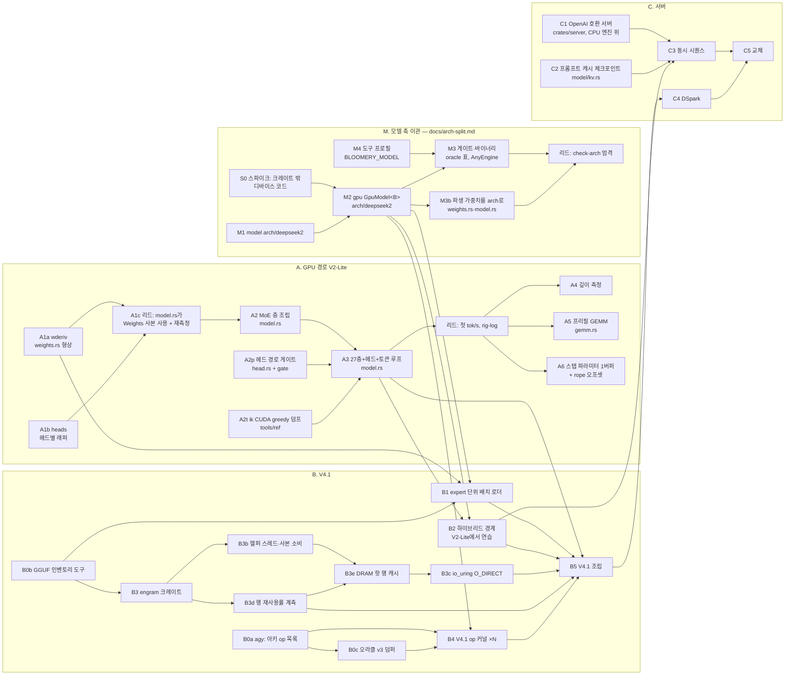

# bloomery — 계획

이 문서는 계획이고, 숫자는 [rig-log](https://github.com/midagedev/rig-log)에 측정된 뒤에만 여기 옮겨 적는다. 통과 기준은 전부 측정으로 쓴다.

이 문서는 계획·현재 상태·라운드 운영을 갖는다. `HANDOFF.md`와 `docs/orchestration.md`는 2026-09-22에 여기로 병합됐고, 두 파일의 마지막 판은 커밋 `5ce25f4`에 있다(`git show 5ce25f4:HANDOFF.md`). 새 세션은 `AGENTS.md`(규칙 정본) → 이 문서의 "지금"까지 읽으면 일을 시작할 수 있다. **끝난 것은 [`plan-ledger.md`](plan-ledger.md)(장부)에 있다** — 닫힌 라운드 카드, 지난 파동과 인계, 로드맵 A의 행별 기록, 라운드 이력을 2026-09-23에 원문 그대로 옮겼다. 옮기기 전 판은 `git show 8707bf1:docs/plan.md`다.

## 지금

**2026-09-23 새벽(사용자 "적극적으로 병렬 오케스트레이션, 자율 진행")** — main `8707bf1`, origin보다 23커밋 앞(푸시는 사용자 승인).

- **툴체인이 CUDA 13.3이 됐다(리드, 박스)**: 13.3.1 툴킷을 13.0 옆에 설치했다(apt 신규 63·업그레이드 0·제거 0, 드라이버 615.71.09 그대로 — 이미 UMD 13.4). `~/bloomery-env.sh`의 `PATH`·`CUDA_TOOLKIT_PATH`를 13.3으로(원본 `~/bloomery-env.sh.cuda130`). **커널은 안 바뀐다**: cuda-oxide 커널은 PTX로 실려 드라이버가 JIT하고, 13.3으로 지은 `.oxart`가 세 바이너리 모두 md5 `61edb10b…`로 13.0과 같다. 툴킷이 닿는 곳은 bindgen 드라이버 바인딩뿐이다(13.3에서 `cuGraphNodeGetParams`·`cuLaunchHostFunc_v2`·`cuDevSmResourceSplit` 등이 늘었다). 13.3 환경에서 GPU 게이트 16개의 판정 줄 416줄이 main 기준과 같고, `forced_exact` 40/41·σ 0.3641/0.3518·648노드·eager = replay도 같다. **ik는 13.0 그대로다**: `/usr/local/cuda` 대안을 13.0에 수동 고정했다(ik의 CMake `nvcc`와 `ldconfig`가 그 경로를 따른다). `llama-bench`는 RUNPATH로 13.0의 cudart·cuBLAS를 문다. **바뀐 계기 하나**: PATH의 `ncu`/`nsys`가 2026.2.1/2026.1.3이 됐다 — 다음 프로파일 표는 새 계기로 도니 첫 표를 한 번 교차 확인한다. cutile-rs(sm_8x에 13.2 이상)의 전제가 섰다(MUL-6).
- **비행 중(파동 8′)**: `m3` ‖ `m3b` ‖ `b3e` ‖ `b0c`(오라클 v3 도구 — 덤퍼의 BF16·I64와 정수 무손실 사본, deepseek41 프로필; V4.1 실행은 리드가 추정을 보고 정한다) ‖ `cudares`(13.1~13.3에서 새로 생긴 것 중 sm_86에 닿는 것 조사). 아래 「파동」 참조.
- **리드 몫**: 세 라운드 검수·머지 → `check-arch` 엄격 전환(`weights.rs`의 `strip_prefix("blk.")`는 모든 아키텍처가 공유하는 접두 파싱이라 검사 ②의 정밀 수정 몫) → B3b 헬퍼 팔과 B3e 캐시 팔 임대 측정 → rig-log. CUDA 전환 기록도 rig-log에.
- **사용자 판단 대기**: bloomery main 푸시, B0c 오라클 v3 덤프(RAM 250 GB·두 카드, 30분 초과), ik를 13.3으로 다시 빌드할지(빌드하면 ik 기준선을 다시 재야 한다).
- **열린 결정 후보**: 스칼라 세그먼트 패스(와 그것만 재는 keyaxis 계기 8개)를 지울지 — 「성능이 먼저」는 엔진이 경로 하나만 싣는다고 했다.
- 지난 인계와 파동 기록은 장부 「「지금」에서 옮긴 것」에 있고, 열린 트리아지 원문은 「대기열 / GPU 선 트리아지」에 있다.

### GPU 선

**2026-09-22 저녁부터 기본 flash 패스는 MMA다**(`294d907`). ~~아래 스코어보드와 깊이 표는 전부 스칼라 패스로 잰 것이고, 다음 A6000 표부터는 MMA로 잰다~~ **잤다(2026-09-22 밤, A6000 한 임대·팔 여섯 번갈아·세 바퀴·n=96, 리드 측정)**:

| 깊이 | 우리(MMA 기본) | 산포 | ik | 산포 | 비 |
|---|---|---|---|---|---|
| 6 | **229.54** tok/s | 1.13 % | 205.47 | 2.54 % | **1.117배** |
| 1024 | **222.24** | 1.06 % | 193.96 | 1.85 % | **1.146배** |
| 4096 | **199.62** | 0.57 % | 179.00 | 0.53 % | **1.115배** |

**깊이 4096의 역전이 사라졌다** — 세 깊이 전부 ik보다 빠르다. 키당 기울기는 파생으로 우리 0.160 µs(6→4096; 구간 0.141·0.166), ik 0.176(0.282·0.140) — 「모델」 `c_key` 행에 **유도로** 적어 둔 0.160 µs와 측정이 맞는다. 카드와 패스가 둘 다 바뀌었으므로 옛 3090 표와 나란히 놓지 않는다: 패스에 대한 귀속은 a4e의 같은 카드 A/B(d4096 6.511 → 5.048 ms, −22.5 %)가 하고, 이 표는 새 기본값의 절대 위치다. 기록 rig-log [09-22-o](https://github.com/midagedev/rig-log/blob/main/log/2026-09-22-o-the-depth-table-on-the-new-default-and-the-reversal-is-gone.md). 옛 스코어보드와 깊이 표(**스칼라 패스·3090**, 계열 비교용)는 장부 「GPU 선 이력」에 있다.

### CPU 선

- **커널**: Q3_K×q8_K, Q4_K/Q5_0/Q5_1/Q6_K×q8_2_x4 전부 융합(crates/qdot). MUL-38 q_nope2 Q8_0×Q8_0(vpsignb 부호접기 maddubs, 비트 동일). MUL-36 flash SIMD(kq_dot 8레인 합순서 + V j축; 폴백 레버 `BLOOMERY_FLASH_SIMD=0`). MUL-37 직렬 activation quant 풀 이양 + moe gate/up 이중양자화 제거(ptr::eq). 커널률은 ik의 95–99%(Q3_K만 ik 대조 미측정).
- **디스패치 경로가 느리면 첫 질문은 스레드 스윕이다**(`SWEEP="8 16 24 32" just measure-decode`): 곡선이 평평하면 일이 아니라 기다림. 프로파일이 꺼진 청크는 락을 잡지 않는다(AGENTS.md).
- **게이트**: 14개 just 레시피(gate-ops/attn/ffn/moe/head/forward/kv/derived/mt/profile/threads/qdot/prompts/1-1). 머지 후에는 영향 게이트 + mt/forward/prompts 재실행이 관례.
- **핀 상태**: prompts KNOWN_DIVERGENCE = ~~**{24}**(MUL-36 재핀, A/B 입증됨 — 이전 {14})~~ **{}**(2026-09-21 밤 `qdot::swiglu` 재핀, `crates/model/tests/prompts.rs` — 24는 0.151 근타이의 제비가 ik 쪽으로 떨어진 것). forward L_OUT_BANDS = (0,3e-3)(3,2e-3)(24,7e-2) + 날짜 주석. gate-mt는 재핀 불허 항목(스레드 무관 비트 동일).
- **스코어보드(2026-09-20 저녁, 같은 임대)**: N=96 **61.48 tok/s** 대 ik 82.88 → **잔여 1.35배**(아침 39.71/2.10배). 경위는 rig-log -j: 청크 끝의 무조건 수집 Mutex 제거(+44%) → 메인 스레드 고정 → mmap 프리폴트(+3.5%; 프리필 +18%는 6토큰 프롬프트 기준). → rintf libm 호출 제거(+8.3%, 2b2fdb6).
- **남은 산수**: 레벨2 dot 합/32 = 8.5 ms/step(완전 병렬 내적), ik 스텝 전체 12.1 ms, 우리 16.3 ms → 비내적 7.8 ms를 3.6 아래로. perf상 임계 경로는 메인 스레드 하나(워커는 표본의 51%를 스핀으로 대기): rintf 10% · memset 6.6% · expf 3.2% · 자기 청크+장벽 18%.
- ~~**스테이지 표(N=96, 레벨1, 24.18 ms/step)**~~ (락 아래서 잰 표 — 새 표는 rig-log -j): batch Q3_K 24.1% · Q3_K 단일 18.4% · batch Q5_0 14.9% · Q4_K 13.5% · Q6_K(lm_head) 5.3% · q_nope2 5.1% · swiglu+F32+접착부 ~10% · **flash 0.40ms(1.6%)**. 전체 54.8 GB/s = STREAM의 37%.
- 주의: 레벨2 quant 열은 MUL-37 이후 워커 CPU합(벽시간 아님).

세션별 스코어보드(밤 → 아침 4)는 장부(`plan-ledger.md`)에 있다. 가장 최근 값은 그 목록의 첫 항목이다.

### 어디에 무엇이 있는가

| 위치 | 내용 |
|---|---|
| `~/repo/bloomery` (이 리포) | 엔진 본체. AGENTS.md = 규칙 정본. docs/research/ = 조사 문서(CPU 조사 종합표는 `cpu-llm-ideas.md`, 패킹이 1순위), docs/RESULTS-*.md = 라운드 산출, docs/plan.md = 단계 계획 |
| `~/repo/rig-log` | 측정 기록(한국어 산문). 임대·증인 있는 숫자만. README 로그 표가 전체 인덱스. ~~최근: 2026-09-20-a…-h~~ 최근: 2026-09-22-a…-e. 증상으로 먼저 찾는다 — `tools/recall.sh '<키워드>'` |
| gadak 트래커 | `GADAK_HOME=$HOME/.gadak gadak --workspace gdk`, 프로젝트 MUL. Done: MUL-1…38 전부 종결(코멘트에 판정). 미완: MUL-30(GPU — ~~착수 대기~~ **진행 중**: A3 종료, A4 측정 완료, A4b 비행 중), MUL-6(CUDA 13.3 툴킷 — cutile-rs 스파이크의 전제) |
| 박스 | 접근은 오직 `./tools/box.sh '<cmd>'`(rsync 단방향 → 박스 편집 금지). 원격: /root/repo/bloomery, 데이터: /root/bloomery-data, 임대 락: /root/bloomery-cpu.lock. GPU: 기본은 3090. ~~**A6000(idx 1) 금지**~~ **정정(사용자, 2026-09-21)**: A6000도 개발에 쓸 수 있다 — `BLOOMERY_CARD=a6000\|both`로만 가고, `llm.service`가 살아 있거나 컴퓨트 프로세스가 있으면 rc 75로 거부된다. ~~**시간 숫자는 3090에만**(기준선이 거기서 나왔다)~~ **정정(2026-09-22 저녁)**: 3090 낙하 두 번 뒤로 **시간 숫자는 A6000에서** 잰다. 3090은 게이트·빌드 카드(300 W 캡) |
| 세션 메모리 | ~~`~/.zcode/cli/memories/projects/rig-log-*/memory/`~~ `~/.claude/projects/-Users-hckim-repo-rig-log/memory/`(`MEMORY.md`가 색인) — 이 워크스테이션의 세션에만 유효하고, 규칙이 아니라 **사건 원본**만 산다. 새 곳에서는 이 파일이 대체 |

## 모델 — 먼저 유도하고, 측정은 유도가 빗나갈 때만 (2026-09-22)

여기까지의 라운드는 대부분 "만들고 재 본다"였다. 그런데 닫힌 라운드를 되짚어 보면 결과의 상당수가 이미 가진 상수로
미리 계산되는 것이었다. 그래서 규칙을 바꾼다. **라운드는 예측을 들고 연다.** 측정은 예측이 밴드를 벗어났는지 보는 두 번째
행위이고, 벗어나면 그때 모델의 어느 항이 틀렸는지가 그 라운드의 발견이다.

### 비용 모델 (디코드 스텝)

`step_ms ≈ Σ_k max(bytes_k / BW, instr_k / issue) + N_node · c_node + N_barrier · c_barrier + depth · c_key`

| 상수 | 값 | 교정한 측정 | 카드 |
|---|---|---|---|
| `c_node` | 0.80 µs | A3d lfold, 독립 계기 둘이 4% 안 | 3090 |
| `c_barrier` | 0.72 µs + 협동 런치 0.20 | A3g fmerge | 3090 |
| `BW` | ~700 GB/s. 이 근처의 커널은 발행 바운드가 아니다 | A3f q4kdec: 명령 37% 감소, 스텝 +0.38% | 3090 |
| `c_key` | 우리 0.46 µs, ik 0.16 µs (캐시된 키 하나당) | A4 depth | 3090 |
| `c_key` (기본 MMA 패스) | 우리 0.160 µs, 스칼라 패스 0.526, ik 0.160 — **파생, 재교정 전**: 09-22-j 3바퀴의 깊이 6과 4096 스텝 차를 4090키로 나눴다(MMA 4.395→5.048, 스칼라 4.360→6.511, ik 4.929→5.582 ms; ctx는 512·4192라 죽은 세그먼트 런치가 들어 있다). 위 3090 행은 스칼라 패스의 것이다. **재교정됨(2026-09-22 밤)**: 새 기본값의 깊이 표에서 우리 0.160 µs(구간 0.141·0.166), ik 0.176(0.282·0.140) — 유도값과 측정이 맞았고, ik 쪽만 0.160 → 0.176으로 올린다(그 유도는 09-22-j의 두 점에서 나왔고 이번 것은 세 점이다) | A4e 3바퀴(파생) → 09-22-o 깊이 표(측정) | A6000 |
| 잡음 | 3바퀴 기준 ±1% | A6 잔여 | A6000 |

시간 카드가 A6000으로 옮겨졌으므로 3090 상수는 **한 번씩만 A6000에서 다시 교정**한다. 교정은 상수마다 측정 하나다.
그 다음부터 라운드마다 재는 일은 없다.

점유율은 측정할 값이 아니라 계산할 값이다. 입력은 블록당 레지스터·smem·스레드(ptxas `-v`)와 SM 수이고, 스펙이 이 숫자를
먼저 적는다.

### 변경 클래스와 증명 방식

| 클래스 | 증명 | 런타임 게이트 | A/B |
|---|---|---|---|
| 이동·분할·이름 바꾸기 (의미 보존) | PTX 표 동일(커널만 증명한다). 호스트 디스패치 코드면 구조 줄도 불변이어야 한다 — 그래프 노드 수, eager = replay, e2e 집합 동일 | 그 구조 줄뿐 | 없음 |
| 정수 경로 재배열 | 결합법칙이 성립하므로 비트 동일, 게이트 하나 | 해당 게이트 1회 | 없음 |
| 런치 수만 바뀜 | Δt = ΔN · `c_node`로 예측 | 해당 게이트 | 점유율도 바뀔 때만 1회 |
| ~700 GB/s 근처 커널의 명령 수 | 모델상 이득 0. **라운드를 열지 않는다** | — | — |
| 점유율·기하 | 계산한 점유율을 스펙에 적는다 | 해당 게이트 | 예측 확인 1회 |
| 부동소수점 합산 순서·정밀도 | 아래 오차 모델 | e2e | 예측 확인 1회 |

측정으로만 답하는 잔여 클래스도 이름을 붙여 둔다. 하드웨어 고장(Xid 79), 컴파일러 레지스터 할당, 캐시 이상(깊이 1024에서
ctx를 키웠더니 오히려 0.9% 빨라진 것처럼 기제가 안 잡힌 것)이다. 이 클래스는 측정이 먼저다.

컴파일 시점에 결정되는 것(노드 수, 런치 수, 커널별 명령·레지스터 수)은 `ptx-scan` 류의 래칫으로 잡고, 런타임에서 다시 재지 않는다.

### 되짚기 — 모델이 미리 말했을 것

| 라운드 | 모델이 말했을 것 | 실측 |
|---|---|---|
| A3f f16 레버 | ~700 GB/s에서 발행 바운드가 아니므로 이득 0 | 명령 −37%, 스텝 +0.38% |
| A4d MMA | 격자 18블록 < SM 84개. 도는 SM에서 점유율은 4워프/48 = 8.3%, 66개 SM은 유휴 | 달성 점유율 8.3%, 모든 깊이에서 느림 |
| A4e | 512스레드에 K 타일 56 KB면 SM당 블록 수가 정해지고, 점유율은 그 산수로 나온다 | 33% (MIO가 다음 벽. 이것은 측정만으로 알았다) |

맞은 줄의 클래스는 증명된 것으로 보고, 빗나간 줄이 측정이 필요한 자리다. 표는 새 라운드가 닫힐 때마다 한 줄씩 늘린다.

### 성능이 먼저, 정확도는 선택 (사용자 결정, 2026-09-22)

빠른 쪽과 정확한 쪽이 갈리면 기본값은 빠른 쪽이고, 엔진에는 그 경로 하나만 둔다. 더 정확한 변형은 엔진의 두 번째 경로가
아니라 검증 쪽에 둔다 — f64 심판 `exact_ref --act f64|ours|ik|ik16`이 반올림 규칙마다 시뮬레이션한다. 버그 판정은 엔진을
자기 규칙의 시뮬(`--act ours`)과 대조한다: σ를 넘게 어긋나는 위치는 버그 후보, σ 안은 반올림이다. σ와 forced_exact 버킷은 기본값이 참값에서 얼마나 떨어져 있는지 알려 주는
진단이지, 성능 변경을 막는 핀이 아니다. 정확도 핀은 버그를 잡는 것만 남긴다(forced_exact 개수 핀 ≤ 6, 참조 게이트).

계기는 errsrc였다. 원인은 활성값 양자화 블록 크기였다 — K-quant 입력을 128값 블록 대신 32값 블록으로 자르면 f64 시뮬에서
불일치가 41 → 25, σ 0.378 → 0.255로 ik CUDA(25, 0.271)와 같아진다(1023위치, `docs/research/errsrc/sim/judge-ours-ik.out`).
그 값은 활성 스케일 4배, 비트 게이트 전부의 재핀, CPU와 GPU 규칙의 분리다. 기본값은 128 그대로다. GPU에 선택 스위치로
32값 경로를 두는 안도 검토했다가 버렸다 — 두 번째 경로는 썩지 않게 할 게이트가 따로 필요하고, 검증은 시뮬로 충분하다.
32값은 `exact_ref --act ik`로만 존재한다.

### 오차 모델 (진단)

지금 e2e 핀은 이산 개수다(마진 ≥ 0.5인 불일치 수 ≤ 6). 표본이 작아서 6과 7 사이는 동전 던지기에 가깝다. MMA 레버가 핀
경계 6에 정확히 걸린 것이 그 예다. `exact-forced-32.tsv`가 1023위치 **전부**의 참 마진을 갖고 있으므로 연속량 σ를 진단으로
함께 찍는다(핀은 아니다 — 위 절). `gate-gpu-e2e`의 `forced_sigma` 줄이고, `--margins PATH`가 위치별 마진을 파일로 남긴다.
첫 실측(main c5b2b22, 스칼라 팔, 3090): σ 0.3518, 편향 −0.0206, 마진 ≥ 0.5에서 기대 3.58 대 실제 4. MMA 팔은 σ 0.3641,
기대 4.12 대 실제 6. 우리 규칙 시뮬(0.378)과 같은 자리다.

1. 팔마다 σ 하나를 잰다. 전 위치에서 (우리 마진 − 참 마진)의 RMS이고, 실행 한 번으로 나온다.
2. 기대 불일치 수는 Σ_i Φ(−m_i / σ)이다(m_i는 참 마진). 핀은 이 값의 분포에서 유도한다. 스칼라 변형을 여러 번 돌려
   산포를 표집할 필요가 없어진다.
3. 먼저 확인할 것: 마진 ≥ 0.5 불일치 4곳(8/2, 18/31, 21/24, 29/27)이 매끄러운 오차인지, 라우터 전문가 선택이 뒤집힌
   불연속인지. 불연속이면 σ는 라우터 마진에 대해 잡아야 한다. **불연속 쪽 증거가 하나 있다**(2026-09-22 저녁): 위치별 차의 꼬리가
   어느 쌍에서나 가우시안보다 훨씬 두껍다. RMS의 4배를 넘는 위치가 가우시안 기대 0.1개인데, 활성 반올림만 다른 시뮬 대 참값도 11개다
   (`docs/research/errsrc/engine/cmp-mma-scalar.out`). 라우터 뒤집힘을 직접 본 것은 아니다.

팔 비교(스칼라 대 MMA)는 σ 두 개의 비교가 된다. 개수 비교보다 검정력이 훨씬 크다.

### 단위는 조건을 달고 다닌다

모든 숫자는 `tok/s @ n=N, 깊이 D, 카드` 형태로 적는다. 조건이 없으면 숫자가 아니다. 중간 비들을 잃은 사건(n=32 대 n=96)은
단위 오류였다.

**새 환경 체크리스트**: ① 두 리포 클론(bloomery, rig-log — 둘 다 GitHub에 푸시돼 있음) ② 박스 SSH 설정 + `tools/box.sh` 동작 확인 ③ gadak 설치/설정(또는 이슈 상태는 이 문서의 「대기열」로 대체 가능) ④ 맥에서 게이트 금지(arm64) — 모든 게이트는 box.sh 경유.

## 목표

DeepSeek-V4.1-Flash를 이 워크스테이션(RTX A6000 48 GB + RTX 3090 24 GB, 둘 다 sm_86, Threadripper 5975WX 32코어, 256 GB)에서 우리 엔진으로 서빙한다. 호스트는 Rust, GPU 커널은 CUDA Rust(지금은 cuda-oxide, 툴킷 13.3 라운드 뒤 cutile-rs), CPU expert 티어는 Rust SIMD. 기준선은 같은 자리에서 잰 것이다. ~~ik_llama.cpp: 서빙 프로파일 PPL 2.2355, 디코드 25.05 tok/s(2026-09-16).~~ **선 그음 2026-09-19 — 그 한 줄이 엔진 둘을 합쳐 놨다.** PPL 2.2355는 **ik 포트**(ik_llama.cpp #2455)가 plain Q3_K_M 324 GB에서 낸 값이고, 디코드 25.05 tok/s는 **mainline 포크**(vcruz305/llama.cpp — `iqk` 디렉터리가 없다)가 grafted 445 GB 파일에서 낸 값이다. 이 박스의 V4.1 서빙은 처음부터 mainline이었다(rig-log `log/2026-09-12-deepseek-v41-first-run.md`가 "mainline llama.cpp지 ik 아님"이라고 적어 뒀고, 여기 옮겨 적으면서 틀렸다). `llm.service`가 띄우는 것은 또 다른 구성이다 — ik + DeepSeek-V4-Flash-**0731** Q4_K_XL 155 GB, 포트 8000.

같은 배치에서 둘을 나란히 잰 표가 #2455 본문에 있다: PPL 2.2355(ik) 대 2.2556(mainline), 디코드 20.4–20.7(ik) 대 21.2(mainline). **두 엔진이 3 % 안에 있다.** 이것이 이 프로젝트에 주는 것은 둘이다 — (1) 넘어야 할 선은 사실상 하나다, (2) ik의 존재 이유인 `iqk_mul_mat`이 이 배치의 호스트 expert 항에서 값을 못 받고 있다. 아주 다른 두 CPU 커널이 3 % 안에 떨어진다는 것은 그 항이 커널이 아니라 **대역폭**에 묶여 있다는 방증이고, `docs/roofline.md`가 그렇게 예측했다.

왜 직접 만드는가: 이 박스가 실제로 서빙하는 모델은 mistral.rs가 로드하지 못하고, ik의 MoE 디코드는 배치를 못 하며, 어느 쪽이든 고치려면 업스트림 머지를 기다려야 한다(2026-09-19 기준 mistral.rs는 09-08 이후 정지, 외부 PR 40건 대기). 발견은 계속 업스트림에 코멘트로 보내되, 엔진은 머지에 의존하지 않는다.

## 디딤돌

V4.1 Flash는 engram 테이블 NVMe 지연 읽기, 공유 압축 KV, 지연 하이퍼커넥션, 저랭크 query norm, CPU expert 티어, DSpark 드래프트를 한꺼번에 요구한다. 먼저 **DeepSeek-V2-Lite-Chat Q3_K_M**(8.1 GB, `deepseek2`, MLA, MoE 64 expert, 3090에 들어감)으로 로더·MLA·MoE·게이트를 세우고, V4.1 고유 부분은 ik 포트(ik_llama.cpp #2455)를 참조로 얹는다.

## 단계

| 단계 | 만드는 것 | 통과 기준 |
|---|---|---|
| 0 | cuda-oxide로 쓴 Q3_K gemv를 같은 텐서의 ggml `mmvq`와 대조 (MUL-1, rig-log WKS-35) | ~~최대 상대 오차 ≤ 1e-4~~ f32 활성값이면 1e-4, q8_1 활성값이면 1e-2(설계를 명시) — 2026-09-19 선 그음: 2라운드가 ggml처럼 q8_1로 갔고 오차 4e-3은 그 설계의 것이다. 대역폭 `stack` M=1에서 ggml의 0.9배 이상. **통과 2026-09-19: 1.05배**(348 대 333 GB/s, 3090). M=8 0.83배는 MUL-8, Q4_K·Q6_K·A6000 행은 MUL-9 |
| 1 | V2-Lite 순전파. 세로로 다섯 라운드, 각 라운드가 끝에서 끝까지 도는 것 하나를 내고 자기 게이트를 가진다(장부 「1단계를 세로로 자른다」) | 고정 프롬프트에서 ik greedy와 토큰 동일, wikitext-2 PPL이 ik 오차 안 |
| 2 | 호스트 expert 티어: 일부 층 expert를 CPU에, 양자화 상태 sparse gemv를 코어 전체에. 커널은 이미 있다(MUL-3, ggml의 1.1배) — 남은 것은 호출자다 | 층·토큰당 비용을 같은 런의 ik와 대조(참조 급: Qwen3.6에서 ik 0.20 ms), batch 2가 batch 1보다 느리지 않음 |
| 3 | V4.1 아키: engram mmap + WILLNEED 프리페치, 하이퍼커넥션, 공유 KV, query norm | PPL 2.2355 행 패리티, 같은 배치에서 25.05 tok/s 대비 |
| 4 | DSpark 드래프트 + 스케줄러, 빠른/느린 모델 라우팅(결정은 로컬·1 ms 아래, 출력이 바뀌므로 φ 측정으로 먼저 판정 — `research/jev-routing.md`) | 수락률·tok/s가 ik 서빙 프로파일 이상 |

## 로드맵 (2026-09-21 재정리 — 순서: GPU 경로 → V4.1 배치·engram·NVMe → 서버)

위 표의 2~4단계는 2026-09-19의 서술이고 그대로 둔다. 그 뒤 이틀의 실측이 순서와 경계를 바꿨으므로
여기 다시 적는다. 각 국면의 끝은 숫자 하나다 — 그 숫자가 rig-log에 실리기 전에는 다음 국면을 열지 않는다.
사용자 결정(2026-09-21): **GPU 경로를 끝내고, engram과 NVMe 오프로딩을 하고, 그 다음 서버.**
라운드 단위의 운영(파일 경계·병렬·순차·파동)은 아래 "라운드 운영" 절에.

### A. GPU 경로 — V2-Lite 전체를 3090에서 (닫힘)

A 국면은 닫혔다. 끝 숫자는 위 「지금 / GPU 선」의 A6000 깊이 표(MMA 기본값)이고, 행별 기록(A1~A4)은 장부 「로드맵 A」에 있다. 남은 A5(프리필)는 「열린 라운드 카드」에 있다.

A3이 국면의 끝이다. A4·A5는 B로 넘어가기 전에 **재기만** 하고, 손대는 것은 B의 배치 결정이 나온 뒤.
근거: V4.1에서는 dense 7.66 GB/토큰이 전부 VRAM에 있고(roofline) 그 항이 GPU 시간의 대부분이므로, V2-Lite에서
얻은 GPU 스텝 효율이 그대로 V4.1의 GPU 항이다.

### B. V4.1-Flash를 이 기계에 — 배치, CPU expert 티어, engram, NVMe

바이트가 말하는 것(roofline, 2026-09-16 서빙 배치 기준): 토큰당 11.7 GB 중 dense 7.66 GB는 VRAM, 라우팅 expert
4.04 GB 중 3.34 GB가 DDR4(33블록), 0.71 GB가 VRAM(7블록); engram 194.9 GiB는 **토큰당 48행(12.75 KiB)**만 읽는다.
가중치 249 GiB(444 − 195)는 RAM 256 + VRAM 72에 들어가므로 **expert의 NVMe 오프로딩은 이 양자화에서는 필요 없다**;
NVMe에 두는 것은 engram 하나다. 더 큰 양자화(Q4)를 올리려면 그때 expert 일부가 NVMe로 가고, 그것은 별도 측정 뒤의
선택이다.

| 행 | 만드는 것 | 끝의 숫자 |
|---|---|---|
| B0 | 선행: V4.1 아키 독해 — ik 포트(#2455)를 참조로 하이퍼커넥션·공유 압축 KV·저랭크 query norm·engram 조회 경로를 op 목록으로; ik에서 V4.1 중간 텐서 덤프(오라클 v3) | 덤프 세트 + op 인벤토리(문서) |
| B1 | 로더: 텐서마다 (디바이스, dtype) 주소를 로드 시 배정(층 단위가 아니라 expert 단위 — mistral.rs가 못 하는 그것); GGUF 444 GiB의 mmap 창 | 로드 시간, 상주 바이트 표(어디에 몇 GB) |
| B2 | **CPU expert 티어**(옛 2단계): 라우팅 expert의 sparse gemv를 CPU 풀에 — 커널은 이미 ik의 95~99%; 남은 것은 GPU 스텝과의 경계(활성값 전송, 동기) | 층·토큰당 호스트 항 ms 대 roofline 하한(3.34 GB ÷ 147.7 GB/s = 22.6 ms); GPU↔호스트 왕복 µs; **GPU 유휴 비율** — 호스트 하한에 닿고도 GPU가 40% 노는 라운드가 초록으로 읽히면 안 된다(`research/hybrid-engines.md`의 R1: 공유 전문가를 호스트 다리와 겹친다) |
| B3 | **engram**: 테이블은 NVMe mmap, 토큰당 48행(12.75 KiB, 흩어진 272 B 읽기)을 `WILLNEED`/`io_uring` 선행 읽기로; ~~캐시 안 하는 것이 설계~~ 캐시 여부는 실 스트림의 행 재사용률(B3d)을 잰 뒤 결정(2026-09-22 조사 `research/nvme-read-techniques.md`) | 조회 지연 µs(p50/p99, 콜드·웜), **스텝 스레드에서의 몫**(벽시계가 아니라) |
| B4 | V4.1 고유 op 셋(B0 목록)을 GPU 커널로, 오라클 v3 대비 게이트 | 층 탭 표 밴드 안 |
| B5 | 조립 + 첫 V4.1 토큰 | **PPL 2.2355(ik) 패리티, tok/s 대 25.05(mainline, 2026-09-16)**·ik 20.4~20.7 |

B의 순서는 위험 큰 것부터다 — B0·B1이 없으면 나머지가 잘못된 형상 위에 선다. B2는 V2-Lite에서 미리 연습할 수 있다
(일부 층 expert를 CPU에 두는 하이브리드; A3 뒤, 경계 하나만 더하는 일).

### C. 서버 — `llm.service`를 대신한다

지금 그 자리는 ik + DeepSeek-V4-Flash-0731 Q4_K_XL(포트 8000, OpenAI 호환, tailnet 공개)이다. 우리 서버는 같은
자리에 같은 API로 서고, 바꿔 끼운 뒤 속도가 돌아왔는지 같은 러너로 확인하는 것이 끝이다.

| 행 | 만드는 것 | 끝의 숫자 |
|---|---|---|
| C1 | OpenAI 호환 HTTP(`/v1/chat/completions` 스트리밍, `/props`, 청크별 `timings` — toktape가 첫날부터 녹화) | toktape 한 클립 |
| C2 | **프롬프트 캐시 체크포인트**: 편집 한 번에 13k 프리픽스가 통째로 재프리필되던 것(rig-log 2026-09-17)을 메시지 경계 체크포인트로 | 재프리필 토큰 수, 편집 후 첫 토큰 지연 |
| C3 | 동시 시퀀스 — 호스트/GPU 2단 파이프라인(roofline: 처리량 1.67배 **도출**, 독립 시퀀스 ≥ 2일 때만) | 동시 2·4 스트림 합계 tok/s |
| C4 | DSpark 드래프트 + 검증 배치(옛 4단계; k* ≈ 2.2 실측이 검증 폭의 상한) | 수락률, 단일 스트림 tok/s |
| C5 | systemd 유닛·임대 협약~~(A6000 야간 학습과의 양보)~~(야간 학습은 2026-09-21에 끝났다 — 협약 상대는 우리 측정 라운드뿐)·교체 | 교체 전후 같은 러너의 tok/s |

## 라운드 운영

날짜 2026-09-21. 이 절은 위 로드맵을 **위임 라운드 단위**로 자른 것이다(2026-09-22 병합 전에는 `docs/orchestration.md`였다).
라운드 하나 = 워크트리 하나 = 파일 경계 하나 = 게이트 하나 = 완료 보고 하나. 리드는 스펙·diff 독해·게이트 재실행·
임대 측정·머지만 한다. 이 절의 크기 표기(S/M/L)는 추정이고 실측이 아니다 — 라운드가 끝날 때마다 실제 소요를 옆에 적는다.

### 원칙

**백엔드(2026-09-21 오후 개정)**: 새 위임은 opus 서브에이전트(Agent 도구, `model:"opus"`)다 — 카드의 "GLM"은 그렇게 읽는다. 돌던 GLM 라운드만 끝까지 둔다.
 (병렬성을 정하는 것은 파일 경계다)

1. **같은 파일을 두 라운드가 동시에 만지지 않는다.** `crates/gpu/src/model.rs`가 GPU 경로의 병목 파일이다 — 조립 라운드는
   전부 여기를 지나므로 **model.rs를 만지는 라운드는 한 시점에 하나**. 커널·게이트·도구·다른 크레이트는 자유롭게 병렬.
2. **오라클이 직렬을 팬아웃으로 바꾼다**(plan.md 1단계에서 실증). 조립 입력이 앞 라운드의 출력이라도, ik 덤프가 그 입력을
   파일로 갖고 있으면 병렬로 열 수 있다. 그래서 오라클 덤프 라운드(A·B 각각)가 다른 무엇보다 먼저다.
3. **리드가 직렬 지점이다**: diff 독해·게이트·임대 측정·머지. 임대는 한 번에 하나. 그래서 동시 비행은 **3~4 라운드**가 상한이고
   ~~(GLM 쿼터도 같은 상한을 준다 — 주간 창은 09-26 11:54 리셋), 그 이상은 조사(agy) 라운드로 채운다.~~
   **개정(2026-09-22)**: 위임이 opus라 쿼터가 상한을 주지 않는다. 상한을 정하는 것은 둘뿐이다 — 리드의 검수 대역과 **박스 임대 하나**.
   박스로 재는 라운드는 한 시점에 하나이고, 코드 읽기·문서 라운드는 그 옆에 몇이든 붙는다.
4. **조사는 코드보다 먼저 병렬로 간다.** ~~agy~~ 조사 라운드는 파일을 안 만지므로 언제나 병렬이고, 그 결론(B0)이 없으면 B의
   코드 라운드가 잘못된 형상 위에 선다. 지금 A를 돌리는 동안 B0를 돈다.
5. ~~**끝의 숫자가 없는 라운드는 열지 않는다.**~~ **예측이 없는 라운드는 열지 않는다**(2026-09-22 개정). 스펙은 「모델」 절에서 유도한 값과 밴드, 그리고 변경 클래스에 따른 증명 방식을 적는다. 측정은 예측을 확인하는 행위이고, 이동 전용 클래스는 PTX 표 동일로 끝난다.
6. **원인이 측정되지 않은 느림에는 구현 라운드를 열지 않는다**(2026-09-22 신설). 먼저 원인 축소를 병렬로 셋 — 우리 쪽 **배가 프로브**
   (그 일을 두 번 시켜 늘어난 만큼이 그 일의 값), **참조 독해**, 그리고 **커널 카운터**(`tools/ref/ncu-gpu.sh`). 구현 스펙은 셋이 같은
   단계를 가리킨 뒤에 쓴다. 첫 사례가 A4b다. 근거는 사고다 — 참조를 안 읽고 세운 가설 셋이 한나절을 먹은 적이 있다.
7. **계기를 한 번 의심한다**(2026-09-22 신설). 새 계기의 첫 표는 값이 아니라 **그 계기가 무엇을 잡았는지의 증거**와 함께 읽는다.
   실측: ncu 첫 실행이 깊이 4096에서 `flash_latent_seg` 10.8 µs를 냈는데 깊이 6의 9.15 µs와 거의 같았다 — `--launch-count`가
   프롬프트 스텝(m=4096)의 첫 층들을 잡은 것이었다. ~~지금 러너는 스텝당 54런치를 건너뛰고 그리드 크기를 찍어 증명한다.~~
   정정(같은 날 저녁): 그 증명은 거짓이었다. `step(&prompt)`는 토큰마다 그래프를 한 번씩 재생하므로 54런치는 프롬프트 두 토큰이고,
   그리드는 캐시 높이에서 나와 깊이 0에서도 528이다. 그래서 "깊이 4096에서 flash 11.2 µs, 깊이 비용의 97%가 flash 밖"이라는 결론은
   깊이 2의 측정이었다 — 두 번째 표도 첫 표와 같은 이유로 틀렸다. 계기의 증거는 계기가 찍는 형상이 아니라 **그 계기와 독립인
   산술**(건너뛴 런치 = (프롬프트 길이 + 버릴 스텝) × 스텝당 런치)과 지표가 깊이를 따라 움직이는 것이다. 시간이 어느 커널에 가는가는
   ncu가 아니라 `tools/ref/nsys-gpu.sh`가 답한다(재생마다 한 번 나오는 커널로 스텝 경계를 긋고, 경계 수가 프롬프트 길이와 맞는지 스스로 확인한다).
   그 답(같은 날 저녁, 재생 621커널, 경계 9/9·4099/4099, 스텝 벽시계 3.90/5.89 ms = 기록과 일치): 깊이 8 → 4098에서 `flash_latent_seg`
   6.55 → **75.77 µs/층**, `flash_merge_q8` 2.54 → 8.98. 스텝 증가 1.98 ms 가운데 두 커널이 1.98 ms — **깊이 비용은 flash가 전부다.**
8. **박스를 쓰는 라운드 스펙에는 "카드가 떨어지면 즉시 멈춤"을 넣는다**(2026-09-22 신설). 재시도·재부팅·수정 없이 시각과 마지막
   출력만 보고한다. `Xid 79` 뒤의 재부팅은 사람이나 BMC를 요구한다(장부 「GPU 선 이력」).

### 의존 그래프



### 열린 라운드 카드

~~백엔드: **GLM** = glm-5.3 구현(`outsource-run.sh --effort max`), **agy** = 조사·보고 전용, **리드** = 이 세션.~~
**백엔드(2026-09-22)**: 표의 "GLM"·"agy"는 전부 **opus 서브에이전트**(Agent 도구, `model:"opus"` 명시)로 읽는다. **리드** = 이 세션.
크기: S 반나절 이하 / M 하루 / L 하루 넘음(쪼갤 후보).

#### A — GPU 경로

| id | 라운드 | 파일 경계 | 백엔드 | 게이트(끝의 숫자) | 앞 | 크기 |
|---|---|---|---|---|---|---|
| A2-2 | 스테이지 분할(2스테이지 = 1스테이지 비트 동일). A2-1은 머지됐고(`c9f5ace`) 전 층 조립은 e2e(`0294d4a`)가 한 그래프로 끝냈으므로, 남은 것은 **여러 스테이지로 나누는 것**뿐이다 — 카드는 두 카드에 걸칠 때 값을 받는다 | `gpu/model.rs` | opus | 2스테이지 = 1스테이지 비트 동일 | e2e | M |
| A5 | 프리필: m>1 활성값 다리 + IMMA GEMM 커널(m 16~512) | 새 `gpu/gemm.rs`, 새 `gate_gemm.rs`; 조립은 별도 라운드 | GLM(커널) → GLM(조립, model.rs) | 커널 밴드 + 프리필 tok/s | A3m; 커널 부분은 A2와 병렬 가능 | L |

#### M — 모델 축 이관(2026-09-22 밤 신설, 설계는 `docs/arch-split.md`)

전부 **이동 클래스**다: 증명은 `ptx-scan` 표 동일·648노드·eager = replay·e2e 집합 동일·게이트 초록·lint 불상승이고 시간은 재지 않는다.
파동 {S0 ‖ M1 ‖ M4} → {M2} → {M3}. 라운드마다 축 하나(R21).

| id | 라운드 | 파일 경계 | 백엔드 | 게이트 | 앞 | 크기 |
|---|---|---|---|---|---|---|
| M3 | 게이트·바이너리: `gpu-gates/src/oracle/deepseek2.rs`(디렉터리·매니페스트·탭 표), `DEFAULT_MODEL` → 도구 프로필, `generate`·`gate_e2e`·`bloomery-decode`가 `AnyEngine` 위에서, 모르는 아키텍처는 오류 한 줄 exit 1 | `gpu-gates/src/**`, `model/src/bin/bloomery-decode.rs` | opus | 게이트 15개 출력 줄 동일; FAIL-first: V4.1 파일을 `generate`에 준 지금의 죽는 모양 기록 → `unsupported architecture "deepseek41"` 한 줄 | M2, M4 | S |
| M3b | **공유 로더에서 MLA 파생 가중치를 뺀다**: `Weights::load`가 deepseek2의 `Derived::new`를 무조건 부르고(`weights.rs:154`) `derived.blk.L.q_nope2`를 공유 이름공간에 쓴다(`:208`). 파생은 아키텍처 계획의 일이다(`arch-split.md` 「무엇이 어디로」 파생 가중치 행) — `ChainBody::derive` 훅으로 `arch/deepseek2`가 만들고 이름도 거기서 짓는다. `check-arch` ②를 막는 두 줄 중 하나를 원인에서 닫는다 | `gpu/weights.rs`, `gpu/model.rs`, `gpu/arch/deepseek2/**`, `gate_p10`·`gate_head_gpu`·`gate_moe_fused` | opus | 이동 클래스: 세 게이트 출력 전체가 base와 동일, GPU 게이트 16개, 648노드·eager = replay, ptx-scan 동일, lint 불상승, `check-arch` 경고 2 → 1 | M2 | S~M — `model.rs` 라운드 |

#### B — V4.1

**2026-09-22 밤: B1·B2·B4·B5는 M2 뒤에 연다** — 넷이 지나는 `gpu/model.rs`·`gpu/weights.rs`·`dispatch.rs`·`model/derived.rs`를 이관이 먼저 지난다(`docs/arch-split.md`). B0c·B3은 그 파일을 안 만지므로 순서가 바뀌지 않는다.

| id | 라운드 | 파일 경계 | 백엔드 | 게이트 | 앞 | 크기 |
|---|---|---|---|---|---|---|
| B0c | 오라클 v3: ik에서 V4.1 중간 텐서 덤프(덤퍼 확장) — 실행은 RAM 250 GB·두 카드를 쓰므로 **llm.service 중단 + 임대** | ik 트리 덤퍼 패치, `tools/ref/dump-ref-v41.sh` | GLM(도구) → 리드(실행) | 덤프 세트 + MANIFEST | B0a | M |
| B1 | 배치 로더: 텐서마다 (디바이스, dtype) 주소를 로드 시 배정, expert 단위; 444 GiB mmap 창; 상주 표 인쇄 | `gpu/weights.rs`, `crates/model` 로더, 새 `gate_place.rs` | GLM | 배치 표가 설계와 일치, 상주 바이트 합 | A1a, B0b | M |
| B2 | 하이브리드 경계: 일부 층 expert를 CPU 풀에(V2-Lite로 연습), 활성값 왕복·동기 | `gpu/model.rs`, `crates/model/moe.rs` | GLM | 로짓 대 순GPU 밴드, 왕복 µs, 층 ms 대 하한, **GPU 유휴 비율**(겹침이 목표다 — 경계는 토큰의 1%, 직렬화가 40/60% 유휴; `research/hybrid-engines.md`), 합류 수단 결정(스트림 메모리 연산 대 호스트 노드 — 첫 확인은 드라이버 속성과 바인딩 유무) | A3 | M |
| B3e | **DRAM 핫 행 캐시**(B3d가 연 카드): 행 id → 272 B 사본의 LRU 하나를 두 사이트·24버킷이 공유한다. 용량은 예산 인자(4 GiB에서 토큰당 48 → 8.38/25.72행). 적중은 헬퍼가 아니라 스텝 스레드가 직접 복사하고(폴트 0), 미스만 B3b 헬퍼로 간다. 예측 먼저: 4 GiB·code에서 헬퍼가 옮기는 행이 ~~8.4배 줄고~~ 48 → 8.38행으로 **5.7배** 줄고(2026-09-23 정정: 행 수를 배수로 읽었다) `engram-rate`의 콜드 팔이 그 비로 내려간다. 단 이 코퍼스에서 4 GiB는 스트림 전체의 서로 다른 행(1.65 GiB)을 다 담으므로 남는 8.38행은 처음 보는 n-gram의 강제 미스다 — 콜드에서 시작하는 짧은 창은 그보다 많이 미스한다(`engram-reuse --limit N`으로 창마다 유도). **B3c보다 먼저** — `io_uring` 경로가 낼 값이 이 캐시 뒤에서 달라진다 | `crates/engram/**` | opus | `gate-engram` 초록 + 캐시 적중이 `engram-reuse`의 같은 용량 적중률과 일치(같은 스트림으로 대조), lint 불상승 | B3b, B3d | S~M |
| B3c | **`io_uring` `O_DIRECT` `READ_FIXED` `DEFER_TASKRUN\|SINGLE_ISSUER`**, 헬퍼 위, 48 × 8 KiB 정렬 고정 버퍼(행의 6.25 %가 4 KiB 경계를 넘는다 — 51.0 페이지/토큰), `enter` 한 번. 크레이트 `io-uring`(새 의존성 — 정당화: 6.8에 liburing 없음). 같은 라운드에 증인 교체(`majflt`·`read_bytes`는 `O_DIRECT`에서 눈을 감는다 → 링 완료 수 + `/sys/block/nvme0n1/stat` 델타 + `buff/cache` 델타)와 fio 512 B 대 4 KiB QD1 팔(러너에 넣는다). **예측**: 헬퍼 CPU 220 → 19–144 µs(출처 둘이 갈림), 페이지 캐시 증가 0. 하지 않는 것: `IORING_OP_MADVISE/FADVISE`(v6.8 `advise.c:42` 무조건 io-wq), `process_madvise`(`CAP_SYS_NICE`, 상한 40 µs), SQPOLL(유휴 깨움 ~30 µs), 패스스루(FIEMAP) | `crates/engram`, `tools/ref/engram-rate.sh` | opus | 임대 표 + 새 증인 | B3b | M — 하루 |
| B4 | V4.1 고유 op 커널 ×N — op마다 자기 파일·자기 모듈·자기 게이트(결정 6) | `gpu/<op>.rs` + `gate_<op>.rs` 각각 | GLM ×N 병렬 | 오라클 v3 밴드 | B0a, B0c | op당 S~M |
| B5 | V4.1 조립 + 첫 토큰 | `gpu/model.rs`, `crates/model` | GLM → 리드 | **PPL 2.2355 패리티, tok/s 대 25.05** | A3, B1~B4 | L |

#### C — 서버

| id | 라운드 | 파일 경계 | 백엔드 | 게이트 | 앞 | 크기 |
|---|---|---|---|---|---|---|
| C1 | OpenAI 호환 HTTP: `/v1/chat/completions` 스트리밍, `/props`, 청크별 `timings`; 엔진은 trait 뒤(CPU 엔진으로 먼저) | 새 `crates/server` | GLM | toktape 한 클립이 녹화됨, 통합 테스트 | — (CPU 엔진은 있다) | M |
| C2 | 프롬프트 캐시 체크포인트(메시지 경계) | `crates/model/kv.rs`, `forward.rs` | GLM | 편집 후 재프리필 토큰 수, 로짓 비트 동일 | — | M |
| C3 | 동시 시퀀스 스케줄러 + 호스트/GPU 2단 파이프라인 | `crates/server`, `crates/model` | GLM | 동시 2·4 스트림 합계 tok/s(도출 1.67배 대조) | C1, C2, B2 | L |
| C4 | DSpark 드래프트 + 검증 배치 | `crates/model`, `gpu/model.rs` | GLM | 수락률, 단일 스트림 tok/s | B5 | L |
| C5 | systemd 유닛·임대 협약·`llm.service` 교체 | `configs/`, rig-log | 리드 | 교체 전후 같은 러너 tok/s | C3, C4 | S |

### 파동 (동시 비행 3~4, 리드 직렬 지점 표시)

지난 파동 표(1~7′)와 `model.rs` 점유 순서의 옛 판은 장부 「파동 이력」에 있다. 지금 파동:

| 파동 | 병렬로 뜨는 것 | 리드가 그 사이 하는 것 | 파동을 닫는 조건 |
|---|---|---|---|
| **8′ (2026-09-23 새벽)** | `m3`(`gpu-gates`·`AnyEngine`·`DEFAULT_MODEL` → 프로필) ‖ `m3b`(`weights.rs`·`model.rs`·`arch/deepseek2`) ‖ `b3e`(`crates/engram`) ‖ `b0c`(`tools/ref` 덤퍼·프로필, 박스 쓰기는 `/root/bloomery-data-b0c`만) ‖ `cudares`(조사, 파일 무변경) — 전부 opus | CUDA 13.3 전환(끝남 — 「지금」), plan.md 분할, 세 머지 → `check-arch` 엄격 전환 → B3b·B3e 임대 측정 | 세 머지, `check-arch` 엄격 초록 |

`model.rs` 점유 순서(하나씩): `m3b` → A2-2 → B2 → A5 조립 → B5 → C4.

### 갱신 규칙

라운드가 끝나면 이 표의 크기 칸에 실제 소요(발사 → 머지)를 적고, 파동 표의 해당 칸에 머지 커밋을 적는다. 순서를 바꾸면
바꾼 이유를 그 줄에 날짜와 함께 남기고 옛 줄은 선을 긋는다.

## 법칙과 교훈 (근거는 rig-log -g와 lib.rs 주석)

- **디스패치당 바이트 법칙**(MUL-35): 사이트 달성 GB/s는 디스패치당 바이트의 단조 포화 함수(172MB→119, 16.8→75, 2–10MB→47–51, 0.5–1.1MB→13–23 GB/s). 커널 MT 상한 122.6–136.3 GB/s(qdot-rate-mt), 풀 디스패치 세금 4.65µs×322회=1.5ms/step(pool-rate) — 커널·풀 무죄, 범인은 얇은 패킹. 활용도 낮은 사이트(예: q_nope2 25%)에서 커널 가속은 ×활용도만 벽시간에 나온다(MUL-38 실증).
- **`#[target_feature]` 교훈**(MUL-26/27): 누락되면 에러 없이 수십 배 느려짐(0.6 GB/s 사례). 헬퍼 분리 자체도 10–13% 손해 — 단일 함수 선호. 분리 시 헬퍼에도 속성.
- **게이트 3중 패턴**(MUL-27+): 인코더/커널 vs 에뮬레이터(인트린식 그래프 흉내 — 손 레인 유도는 틀림), vs ik 자체 커널(하네스에서 bx=행 스트라이드). 정수 경로는 결합법칙으로 비트 동일 — 에뮬레이터 불필요(MUL-38).
- **재핀 규율**: 집합 변화는 되돌림 레버 한 실행으로 A/B 입증(flash는 BLOOMERY_FLASH_SIMD=0).
- **리뷰 판정(2026-09-20 저녁)**: qdot의 `_mm*` 헬퍼(`hsum_i32`·`field_dot`·`q5x_codes`·`hsum_float_8`)는 속성 없이 `#[inline(always)]`로 호출자의 기능을 물려받는 형태이고, 릴리스 바이너리에 독립 심볼이 없음을 `nm`으로 확인했다 — 위 교훈의 "헬퍼에도 속성"은 인라인이 보장되지 않는 헬퍼에 한한다. 전역 RUSTFLAGS가 없으므로 속성은 전부 하중을 받는다(AGENTS.md Known state).
- **사고 보강**(ef9e579): 게이트 타임아웃·box-gc·트랙 체크리스트. "조용한 에이전트는 상태가 아니라 증상" — 박스 `pgrep -fa '<원격 경로>'` 부터.
- **하드웨어 판단 기록**: 3995WX(Zen2 64C) 교체는 무이득~역행(같은 DDR4 평면, 코어당 0.65배). 플랫폼을 바꾼다면 대역폭(8채널 DDR5).

## 대기열

**2026-09-22**: 아래는 **CPU 선**의 대기열이고, 마지막 CPU 라운드는 09-21 아침 4(rig-log 09-21-e)다. GPU가 리드인 동안 여기서 멈춰 있으므로,
"다음"이라는 말은 전부 그 시점의 다음이다. GPU 선의 다음은 위 「라운드 운영 / 열린 라운드 카드」에 있다.

트래커가 정본이다: **MUL-39**(패킹, 설계 라운드부터) · MUL-40(gate·up 결합 GEMM) · MUL-41(전문가 블록 배치 GEMM) · MUL-42(워커 수 재스윕). 각 이슈에 지금까지 잰 값과 "무엇을 재면 끝나는가"가 있다. 아래는 그 요약.

**전제 변경(2026-09-20 저녁)**: 아래의 '디스패치당 바이트' 근거는 수집 Mutex가 있던 엔진에서 잰 것이다. 패킹의 새 근거는 디스패치 횟수(401/step)와 디스패치당 앞뒤 비용 11–60 µs, 그리고 메인 스레드의 직렬 구간이다. 순서: ① swiglu를 병렬 디스패치 안으로(MUL-40 에필로그) ② quant를 행 디스패치에 접기·shexp를 라우팅 배치에·같은 입력 q_a/kv_a 한 디스패치·스텝 내 할당 제거. 기각된 것: 폭 제한 디스패치, 동적 행 분배, malloc trim, 거버너, n-gram 추측(MUL-43).

~~ik 잔여 2.10배의 마지막 기제 = 스케줄링 구조~~(ggml식 텐서당 1노드·행-방향 연속 청크·노드별 장벽만으로 ik는 STREAM의 73%를 뽑음). 구체 후보(우선순위):
1. **gate·up 결합 GEMM + SiLU·mul 에필로그**(A×[B1,B2] 단일 GEMM) — swiglu 직렬 0.87ms + 디스패치 52→26 + batch Q3_K quant 잔여를 한 방에(Intel 실측 +12% 계열).
2. **MoE topk_ids 정렬 → 전문가별 블록 배치 GEMM**(게더의 GEMM 흡수, ZenDNN group_matmul 계열).
3. **텐서-1노드 연속 청크/디스패치 굵히기** — batch Q3_K 24.1%가 첫 표적. 잔여 상한 ~10ms/step(레벨2 유도).
설계 라운드로 시작할 것(청크 밸런스·같은-k 사이트 결합 — Q4_K의 53호출은 k 혼재 2,048/2,816). 게이트: 비트 불변이면 재핀 0(quant·패킹 이동), 산술 변화면 재핀+A/B.
**공짜 실험**: 워커 수 스윕(BLOOMERY_THREADS 8/16/24/32 — ZenDNN이 "128코어 단일 인스턴스 < 2×64 인스턴스"임을 공식 인정한 것과 같은 현상, 문헌상 20–30% 차이 사례).

이슈: MUL-43(스펙 디코딩 타당성 — n-gram 수용률 오프라인 계수가 먼저) · MUL-44(KV q8_0, 조건부) · MUL-30(GPU) · MUL-46(정리 라운드 — Done. 뼈대 분할이 들여온 swiglu 회귀는 d9626c4에서 닫음; 미결 잔여는 MUL-39에서 재측정: 디코드 swiglu 42.6 대 28.3 ms/32스텝, moe_trace·wv_b_heads·moe_expert_io +13 ms, 워커 파킹 64→590) · MUL-45(게이트 종료 코드 사고, 기록).

- **스펙 디코딩**(PARD식 k토큰 검증, 우리 추정 1.5–2.5×) — lm_head 대역폭 벽+고정비를 통째로 상각. 초안 모델 필요(후보: ~~자기 자신 Q3_K or~~ n-gram — 자기 자신은 드래프트 비용이 본체와 같아 성립하지 않는다; 수용률부터 센다, MUL-43).
- **GPU 단계**(MUL-30)의 기준선은 위 "지금 / GPU 선"에, 라운드 이력은 장부(`plan-ledger.md`) "GPU 단계"에 있다.
- 구조 부채(패킹 라운드 전에 볼 것): `ops.rs`의 `matmul_q_multi` 397줄, `moe.rs`의 `moe_ffn` 326줄 — 패킹은 바로 이 두 함수에 얹힌다. 양자화 사전 패스·PairWork 조립·행 워커를 나눠 두면 설계 라운드의 diff가 읽힌다. 비트 불변 리팩터이므로 mt/forward/prompts가 판정한다.
- 디코드 경로의 호출당 할당(리뷰 발견, 미측정): `wv_b_heads`가 스텝마다 헤드별 `Tensor2`·`TensorInfo`·`format!` 이름을 다시 짓고(호출당 ~35회), `MlaParams::read`가 스텝당 27번 메타데이터를 다시 읽는다. 레벨2 표에서 접착부 전체가 0.8ms/step(3%대)이라 상한은 작다 — 로드 시점으로 올리는 일은 패킹 라운드에 끼워서.
- Q5_0/Q5_1 커널 쌍과 flash 스칼라/AVX2 쌍은 의도된 쌍둥이다(헬퍼 분리 10–13% 손해 실측). 합치지 말고 TWIN 주석을 따라 양쪽을 같이 고친다. `tools/ref/*_ref.cpp`·`*_rate.cpp` 다섯 쌍의 복제는 하네스라 우선순위 낮음.
- 소형: KV q8_0(flash 이후 ctx 기울기), kq 부분합 4→8, 발산 {24} 원인(마진 0.151의 근타이 — 우선순위 낮음), THP 1회 A/B 노벨.
- ik 발전 감시: ik가 달라지면 오라클/참조 재생성(just build-ref-dump / argmax-ref).

### GPU 선 트리아지 (2026-09-22, 「지금」에서 옮긴 원문 — 트래커로 옮기기 전까지 여기가 원본)

- **다음 리팩터 후보**(트리아지 원본은 세션 스크래치였다 — 요지만): tools6(셸 기본값을 `ref-paths.sh`로), ~~gates-c~~ 머지. 그 라운드가 남긴 것 셋: **gates-c2**(같은 축의 잔여 — `real_x.rs` 461–485·594·631·683과 `rawx_floor.rs` 228의 손 검사, `gate_p6.rs` 98–111, `lib.rs::f32_tensor`의 타입 검사, 랭크 확인 없는 `dims[1]`/`dims[2]` 인덱싱 — `gate_p10.rs` 698·744, `exact_ref.rs` 74 `view()`, `gate_p4.rs` 131의 토큰 id 대 vocab, `generate.rs` 125의 CLI `panic!`), ~~**gates-d**~~ 머지(`6959482`). gates-d가 본 것: **`gate_p10`의 Q5 read-back은 독립이 아니다** — 머리글은 "로더 코드가 아닌 게이트 자신의 헬퍼로 포장한 사본"과 비교한다고 하지만 `pack_q5_0/1`은 로더(`weights.rs` 319·327)가 부르는 바로 그 함수라, 상주 Q5 텐서(census 기준 12.4 GB 중 약 7.6 GB)는 로더를 자기 자신과 대조한다. 포장 결함은 `gate_p2`·`gate_p9`의 수치 대조(역양자화 f64 참조)가 간접으로 잡는다. 처분 후보: 머리글 정정(XS) 또는 `gate_q8_planes`처럼 게이트 안에 Q5 포장을 따로 전사(M). 그 밖에 `kid_*` 꼬리 25줄 R14 코어(M), `run()` 360줄 단계별 분할 R12(M), `crates/gpu/src/q5.rs`의 `enqueue_*` 런처 allow 8곳 R8(M), 기계 라운드 몫(`lib.rs` `route_ref`의 `partial_cmp().expect()` → `total_cmp` R23, `manual_range_contains`·`is_multiple_of`·`chunks_exact` 잔여 R17). 탭 목록의 `unreachable!`은 내부 불변식이라 둔다(R10), gpucast(R5), 미해결 doc 링크 8건 + rustdoc 게이트, `model::probe`→`instrument` 개명, 커널 모듈 `pub` 52개 가시성, exact_ref 가중치 재역양자화 캐시.
- **이번 파동의 항목 6 트리아지(2026-09-22 밤)**. *지금 닫은 것*: `gate-gpu-p0`가 유일하게 게이트 락 없이 GPU 바이너리를 돌리고 있었다(`a9f4823` — 바로 위 주석이 적어 둔 그 충돌 사고의 락이다), 카드 UUID 둘의 주인을 `cards.sh`로(`3570abd`), 스텝이 더는 안 타는 경로를 "step path"라 부르던 doc 셋(`8f16310` — `q_nope2_absorbed`·`wv_b_heads_with`은 링커가 디코드 바이너리에서 지우고, `head.rs`의 밴드 근거는 Q6_K를 roundtrip으로 보낸다고 적고 있었다). *트래커행*: `box.sh:17`이 데이터 경로 기본값의 마지막 셸 사본(맥에서 돌아 트리를 소스할 수 없으니 `check-recipes.sh`가 두 값을 대조하는 쪽, S), LCG `prompt()` awk가 러너 넷에 복사(같은 수열이 계약인데 관례로만 있다, S), `IK_BEST_FLAGS` 3중복·토큰 수열 4중복(S), `bloomery-decode` 경로를 손으로 조립하는 세 곳(`depth-decode.sh`엔 `bin_of()`가 없다, XS), Rust가 모델·데이터 경로를 12곳 재기술(테스트 크레이트가 의존할 자리가 필요, M), `ops.rs`의 융합 판정 4중복 → `fused_cb(ty,k)`(S), qdot 지원 5타입 목록 4중복(S), `qdot/src/lib.rs:268`의 도달 불가 `_` 팔(XS), 테스트가 `model_path` 하나 때문에 `common/oracle.rs`를 통째로 끌어와 남은 dead-code 13줄 대부분을 만든다 → `common/model.rs` 분리(S), `oracle.rs`의 매니페스트 위치 인덱스 파싱(헤더 핀 없음, S), `gguf`의 `Q5_K`가 `activation_format`을 주장하는데 `dequant_row`는 거부(XS). *판단 대기*: mechlint가 핫 패스라 남긴 6줄(커널 본체 4 + roundtrip 2)은 V2-Lite에서 실행되지 않는 폴백이라 A/B로 잴 수 없다 — 기계 라운드에서 닫을지. *gpucast가 본 것 중 진도 쪽 둘*: **Q5_0 상주 7,579,107,328 B 대 파일 3,298,820,096 B** — census 두 수의 비 2224/968이 K=1408행을 함의하고 거기서 행당 640 B 창 패딩 × 3,407,872행 ≈ 2.18 GB가 **파생**된다(측정한 수가 아니다). V4.1 배치(B1)의 메모리 예산이 걸리는 자리라 B를 열기 전에 확인할 것. 그리고 `weights.rs:251`의 `resident_size`는 K-quant에서 **행**을 4의 배수로 올리는데 업로드 쪽 `words_of`는 **바이트 스트림**을 워드로 올린다 — `rows % 4 == 0`에서만 같으니 V2-Lite에서는 잠복이고 V4.1 형상에서 함정이다(코드 독해, 미측정). 나머지(무검사 곱 넷, `Q8Blocks32::new`의 상한 비대칭, `flash.rs` 런처 8개의 변환 블록 중복 R14)는 트래커행. *도구 공백*: **두 바이너리를 한 임대 안에서 번갈아 세우는 GPU 러너가 없다** — `depth-gpu.sh`의 `env=` 팔은 환경만 바꾸고 `$BIN`은 고정이라, 호스트 쪽 변경의 A/B가 필요한 다음 라운드에는 `bin=` 팔이 먼저 있어야 한다(S).

## 측정 프로토콜 치트시트

```
just measure-decode                    # N=8 창 + 같은 임대 ik (헤드라인)
just gate-alloc                        # 정상 상태 스텝의 할당자 호출 수 (내려가기만 하는 래칫)
just ab-decode bloomery-<track>        # 같은 임대 A/B — 디스패치 경로를 만진 라운드의 완료 조건 (절대값은 창마다 ~5% 움직인다)
./tools/box.sh 'BLOOMERY_DECODE_N=96 bash tools/ref/decode-measure.sh'   # N=96 창
./tools/box.sh 'BLOOMERY_DECODE_N=96 bash tools/ref/profile-measure.sh' # 스테이지 표 L1+L2
cargo build --release -p bloomery-qdot --bin qdot-rate-mt && .../qdot-rate-mt   # 커널 MT 상한(참고)
```
비교는 같은 임대 안에서만. 스텝 표의 첫 구간 편향(MUL-28) 주의. 기록 순서: bloomery 커밋 → rig-log 기록 + README 행 → gadak 코멘트+Done → 메모리.

## 라운드 전에 정해 둔 설계 규칙 (2026-09-19, 1단계에서)

라운드 전에 리드가 정해 두는 것(정하지 않으면 세 군데서 따로 발명된다): 텐서 레이아웃은 ggml의 `ne[]`
순서 그대로 — 비교가 전부 같은 모양이 된다. 양자 타입은 `quant` 크레이트 하나가 소유하고 CPU·GPU 커널이
같이 쓴다. 오라클 경계는 `$BLOOMERY_DATA/ref/`에 ik가 떨군 중간 텐서이고 게이트는 거기서 읽는다.
오류 타입은 라이브러리 `thiserror`, 바이너리 경계 `anyhow`.

**mistral.rs를 읽고 추가된 것** (2026-09-19, `docs/research/mistralrs-prior-art.md`). 이것들은
나중에 못 고치는 부류라 라운드 전에 박는다.

- **텐서마다 (디바이스, dtype) 주소를 로드 시점에 준다.** 층 단위 배치 + 전역 dtype 조합을 쓰지
  않는다. mistral.rs의 `DeviceMapper`는 층 인덱스만 받아서 expert 단위 배치를 아예 표현하지
  못하고, 그것이 2단계에서 우리가 필요한 바로 그것이다.
- **MoE CPU 경로는 첫날부터 라우팅된 expert만 도는 sparse dots다.** 폴백이 라우팅 안 된
  expert를 디퀀트하면 죽는 게이트를 1-3에 건다. 그 폴백이 mistral.rs의 442 ms다.
- 모델 하나는 파일 하나. 이름 표는 표로, arch마다 여섯 파일에 흩뿌리지 않는다.
- GGUF인지 아닌지는 가중치 소스 경계에서 한 번 푼다. 모델 코드가 컨테이너 형식으로 분기하지 않는다.
- 1단계 디스패치는 monomorphic. 토큰 경로에 `Mutex<dyn Trait>`·`Box<dyn Any>`를 두지 않고,
  넣어야 할 때는 비용을 먼저 잰다.
- KV는 미리 잡은 버퍼에 제자리 append. 디코드 경로의 clone-in/clone-out을 금지한다.
- MLA는 CPU에서 latent 위의 weight-absorbed 형태로 먼저. 융합 커널은 나중의 최적화지 설계가 아니다.
- **활성값은 첫 줄부터 `[ne0=embd, ne1=n_tokens]`다.** 라운드 표가 "M=1"이라고 적은 것은 그
  라운드가 재는 것이 토큰 하나라는 뜻이지, API가 토큰 하나만 받는다는 뜻이 아니다. 루프라인이
  말하는 가장 큰 지렛대는 한 번 읽은 가중치로 여러 토큰을 내는 것(`docs/roofline.md`)이고,
  M=1로 쓴 순전파는 거기로 싸게 못 간다. 블록 0은 dense라 지금은 배치 차원이 공짜다.
  1-3(expert 디스패치)은 `docs/research/quant-decode-efficiency.md`의 Q6가 도착한 뒤에 연다 —
  `ne1 > 1`에서 expert 디스패치가 어떻게 생겨야 하는지가 거기서 정해진다.

**리서치를 해가며 진행한다**(사용자 지시 2026-09-19). 라운드 스펙마다 "선행 조사:" 한 줄로
근거가 된 `docs/research/` 문서를 가리킨다. 루프라인은 `docs/roofline.md`가 소유하고,
어떤 기법이든 "루프라인의 어느 항을 얼마나 줄이는가"로 환원되지 않으면 설계 입력이 아니다.

## 이 모델에 실제로 들어 있는 것 (2026-09-19 GGUF 헤더 직접 파싱)

DeepSeek-V2-Lite-Chat Q3_K_M, GGUF v3, 텐서 377개, 블록 27개(블록 0은 dense, 1~26이 MoE),
expert 64개 중 6개 사용, 임베딩 2048, 헤드 16.

| ggml 타입 | 개수 | 어디 |
|---|---:|---|
| F32 (0) | 108 | 모든 norm, 라우터 `ffn_gate_inp` |
| **Q5_0 (6)** | 26 | `blk.N.ffn_down_exps` — expert down 투영 |
| **Q5_1 (7)** | 1 | `blk.0.ffn_down` — dense 블록의 down |
| Q3_K (11) | 188 | `token_embd`, `attn_q`, `attn_kv_a_mqa`, `attn_kv_b`, gate/up 전부 |
| Q4_K (12) | 53 | `attn_output`, `ffn_down_shexp` |
| Q6_K (14) | 1 | `output.weight` |

**선 그음:** 앞선 기록이 expert down을 Q5_K라 적었는데 실제는 **Q5_0**이다. K-quant가 아니라 레거시
계열이라 블록 기하가 완전히 다르다(32값, f16 d + 4비트 qs + 5번째 비트를 담은 u32). 1-3 스펙이 이걸
전제로 쓰여야 한다. 전체 순전파에 필요한 디퀀트 경로는 다섯이다: Q3_K, Q4_K, Q5_0, Q5_1, Q6_K.

## 이 기계에 맞춘다는 것 (사용자 요구, 2026-09-19)

목표는 범용 엔진이 아니라 **이 장비에서의 최선**이다. CPU 쪽 사실은 박스에서 읽었다(2026-09-19 `lscpu`, `/proc/cpuinfo`): Threadripper PRO 5975WX, **Zen 3**, 32코어 64스레드, CCD 4개에 L3 32 MB씩 128 MB, L2 512 KB/코어, NUMA 노드 1개(NPS1), SMT 켜짐, THP `madvise`. ISA는 **AVX2·FMA3·F16C·BMI2**까지이고 **AVX-512도 VNNI도 없다.** 메모리 읽기 실측 147.7 GB/s(잠정 — 4라운드에서 두 엔진이 317 MB 작업 집합으로 이 값을 넘었다, 재측정 WKS-35)(rig-log, 32스레드).

이 사실이 2단계(호스트 expert 티어)의 설계를 정한다.

- **정수 내적은 AVX2 `vpmaddubsw`/`vpmaddwd` 사슬**이다. VNNI가 없으니 ik의 `iqk_mul_mat`가 AVX2에서 하는 그대로, 활성값을 Q8로 양자화해 int8×int8→int16→int32로 누산한다. Rust는 `std::arch::x86_64` AVX2 intrinsics가 stable이고, 박스 빌드는 `-C target-cpu=znver3`, 런타임 감지는 `is_x86_feature_detected!`. f32 FMA 경로는 대조군으로만 둔다.
- ~~**스레드 수는 재서 정한다.**~~ **쟀다 (2026-09-19, 1-5 스레드 라운드, 한 임대 안):**

  | 스레드 | tok/s | ms/토큰 | 1스레드 대비 | 효율 |
  |---:|---:|---:|---:|---:|
  | 1 | 0.2976 | 3359.9 | 1.00배 | — |
  | 8 | 1.7345 | 576.5 | 5.83배 | 73 % |
  | 16 | 3.0764 | 325.1 | 10.3배 | 65 % |
  | **32** | **4.2503** | **235.3** | **14.3배** | **45 %** |
  | 64 (SMT) | 1.1433 | 874.6 | 3.84배 | 6 % |

  **32(물리 코어)가 답이고 SMT 64는 3.7배 느리다.** "나을 이유가 없다"고 썼는데 나쁠
  이유가 있었다: 풀이 새 일을 기다리며 스핀하므로, 코어를 초과 구독하면 스핀하는
  형제가 실제로 일하는 스레드의 사이클을 뺏는다. `BLOOMERY_SPIN=0`으로 확인했다 —
  64스레드가 1.1433 → **2.1805**(1.9배)로 회복하지만 여전히 32에 못 미치고, 같은
  플래그가 32스레드에서는 4.2503 → 3.7913으로 **손해**다. 스핀은 스레드 ≤ 코어일 때
  이득이고 초과 구독에서 손해다. 나머지 절반은 SMT 경합이다.
  효율이 8 → 32에서 73 %에서 45 %로 떨어지는 것은 아직 대역폭이 아니다(유효 5.5 GB/s,
  147.7의 1/27) — 동기화와 직렬 구간이다. GPU 스트림·서버 스레드 몫을 뺀 코어 예산은
  2단계에서 다시 잰다.
- **CCD 친화성.** 코어 8개씩 L3를 공유하니 expert 행 블록을 CCD 단위로 배정하고 스레드를 `sched_setaffinity`로 고정한다. 라우팅된 expert 8개를 CCD 4개에 나누면 L3에서 서로 밀어내지 않는다. NPS1이라 메모리 채널은 인터리브 하나다 — NPS2/NPS4가 대역폭을 바꾸는지는 BIOS 라운드(rig-log WKS-22)의 질문이고 여기서 가정하지 않는다.
- **페이지.** 가중치 mmap에 `madvise(MADV_HUGEPAGE — 4라운드(2026-09-19) 초 단위 벤치에서 THP 미발동(`AnonHugePages` 0 kB), 효과 미확인)`(THP가 `madvise` 모드라 이게 유일한 경로), 행 블록 선행 프리페치, 그리고 engram처럼 안 읽는 바이트는 안 올린다.
- **천장을 먼저 계산한다.** 토큰당 이 티어가 읽는 바이트(라우팅 expert 수 × 층 × Q3_K 행 크기)를 147.7 GB/s로 나눈 값이 하한이고, 게이트는 그 하한 대비 비율로 쓴다. ik의 0.20 ms/층(Qwen3.6, 2026-09-17)이 참조 급이다 — V4.1의 같은 하한은 0.684 ms/층(유도, `research/hybrid.md`)이므로 3.4배를 회귀로 읽지 않는다.

GPU 쪽도 같은 원칙이다. sm_86은 `dp4a`(int8 내적)와 int8 텐서 코어(IMMA)를 갖고 있고 FP8은 없다. M=1 gemv는 대역폭에, M=8 이상 배치는 IMMA에 거는 것이 이 카드의 형태다. 0단계 2라운드의 q8_1 선택지가 그 첫 걸음이다.

## 규칙

- 시간 수치는 3090에서(ik 기준선이 거기 있다). ~~A6000은 서빙과 야간 학습이 쥐고 있고, 0~2단계는 그것을 건드리지 않는다.~~ 정정(사용자, 2026-09-22): **두 카드 다 우리 것** — 야간 학습은 09-21에 끝났고 `llm.service`는 꺼져 있다. A6000은 게이트·빌드 검증을 3090 임대와 병렬로 돈다(`BLOOMERY_CARD=a6000`). 툴킷 13.3 승격만이 기계 변경이고, 그때는 rig-log의 machine-changes에 기록한다.
- 첨부 프로토콜(`/props` + 청크별 `timings`)은 1단계부터. toktape가 어느 단계든 녹화할 수 있어야 한다.
- GGUF 파서·토크나이저는 기존 crate. 이 엔진의 가치는 배치·스케줄러·커널이다.
- 측정은 조용한 기계 프로토콜(rig-log `docs/quiet-machine.md`)로, 행마다 증인을 남긴다.
- 게이트 완화 금지 — 재핀은 A/B 입증 + 날짜 주석과 함께만. 측정 안 된 수를 기록에 쓰지 않는다. 유도/추정은 명시.
- 게이트 판정은 출력 문구가 아니라 종료 코드로 읽는다(`tools/gate.sh`의 첫 형태 `… || echo`는 빨간 게이트도 0으로 끝냈고 e3bb924가 닫았다). 프로파일 표도 측정이다 — 옆에서 빌드 하나만 돌아도 비율이 흔들린다.
- 한국어: 산문·커밋. 영어: 코드 주석. 커밋·푸시는 라운드 종결 시.
- 병렬 트랙: git worktree + box.sh 원격 디렉터리 자동 유도. 시작·끝 `just box-gc`. 에이전트 프롬프트는 자립적(AGENTS.md 먼저 읽기, push/main/임대 금지, 설명 없는 게이트 실패 시 정지 보고). 임대 창은 메인 단독(페이즈 분리: 0=메인 임대 덤프 → 1=병렬 트랙(박스 CPU 사용자 1개 + Mac전용/읽기전용) → 2=메인 머지·측정·기록).
- **머지 순서 규율**: 재핀 없는 트랙(비트 불변 주장)을 먼저 머지, 산술 순서를 바꾸는 트랙(재핀 발생)을 마지막에 — 재핀 귀속이 흐려지지 않게.

## 툴체인 (2026-09-19 박스에서 확인)

nightly-2026-08-28(각 crate의 `rust-toolchain.toml`이 고정), LLVM 21.1.8은 apt가 아니라 릴리스 타르볼(`~/opt`), ~~CUDA 13.0~~ CUDA 13.3(2026-09-23 전환 — 「지금」; 13.0은 옆에 남아 `/usr/local/cuda`가 가리킨다), 드라이버 615.71.09. `cargo oxide doctor` 전 항목 통과, `vecadd`가 `.target sm_86` PTX로 3090에서 정답. 빌드·실행은 `tools/box.sh`가 트리를 박스로 rsync한 뒤 돈다.
